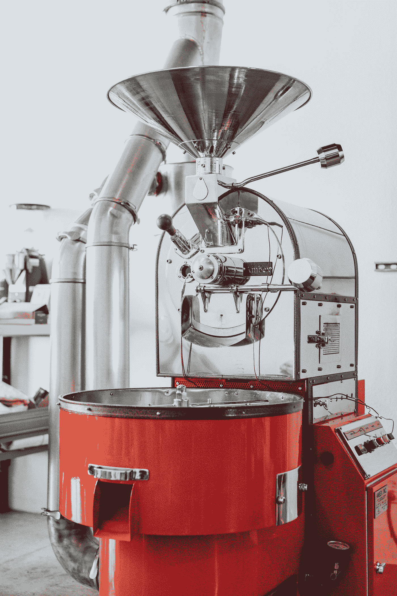
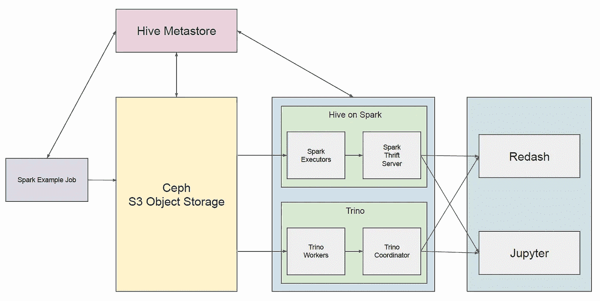

# DataRoaster 现在是开源的，这就是我创建它的原因

> 原文：<https://itnext.io/dataroaster-is-now-open-sourced-why-i-created-it-4d4a89be736b?source=collection_archive---------3----------------------->

内森·杜姆劳在 [Unsplash](https://unsplash.com?utm_source=medium&utm_medium=referral) 上的照片

[DataRoaster](https://github.com/cloudcheflabs/dataroaster) 是一个提供运行在 kubernetes 上的数据平台的工具。最近我把它开源了。

在开发 DataRoaster 之前，我使用像 HDP(Hortonworks Data Platform)这样的免费数据平台来构建数据湖。在 Hortonworks 被 Cloudera 收购后，HDP 不再自由。要建立一个数据湖，有 AWS EMR 这样的无服务器服务，但你必须考虑使用公共云提供商提供的这种无服务器服务的成本。

正如在 [A 概念:基于 Kubernetes 的私有云平台](/a-concept-kubernetes-based-private-cloud-platform-6ba9641c7e01)中提到的，我一直在寻找商业数据平台和无服务器服务的替代品。在我为这个概念开发了几个月的实现之后，DataRoaster 就创建好了。

DataRoaster 提供了几个数据平台组件，例如 hive metastore、spark thrift server、trino、redash、jupyterhub、kafka。spark thrift server 的组件来源于我写的 Kubernetes 中 spark 上的 [Hive 的博客。Spark thrift server 作为 Spark 上的 hive 的概念，现在可以很容易地部署在 kubernetes 上。](/hive-on-spark-in-kubernetes-115c8e9fa5c1)

有一个[数据烘烤器演示](https://youtu.be/AeqkkQDwPqY)。该演示的架构如下所示。

演示的场景是:

*   使用 hive metastore 运行 spark 示例作业，在由 ceph 存储提供的 s3 兼容对象存储中创建拼花表。
*   使用使用 hive metastore 的 spark thrift server 和 trino 查询保存在 ceph 中的 parquet 表中的数据。
*   使用 redash 和 jupyter 的 spark thrift server 和 trino coordinator 连接器查询数据。

然而，要在这个演示中构建这样一个数据湖，您必须安装几个组件，如 hive metastore、hive on spark、trino、redash 和 jupyterhub。您还需要知道如何在像 kubernetes 这样的容器编排器上安装它们。这不容易理解。如演示视频所示，您可以使用 DataRoaster 快速轻松地创建这样的数据湖。

DataRoaster 是开源免费的。要使用 DataRoaster，请访问此处的。