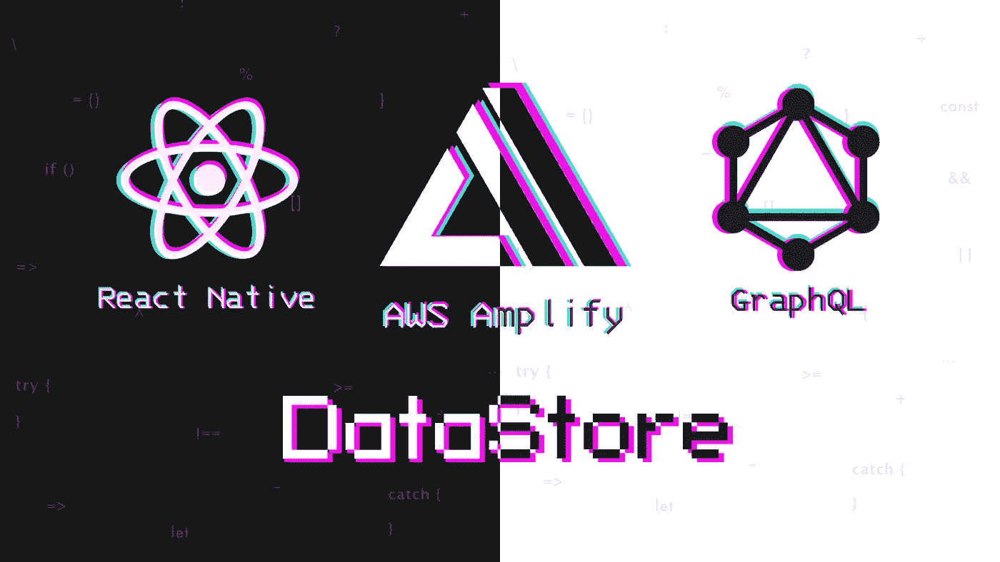
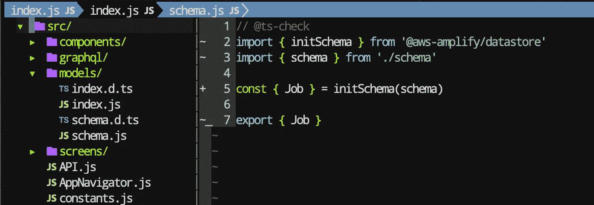
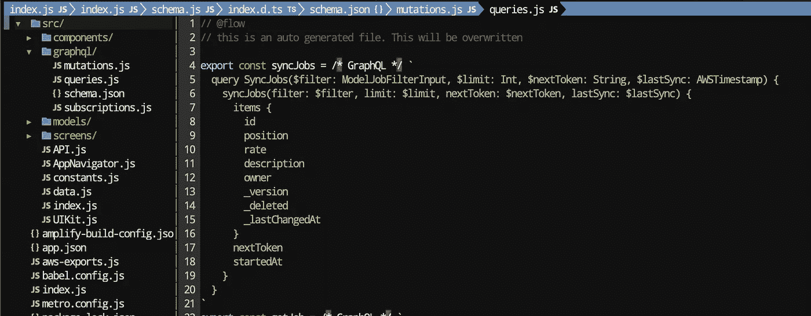
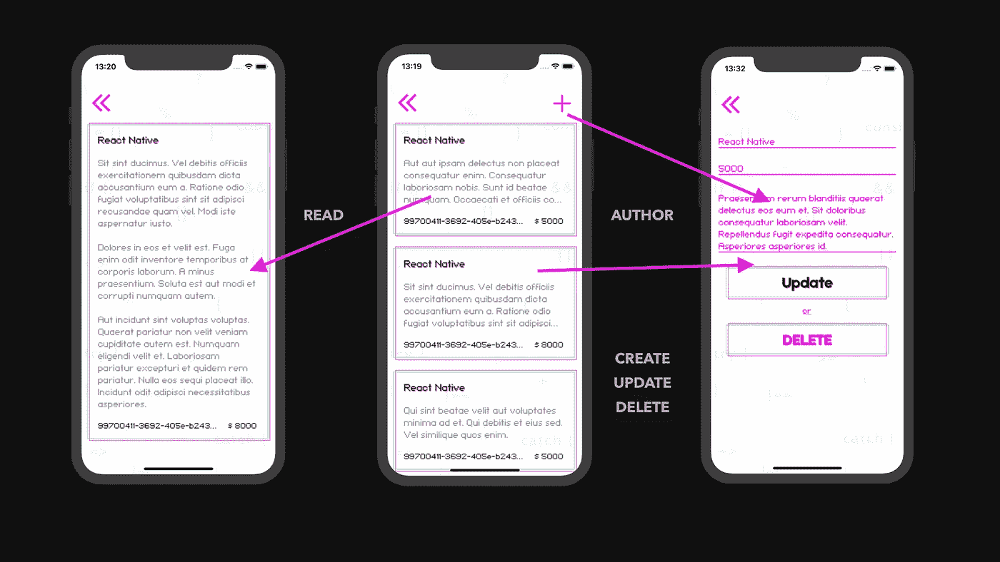
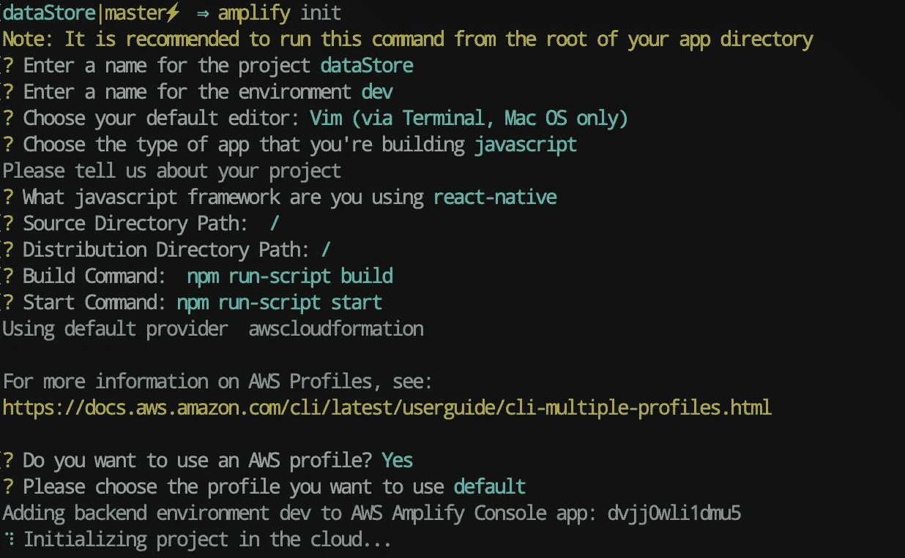
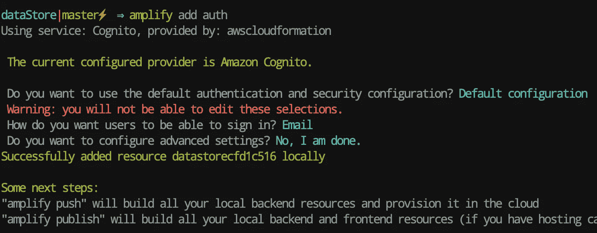
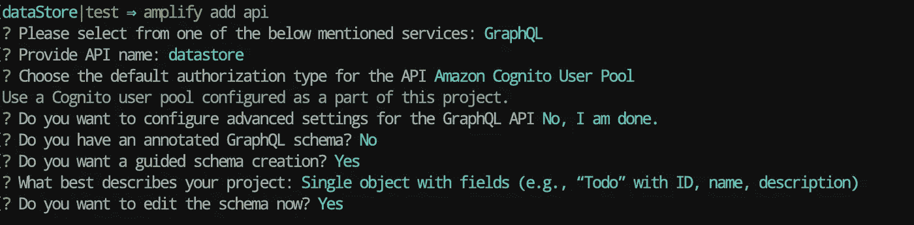
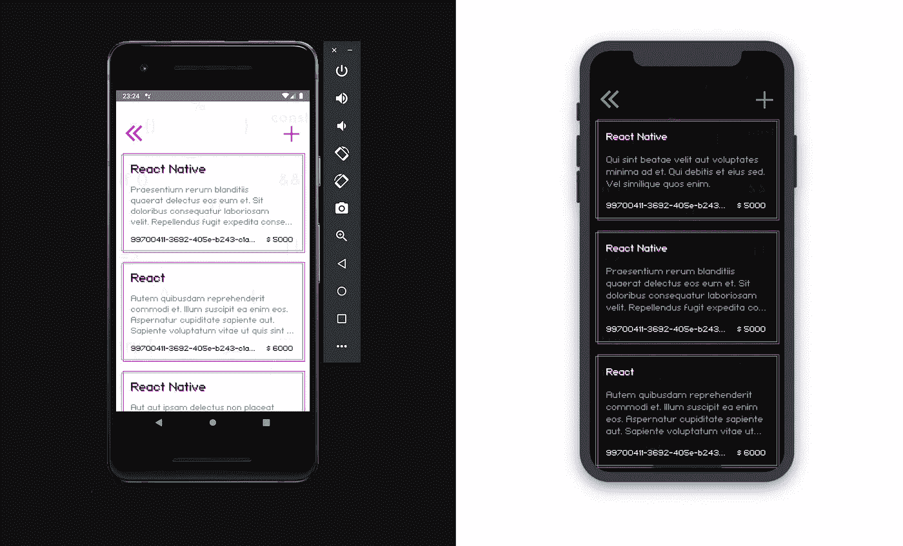
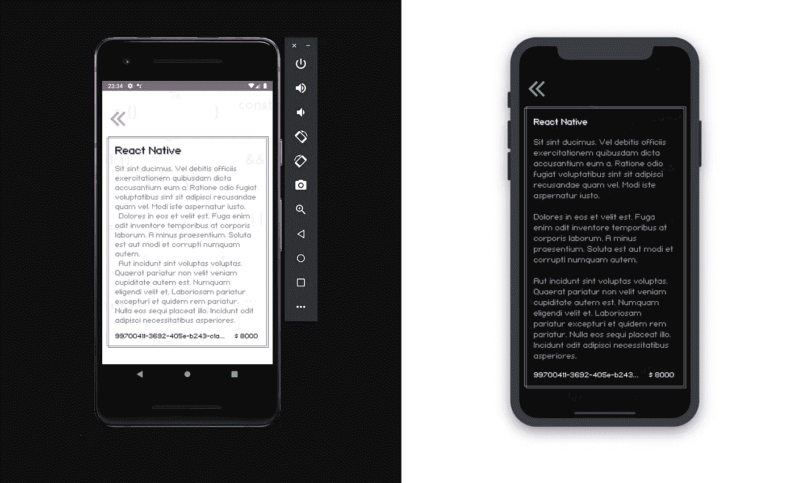
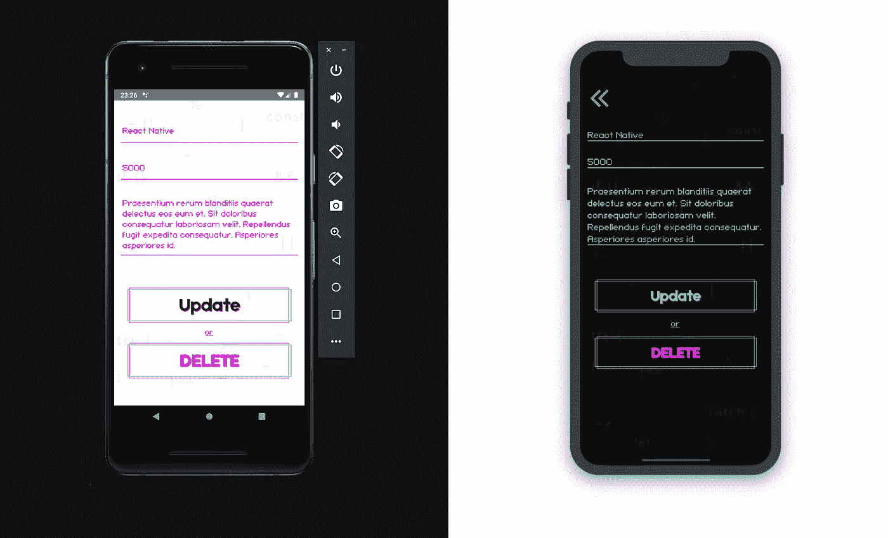

# 数据存储— CRUD(创建读取更新删除)

> 原文：<https://itnext.io/datastore-crud-create-read-update-delete-2bceac8312e2?source=collection_archive---------2----------------------->



# 再见 Redux，MobX，阿波罗！

后端和前端的线断了！国家管理者进化的创新一步。

开发 web 和移动应用程序最困难的任务之一是在设备之间同步数据和执行离线操作。理想情况下，当设备离线时，您的客户应该能够继续使用您的应用程序，不仅可以访问数据，还可以创建和修改数据。当设备恢复在线时，应用程序必须重新连接到后端，同步数据并解决冲突(如果有的话)。正确处理所有极端情况需要大量无差别的代码，即使在具有自主突变和增量同步的设备上使用 AWS AppSync SDK 缓存时也是如此。

Amplify DataStore 在设备上提供持久存储，以便在您连接到互联网或离线的情况下记录、读取和监控数据变化，并且还可以轻松地与云以及设备之间同步数据。

Amplify DataStore 允许开发人员使用分布式数据编写应用程序，而无需为离线或在线脚本编写额外的代码。

您可以在没有 AWS 帐户的情况下在仅本地模式下离线使用 Amplify DataStore，或者使用 AWS AppSync 和 Amazon DynamoDB 提供整个后端。

数据存储包括使用 GraphQL 后端的增量同步和几个冲突解决策略。

# AWS Amplify DataStore 相对于 Redux、MobX、Apollo、Relay、选择器的优势:

将 AWS Amplify 与 Redux 相比较，MobX 是不正确的，因为 AWS Amplify 不仅是一个状态管理器，还是一个客户端-服务器，所以在客户端-服务器类中我们将它与 Apollo 和 Relay 相比较。

# 1.即时开箱即用。

我认为，如果一个企业的移动应用程序没有受到使用 web sockets 技术实现的订阅事件的影响，就不能认为这个企业是认真的。现在有多少应用程序在 web 套接字上工作？我认为不会，因为实时是开发者在后台和前端的额外工作。对于我们来说，AWS Amplify 上的[full stack server less](https://fullstackserverless.github.io/docs/amplify-01)开发人员，实时是开箱即用的，无论是在前端还是后端，我们不需要为每个模型编写集成 web sockets 的实现代码，因为它是自动生成的，我们还需要为所有生成的代码编写文档，在我们的项目中基于 GraphQL schema 指令实现。为了不被大话吓到，我给你看一个来自[上一课](https://fullstackserverless.github.io/docs/amplify-03)的例子，商店在 AWS Amplify 中是如何定义的:

这就决定了店内的模式，不仅是前端，后端也是如此。前端和后端的一个真实来源。是的，是的，我看到我这辈子还会不止一次重复，既然这是一个杀手级的特性和妙语 vs Redux，MobX，Apollo，Relay。

就是这个架构，不同于 Redux，MobX，Apollo，抹去了后端和前端之间的界限。并将 AWS Amplify 数据存储置于每个人之上

如果您来自后端，那么您不再需要向数据库中编写解析器并将订阅拖到每个数据模型中。

无服务器——这是后端开发人员开始学习前端的时候，因为他们的服务只需要用于那些跟不上时代的项目，并且他们不能实时生活。

# 2.代码生成。

什么是代码生成，你可以不用我在维基百科上阅读，除非你知道它的意思，这让我们想起了你自己。用 fetch 还是 axios？通过向深林 API 发送请求，我们也是结合 Redux，MobX，Apollo，Relay 来写的。这是今天的另一条新闻！你不再需要编写这些 API 调用，你只需要调用它们。这意味着您不再需要使用服务器请求代码创建这个庞大的 daddy，因为在 AWS Amplify DataStore 中，它们也是基于您的存储在您的项目中生成的，由它们的第一个项目的完全相同的 GraphQL 图定义。这是一个命令:

```
npm run amplify-modelgen
```

结果，我们得到了包含生成代码的 models 文件夹。



和推送到服务器后的 graphql 文件夹，所有请求都在 Flow、TS 或普通 JavaScript 中。



# 3.离线数据和云同步

应用程序在线后，无需编写额外的代码向服务器发送请求。有时你会发现自己处于一个不可靠的情况，但你最好等待更长的时间，而不是明显失败的行动。Apollo 有 apollo-link-retry，它在默认尝试之间提供指数级回滚和服务器请求。的确，他(目前)不处理响应中 GraphQL 错误的重试，只处理网络错误。Redux、MobX 当然没有这个解决方案，因为它们不是客户端，你必须使用第三方中间件，因为 REST 就像一个退休的祖父，有任何孙子孙女的支持。 [GraphQL vs REST](https://fullstackserverless.github.io/docs/amplify-02) 的详细分析。AWS Amplify DataStore 不仅有一个 apollo-link-retry 的模拟，还有一个内置的可定制的熟悉编程模型，在云中具有自动版本控制、冲突检测和解决。

在 AWS Amplify 的缺点中，我想提一下 Apollo hooks 的加载和开箱即用的错误减少了前端编写的代码量。

[官方文件](https://aws-amplify.github.io/docs/js/datastore)

本课结束时，我们将与您一起收集使用 Amplify DataStore 的移动应用程序:



# 走吧。

我们的 AWS 放大支持聊天[不和](https://discord.gg/Ntuttww)

该器件的最终代码可在 [Github](https://github.com/fullstackserverless/startup/tree/datastore) 上找到。


# 克隆存储库

如果继续上一课，可以直接进入步骤 5。

```
git clone [https://github.com/fullstackserverless/startup.git](https://github.com/fullstackserverless/startup.git)
```

转到项目文件夹

```
cd startup
```

安装依赖项

```
yarn
```

或者

```
npm install
```


# 注册您的 AWS 帐户

对于那些还没有注册的 AWS 我们按照[这个](https://aws-amplify.github.io/docs/)指令进行注册📃通过视频教程ем，我们检查了所有 5 个步骤。

> 你需要一张银行卡💳，哪里应该超过 1 个亿💵在这里，我们看到并放入了 Amplify 命令行界面(CLI)


# 在 React 本地项目中初始化 AWS Amplify

在 React 本地项目的根目录中初始化我们的 AWS Amplify 项目。

```
amplify init
```

我们回答这些问题:



项目已初始化🚀


# 连接身份验证插件

现在应用程序已经在云中了，您可以添加一些特性，比如允许用户注册我们的应用程序并登录。

我们连接认证功能。

```
amplify add auth
```



向云提交更改💭

```
amplify push
```

✔所有的资源都在云中更新

我们收集项目并检查认证的操作。


# 放大应用程序

开始使用数据存储的最快方法是使用 npx 脚本 amplify-app。

```
npx amplify-app@latest
```


# 安装依赖项

详细安装[此处](https://aws-amplify.github.io/docs/js/datastore#setup)

如果您有一个 React 本机 Cli，那么

```
yarn add @aws-amplify/datastore @react-native-community/netinfo @react-native-community/async-storage
```

如果您使用 React Native> 0.60，则运行以下 iOS 命令:

```
cd ios && pod install && cd ..
```


# 连接 API 插件(应用程序同步)

如果您在最后一课的[中连接了它，则跳过这一步。如果没有，连接 API 插件](https://fullstackserverless.github.io/docs/amplify-03)

```
amplify add api
```



在选定项目之后，GraphQL 模式将在`amplify/backend/api/<datasourcename>/schema.graphql`中打开，我们在这里插入这个模型:

这里有更多关于[的信息](https://fullstackserverless.github.io/docs/amplify-03#schemagraphql)


# 模型生成

对数据建模并创建数据存储所使用的模型是开始的第一步。GraphQL 作为 JavaScript、iOS 和 Android 对于这个过程的通用语言，在与云端同步时也作为网络协议使用。GraphQL 也支持一些特性，比如 AppSync 中的 Automerge。可以使用 NPX 脚本或从命令行使用 Amplify CLI 来生成模型。

> *您不需要 AWS 帐户来运行它并在本地使用数据存储，但是，如果您想要与云同步，建议您按照上一课的说明安装和配置 Amplify CLI*

由于我们在上一课中描述了电路，现在我们可以运行命令了

```
npm run amplify-modelgen
```

并在 src/models 文件夹中获取生成的模型


# 更新 API

我们包括所有 API 的数据存储

```
amplify update api
```


向云提交更改💭

```
amplify push
```

✔所有的资源都在云中更新


# 阅读

创建 Jobs main src/screens/Jobs/Jobs main . js 屏幕



在这个屏幕上，我们将使用 pagination 选项进行查询，其中的数字是通过 useQuery 钩子得到的，它将向我们返回一个数组，我们将把这个数组发送到 Flatlist。

要披露空缺的详细信息，请创建屏幕 job detail src/screens/Jobs/job detail . js



# 创建更新删除

创建屏幕 JobAdd src/screens/Jobs/JobAdd . js，我们在其中执行函数 CREATE UPDATE DELETE



在 screens/Jobs/index.js 中，我们导出屏幕

```
*export* * *from* './JobsMain'*export* * *from* './JobDetail'*export* * *from* './JobAdd'
```


# 航行

添加导入作业屏幕并将它们连接到 StackNavigator


# 作业按钮

在 screens/Authenticator/User/index . js 中编辑用户屏幕

构建应用程序并进行测试

## [#](https://fullstackserverless.github.io/docs/amplify-04#done-) 搞定了✅

# 参考资料:

[https://AWS-amplify . github . io](https://aws-amplify.github.io/)

[https://learning . oreilly . com/library/view/full-stack-server less/9781492059882/](https://learning.oreilly.com/library/view/full-stack-serverless/9781492059882/)

[https://www . altex soft . com/blog/engineering/graph QL-core-features-architecture-pros-and-cons/](https://www.altexsoft.com/blog/engineering/graphql-core-features-architecture-pros-and-cons/)

[https://engineering . FB . com/core-data/graph QL-a-data-query-language/](https://engineering.fb.com/core-data/graphql-a-data-query-language/)

[https://graphql.org/learn](https://graphql.org/learn)

[](https://www.patreon.com/fullstackserverless)