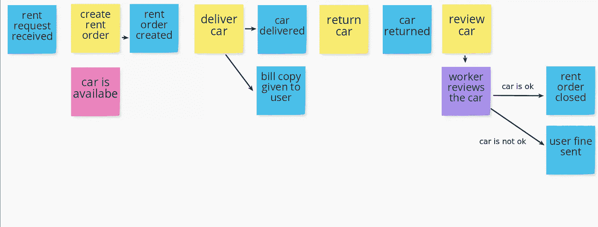
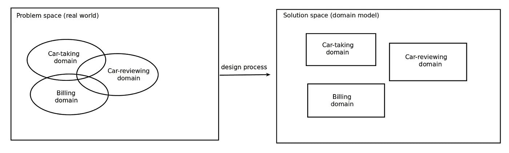
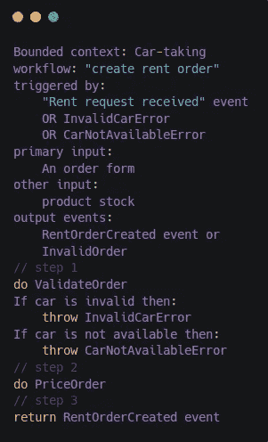
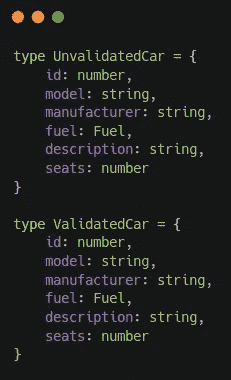
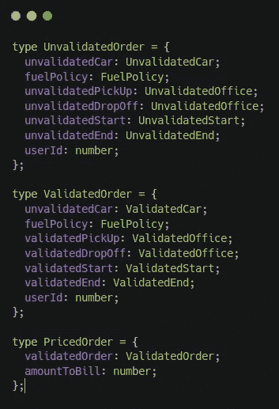
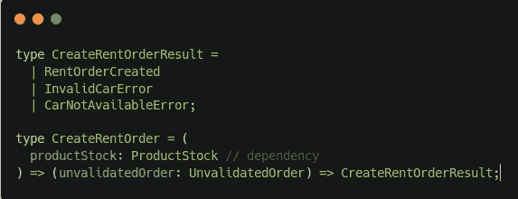

# DDD 在 Node/Typescript 中，以函数的方式。第一部分

> 原文：<https://itnext.io/ddd-in-node-typescript-the-functional-way-part-1-98d18d998b33?source=collection_archive---------1----------------------->

这是一个系列的第一部分，在这里我将解释如何以函数的方式实现 DDD(域驱动设计):使用 NodeJS 和 Typescript。

DDD 在 Node/Typescript 中，以函数的方式。第一部分

免责声明:这不是为了解释 DDD 的基本知识，有很多伟大的书籍已经这样做了。无论如何，这篇文章有大量的链接，可能有助于发现或更新概念。

您不需要对 DDD 和函数式编程有广泛的了解，但是推荐一些基础知识。

本系列的目标是:解释如何在函数范式中实现 DDD，特别是使用 NodeJS 和 Typescript 进行类型检查。

在第一集中，我们将设计和定义我们的领域，并开始创建第一批领域类型，或者换句话说，业务核心。类型是我们的[域模型](https://culttt.com/2014/11/12/domain-model-domain-driven-design/)的基础，它们定义了允许创建域对象的方式，因为除了类型和名称，我们还定义了**约束**。

用这种方式定义我们的业务是非常有用和有利可图的，因为我们可以**在开发阶段**捕获 bug，这是一个 bug 的较低成本。如果你不使用类型，在运行时会出现错误，如果有测试的话。否则，大多数错误将在生产中被发现，很可能是由用户发现的。

使用类型的另一个好处是，你将省去编写大量的单元测试。这还不错。如果类型检查在违反规则时警告你，**你不需要对那个类型进行单元测试**，这已经包括在内了。

我们将使用 Typescript，它与大多数 IDE 有很好的集成，特别是 VS 代码和后面的优秀社区。

删除任何面向对象元素的原因是 JavaScript 实际上是一种函数范式语言。它也支持面向对象范式，但是**函数式编程从 JS** 中汲取了所有的强大功能，特别是自从引入了一些 ES6 特性之后。你可以使用类或者原型继承，但是我更喜欢组合、闭包、lambdas、不变性或者 currying。反正我不打算解释函数式编程的[好处。](https://alvinalexander.com/scala/fp-book/benefits-of-functional-programming)

为此，我们将创建一个虚拟的汽车租赁公司，该公司希望实施一个计算机化的系统，从过时的传统纸质系统中脱离出来。让我们把公司命名为 RentSuper。此时，与[领域专家](https://www.infoq.com/news/2016/05/domain-experts-ddd/)的沟通将至关重要。我想你听说过[这种无处不在的语言](https://martinfowler.com/bliki/UbiquitousLanguage.html)。让我们定义我们的领域。

一个伟大的发现方法是[事件风暴](https://www.eventstorming.com/)。这将有助于理解和分割业务的各个部分。汽车租赁业务非常庞大，所以我们将重点放在取车系统上，这个过程从用户请求汽车开始，到用户放弃汽车结束。

我做了一个快速事件风暴。不是专家，不想进入细节。这是取车系统的结果:

取车领域事件风暴

没有领域专家提供的信息帮助，我做不到。他们是确切知道这些步骤如何工作的人。这就是为什么**沟通是至关重要的**。如你所见，便利贴中的所有术语都可以被每个人理解，这是构建这种无处不在的语言的第一块基石。

在当前模型中，域是重叠的。我们需要将域分成[有界的上下文](https://martinfowler.com/bliki/BoundedContext.html)。在实践中，定义这种环境可能很棘手，事实上，这是最大的挑战之一。出于这个目的，我们不打算深究这个问题，所以这是我们的有界环境:

使用有界上下文创建解决方案

为了定义有界上下文之间的联系，[上下文映射](https://www.infoq.com/articles/ddd-contextmapping/)是一个很好的工具，但是现在我们只定义取车域，所以跳过这一部分。

创建租赁订单工作流

现在，我们将定义我们在事件风暴中定义的第一个工作流的输入和输出:**创建租赁订单**。

我们不会深入探究像 *ValidateOrder* 这样的子步骤，因为这不是本文的目标。

有了这个工作流的伪代码，我们已经有了一些开始编写类型的信息。原始类型和基本类型应该优先。

汽车类型

我们要租车，所以开始做车型模型。

在工作流程中，需要验证汽车:汽车存在，在选定的提货办公室可用，并且可以卸货。

所以我们需要创造两种类型。

订单类型

*UnvalidatedOrder* 是我们接收到的输入。它有一些未验证的值。

一旦通过*产品库存*依赖关系确认了汽车、办公室和日期，订单就生效了。

再一次，使用依赖关系，我们在选定的日期和办公室获得该车的 *amountToBill* ，以创建*price order，*作为有效负载发送到 *RentOrderCreated* 事件中。

工作流签名

现在是类型检查的重要部分进入的时候，**函数签名。**这在定义工作流时绝对至关重要，确保我们领域的**一致性。**

工作流的结果可以是 *RentOrderCreated* 事件，也可以是错误。

函数签名将第一个参数( *ProductStock* )标记为依赖。作为第二个参数，它接收 *UnvalidatedOrder* 并返回先前定义的结果。

在开始实施工作流之前，我们需要定义子步骤: *ValidateOrder* 、 *PriceOrder* 和 *CreateEvents* 工作流。为了敏捷，这里就不做了。

这个 Github repo 里面显示的代码和所有相关的都是 [**。**](https://github.com/boxgames1/nodejs-ddd)

我希望你喜欢这第一部分。一会儿见！

我是奥利弗·阿隆索，在西班牙远程工作的软件工程师。您可以在我的 [LinkedIn 个人资料、](https://www.linkedin.com/in/oliverioap/) [我的 web](https://oliveralonso.dev/) 或 [GitHub 帐户中找到更多关于我的信息。](https://github.com/boxgames1)

感谢阅读！