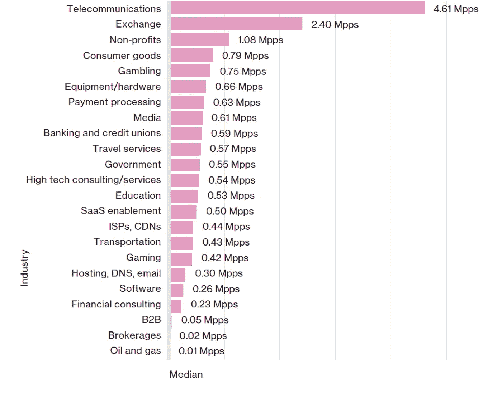
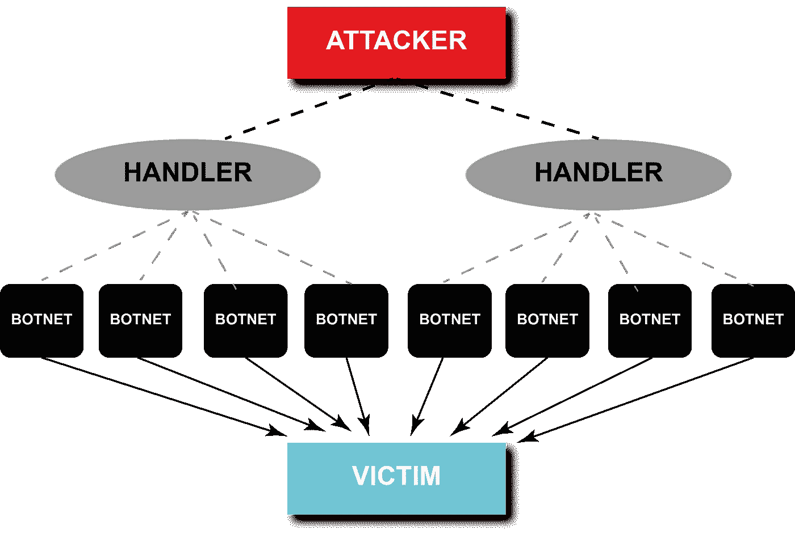
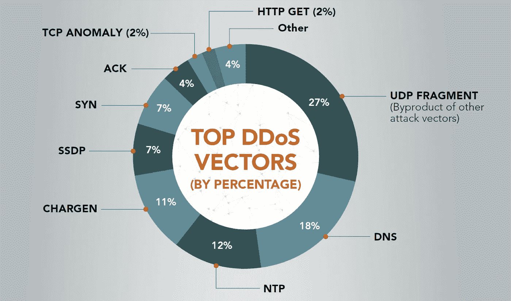

# DDoS 和最佳 DDoS 保护

> 原文：<https://itnext.io/ddos-and-best-ddos-protection-3202b461dba6?source=collection_archive---------2----------------------->

> “……在这里！在拐角处…喵…我抓到了…”
> 
> “……不！…”“我们的服务器遇到了问题。请稍后再来！”

上周开始的热潮仍在继续。几乎不可能在某个地方听不到兴奋的声音。增强现实应用 Pokémon Go 是[有史以来最受欢迎的](https://www.surveymonkey.com/business/intelligence/pokemon-go-biggest-mobile-game-ever/)美国手机游戏，到处都有人玩。

7 月 16 日和 17 日，出现了大范围的服务器崩溃，激怒了粉丝。一个名为 PoodleCorp 的黑客组织在 Twitter 上宣称对[事件负责，这一说法还有待证实。](https://twitter.com/poodlecorp)

据称，Pokemon Go 的服务器因 DDoS 攻击而瘫痪。根据 [Akamai Q1 2016 年【互联网现状】/安全报告](https://www.akamai.com/us/en/multimedia/documents/state-of-the-internet/akamai-q1-2016-state-of-the-internet-security-report.pdf)显示，与 2015 年 Q1 相比，2016 年第一季度这种网络攻击增加了 125.36%。与此同时，[威瑞森 2016 年数据泄露调查报告](http://www.verizonenterprise.com/resources/reports/rp_DBIR_2016_Report_en_xg.pdf)指出，游戏、信息技术& IT 服务和金融行业是最受攻击的行业，共发生 9630 起事件。值得注意的是，自 2014 年第一季度以来，网络游戏一直是最受攻击的行业。

下图摘自《威瑞森 2016 年数据泄露调查报告》，显示了按行业划分的 DDoS 数据包中值计数，单位为每秒百万个数据包，(n=5，800):

## 那么，什么是 DDoS 攻击呢？

[赛门铁克将分布式拒绝服务](http://www.symantec.com/content/en/us/enterprise/media/security_response/whitepapers/the-continued-rise-of-ddos-attacks.pdf)或简称为 DDoS 定义为试图通过大量活动来拒绝合法用户的服务。最常见的方法是针对 Web 服务器的网络流量洪水 DDoS 攻击，分布式意味着多个来源同时攻击同一个目标。这些被称为僵尸网络的多个来源将 DDoS 与拒绝服务(DoS)攻击区分开来。DoS 攻击通常使用单个网络连接，用数据包、请求或查询来堵塞目标系统或资源。

## DDoS 攻击架构

DDoS 攻击有几种类型，但根据主要的网络基础设施目标，它们可以分为三种主要类型:

*   **基于容量的攻击—无连接** 这种 DDoS 攻击也称为“洪水”，使用不同的技术来饱和目标站点的带宽。因此，用户无法访问该网站。攻击通常使用僵尸网络来执行，其规模以每秒位数(Bps)来衡量。
    用户数据报协议 [(UDP)泛洪](https://security.radware.com/ddos-knowledge-center/ddospedia/udp-flood/)，互联网控制消息协议 [(ICMP)泛洪](https://f5.com/glossary/icmp-flood-ping-flood-smurf-attack)，以及其他欺骗数据包泛洪就是其中的一些技术。
*   **应用层攻击—基于连接的** 这些攻击称为第 7 层攻击，专门针对应用程序或服务器中的漏洞。它们通过垄断具有大量看似合法的请求的进程和事务而导致崩溃。数量以每秒请求数来衡量。
    零日 DDoS 攻击和 [Slowloris](https://www.incapsula.com/ddos/attack-glossary/slowloris.html) 是常见的应用层攻击。
*   **协议攻击— TCP 状态** 这类攻击主要针对防火墙、负载均衡器等服务器资源或中间通信设备，破坏连接。它以每秒数据包数(Pps)来衡量。SYN floods、 [Smurf DDoS](https://usa.kaspersky.com/internet-security-center/definitions/smurf-attack#.V46kiJP9u70) 、碎片包攻击、Ping of Death 都是这一类的不同类型。以下图表改编自 [Akamai Q1 2016【互联网现状】/安全报告](https://www.akamai.com/us/en/multimedia/documents/state-of-the-internet/akamai-q1-2016-state-of-the-internet-security-report.pdf)说明了 2016 年第一季度 DDoS 攻击媒介的频率:

2016 年第一季度共跟踪到 24 个 DDoS 攻击媒介。UDP Fragment、NTP、DNS 和 CHARGEN 制造了几乎 70%的攻击。

*有关 DDoS 攻击的更多详细描述，请查看“* [*网络犯罪:拒绝服务(DoS)攻击*](https://www.linkit.nl/knowledge-base/170/Cybercrime_aanvallen_2_de_Denial_of_Service_DOS_attack)*——荷兰语”。*

DDoS 攻击的威胁越来越大，这引发了一个问题:如何保护组织免受这些攻击的破坏性影响。有一些措施，利用现有的安全，以防止 DDoS 攻击，以减少整体的脆弱性。这些攻击检测/响应，如[黑孔](http://www.cisco.com/c/dam/en_us/about/security/intelligence/blackhole.pdf)、路由器过滤和防火墙，提供了基本的保护，并且没有针对当今常见的高级攻击进行优化。通常，全面的 DDoS 保护由以下步骤组成:

*   预防—保护所有易受攻击点的上游架构
*   监视
*   检测—包括网络行为分析(NBA)技术，可准确区分合法流量和攻击流量，以保持业务连续性
*   缓解—承受攻击负载，同时允许合法流量通过

## DDoS 防护是如何工作的？

基于底层策略，DDoS 防御和检测方法可以分为[三个基本类别](https://www.acs.org.au/__data/assets/pdf_file/0005/15395/JRPIT38.1.69.pdf):主动机制、反应机制和攻击后分析。可以将指定的防御方法组合在一起使用。

还有几种 DDoS 防御机制可以[归类为以下](http://referaat.cs.utwente.nl/conference/6/paper/6796/ddos-defense-mechanisms-a-state-of-the-art-research.pdf):

1.  [安全覆盖服务(SOS)](https://www.cs.columbia.edu/~angelos/Papers/sos.pdf) 安全覆盖服务(SOS)在目标周围引入安全覆盖网络来保护目标。目标受到周围网络的保护；所有未被标记为已批准的目标流量都会被积极阻止。
2.  [路径标识符(Pi)](http://d-scholarship.pitt.edu/19225/1/FinalVersion.pdf) Pi 技术通过互联网给路径交叉的每个数据包添加一个指纹。通过相同路径接收的数据包包含相同的路径指纹。当数据包到达受害者时，过滤器会检查每个数据包上的指纹。
3.  D-WARD
    自主 DDoS 防御系统 D-WARD 在源头附近过滤 DDoS 攻击数据包。该系统监控正在部署的网络和互联网之间的双向流量，搜索通信困难。当检测到异常时，系统将根据可疑流量的攻击性对其进行相应的速率限制。
4.  [协作式 DDoS 检测方法](http://parashar.rutgers.edu/Papers/ddos-icics-04.pdf) 部署在网关上，该技术使用多个分布式系统，通过在由特定算法构建的网络流量配置文件中寻找异常来检测 DDoS 攻击。
5.  [基于 IP 回溯的包过滤](http://www.ieee-icnp.org/2002/papers/2002-27.pdf) 基于 IP 回溯的包过滤技术使用 IP 回溯来重建攻击路径，以决定应该丢弃哪些数据包。流量在到达受害者网络的网关之前经过的一组上游路由器协作检查通过它们的数据包。
6.  在这种技术中，路由器协同工作来处理 DDoS 攻击产生的流量..当推回算法在运行它的路由器的输出链路上检测到拥塞时，它对该链路应用速率限制，并丢弃满足拥塞签名的分组。与此同时，与签名匹配的流量信息将被发送到上游路由器，以限制流量速率。

总的来说，大组织通常有不同于小组织的方法。虽然大型组织有非常分层的方法来防御 DDoS 攻击，但小型企业通常使用第三方提供商来提供保护。根据不同的情况，这种保护可能是云提供商(如 Imperva Incapsula )、CDN(如 Akamai )或基于 DNS 的解决方案。

在下一篇文章中，我将描述最好的公司以及他们用来抵御 DDoS 攻击的机制。