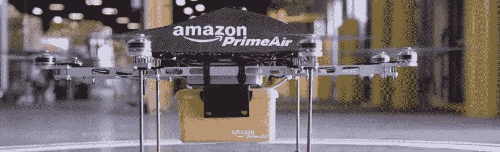

# 无人机在我们社会中的进步

> 原文：<https://itnext.io/de-opmars-van-drones-in-onze-samenleving-a72373b151a6?source=collection_archive---------2----------------------->

如果你是一个有点技术性的萨维吉，或者你读过一个博客关于最新的小工具，你不会逃避它:无人机的新闻。有时甚至是主流杂志。越来越多的公司开始为无人机开发有趣的应用程序。但是，它仍然停留在一个公告(美丽的公关)比无人机实际上是商业的一部分。在这篇文章中，我将分享一些关于无人机的有趣的未来计划，我不记得你，无人机已经部署在哪里，以及无人机的严重进步可能会阻碍什么。

## **从军事应用到超高速分组传送**

尽管近几年无人机一直很热但无人机的历史已经有 150 多年的历史了。早在 1849 年的" T2 " T3 奥地利对威尼斯发动攻击时就已经部署了无人驾驶飞行器。事实上，这只是一个巨大的气球，里面有炸弹和一个时间转换器。几年前，我们主要看到无人机在军事应用中，无论是自主的还是遥控的飞机，无论大小，在战争和和平任务中都扮演着一定的角色。但是无人机背后的技术创始人之一是一个没有军事背景的人。1898 年，尼古拉特斯拉(Nikola Tesla)在他的发明上获得了一项[专利](http://www.pbs.org/tesla/ins/lab_remotec.html)，通过无线电信号，他可以远程控制无人驾驶的船只。

随着电脑、相机和其他传感器的技术在过去几年里变得越来越小且越来越便宜，无人机也已经进入了企业和私人领域。这也大大提高了知名度。对于年轻人和老年人来说，这也不是毫无意义的连续两年都是一个巨大的[受欢迎的圣诞礼物](http://uk.businessinsider.com/afp-in-united-states-drones-take-off-as-christmas-gifts-2014-12?r=US&IR=T)。当然，从另一个角度拍摄节日照片，从空中拍摄足球孩子的照片，或者只是和他们一起飞行是很棒的。

除了这些有趣的应用功能之外，越来越多的公司和政府也看到了无人机的实际用途。几个公司已经宣布计划用无人机运送包裹。互联网巨头 [Amazon](http://www.cbsnews.com/news/amazon-unveils-futuristic-plan-delivery-by-drone/) 是最早公开这些计划的公司之一。谷歌、联邦快递、DHL 和 Domino 的比萨也表示正在认真准备运送无人机。

## **无人机现在实际上在哪里使用？**

除了美好的未来计划之外，还有许多情况下，无人机已经投入使用。从政府应用程序到商业企业应用程序，这一点不尽相同。

因此，在非洲猎犀牛和大象[用热相机打击无人机](http://www.nbcnews.com/news/world/air-shepherd-uses-drones-stop-elephant-rhino-poachers-africa-n335801)。[澳大利亚的海岸](http://mashable.com/2015/10/25/shark-detecting-technology-australia/#zIUFFYe9bkqB)在夏天用无人机监视，以便及时警告海滩游客注意白鲨。同时还试验了无人机在[检查底漆](http://webcache.googleusercontent.com/search?q=cache:wdEgEDGopgUJ:www.groenkennisnet.nl/nl/groenkennisnet/show/Inzet-drones-bij-dijkinspectie.htm+&cd=1&hl=en&ct=clnk&gl=nl)时的插入量，用于杂草植物的追踪。这些应用程序对社会和自然尤其重要，但也是跨国公司的壳牌公司使用高科技无人机在石油钻井和炼油厂难以到达的地方进行维护检查。

无人机也是为了新闻和摄影而设计的。我们都看到了阿尔卑斯山大桥倒塌的画面是由无人机拍摄的。之后的影像对事故的重建非常有价值。同时[房产经纪人](http://www.drones.nl/drones-gereedschap-voor-makelaars/)也利用无人机拍摄他们出售的房子的独特视频。然而，不明确的法律仍然阻止着我们。

## **什么是无人机的大规模崛起仍然阻碍着**

关于无人机的应用有很多绝妙的想法有时看起来像科幻小说。然而，从技术上来说，我们离现实并不遥远。现在，我们经常会看到的是立法。当涉及到无人机的商业行为时公司必须遵守有限的法律。2013 年 7 月基础设施和环境部长宣布禁止无人机商业飞行。但同时，也有法律法规允许例外。但是，例外的标准和确切情况仍然不够明确。因此，政府建议市民考虑这一点。

无人驾驶飞机是否违反航空法？如果无人驾驶飞机造成损害，谁应负[的责任？这些问题必须先得到解答才能让无人机起飞。有一个潜在的危险就是电子可以被入侵无人机。政府正在调查这种危险，但第一个“T2”被入侵的无人机“T3”的实际案例已经出现。](https://ictrecht.nl/privacy/het-gebruik-van-drones-nu-wel-niet-toegestaan/)

如果有一架无人机在你的后院飞来飞去而你不知道是谁在幕后操纵呢？除了安全和(法律上的)责任之外，隐私也是无人机越来越受欢迎的问题。

不管怎么说，罪犯们已经知道如何使用无人机了而且他们对法规也不太了解。贩毒集团已经知道如何利用无人机从墨西哥偷运毒品到美国。

如果政府对无人机的使用做出了明确规定你很快就可以用无人机来运送你的第一个包裹了。与此同时政府也在利用无人直升机来造福社会和环境。

你就不能等到这一刻吗？还是你想让无人机尽量离你远点？通过社交媒体让我们知道！