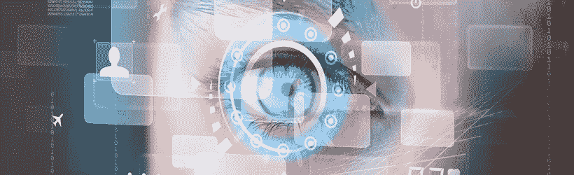

# 生物测定在多因素验证中的作用

> 原文：<https://itnext.io/de-rol-van-biometrie-binnen-multifactor-authenticatie-27a023370698?source=collection_archive---------3----------------------->

[急性市场情报](http://www.acuity-mi.com/GBMR_Report.php)的研究表明，2020 年生物技术解决方案的销售额将增长到 350 亿美元。这标志着这项技术的强劲增长。生物识别技术将在许多方面起到验证的作用。但是，这是什么角色，有哪些应用程序，以及是否有隐私问题？

## 身份验证

该理论描述了通过*你知道的东西*(密码，代码)*你拥有的东西*(例如随机阅读器，智能卡)和*你是*的东西(指纹，虹膜))。生物测定是在最后一种类型的“T8”中进行的，也就是你是。

生物识别技术正在不断发展，下面列出了当前可能的形状:

**型**型

**方法**

指纹呢

通过扫描某人指纹进行身份验证

我的脸

通过扫描某人的脸进行身份验证

艾瑞丝

通过扫描某人的虹膜进行身份验证

视网膜，视网膜

通过扫描眼球后部的血管进行身份验证

你的声音

语音识别验证

耳朵吗

耳型认证

DNA 呢

DNA 分析和匹配验证

走路的方式

通过某人的方式进行身份验证

手几何图形

通过某人的手的几何形状和长度进行验证

闻闻看

根据某人的气味进行验证

你的血管

通过某人的血管模式进行验证

手写的

通过某人的笔迹验证

击键

按下按键的方式验证

-心跳

某人的心跳认证(ECG)

**生物特征类型表，源** [**www .生物特征研究所. org**](http://www.biometricsinstitute.org)

大量类型目前仍处于试验阶段，还需要进一步研究渗透率。当前的商业应用程序主要侧重于通过人脸识别、指纹、虹膜或视网膜扫描进行身份验证。

## 应用程式

生物测定最大的好处是方便使用，因为它不需要记住或携带任何东西。功能上，对于身体有障碍的人，请考虑通过虹膜扫描或面部识别进行访问控制。即使是在运动和娱乐方面，没有物理键，也很容易使用(个人)设施。此[美国运动学校链](http://www.asmag.com/showpost/14759.aspx)用于其成员，例如，用于对设施进行物理访问的手掌扫描。在此之前，会员证必须出示，会员证经常被会员遗忘，导致在柜台排队等候。

## 可靠性

就像所有的安全技术一样生物测定也有弱点。指纹比较容易识别(请参阅我们的知识库文章「T3」)中的「T2」来获取更多资讯、透过相片或影片模拟脸部，以及在其中储存生物特征描述档的资料库。其中最接近的例子是 2015 年 7 月美国政府(人力资源管理厅)560 万名雇员的[被盗指纹](https://www.theguardian.com/technology/2015/sep/23/us-government-hack-stole-fingerprints)。

## 隐私问题

最常见的隐私问题是，未经授权或通知而将存储的个人信息链接到其他数据库。因此，除了最初捕捉到的生物特征数据之外，生物特征数据还可用于其他用途(例如警察系统在演示中识别脸部)。数据(虹膜/视网膜)可能与医疗问题(肿瘤、血液疾病)和药物滥用也可能被视为侵犯隐私。

你身体特征的主人是谁？数据的存储时间和地点，以及谁可以访问这些信息？这些问题通常在有人使用生物识别技术时无法直接回答。

另一个主要缺点是身份验证模式被盗、伪造或模仿时不可逆转。新密码很快就被选定，新的手指、虹膜甚至是面部表情都要复杂得多。无法撤销已损坏的数据可能导致任何人的身份验证不再被接受。

## 弱点是什么

生物特征扫描仪的一个弱点是它们的工作不总是那么好。这有助于防止在 iris 扫描仪中有人被认出来。所以，有人被拒绝了，而他本应该被访问的。这个所谓的*错误修正*是一种尴尬的经历。

有些解决方案，如视网膜扫描，可能会出现侵入和恐吓。使用这种技术时，用户必须非常密切地盯着扫描仪。

## 你的建议

独立实体(如和[sans](https://www.sans.org/reading-room/whitepapers/authentication/biometrics-in-depth-examination-1329)建议使用与所有其他验证方法相同的方法来存取生物识别，因此在储存装置时遵循一般的安全规范(加密标准、实体存取控制)上述机构肯定会支持积极的方面和进一步的透明度。

目前，在所有生物鉴别能力中，视网膜扫描被认为是[最安全的](http://www.technovelgy.com/ct/Technology-Article.asp?ArtNum=16)，目前还没有找到制造人视网膜的方法。眼睛后面的血管是独特的。视网膜扫描不仅成本高昂，而且难以实施。目前，这项技术主要部署在高保障(政府)环境中。

另一个建议的方法是使用多模式生物识别，使用多种生物特征类型进行授权，例如脸部和声音识别。因为这种同步性黑客很难模仿。

此外，IT 安全社群也将投票决定只使用生物特征识别功能，例如识别脸部，然后再输入使用者名称和密码。这样会增加额外的安全性。

## 结论是

由于使用方便，而且有许多优点，所以生物测定的使用已不再是遥不可及的事。在英国，巴克莱银行为有能力的客户推出了大规模的语音识别和手指扫描仪。剩下的 1200 万客户将在今年晚些时候跟进。中国互联网巨头阿里巴巴(Alibaba)则倾向于在 2017 年推出“T0”【面对面分享】技术。这两个例子都是强劲增长的特征。

技术、透明度和用户友好性将不断提高，但在系统的整体接受/使用方面，提供的隐私保护至关重要。