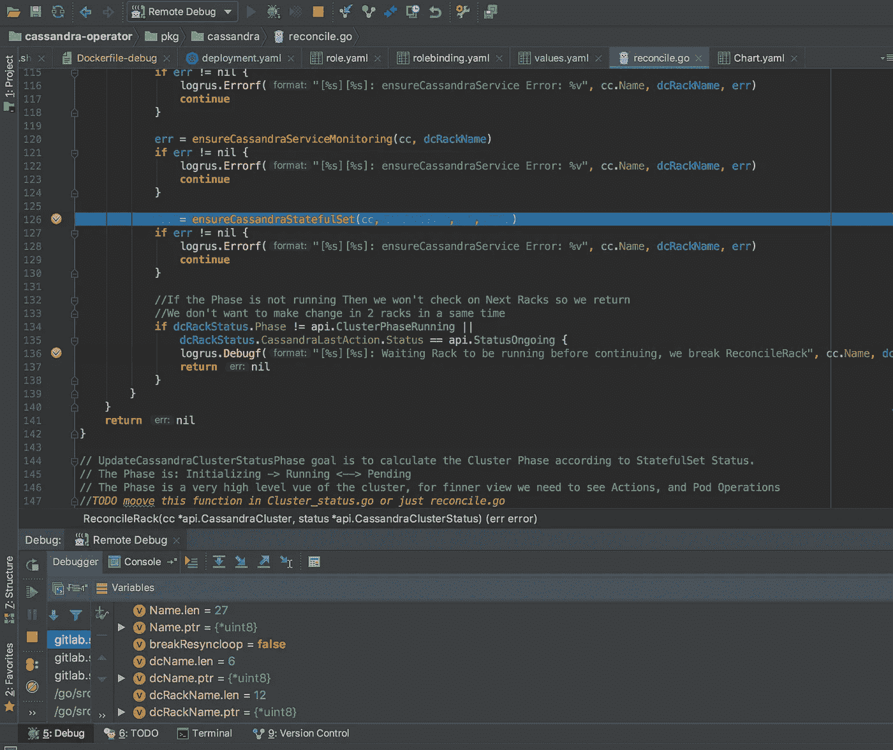

# 从 IDE 调试 Kubernetes 中的 Go 应用程序

> 原文：<https://itnext.io/debug-a-go-application-in-kubernetes-from-ide-c45ad26d8785?source=collection_archive---------2----------------------->

作为开发人员，能够用自己的 IDE 调试应用程序总是很有用的。

当您的应用程序只与 Kubernetes API 一起工作时，您可以简单地在 IDE 中启动您的应用程序，并将其连接到远程 Kubernetes API。

但是当您的应用程序需要连接到只能在 Kubernetes 集群中使用的其他系统时，这个解决方案就不再有效了。

## 构建应用程序

我想调试的应用程序是一个 Cassandra 操作符，它基于 CoreOS [操作符 SDK](https://github.com/operator-framework/operator-sdk)

操作员使用脚本 build.sh 来构建 Go 应用程序，我向脚本添加了一个输入参数 **DEBUG** ，这样它可以构建一个应用程序的调试版本，添加了特定的 gcflags，然后在二进制文件后面加上 *-debug* 。

注意，我们还将 dlv 二进制文件(它是 Go 调试器)添加到了我们的目标二进制文件中。

```
**#!/usr/bin/env bash** *set* -o errexit
*set* -o nounset
*set* -o pipefail

**if !** *which* go *> /dev/null*; **then** *echo* "golang needs to be installed"
   *exit* 1
**fi** BIN_DIR="**$**(pwd)/tmp/_output/bin"
*mkdir* -p **$**{BIN_DIR}
PROJECT_NAME="cassandra-operator"
REPO_PATH="gitlab.si.francetelecom.fr/kubernetes/cassandra-operator"
BUILD_PATH="**$**{REPO_PATH}/cmd/**$**{PROJECT_NAME}"

**if [** $# **-gt** 0 **] && [** "$1" **=** "DEBUG" **]** ; **then** *echo* "building "**$**{PROJECT_NAME}" In DEBUG Mode..."
  GOOS=linux GOARCH=amd64 CGO_ENABLED=0 *go* build -gcflags "-N -l" -o **$**{BIN_DIR}/**$**{PROJECT_NAME}-debug $BUILD_PATH
  *cp* /usr/local/bin/dlv **$**{BIN_DIR}
**else** *echo* "building "**$**{PROJECT_NAME}"..."
  GOOS=linux GOARCH=amd64 CGO_ENABLED=0 go build -o **$**{BIN_DIR}/**$**{PROJECT_NAME} $BUILD_PATH
**fi**
```

## 建立 Docker 形象

操作员 SDK 生成一个 docker 文件来为我们的操作员构建映像，并生成一个脚本( *docker_build.sh)* 用于构建映像，在这个脚本上我们还添加了 **DEBUG** 参数:

```
**#!/usr/bin/env bash

if !** *which* docker *> /dev/null*; **then** *echo* "docker needs to be installed"
   *exit* 1
**fi** *:* **$**{IMAGE:?"Need to set IMAGE, e.g. gcr.io/<repo>/<your>-operator"}

**if [** $# **-gt** 0 **] && [** "$1" **=** "DEBUG" **]** ; **then** *echo* "building container **$**{IMAGE} in DEBUG Mode..."
  *docker* build -t "**$**{IMAGE}" -f tmp/build/Dockerfile-debug .
**else** *echo* "building container **$**{IMAGE}..."
  *docker* build -t "**$**{IMAGE}" -f tmp/build/Dockerfile .
**fi**
```

我们添加了一个新的 Dockerfile-debug，最后只做了一些修改:

```
....
ADD tmp/_output/bin/cassandra-operator-debug /usr/local/bin
ADD tmp/_output/bin/dlv /usr/local/bin

EXPOSE 40000

ENTRYPOINT ["/usr/local/bin/dlv", "--listen=:40000", "--headless=true", "--api-version=2", "exec", "/usr/local/bin/cassandra-operator-debug"]
```

我们在 docker 映像中添加了应用程序的调试版本和 delve 调试器。我们还更改了入口点，告诉映像启动调试器，调试器将在调试模式下执行操作符。

Delve 公开了端口 40000，我们将在这个端口上配置我们的 IDE 来与之通信。

用于在调试模式下构建整个运算符的 Makefile 的摘录:

```
docker-build-debug: docker-get-deps
  echo "Generate CRD Client"
  tmp/codegen/update-generated.sh
  echo "Build Go Application In DEBUG Mode"
  docker run --rm -v $(PWD):$(WORKDIR):rw $(REPOSITORY)/dev:$(VERSION) /bin/bash -c './tmp/build/build.sh DEBUG'
  echo "Build Docker Image With DEBUG Enabled"
  IMAGE=$(REPOSITORY):$(VERSION)-debug ./tmp/build/docker_build.sh DEBUG
```

## 部署应用程序

一旦您在调试模式下编译了操作符并重新创建了 Docker 映像，我们还需要在部署中做一点小小的更改，以公开端口 40000 并向集群中的操作符 Pod 添加 **SYS_PTRACE** 功能。为了部署管理调试值的应用程序，我使用了一个 Helm 图表来定制部署:

```
...{{- if .Values.debug }}
        **image:** "{{ .Values.image.repository }}:{{ .Values.image.tag }}-debug"
{{- else}}
        **image:** "{{ .Values.image.repository }}:{{ .Values.image.tag }}"
{{- end }}
        **imagePullPolicy:** "{{ .Values.image.pullPolicy }}"
        resources:
{{ toYaml .Values.resources | indent 10 }}
        **env:** - name: WATCH_NAMESPACE
            valueFrom:
              fieldRef:
                fieldPath: metadata.namespace
        ports:
        - containerPort: 9710
          name: metrics
          protocol: TCP
{{- if .Values.debug }}
        - **containerPort:** 40000
          name: debug
          protocol: TCP
      securityContext:
        capabilities:
          add:
            SYS_PTRACE
{{- end }}
```

要在调试模式下部署操作员，我只需增加调试值:

```
helm install ./helm/cassandra-operator --name cassandra-operator-debug --set debug=true
```

这将为操作员创建所有必要的 Kubernetes 对象。如果您有一个 TCP 入口，您可以配置一个特定的路由到达您的 pod 的端口 40000。因为我没有端口，所以我将创建一个端口转发，以便能够从我的 IDE 所在的本地机器到达这个端口:

```
kubectl port-forward <cassandra-operator-debug-pod-name> 40000:40000
```

## 配置 IDE

我使用 Goland 来调试我的围棋程序，但它也可以在其他 IDE 上类似地运行

我们需要创建一个远程调试，并将其指向 localhost:40000，因为我已经激活了端口转发。


从那时起，我们能够在本地 IDE 中设置断点，它将与 Kubernetes 集群中部署的 delve 调试器通信，以允许调试我们的应用程序:



## 最后

在开始执行代码之前，应用程序将等待 IDE 连接到它，这样您就可以从头开始调试。

每当您在 IDE 端停止调试(或松散连接)时，Pod 将停止在状态 **completed** 中，如果您使用的是 Kubernetes 部署，它可能会自动重启。

你需要知道:

*   由于 delve 和您的 IDE 之间的网络延迟，您的远程调试将会变慢
*   每次您想测试一行新代码时，您都需要在调试模式下重新构建代码，在调试模式下重新构建 docker 映像，将其重新推送到 Docker 注册表中，然后在调试模式下重新部署操作符。