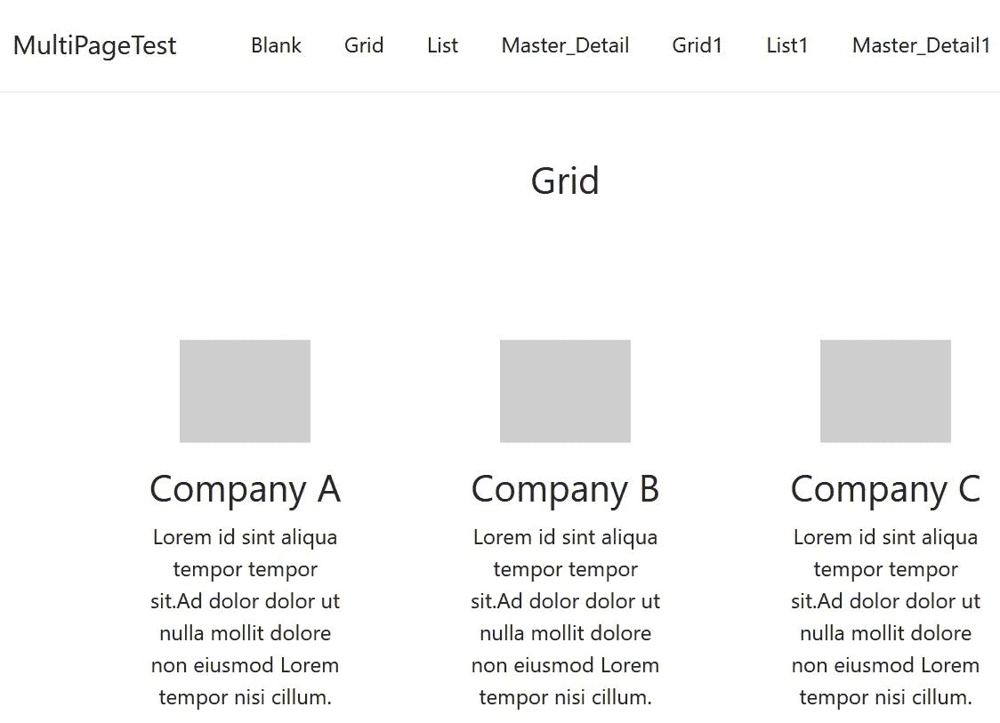
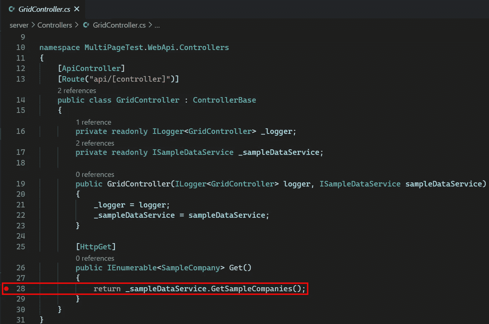

# 调试从 Web Template Studio 创建的 ASP.NET 核心后端

> 原文：<https://itnext.io/debug-asp-net-core-back-end-created-from-web-template-studio-903286743ae5?source=collection_archive---------8----------------------->

上周我们讲述了如何用 Web Template Studio 创建一个应用程序，现在我们有了一个应用程序，我们将学习如何调试 ASP.NET 核心后端。


## 示例应用程序

本文中使用的示例应用程序已经从我们上周使用的扩展到包含 Web Template Studio 提供的每种页面类型的两个实例。网格、列表和主/细节页面类型触发控制器被添加到我们的后端应用程序中，这将为我们提供一些工作。要添加这些额外的页面类型，您必须在 Web Template Studio 中运行完整的向导，而不是使用向导第一页上的 create project 按钮。下面是带有额外页面类型的新示例应用程序的屏幕截图。



## 在 VSCode 中调试

在这篇文章中，我们的目标是在返回上面截图中网格页面数据的控制器动作中设置一个断点。浏览**服务器/控制器**下的项目，看起来我们很可能对**网格控制器**感兴趣。该控制器只有一个动作，因此单击具有 **Get** 函数的 **return** 语句的行的行号左侧。



与上周的帖子不同，为了调试后端，我们需要将它与前端分开运行，这意味着我们需要不再使用 **npm start** 来运行整个应用程序。使用以下命令启动前端。

```
npm start-frontend
```

现在运行后端，转到 VSCode 中的**运行**部分，然后点击**播放**按钮，使用**运行后端。【网芯推出(web)】简介。**


这将启动一个我们不需要的空白页，它可以被关闭。如果空白页让你觉得太烦，可以在启动配置文件中进行更改。现在我们的后端正在运行，使用前端导航到**网格**页面。


## 包扎

希望通过以上步骤，您已经准备好调试应用程序的后端部分。我敢打赌，对于我们大多数人来说，分别运行前端和后端将更符合我们的正常工作方式。关于在 VSCode 中调试的更多信息，请查看官方文档。

*原载于* [*埃里克·l·安德森*](https://elanderson.net/2020/09/debug-asp-net-core-back-end-created-from-web-template-studio/) *。*