# 使用 Visual Studio 代码在 TypeScript 中调试测试

> 原文：<https://itnext.io/debug-your-tests-in-typescript-with-visual-studio-code-911a4cada9cd?source=collection_archive---------1----------------------->

## 在本文中，我将向您展示如何设置 Visual Studio 代码，以获得测试概述并调试单个测试。

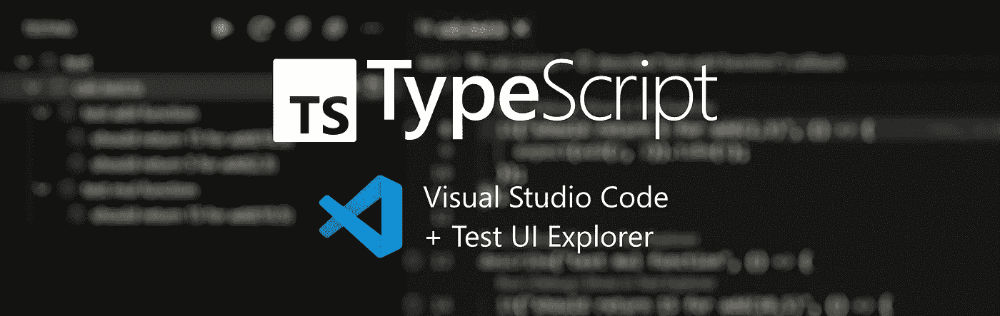

在本文中，我们使用了来自[上一篇文章](/testing-with-jest-in-typescript-cc1cd0095421)的示例项目，该文章讲述了如何用 jest 在 Typescript 中建立一个新项目。

GitHub 上的消息来源:【https://github.com/bromix/typescript-jest-example 

随着您的项目继续增长和复杂性的增加，测试的数量也在增加。让我们想象一下，我们有一个大约 100 个测试的大项目，现在有一个测试失败了。你必须知道哪个测试失败了，为什么失败了，错误发生在源代码的什么地方。

# 入门指南

正如我们在上一篇文章中所做的，我们再次更改了`add()`函数，导致了一个错误。

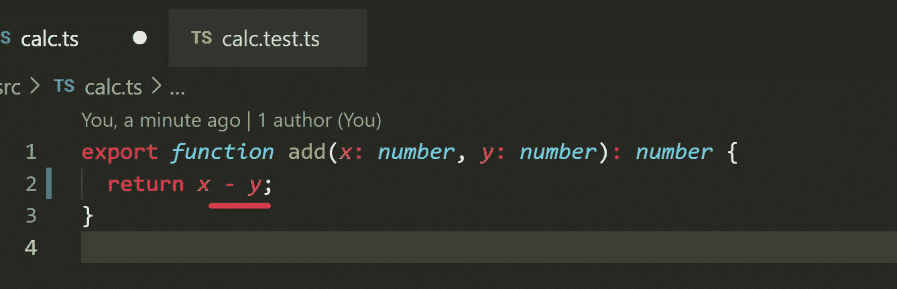

如果我们从控制台运行所有测试，我们将看到类似下图的内容，但是如果 IDE 能够帮助我们更高效地工作，那将非常有帮助。

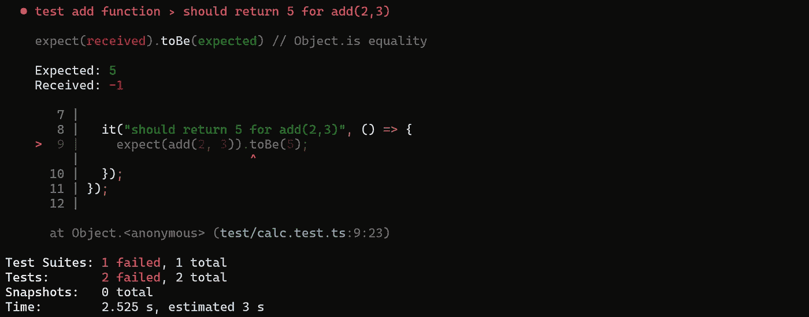

# 测试资源管理器 UI 扩展

这个优秀的扩展能做什么我就不细说了。关于它的所有信息都可以在[市场页面](https://marketplace.visualstudio.com/items?itemName=hbenl.vscode-test-explorer)上找到。

简而言之，这个扩展为 Visual Studio 代码添加了一个测试浏览器，它通过社区编写的附加扩展(称为适配器)支持不同的语言和测试框架。只要看看 Marketplace 页面，看看支持多少种语言和测试框架。我自己用它来处理 TypeScript、Python 和 C++。

我们将安装 [Jest 测试浏览器](https://marketplace.visualstudio.com/items?itemName=kavod-io.vscode-jest-test-adapter)适配器。适配器还会为我们安装相关的测试资源管理器 UI 扩展(如果尚未安装的话)。

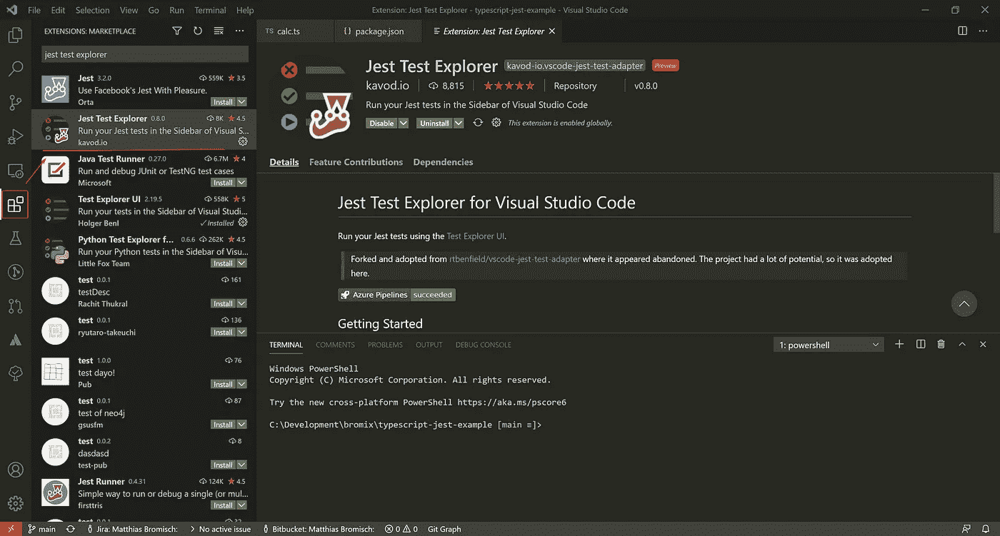

# 它是如何工作的？

安装适配器和扩展后，您将在左侧看到一个新图标(一个试管)。当您点击它时，您将进入测试浏览器。

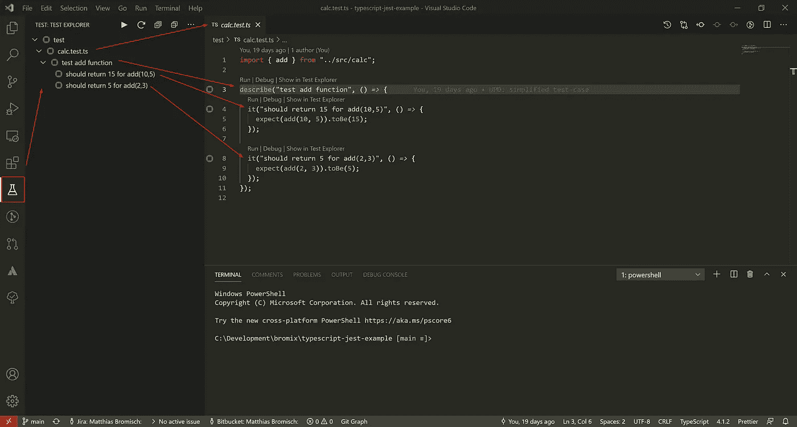

您可以获得每个测试文件(在我们的例子中是`calc.test.ts`)的概述，以及包含在它们自己的层次结构中的测试。在上图中，我试图可视化从测试浏览器到文件中测试的关系。

您可能还注意到了测试文件中每个测试上面的附加条目。这些条目将帮助您运行单个单独的测试，或者只是使用工作断点调试单个测试。

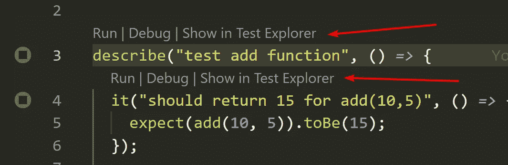

`Run`将只运行没有附加调试器的测试。
`Debug`将使用附加的调试器运行测试。
`Show in Test Explorer`将跳转到测试浏览器中的条目。

## 一次单独或全部运行测试

如果您浏览测试资源管理器，您将看到您可以在层次结构中的任何级别运行测试。

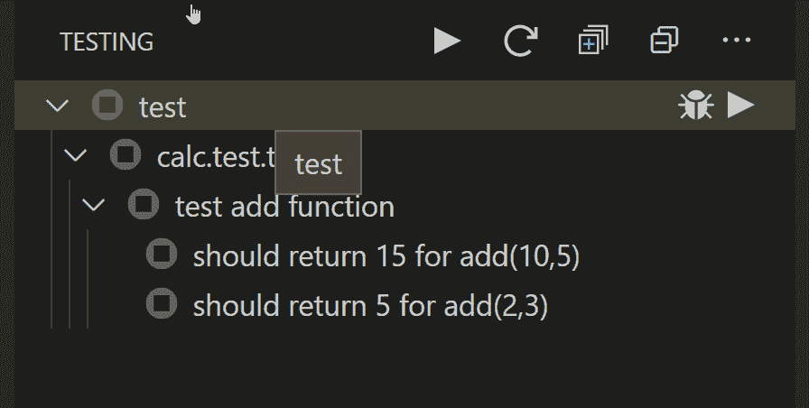

对于这个例子，让我们运行所有的测试，我们会看到所有的测试都会失败。

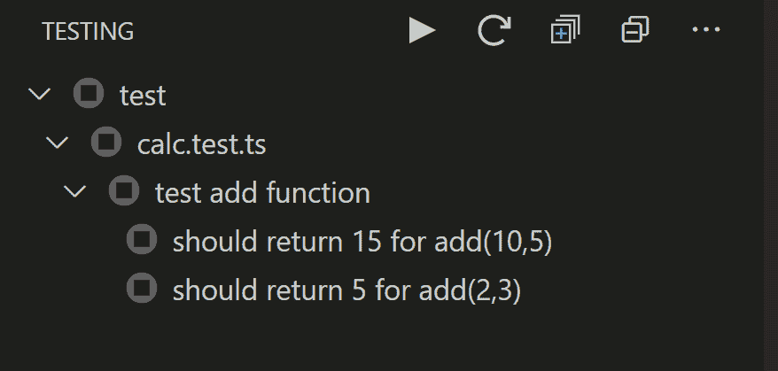

为了演示 Test Explorer 的有用性，我们添加了一个额外的两个数相乘的函数，并为它编写了一个合适的测试。

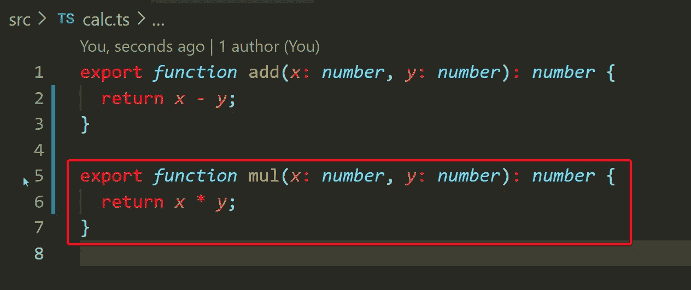

src/calc.ts 中的函数 mul(x，y)

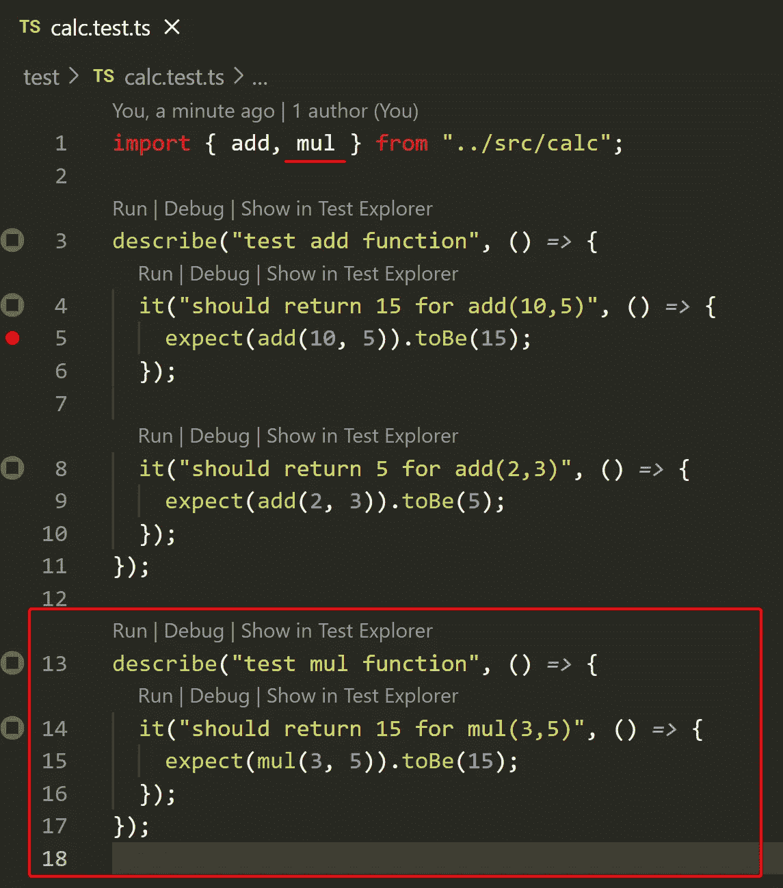

在 test/calc.test.ts 中测试 mul(x，y)

您将立即看到 Test Explorer 已经用新的测试更新了它的概述。现在我们重新开始所有的测试…

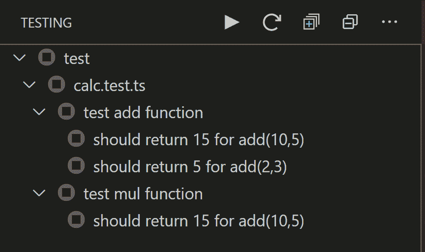

显示哪些测试失败了，哪些没有

在总览中，您现在可以确切地看到哪个层次中的哪个测试失败了。现在让我们想象一下，正如我在开始提到的，我们可能有一个包含 100 个测试的项目。你很快就会忘记这一点。测试资源管理器对于一个接一个地调试单个测试(如果有几个测试失败)非常有帮助。

## 调试失败的测试

如果您选择了一个失败的测试，您会得到选项(最右边的最后一个图标)来直接跳转到测试的实现。

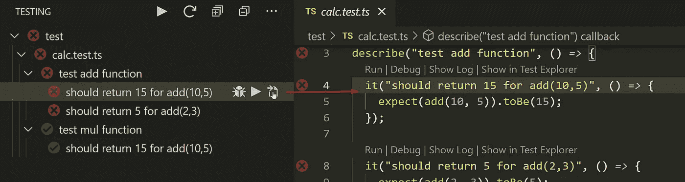

跳转到测试的实现

现在，我们可以在测试中设置一个断点，并使用 debug 运行单个测试，等待调试器在断点处停止，按 F11 键跳转到函数`add()`，查看值`x`和`y`，并检查为什么返回值为假。

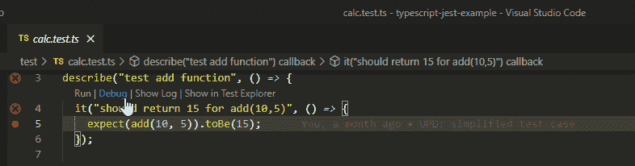

我们用一个`+`替换我们错误设置的`-`，并再次运行测试。之后，所有的测试应该会再次成功运行。

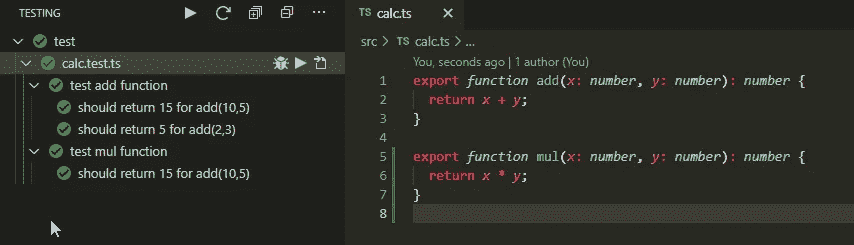

所有测试运行无误

# 结论

这是一个非常简单的例子，说明基于测试的调试是如何工作的。我不想因为太多的高级功能而分心，只是在本文中展示了方法和原则。
另外，我想指出由 [Holger Benl](https://github.com/hbenl) 为 Visual Studio 代码开发的非常有用的扩展 [Test UI Explorer](https://marketplace.visualstudio.com/items?itemName=hbenl.vscode-test-explorer) 。在我看来，没有这个扩展，调试测试就没有任何意义了。该扩展为开发人员提供了一个概览，并节省了逐个调试测试的时间。

我希望你喜欢这篇文章，如果你有任何问题或建议，请联系我。

完整的例子可以在 GitHub 上找到:[https://github.com/bromix/typescript-jest-example](https://github.com/bromix/typescript-jest-example)