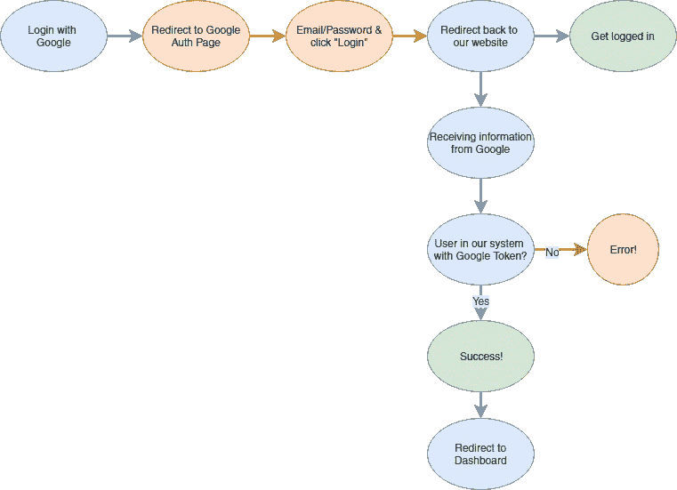
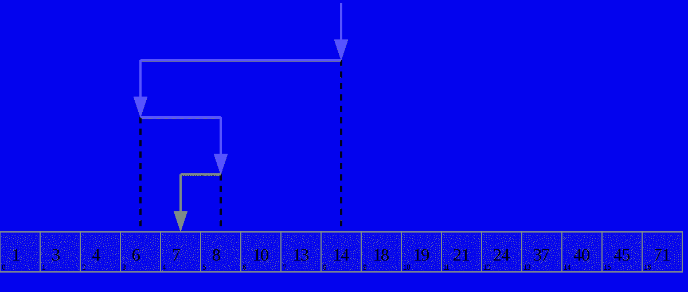

# 调试 101:定位问题

> 原文：<https://itnext.io/debugging-101-locating-the-problem-4201da859a73?source=collection_archive---------5----------------------->

我最近观察了几个程序员试图修复一个 bug，并(带着相当大的紧张)观察了他们在黑暗中调整和更改不同代码行的艰苦努力。

我立刻知道我要做什么，这更像是一个二分搜索法(见下面的例子),可以快速解决我遇到的几乎每一个 bug。

它包括 3 个步骤:

1.  重现问题
2.  遵循请求顺序
3.  适当调整代码

请注意，这是*语言不可知的*:从 Javascript 到 GoLang 的概念是相同的*。*经验和熟悉程度主要有助于您理解步骤 3，以及与本文更相关的请求顺序。

在这篇文章中，我将展示这如何应用于一个报告错误“登录不工作”的用户。让我们来看看这些步骤。

# 重现问题

简说“登录不起作用”。这不是很有帮助(希望我们指导人们给出更好的错误报告)。

*如果你不能复制它，几乎不可能解决任何问题或缺陷。*

我们尝试登录并成功了。我们尝试用一个新帐户登录…并且成功了。这不是很有帮助。我们需要能够始终如一地复制它，或者理解如何复制它(如果它依赖于计时器，而我们只能每 X 个小时复制一次，那么理解就足以解决这个问题)。

假设我们回头从 Jane 那里获得更多详细信息:她告诉我们她试图使用 Google 身份验证，这发生在她注销 Gmail 并重新登录之后。

我们用自己的帐户尝试了一下，瞧，我们得到了一个“未授权登录”的错误。

我们可以复制这个问题，进行下一步。

# 遵循请求顺序

让我首先定义我所说的“请求序列”是什么意思。我指的是从你最后一次重现错误到错误发生之间发生的所有事情。这可以是后端、前端、第三方服务、API 调用、JSON 解释器、开发操作等。

我见过的最好的例子是对这个问题的回答:

> "当你在浏览器中输入 google.com，然后按回车键，会发生什么？"
> -[github.com/alex/what-happens-when](https://github.com/alex/what-happens-when)

这种方法可以有几乎无限的深度，但我们从来不需要潜得比必要的更远。

再来看登录问题。我们可以概括这些事件。

1.  点击“使用谷歌登录”
2.  重定向至谷歌认证页面
3.  在谷歌的登录界面输入电子邮件和密码，然后点击“登录”
4.  重定向回我们的网站
5.  登录

或者，在我们的情况下:

5.收到“未授权登录”错误。

现在我们开始我们的“二分搜索法”。这就是我所说的二分搜索法(因为我用得有点不典型):如果我们正在浏览从 1 到 71 的一系列数字，我们想找到数字“7”，你可以从中间开始，简单地问，“它是更低还是更高？”并重复。

在我们的例子中，我们想要同样的方法，但是问题是:“在请求链中，问题是在前面还是在后面？”

我们有 5 个步骤，最后一步是问题。我们需要找到错误开始的地方。在这种情况下，我们只能完全控制 1、2 和 5。我们对第 4 步有部分控制权(我们告诉 Google 重定向回哪里)，对第 3 步没有控制权。

既然不能勾选 3，那就要么从 2 开始，要么从 4 开始。因为第 4 步更接近问题，所以我就从这里开始。

现在，我们需要做一些检查，看看在这一点上是否一切正常(“问题是早还是晚？”).第 4 步的第一部分是看我们是否到达重定向链接。

我们查看我们所在的错误页面，是的，我们在重定向链接上。这表明步骤 1-3 正在成功运行，而步骤 4 和 5 之间出现了问题。

这意味着进一步分解它。第 4 步包括:

a)从 Google
接收信息 b)检查我们的系统中是否有一个用户拥有匹配的 Google 令牌
c)用来自 Google
的错误消息登录或拒绝该用户 d)重定向到仪表板

二分搜索法:同样，我们应该在*b)*之后检查，我们的 a 系统中是否有用户拥有匹配的谷歌令牌？

不，我们没有。

然而，我们知道*我们应该*在我们的系统中有一个匹配的用户。你的系统大概是相当稳定的，人们一直登录得很好。

太好了，现在我们知道问题出在 4a 还是 4b。

检查 4a 是否有正确的数据—它有。

我们的问题出在 4b。

***并重复…***

我将总结一下整个过程，而不是让你厌烦。4b 当在请求序列中被分成进一步的步骤时，显示我们在那个电子邮件地址下确实有一个用户，但是它有一个不同的、不匹配的令牌。

我们的发现如下:*当您退出 Gmail 并重新登录时，下次登录时，Google 会为系统提供一个与我们不同的令牌。*

# 适当调整代码

这通常包括你作为程序员的知识和经验，以及你谷歌和搜索 StackOverflow 的能力。本文的目的不是深入探讨这个问题。在我们的人工调试中，我们发现我们需要一个为用户更新令牌的过程，并实现它，瞧！我们完了。

# 了解请求链

在公司里，对需求链的了解经常被低估。谁需要知道所有的细节？

在之前的一家公司，我问我的首席技术官，我们是否可以获得一些关于我们的请求生命周期*的文档，他们给出了一个非常高的概述，但有些拒绝。这使得调试变得非常困难，并且经常回到无中生有的方法。

*请求生命周期与请求链:生命周期是特定于一个域的请求链(HTTP 请求生命周期，Laravel 请求生命周期)，而不是您的操作和另一个事件之间的每个请求链，它可能跨域。

# 摘要

解决 bug 包括三个步骤:

1.  重现问题
2.  按照请求顺序
3.  适当调整代码

请求序列由您的请求和您复制的问题之间发生的每个事件组成。要找到一个 bug，你所要做的就是跟踪这个链(我使用二分搜索法方法)。

语言和框架的知识和经验有助于快速定位 bug 可能在请求链的哪个部分，但是方法是相同的。

# 如果你快乐并且你知道它…

如果你喜欢这篇文章，并且觉得它很有用，请告诉我并*鼓掌*或者在下面写评论！我很乐意进一步阐述你可能有的任何问题。

[凯瑞·琼斯](https://medium.com/@kerryjones12)是公司创始人兼首席技术官，最近被授予福布斯 30 位 30 岁以下成就奖。我对一切创业都充满热情，从文化优先的环境到技术堆栈和范例的利弊。在 [LinkedIn](https://www.linkedin.com/in/kerryrjones/) 上和我联系，或者在 [Twitter](https://twitter.com/kerryjones) 上和我打招呼。