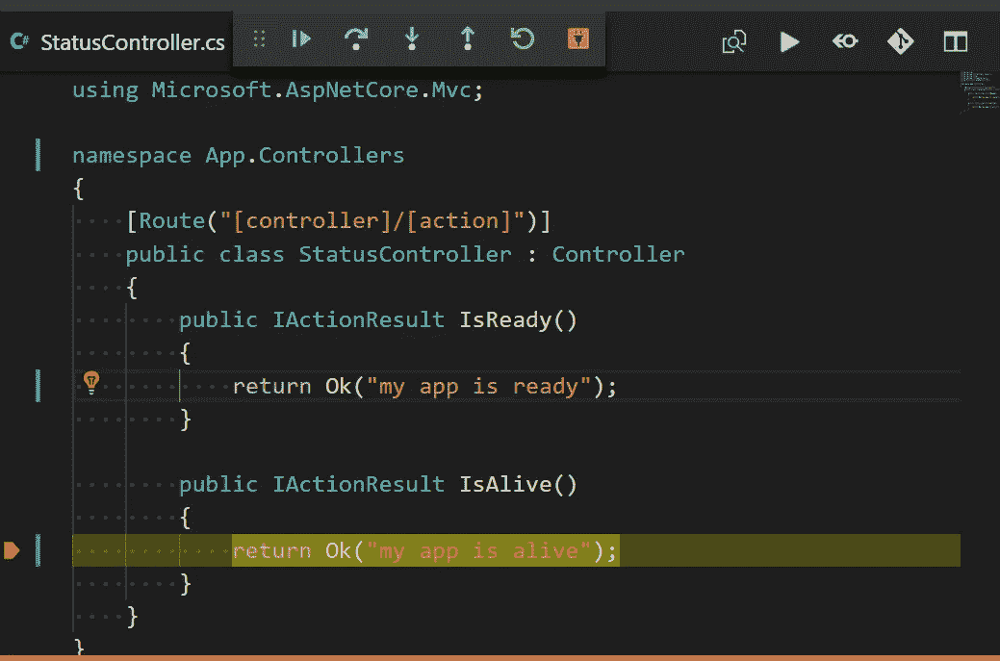

# 从 VSCode 调试 Kubernetes 中的 ASP.NET 内核

> 原文：<https://itnext.io/debugging-asp-net-core-in-kubernetes-from-vscode-294a728031e6?source=collection_archive---------1----------------------->

如果你想从 Visual Studio 2019 中调试你的应用程序，这里有一篇[文章](https://pavel-agarkov.medium.com/how-to-debug-asp-net-core-in-kubernetes-from-visual-studio-2019-1e9d16099d99)适合你。

假设您有一个结构如下的工作区文件夹:

```
Root Workspace Folder
+-- Dockerfile
`-- app
    +-- App.csproj
    `-- ...
```

基于这个假设，我们可以在 docker 文件中编写第一个构建阶段[如下:](https://docs.docker.com/engine/userguide/eng-image/multistage-build/)

```
**FROM** microsoft/dotnet:2.1-sdk **as** dotnet-build
**ARG** DOTNET_CONFIG=Release
**WORKDIR** /build
**COPY** /app/*.csproj ./
**RUN** dotnet restore
**COPY** /app/ .
**RUN** dotnet publish -c ${DOTNET_CONFIG} -o ./results
```

在这里，我们首先只复制 App.csproj 文件并恢复依赖关系，以便缓存该层，如果自上次构建以来依赖关系没有变化，则跳过该层。请记住，我们将所有代码放入`/build`文件夹中——我们稍后将需要它来指定源代码映射。

下一步是编写映像构建的最后阶段:

```
**FROM** microsoft/dotnet:2.1-aspnetcore-runtime **as** app
**ARG** INSTALL_CLRDBG=exit
**RUN** bash -c "${INSTALL_CLRDBG}"
**WORKDIR** /app
**EXPOSE** 80
**COPY** --from="dotnet-build" /build/results .
**ENTRYPOINT** ["dotnet", "App.dll"]
```

在第 2–3 行，我们提供了一种稍后从`docker build`命令指定调试器安装脚本的方法。最后，我们复制来自`dotnet-build`阶段的构建结果并指定入口点。

让我们用下面的 shell 脚本构建这个映像:

```
**IMAGE**=your-registry/your-app-image;
**docker build** -t **$IMAGE** \
  --build-arg DOTNET_CONFIG=**Build** \
  --build-arg INSTALL_CLRDBG="apt-get update \
    && apt-get install -y --no-install-recommends unzip \
    && rm -rf /var/lib/apt/lists/* \
    && curl -sSL https://aka.ms/getvsdbgsh | \
       bash /dev/stdin -v latest -l **/vsdbg"** \
  **.**;
**docker push** **$IMAGE**;
```

你得用真实值代替`your-registry/your-app-image`。在`docker build`命令中，我们指定`dotnet publish`命令的配置为`Build` 并覆盖调试器安装脚本。在生产中，你可以跳过那些`--build-arg`。

接下来，您可以像往常一样将这个映像部署到 kubernetes 集群中，但是不要忘记删除或调整活性/就绪性问题。或者，您可以只运行以下命令来启动新的 pod:

```
**kubectl run** my-app --image=**$IMAGE** --labels="**app=my-app**"
```

为了开始调试我们应用程序的这个新实例，我们需要将以下 shell 脚本添加到根工作区文件夹中:

接下来我们需要调整`launch.json`来使用这个脚本:

在`sourceFileMap`中，我们在容器端指定了`/debug`文件夹，因为我们在`dotnet-build`阶段将所有源代码放入该文件夹，在主机端指定了`${workspaceRoot}/app`，因为它是我们原始源代码的位置。在多个 dotnet 项目的情况下，我们不需要在末尾添加`/app`，因为`dotnet` 会自动添加与解决方案相关的每个项目文件夹。

作为一个`pipeProgram` ,我们使用 Git Bash(因为我们在 Windows 上)并传递我们在上一步创建的`kube-debug.sh`脚本。接下来，我们指定相同的`--selector`作为我们在`kubectl run`命令和可选的`--namespace`中使用的标签。

`debuggerPath`是相对于`WORKDIR /app`的，因为它只在 Windows 上这样工作，否则 Git Bash 认为该路径是相对于主机的。不要问我为什么…

现在，您可以按 F5 键，享受调试会话！



我的应用程序正在运行:)