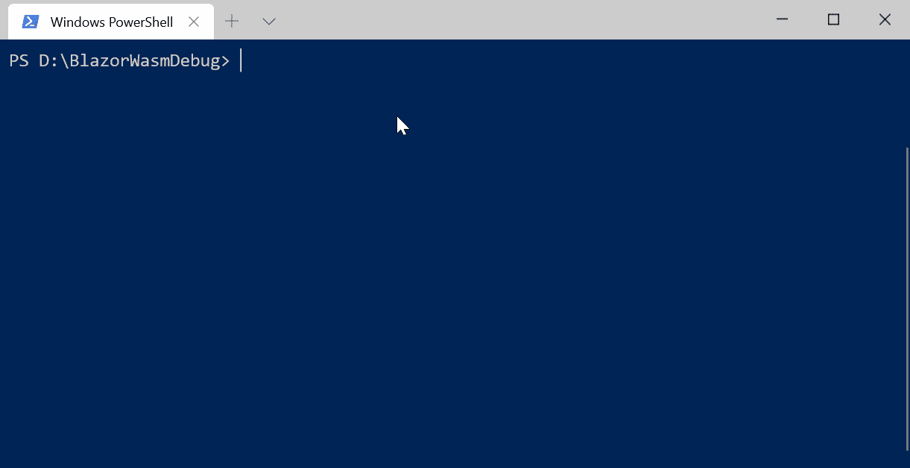
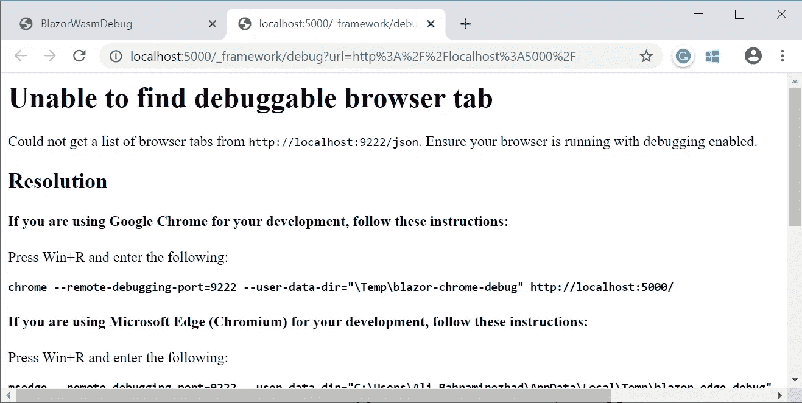
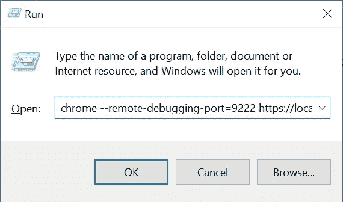
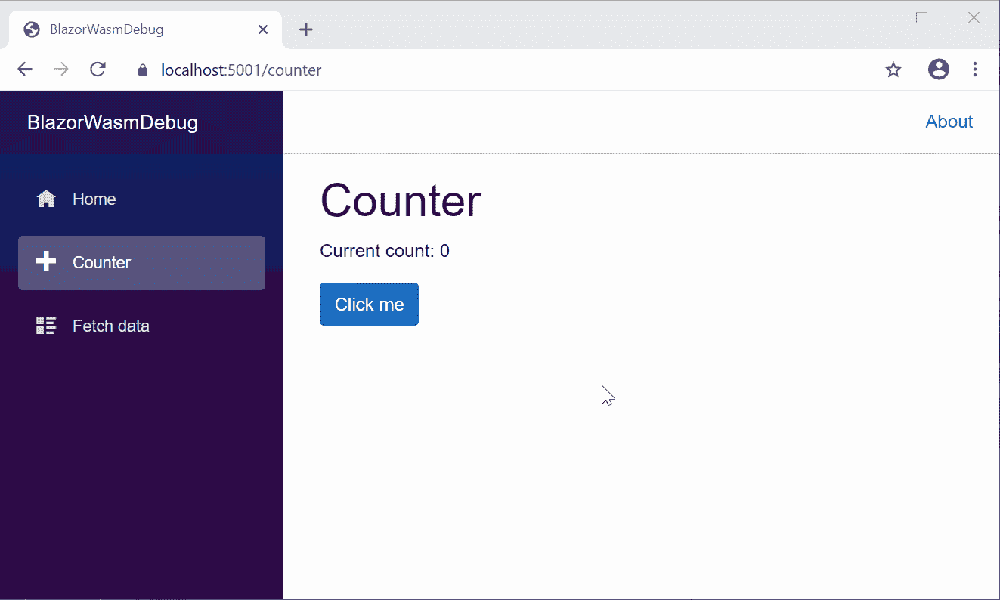
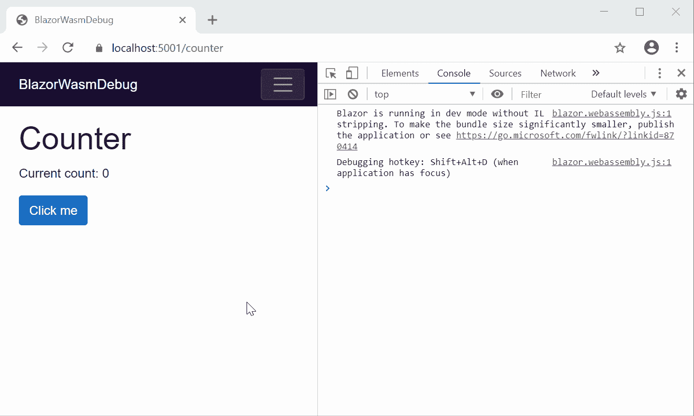
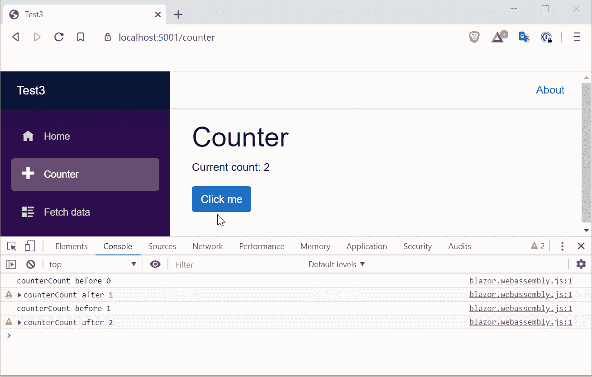

# 调试 Blazor Web 程序集应用程序

> 原文：<https://itnext.io/debugging-blazor-web-assembly-apps-c47ef25bcb5f?source=collection_archive---------5----------------------->


Blazor 只是另一个和其他一样的 SPA 框架，但是它和其他的有什么不同呢？Blazor 写在**上面。NET** 并且可以发布为 **WebAssembly** 。用 **C#、**编写你的应用，用**赋予它力量。NET** 库并将其作为 **WebAssembly** ！

Blazor 提供了两种不同的托管模式，Web Assembly 和 Blazor Server。Blazor-server 在服务器上运行代码，使用 SignalR 与前端通信。这提供了容易的调试；这个应用程序就像你每天用来调试的老的好的 ASP.NET 核心应用程序一样。然而说到 BlazorWasm，调试从来都不容易！😢

Blazor WebAssembly 是 ASP.NET 核心 3.1 的预览版，目前调试是有限的，错误百出，有点困难。例如，您可以:

*   设置/删除断点
*   F10，F8 调试中的步骤和恢复
*   观察局部变量的值，这些变量是 **int** 、 **string** 或 **bool**
*   查看调用堆栈

调试 BlazorWasm 应用程序时只能做几件事，这意味着你不能**悬停查看值**，不能**进入异步**方法，不能**在浏览器控制台中评估表达式**。

除了 Blazor 提供的东西之外，我还创建了一个调试库(名为“BlazeDBG”)来超越限制。首先，从 Blazor 提供的内容开始。

## 入门指南

在谷歌 Chrome(70 版或更高版本)或微软 Edge 预览版中可以调试 BlazorWasm。

我在 Blazor 上有一个简单的剃刀页:

我想调试一下`IncrementCount`方法。

为了能够调试，您需要使用调试配置文件运行 Blazor 应用程序。为此，在项目的根目录下打开一个终端，并执行下面的命令:

```
dotnet run --configuration Debug
```



*   导航到将在其上运行您的应用程序的 URL。(https://localhost:5001)。
*   按下 Shfit+Alt + D ( *上的 Mac Shift + Cmd + D*

大多数时候，Blazor 和 Chrome debugger 无法连接到你的应用程序，并给你一个这样的错误:



如果您看到了这个窗口，请复制该命令，并在 run 中使用这些参数运行 Chrome:



```
**chrome --remote-debugging-port=9222 --user-data-dir="\Temp\blazor-chrome-debug" http://localhost:5000/**
```

它将打开 Chrome，按下调试器组合键打开调试器。在源代码和文件中://你可以看到你的源代码，设置或删除断点来控制你的应用程序工作流。



调试示例

如您所见，即使悬停鼠标或添加观察器，我也看不到属性值。为了能够看到应用程序内部的值，您可以通过 Blazor 代码中的`Console.WriteLine`在浏览器控制台中写入数据。

当运行你的应用程序时(不需要调试配置文件)，每次应用程序到达`Console.WriteLine`时，它将在浏览器控制台中记录它。



控制台日志记录

## 错误诊断

考虑下面的代码:

```
[@code](http://twitter.com/code) {
    private int currentCount = 0;private void IncrementCount()
    {
        int a = 0;
        int b = 0;currentCount = a / b;
    }
}
```

上面的代码会抛出一个异常。如果我们运行应用程序，您将在浏览器控制台中看到错误和堆栈状态。


*   它告诉你发生了什么异常。
*   您可以看到是什么方法和哪一行导致了错误。

*例如，* `*Attempted to divide by zero.*` *中的异常已经抛出* `*Pages.Counter.IncrementCount*` *方法中的* `*Counter.razor*` *第 19 行。*

这些是 Blazor 为调试提供的主要东西，但是我们知道 Blazor 支持 [JavaScript interop](https://docs.microsoft.com/en-us/aspnet/core/blazor/javascript-interop?view=aspnetcore-3.1) 。通过注入一些 JS 并在 C#中实现一些 helper 方法，我们应该能够调试更多！

我创建了一个类，它只是通过在 JS 和。Blazor 内部的 NET。我称之为 BlazeDBG。

## BlazeDBG

从 [GitHub](https://github.com/0x414c49/BlazorDebugger) 中抓取接口和类。

*   在您的服务中将 IBlazeDebugger 注册为 Singleton。

```
public class Startup
    {
        public void ConfigureServices(IServiceCollection services)
        {
            services.AddSingleton<IBlazeDebugger, BlazeDebugger>();
        }
    }
```

*   将对象注入到您的 razor 页面:

```
@using BlazeDBG;
@inject IBlazeDebugger BlazeDbg;
```

*   将您想要的任何内容记录到控制台:

```
@code {
    private int currentCount = 0; private void IncrementCount()
    {
        BlazeDbg.ConsoleLog("counterCount before", currentCount); currentCount++; BlazeDbg.ConsoleLog("counterCount after", currentCount, LogLevel.Warn);
    }}
```



实际调试

## 注意事项:

1.  目前 MonoWasm 只有。WebAssembly 的. NET 运行库。mono 团队正在进行一个项目，将整个应用程序编译到 wasm 中。现在还没准备好，但将来会的。