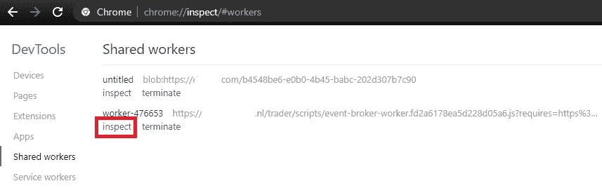
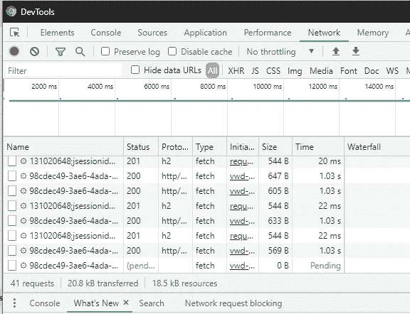

# 调试浏览器 Web 工作线程

> 原文：<https://itnext.io/debugging-browser-web-workers-db2136ef28f1?source=collection_archive---------6----------------------->

这是一篇关于调试 web workers 的短文。

作为软件工程师的一个重要方面是快速隔离各层(浏览器/后端/数据库)之间的错误。在浏览器上，我们习惯了开发者工具。这告诉我们发生了什么错误，允许我们调试 javascript 或监视网络选项卡，以查看通过网络的请求/响应。但是在一些应用程序中，工作是在 Web Worker 内部完成的，开发人员工具默认情况下似乎不会调试它。是吗？

有了 chrome，你可以导航到 chrome://inspect/#workers。

Chrome inspect web workers。

这就是 WebWorker 环境中的开发工具。

web worker 中的开发工具

现在，您可以调试脚本或在网络选项卡中查看发生了什么。

## 但是什么是网络工作者呢？

Web workers 是一种在后台运行东西的简单方式，在一个独立于 UI 的线程中。它们通常用于需要在浏览器中进行高度处理的应用程序，因此我们可以在更多的线程中运行这种处理，而不会干扰主 UI 线程。

# 最后的想法

因此，如果有时您在网络选项卡上期待 HTTP 请求，但是它们神秘地根本没有出现。也许请求是在 web worker 内部发出的，所以值得仔细检查——调试愉快。