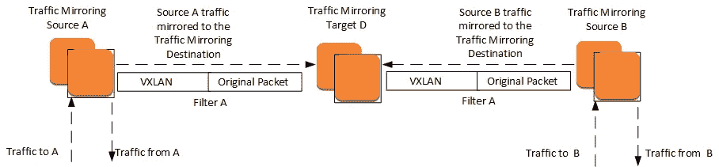
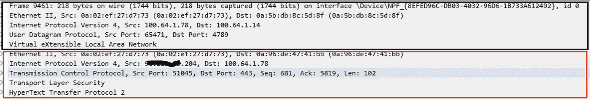
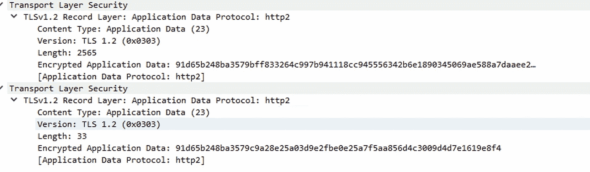
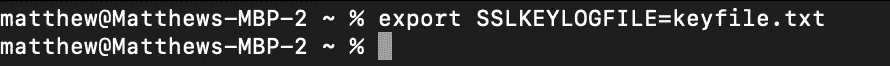
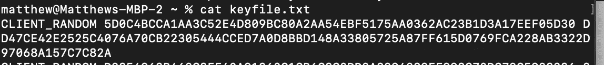
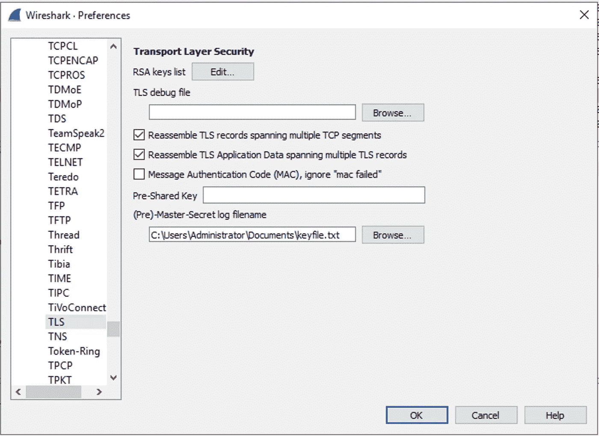
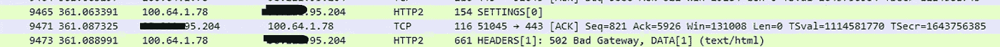

# 当 VPC 流量日志不够用时

> 原文：<https://itnext.io/debugging-complex-networking-issues-with-elb-and-other-aws-managed-services-8d2ff9822fbe?source=collection_archive---------1----------------------->

## 调试 ELB 和其他 AWS 托管服务的复杂网络问题

任何优秀的云工程师的一个基本条件是拥有强大的网络基础。无论你在云中做什么，在某些时候，一些数据必须从一个地方移动到另一个地方。当数据移动时，迟早会有东西出故障，有人必须调试它。当您处理 AWS VPC 时，您经常检查的第一件事是 VPC 流量日志，但这仅在以下方面有所帮助:

1.  有路由问题吗？如果流量不在 VPC 流量日志中，几乎总是路由问题。
2.  VPC 安全组是否允许接口之间的流量？
3.  网络 ACL 是否允许子网之间的流量？

如果在您的 VPC 流量日志中有一个拒绝，2 或 3 是罪魁祸首。但是，如果 VPC 流量日志显示接受您的流量，但您仍然在日志中看到“连接超时”或其他网络错误，会发生什么呢？如果 EC2 实例的操作系统上存在丢弃流量的配置，例如基于主机的防火墙或内部路由问题，VPC 流日志不会知道。幸运的是，您可以访问 EC2 实例的底层操作系统，因此您可以从那里进行调试。

最近在一个项目中，我们在一个应用程序负载平衡器上遇到了间歇性的 502 错误——间歇性的错误并不有趣。我们检查了 ALB 访问日志，它们提供了很好的信息，但它们不是原始数据。即使你能够解读他们讲述的故事，他们也没有讲述完整的故事。

```
type time elb client_ip client_port target_ip target_port request_processing_time target_processing_time response_processing_time elb_status_code target_status_code received_bytes. sent_bytes. “request”. “user_agent” ssl_cipher. ssl_protocol target_group_arn “trace_id”. “domain_name” “chosen_cert_arn” matched_rule_priority request_creation_time “actions_executed”https 2022–04–19T21:37:22.712394Z app/my-albli-B66X277T4761/55b71d5d1d4b7322 xx.xx.255.79:23273 xx.xx.0.120:443 0.021 0.003 -1 502–184 688 GET [https://trg.domain.com:443/index.net/Security/logon.aspx](https://trg.domain.com:443/index.net/Security/logon.aspx) HTTP/1.1 MonitoringTOOL_Monitor/1.0 ECDHE-RSA-AES128-GCM-SHA256 TLSv1.2 arn:aws:elasticloadbalancing:us-east-1:1111111111:targetgroup/my-nlb/2667f724b1efc5c5 Root=1–3333333–0124f1707221a2650b9fe9f9 trg.domain.com arn:aws:acm:us-east-1:11111111111:certificate/2222222–9f9f-4b8b-ace5–0c5a8c672798 0 2022–04–19T21:37:22.688000Z waf,forward
```

大多数网络工程师更喜欢 Wireshark——它是黄金标准，可以让您看到整个故事。问题是:我如何在一个实际上无法登录的系统上捕获数据包？例如，当使用托管 AWS 应用程序负载平衡器时。

进入 VPC 交通镜像！

流量镜像于 2019 年 6 月发布，提供了一种全面了解通过 AWS ENI 的任何流量的方法。

它需要 3 条信息:

1.  来源 ENI——您希望实际监控哪个 ENI
2.  目标—您希望镜像流量发送到哪里
3.  过滤器—您希望镜像哪些流量—您可以镜像入站/出站、UDP/TCP、源/目标 IP、源/目标端口。

然后，AWS 将镜像流量封装在 VXLAN(一种运行在 UDP 4789 上的协议)中，并将其从镜像源发送到镜像目标。这需要将目标的安全组打开到 UDP/4789。



所以我启动了一个安装了 Wireshark 的 Windows 服务器，并将其设置为我的目标，我的来源是我的 ALB 的 ENI。



在 Wireshark 中查看流量，您可以看到封装。底部的红框是从客户端到 ALB 的原始数据包。黑色方框是包装器流量—您可以看到它是 UDP Dst 端口:4789。

设置镜像后，我需要自己生成一个 502 错误。然而，这里有一个小问题——502 响应在 HTTPS 是加密的。我很好奇，不仅想看到 502 的回复，还想知道之前和之后发生的事情。所以我必须找到 502 加密响应，然后才能进行下一步。



这是加密的天书。

幸运的是，Wireshark 确实允许您解密 HTTPS(即使使用 Diffie-Hellman，即完美的前向保密)，但您需要捕获用于加密的密钥。

使用 curl 时，您可以让 curl 将 TLS 中使用的加密密钥写入您通过设置以下环境变量指定的文件中。



下次运行 curl 时，您将在指定的文件中看到类似这样的内容。



我用 Wireshark 将密钥从我的笔记本电脑复制到 Windows box，然后配置 Wireshark 用我的密钥文件解密。



现在我可以在 Wireshark 中看到我的 502 错误。但是为什么会这样呢？？



我根据我的 IP 地址过滤流量，因此我移除了过滤器并记下了 502 消息的序列号。就在它之前，有一个我的 ALB 的目标发送的 TCP Reset！


我们的目标是 NLB，因此我们查看了网络负载平衡器的 AWS 文档，发现了以下情况:

> 对于客户端通过网络负载平衡器发出的每个 TCP 请求，都会跟踪该连接的状态。如果客户端或目标在超过空闲超时的时间内没有通过连接发送任何数据，则连接关闭。如果客户端或目标在空闲超时时间过后发送数据，它会收到一个 TCP RST 数据包，表示连接不再有效。
> 
> 弹性负载平衡将 TCP 流的空闲超时值设置为 350 秒。您不能修改该值。客户端或目标可以使用 TCP keepalive 数据包来重置空闲超时。为保持 TLS 连接而发送的 Keepalive 数据包不能包含数据或有效负载。

这是 TCP keepalive 问题！因此，我们的下一步是在我们的 NLB 目标上启用 TCP keepalive 这应该会解决这个问题——届时我将更新博客。

## 结论:

这表明在调试网络问题时，在 Wireshark 中查看原始数据包捕获是无可替代的。甚至跟踪此问题的 AWS 支持人员也发现 Wireshark 信息在为 ALB 访问日志提供上下文方面非常有用。但是，如果没有 VPC 流量镜像和 VXLAN 封装的魔力，这一切都是不可能的！

Matthew 是领先的 AWS 网络安全合作伙伴 stackArmor 的高级解决方案总监，该公司为希望满足合规框架安全要求的客户设计定制解决方案:FedRAMP、NIST 800 系列、PCI-DSS、国防部 SRG、HIPAA、FISMA、FIPS 140–2(和 3)等。StackArmor 提供了一个经过 AWS 审核的解决方案，可以加速 FedRAMP ATO 的运行并降低 40%以上的成本。