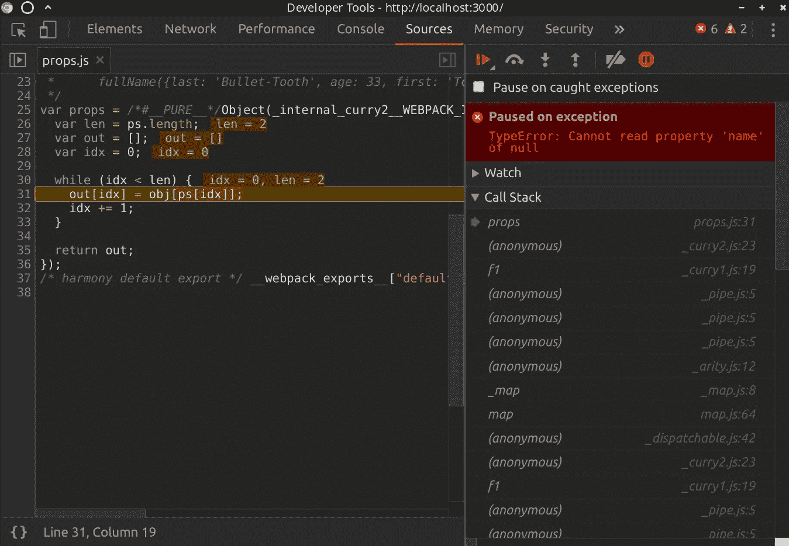
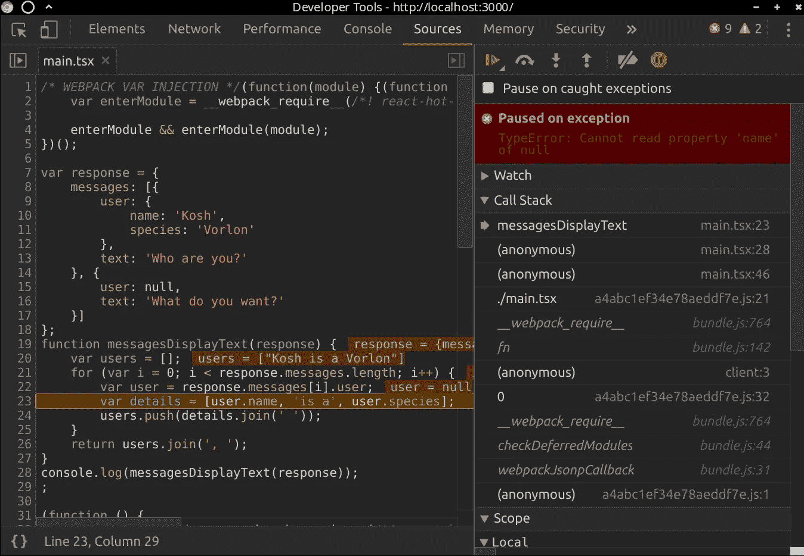
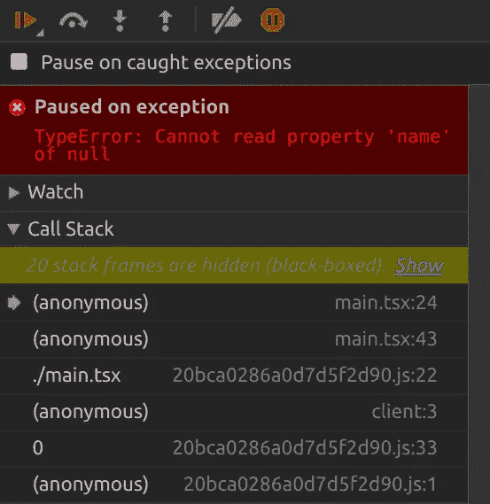
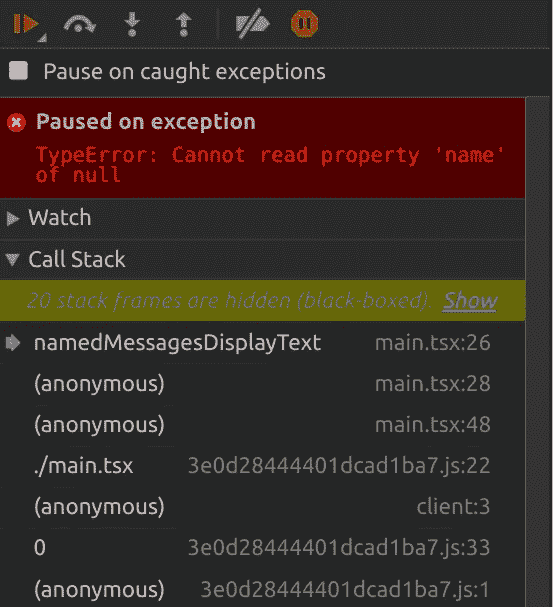

# 调试功能 Javascript

> 原文：<https://itnext.io/debugging-functional-javascript-545b6ea59660?source=collection_archive---------1----------------------->

在探索了 Javascript 中的函数式编程之后，我想写一些调试时值得考虑的权衡。这篇文章相当固执己见，但是提供了一些技巧来使事情变得简单。

我将假设您熟悉基本的函数式编程概念。我提出的一些问题并不特定于功能模式本身。

如果你一直写 100%没有错别字的完美代码，你可能会觉得有点枯燥。或者，如果你认为苹果可以像取消 escape 键一样取消退格键，你应该继续:/

这样做的目的不是阻止任何人用更实用的风格写作。这也不是要阻止使用像[拉姆达](http://ramdajs.com/)、[洛达什 _fp](https://github.com/lodash/lodash/wiki/FP-Guide) 或[避难所](https://sanctuary.js.org/)这样的高质量功能库。我喜欢用功能性更强的风格编写代码，并且理解许多使用和推广它的好理由。

*免责声明已经够多了*。

我发现在某些情况下，特别是在 Javascript 中使用[默认/无点](https://en.wikipedia.org/wiki/Tacit_programming)编程风格时，会导致堆栈跟踪混乱和调试障碍。

让我们从查看一些函数式代码中意外错误的堆栈跟踪开始。这可能只是一些愚蠢的打字错误，在这种情况下，它来自一些使用 [Ramda](http://ramdajs.com/) 库的相当“简单”的东西:



看到这种事情，不禁想起自己在编写调试`Angularjs 1.x`控制台错误时看到和经历的挫败感。

在这种情况下，人们很容易天真地认为:

> *“如果一个错误的调用栈只显示了依赖关系中的行，那么这个错误一定是依赖关系中的一个 bug！”*
> 
> 没有一个程序员有过这样的想法←讽刺

你在 github 等网站上看到过多少期被人评论为:

> *“呜呜对不起我的错，我没看到…”*

抛开一厢情愿的想法，您需要解决这个错误，不管它是否是您的代码。从消息中可能很难看出在代码中的什么地方引用了一般称为“name”的东西。众所周知，可能是一些聪明人使用了[函数原型](https://developer.mozilla.org/en-US/docs/Web/JavaScript/Reference/Global_Objects/Function/name)的 name 属性。

我们在调用栈中看到的是非常常见的函数模式中的函数名，如`pipe`、`curry`和`map`。问题是，你可能会在你的代码库中使用这些。所以这就相当于知道代码路径使用了`if`和`else`语句。没用，如果这来自生产，祝你好运知道从哪里开始有效地调试问题。

那么，为什么更函数式的编程风格会导致这样混乱的堆栈跟踪呢？

它是以下各项的组合:

*   [功能驱动](https://en.wikipedia.org/wiki/Currying)
*   [心照不宣/免分](https://en.wikipedia.org/wiki/Tacit_programming)风格
*   Javascript 的动态特性
*   异步方法
*   大量的库代码

所有这些都有一个副作用，就是用函数名填充调用堆栈，这些函数名通常是匿名的，或者来自一个依赖项，如果它们没有被完全放大的话。现在浏览器的调用栈大小毕竟是有限的。我将向您展示如何进一步增加它。

# 比较命令式和函数式示例

通过一个简单的代码示例，这一点更容易理解。来自不太琐碎和较大的代码库的代码很可能有更长的堆栈跟踪，如果你只是走进来，可能会更难推理。

在这个例子中，假设我们从一个服务中得到以下对象。

```
const response = {
  messages: [
    {
      user: {
        role: 'The first ones',
        name: 'Kosh',
        species: 'Vorlon'
      },
      text: 'Who are you?'
    }
  ]
}
```

我们需要在视图中显示一些逗号分隔的文本。文本必须包含所有用户名及其种类的列表。每个用户需要采用以下格式:

```
`${userName} is a ${species}`*// Eg =>  Kosh is a Vorlon, ...*
```

为了举例说明，让我们用几种不同的风格来实现它。

## 无功能点

```
const userDisplayText = R.pipe(
  R.prop(['user']),
  R.props(['name', 'species']),
  R.intersperse('is a'),
  R.join(' ')
)const messagesDisplayText = R.pipe(
  R.prop('messages'),
  R.map(userDisplayText),
  R.join(', ')
)
```

## 必要的

```
function messagesDisplayText(response) {
  var users = []
  for (var i = 0; i < response.messages.length; i++) {
    var user = response.messages[i].user
    var details = [
      user.name,
      'is a',
      user.species
    ]
    users.push(details.join(' '))
  }
  return users.join(', ');
}
```

是的，这些都是奇怪且不完美的实现方式，它只是用来描述不同之处。然而，它们都输出相同的所需字符串。现在的*因为发生了错误，显然用户在响应中的有效值也是 null:*

```
const response = {
  messages: [
    {
      user: {
        name: 'Kosh',
        species: 'Vorlon'
      },
      text: 'Who are you?'
    },
    {
      user: null,
      text: 'What do you want?',
    },
  ]
}
```

我们怎么知道？:(

如果你猜对了，是的，这就是你在文章开头看到的错误的原因。

让我们在 Chromium 中使用“异常暂停”时看到这一点，并并排比较这两种风格:

功能性:


命令式:



在这个特定的场景中，它几乎就像是黑白的。命令式调用堆栈显示了理解问题所需的确切函数名和行号。

# 为什么继续使用功能性风格？

具有讽刺意味的是，人们对函数式编程感兴趣的一个原因是代码更容易推理。在这种情况下，一些在命令式风格下可以阅读的东西，现在会产生一些在函数式风格下看起来更复杂的错误。

除了这个示例之外，问题的原因可能不像服务器响应返回意外的有效负载签名那样简单或不可能。知道这个值为什么是`null`远不是一件小事。

根据我目前所知，我将尝试描述一个函数式程序员最糟糕的噩梦。考虑错误发生在具有深度继承的类内部，在具有命令式代码的属性上。这段代码改变了一个复杂的本地状态，也可能受到未记录的、难以推断和预测的副作用的影响。在这种情况下，通常很难跟踪和再现对象状态。尤其是在 qa 或生产中开发之后才第一次看到的状态。更糟糕的是，除了您自己的机器之外，其他机器上似乎只发生这种情况。

关于`Functional vs Imperative`的讨论超出了本文的范围。所以收起你的战斗手套吧，大概之前都说过了；)

无论如何，不要因为理解这样的错误而失去希望，让我们通过一些技术来进行调试。

# Devtools 黑盒

就像任何其他有很多依赖项的 Javascript 项目一样，我们可以使用大多数主流浏览器的 devtools 提供的[黑盒](https://developer.chrome.com/devtools/docs/blackboxing)特性。实际上，我们可以从视图堆栈行中过滤出我们当前不关心的依赖项。

使用上面的例子，这里是功能性例子的“在未捕获的异常上暂停”,所有的 Ramda 行都是黑色的:



是的，在这种情况下，在隐藏了 20 帧 Ramda 之后，你现在可以看到我在`main.tsx:24`上写代码的地方了。这正是我调用导致异常的自由点方法的地方。

知道这些过滤器可以在重新加载时保持持久是很有用的，如果您需要过滤掉一些更具体的东西，它们还支持正则表达式。黑盒还有[这些效果](https://developer.chrome.com/devtools/docs/blackboxing#what-happens)需要注意:

*   从库代码抛出的异常不会暂停(如果启用了异常暂停)，
*   步入/退出/跳过库代码，
*   事件侦听器断点不会在库代码中中断，
*   调试器不会在库代码中设置的任何断点上暂停。

# 堆栈跟踪限制

如果您正在编写大量函数式代码，堆栈跟踪通常会非常大。出于明显的性能原因，浏览器设置了限制。因此，如果您真的遇到困难，一些浏览器(如 Chromium)允许您通过这个全局 api 增加堆栈跟踪限制:

```
Error.stackTraceLimit = number
```

请注意，这个 api 不是为生产环境设计的。

# 包装命名函数

在意外错误的堆栈跟踪中知道函数名的好处显而易见。最好的情况是，如果您熟悉函数名，您可能会立即猜到给定特定的错误消息会发生什么。

如果您正在使用一些高级的错误日志记录工具，那么 Stacktraces 本身也很有用。也许您想通过特定的函数名来分组或搜索特定的错误。这可能显示出其他的见解，如发生时间的相关性。

您可以将命名函数添加到无指针样式函数的堆栈跟踪中，只需将它包装在一个:

```
function namedMessagesDisplayText(response) {
  *// the point-free style function*
  return messagesDisplayText(response)
}
```

现在检查调用堆栈，您应该看到函数名`namedMessagesDisplayText`:



考虑到这一点，您可以通过保留纯粹的`point-free`样式来避免多余的函数，并改为编写以下代码:

```
function messagesDisplayText (response) {
  return R.pipe(
    R.prop('messages'),
    R.map(userDisplayText),
    R.join(', ')
  )(response)
}
```

# 日志助手

它不会帮助您改进堆栈跟踪，但在理解错误或跟踪函数式控制流中的数据方面，它是一个非常有价值的工具。

要点是简单地创建可以插入到作品中的日志记录函数:

```
const traceUser = (data) => {
  console.log('the user', data)
  return data
}const userLabelText = R.pipe(
  R.prop(['user']),
  traceUser, *// <-- just another part of the pipe :)*
  R.props(['name', 'species']),
  R.intersperse('is a'),
  R.join(' ')
)
```

现在，在您的控制台或日志记录实用程序中，您可以看到发生了什么:

```
// the user {role: "The first ones", name: "Kosh", species: "Vorlon"}
// main.tsx:26 the user null
```

# 断点

如果你想在功能组合中使用一个断点，在这个例子中，我认为与命令式代码相比，它不那么直接。

如果你试图在一根管子的一条线上放一个断点或者作曲，那是行不通的。或者，如果您试图“步入”一个函数模式，如本质上封装了一个`if/else, if/else`的 [R.cond](http://ramdajs.com/docs/#cond) ，您将不得不逐句通过库代码，从而增加调用堆栈的大小。如果它只是一个`if {} else ..`或者一个`switch`语句，调试器将只会单步调试你的代码。

幸运的是，如上所示，devtools 中的黑盒可以通过自动告诉调试器跳过黑盒行来帮助避免这种情况。

然而，为了在合成中更加精确，您总是可以使用[调试器](https://developer.mozilla.org/en-US/docs/Web/JavaScript/Reference/Statements/debugger)语句。因此，扩展日志记录函数的概念，只需将它添加到一个助手函数中:

```
const debug = item => {
  debugger *// <-- break here*
  return item
}const userLabelText = R.pipe(
  R.prop(['user']),
  debug, *// <-- put this wherever in the pipe you need to*
  R.props(['name', 'species']),
  R.intersperse('is a'),
  R.join(' ')
)
```

我发现这在学习 API 和用函数式风格思考时特别有用。

如果你以前没用过，[调试器语句](https://developer.mozilla.org/en-US/docs/Web/JavaScript/Reference/Statements/debugger)指示 devtools 中断。只有在打开并连接了 devtools 窗口的情况下，才会发生这种情况。使用它的最大好处是，不需要手动找到该行并手动将其插入断点。像热重装这样的事情，通常你只需要点击键盘上的 save，然后等待一个 devtools 窗口，把焦点放在你想要的地方。

因为这就像代码中的任何其他语句一样，所以您也可以将其包装在任何表达式中，以获得条件断点:

```
const debug = item => {
  if (item === null) debugger
  return item
}
```

# 猴子补丁

一种仅用于开发的有趣方法是包装一个高阶函数，通过抛出和捕获错误来捕获上下文，如函数名和自定义堆栈跟踪。`@jacobp100`有一个使用 Ramda pipe 的[很酷的例子，值得一试。我想这个想法在其他创造性的方面也是有用的。](https://medium.com/@jacobp100/debugging-functional-libraries-in-javascript-f586cdf8ea4)

# 运行时类型系统

为了提供一些更有用的错误消息，来自运行时的额外上下文会有所帮助。[避难所](https://github.com/sanctuary-js/sanctuary#type-checking)允许消息和文档就位。它们类似于[功率断言，如](https://github.com/power-assert-js/power-assert)错误消息:

```
S.add(2, true);
// ! TypeError: Invalid value
//
//   add :: FiniteNumber -> FiniteNumber -> FiniteNumber
//                          ^^^^^^^^^^^^
//                               1
//
//   1)  true :: Boolean
//
//   The value at position 1 is not a member of ‘FiniteNumber’.
//
//   See https://github.com/sanctuary-js/sanctuary-def/tree/v0.14.0#FiniteNumber for information about the sanctuary-def/FiniteNumber type.
```

# 编译时类型检查

对于在编译时或在 ide 中捕捉错误的函数式风格来说，Typescript 有很大的好处。Typescript 不能真正帮助您处理运行时错误。

应该说，错误键入的代码会导致引入只在运行时出现的错误。例如，如果您将某些内容强制转换为`any`，这将告诉 Typescript 忽略该类型。现在，如果你通过`any`传递一些无效的东西，你只会在运行时看到一个错误。请记住，盲目信任复杂类型或者将函数参数保留为`any`会导致错误的安全感和运行时错误。

在一些场景中，我发现严格地键入每件事可能会很麻烦，而且回报很少。例如，考虑从 Ramda [@types/ramda](https://github.com/types/npm-ramda) 定义中用[泛型](https://www.typescriptlang.org/docs/handbook/generics.html)严格键入一个大的[管道](http://ramdajs.com/docs/#pipe)或[组合](http://ramdajs.com/docs/#compose)。

对于相当大的管道，考虑严格遵守以下接口:

```
pipe<V0, T1, T2, T3, T4, T5, T6, T7, T8, T9>(
    fn0: (x0: V0) => T1,
    fn1: (x: T1) => T2,
    fn2: (x: T2) => T3,
    fn3: (x: T3) => T4,
    fn4: (x: T4) => T5,
    fn5: (x: T5) => T6,
    fn6: (x: T6) => T7,
    fn7: (x: T7) => T8,
    fn8: (x: T8) => T9): (x0: V0) => T9;
```

另一个较小的例子，没有换行符:

```
compose<V0, T1, T2, T3, T4, T5, T6>(fn5: (x: T5) => T6, fn4: (x: T4) => T5, fn3: (x: T3) => T4, fn2: (x: T2) => T3, fn1: (x: T1) => T2, fn0: (x: V0) => T1): (x: V0) => T6
```

我认为这很容易让用户出错和沮丧。您的类型的名称很可能超过两个字符，因此您可能需要打开文本换行。我发现编写泛型比编写组合本身要花更长的时间。

与其键入整个 compose，我建议更重要的是将它包装在一个命名函数中，严格键入所有的输入和输出，并添加合理数量的测试覆盖。

不过，不要让这吓到你。我可能在挑最坏的情况。实际上，它非常好用，在你需要重构代码的时候非常有价值。

# 最后的想法

虽然错误堆栈跟踪可能不总是理解错误的唯一方式，也不是最有帮助的方式，但它们在开发、qa 和生产中仍然是有用的。我认为，为运行在跨平台和多厂商 web 浏览器中的 Javascript 做好处理错误的准备是必须的。考虑到其他外部因素，如冲突的浏览器扩展、本地网络拓扑和连接性，很难不将其描述为一个不稳定的环境。

考虑到这一点，现在有一个完整的工具行业可以提供一些强大的方法来捕获错误、用户痕迹和发生时的错误堆栈跟踪。如果你不使用任何东西，一个很好的解决方案是 [sentry](https://github.com/getsentry/sentry) ，它也是 BSD3 许可的。

函数式编程风格不是万能的，尤其是当你在浏览器和 Javascript 中使用它的时候。如果您在一个大型复杂的代码库中编写大量的功能代码。我的建议是不要一开始就使用完全没有点的风格。相反，要确保在主要业务逻辑和公共 API 上健康地使用命名函数。也要考虑用 [Typescript](http://www.typescriptlang.org/) 或 [Flow](https://flow.org/) 正确地输入那些函数，这样更容易维护和重构。

我找不到太多关于这类事情的其他文章。所以我鼓励其他人。除非你建议人们购买支持纵向模式的显示器支架。这样，所有的调用栈都可以适合视图；)

我想归功于一本关于函数式编程的极好的书[非常合适的指南](https://mostly-adequate.gitbooks.io/mostly-adequate-guide/ch05.html#debugging)，日志技术也在调试部分提到。

交叉发布自:[https://christopherdecoster.com/posts/debugging-fp-js/](https://christopherdecoster.com/posts/debugging-fp-js/)