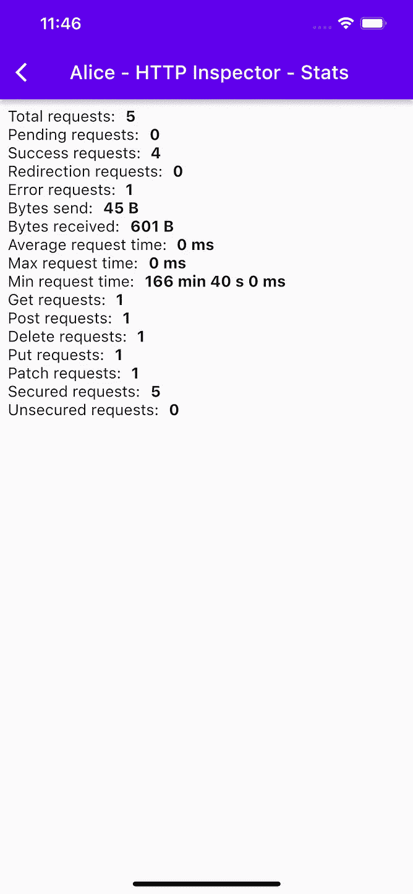
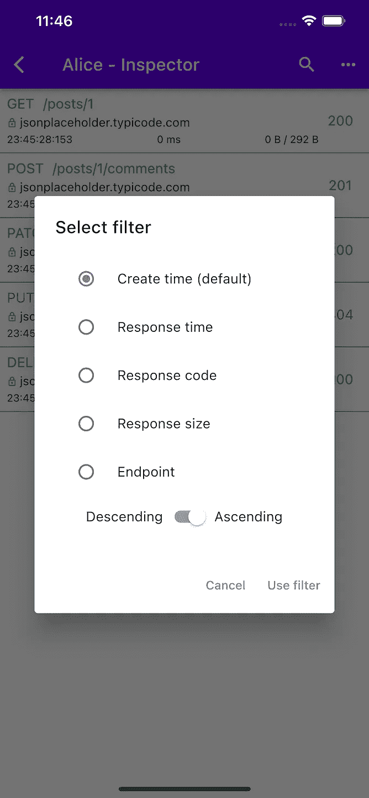
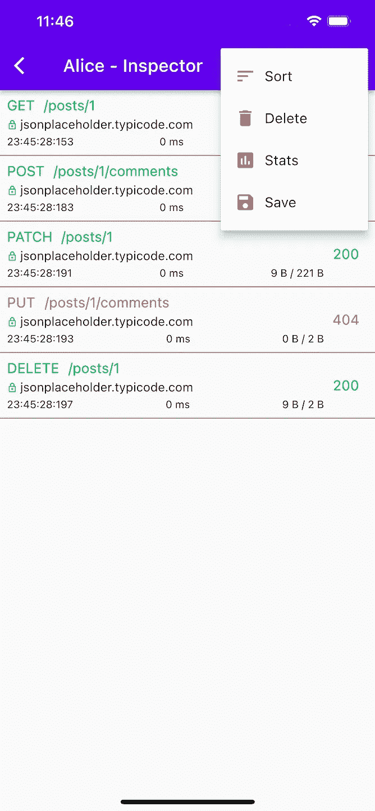
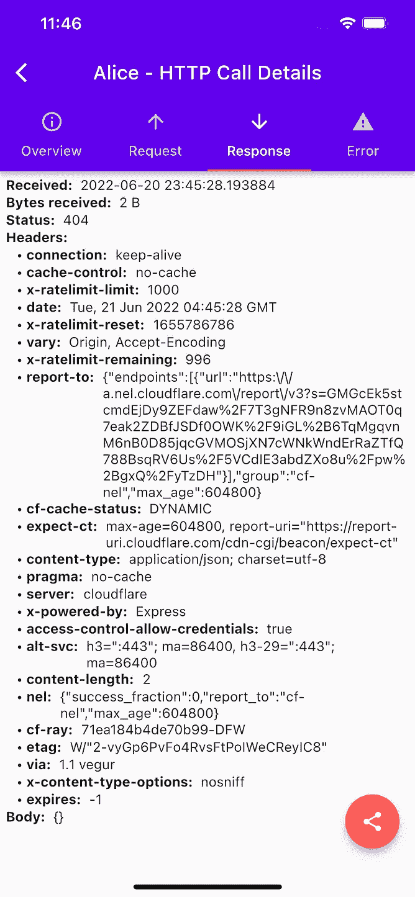
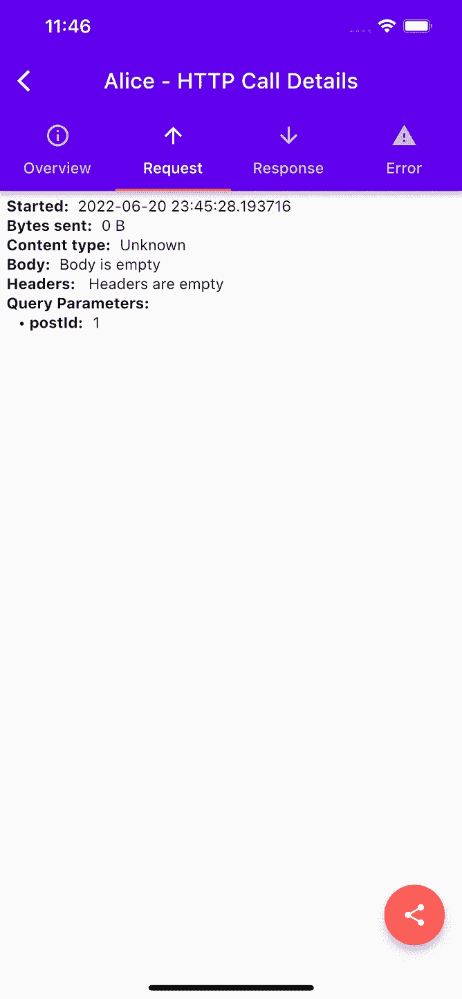

# 用 Alice 调试 Flutter 中的网络调用

> 原文：<https://itnext.io/debugging-network-calls-in-flutter-with-alice-a43883899e67?source=collection_archive---------5----------------------->


用 Alice 调试 Flutter 中的网络调用

## 看视频

用 Alice 调试 Flutter 中的网络调用

在这篇文章中，我展示了一个在 Flutter 中调试网络调用的有用插件。

***爱丽丝！***

你可以在这里找到 ***爱丽丝*** 包[。](https://pub.dev/packages/alice)

> Alice 是一个用于 Flutter 的 http 检查工具，它可以帮助调试 HTTP 请求。它捕获并存储 http 请求和响应，可以通过简单的 UI 查看。

整合起来很简单！

## 首先在 *pubspec.yaml* 中添加依赖关系。

```
dependencies:
  flutter:
    sdk: flutter cupertino_icons: ^1.0.3
  alice: ^0.2.5
  http: ^0.13.4
```

## 创建 ***爱丽丝*** 的实例。

```
Alice alice = Alice();
```

## 将 ***alice*** 加入您的网络通话。

```
import 'package:http/http.dart' as http;final response = await http        .get(Uri.parse('[https://jsonplaceholder.typicode.com/posts/1'](https://jsonplaceholder.typicode.com/posts/1')));if (kDebugMode) alice.onHttpResponse(response);
```

## 打开调试信息用户界面

网络调用完成后，您可以使用下面的代码打开 alice inspector。

```
alice.showInspector();
```



就是这样。

如果你觉得这篇文章有用，请留下你的宝贵意见。

感谢阅读。