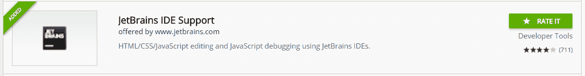
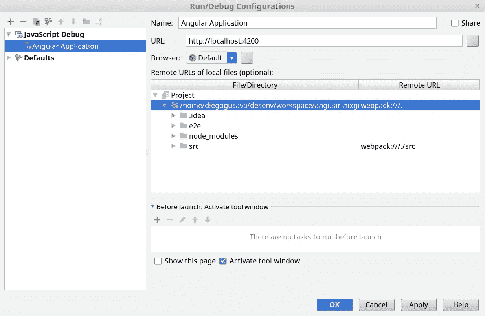
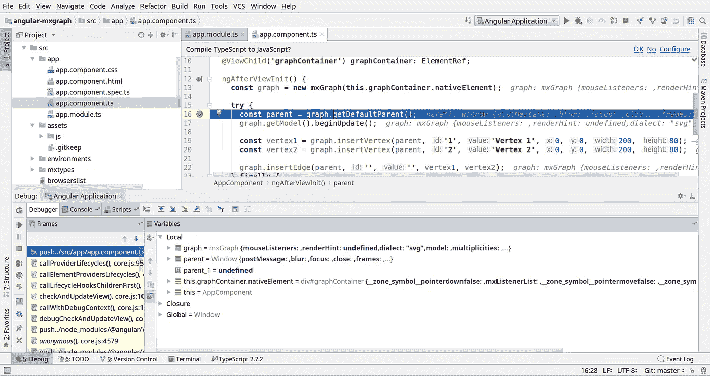

# 在 Intellij IDEA 中调试角度应用程序

> 原文：<https://itnext.io/debugging-your-angular-application-in-intellij-idea-411a9b08759f?source=collection_archive---------2----------------------->

有趣的是，我是在开始使用可视化代码后才在 Intellij IDEA 中发现这个功能的，有一天我很生气，因为我无法使用我喜欢的 IDE 进行调试，我遇到了免费的可视化代码，并提供了大量的插件，但问题是我不习惯这个界面，我错过了 Intellij IDEA 提供的一些快捷方式，所以我又回到了 Intellij。

我们需要做的第一件事是在 Chrome 上安装 Intellij IDEA 支持插件:

安装插件后，我们需要设置我们的 IDE。创建一个新的 javascript 调试配置，如下图所示:

这里您需要做的两件重要的事情是:

1.  设置根文件夹的远程 URL:**web pack:///。**
2.  为你的 src 文件夹设置远程 URL:**web pack:///。src/**

保存配置，在代码中放置断点，并启动新的调试会话。浏览器将在[打开 http://localhost:4200/](http://localhost:4200/) 。当然，应用程序需要运行。

快乐编码:)