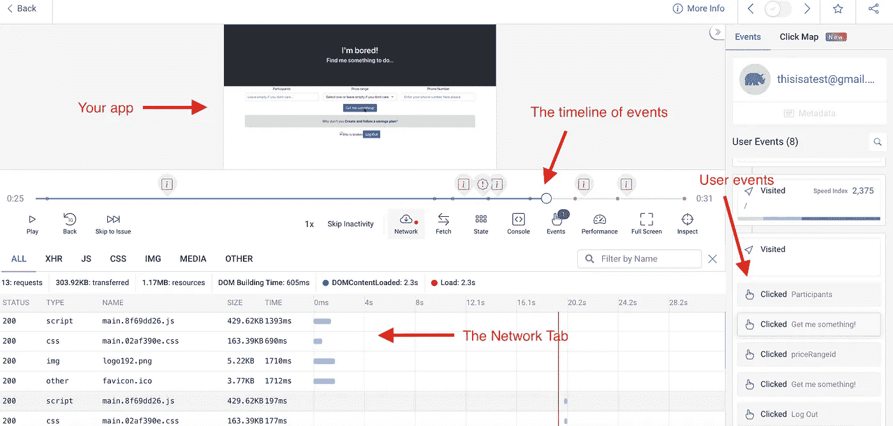

# 将 SaaS 调试为 Solopreneur——以会话重放工具为例

> 原文：<https://itnext.io/debugging-your-saas-as-a-solopreneur-the-case-for-session-replay-tools-746ff62b152f?source=collection_archive---------4----------------------->

## 理解会话重放给开发人员带来的好处可以帮助您节省调试时间

约纳斯·勒普在 [Unsplash](https://unsplash.com/s/photos/multitasking?utm_source=unsplash&utm_medium=referral&utm_content=creditCopyText) 上拍摄的照片

让我给你描绘一幅图画:你正在制造你的新产品；你独自做这件事是因为，请注意，你能做到。您拥有编码几乎所有东西所需的知识，并且您不能或不愿做的事情，您使用第三方服务。

现在您的产品已经准备好接受 beta 测试，并且您已经完成了自己的手动测试。

然而，一旦用户开始进来，你就开始通过电子邮件、Twitter 和你的 Discord 服务器收到错误报告。其中一些详细描述了截图和复制步骤(gotta love 那些用户)，但大多数都是类似“我不能做 X”或“应用程序不断崩溃”(即使是 web 应用程序)的消息。那么你能用它做什么呢？

# 你能做什么？

如果您已经设法预见到了其中的一些问题，那么您可能需要查看一些后端日志。也许您的后端服务正在崩溃或导致问题，这可能是一个很好的起点。

但是当那些日志不能给你你想要的答案时，你该去哪里呢？

常识会引导你去接触你的用户，感谢他们测试你的应用程序，并询问他们所发现问题的更多细节。

如果你幸运的话，他们不会介意你花时间去解决你提出的问题。因为说实话，这不是你用户的问题；百分之百是你的。如果他们不是技术用户(即开发人员)，那么尝试深入了解您的前端正在发生的事情可能需要打几个电话，甚至可能需要一些屏幕共享。

如果你没有那么幸运，你会被忽视，被迫想办法自己重现这个问题。

不管是哪种情况，你都没有处于一个好的位置，因为你在打扰你的用户或者猜测他们在做什么来发现问题。

你很幸运，还有一个选择。

# 尝试会话重放

会话重放是一种调试技术，它包括重现用户采取的确切步骤，以了解他们在哪里遇到了问题。也就是说，这不是一个视频记录，因为作为捕获数据的一部分，您还需要捕获控制台错误、发出的请求以及更多数据。

对于 UX 的设计者和产品人员来说，会话重放可能听起来很熟悉，因为它也可以用来理解用户如何与应用程序交互。

然而，是时候让开发者也参与进来了。

也就是说，开发者需要更多关于用户会话的细节，而不仅仅是理解他们点击了哪里。这就是为什么如果你是一个独自尝试改进你的调试游戏的 solopreneur，你会想要远离像 Fullstory，SmartLook，HotJar 之类的会话重放工具。请注意，他们做得很好；你绝对可以使用它们，并从中获得一些见解。但是它们不是为开发人员设计的，所以最有问题的 bug 不容易调试。

那么，有哪些选项实际上是为开发者设计的呢？我个人最喜欢的一个和我推荐给大家的选项是 [OpenReplay](https://openreplay.com/) 。

我在应用程序上重播用户会话的屏幕截图

正如你从上面的截图中看到的，这个播放器有几个选项，我觉得对所有开发人员来说都很完美，因为它们允许你看到整个画面，就像你坐在你的用户旁边一样:

*   当然，重放**捕捉实际的 DOM 元素**和事件，而不是制作视频记录。
*   您还可以**查看和检查用户控制台中记录的 JavaScript 错误**。这对于发现普通用户永远不会发现的隐形错误非常有用。
*   您用户的**网络标签**也被捕获，这意味着如果您的前端发出请求或加载外部资源，您将看到它们是什么以及它们发生了什么。这对于识别由缺少资源引起的问题非常有用。
*   除此之外，您还可以获得关于应用程序的动作和性能的统计数据。您还可以用它们创建自定义仪表板。当然，你得到了所有的 [web 生命特征](https://web.dev/vitals/)，但是其他的像内存使用、缓慢的资源、崩溃等等。

现在，这些是调试基于“这不起作用”类型的错误报告的应用程序的一些奇妙的特性。但除此之外，OpenReplay 的项目还有其他有趣的特点:

*   **它是开源的**，这意味着你可以扩展它或修复问题，并向他们发送一个 PR。有了 Github 上的 [4.6k 明星，他们的项目](https://github.com/openreplay/openreplay)每天都在受欢迎，他们有一个 [Slack 社区](https://slack.openreplay.com/)，在那里你可以直接联系开发人员。
*   您可以**净化**他们的追踪器捕获的数据，以确保任何敏感信息都不会离开应用程序的安全传输通道。换句话说，你的用户没有理由不信任你这样调试应用程序。主要是因为，默认情况下，有些字段是不会被捕获的，比如电话号码和电子邮件字段。
*   最重要的是，如果他们的 SaaS 选项对你来说不理想，你可以**在你的服务器**上部署整个平台，让这一切都在你的控制之下。假设您害怕将信息从服务器发送到外部数据库，从而违反了一些隐私政策。这种自托管能力允许您**将数据保存在您的服务器**中，同时仍然拥有完整的可用功能集。

他们在 SaaS 的免费层非常适合在你下定决心之前开始使用和测试产品。即使你最终想和他们一起“全面企业化”，他们的定价模式是根据用户而不是数据流量来调整的，这意味着即使你有一个成功的产品，它也是你项目的完美选择。

当你是一个独立创业者时，独自做每件事有时会很有挑战性。你很可能会尝试尽可能多地自动化，这样你就可以专注于需要你关注的关键任务。

在调试的情况下，不能自动化；然而，使用简化过程的工具，使你从花费几个小时到仅仅几分钟来识别一个问题，是你能达到的自动化天堂。

你试过 OpenReplay 或者类似的工具吗？请在评论中分享你的想法，一起来讨论吧！