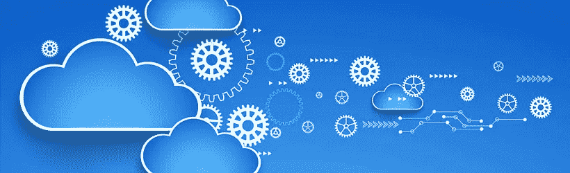

# 通过 Edge 分散云计算

> 原文：<https://itnext.io/decentralizing-cloud-computing-through-edge-d32890614e4b?source=collection_archive---------0----------------------->

通过[物联网连接协议](http://www.postscapes.com/internet-of-things-protocols/)进行通信的嵌入式传感器在物理对象和环境中无处不在，已经将物理世界转化为一个完整的信息系统。传统上，这些数据大部分是在云或数据中心进行管理和分析的。

更短的响应时间、敏捷的数据处理和分析已经成为入侵各个领域的物联网的必需品。然而，传统的基于集中式云的范例无法充分满足这些要求。

物联网中称为边缘计算的不同模型利用分散计算来减少需要在云端传输、处理和分析的数据量。

## **什么是边缘计算？**

边缘计算是指在数据源(网络边缘)执行数据处理的技术。它能够在本地计算设备上收集和处理数据，而不是在云中或远程数据中心。

ARC 咨询集团副总裁 Greg Gorbach 表示:“边缘计算方法在整个工业领域迅速获得青睐。这是一种在需要的地方部署强大分析的方式，同时增强实时性能优化并最大限度地减少数据瓶颈。”

BI Intelligence 最近发布的一份报告估计，2020 年，企业和政府拥有的 56 亿台物联网设备将使用边缘计算。下面的图表摘自[商业内幕](http://uk.businessinsider.com/edge-computing-in-the-iot-forecasts-key-benefits-and-top-industries-adopting-an-analytics-model-that-improves-processing-and-cuts-costs-2016-7?r=US&IR=T)，显示了通过边缘计算连接的设备的预期增长:

根据该报告，边缘计算模式特别适合在物联网应用中实施，主要原因如下:

*   近乎实时的数据分析
*   降低运营和数据管理的相关成本
*   减少了发送回云的数据(因此，减少了对网络的限制)
*   确保即使一台设备出现故障，其他 IT 资产也能保持运行

通用电气的 Predix 是一个操作系统和基于云的平台，利用了边缘计算技术。它收集和分析数据，同时为优化工业基础设施和运营提供实时见解。结合边缘计算的云灵活性使 Predix 不同于其他云平台。