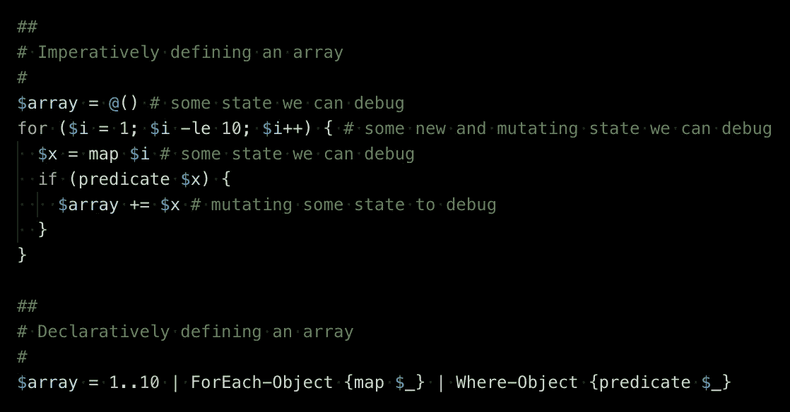
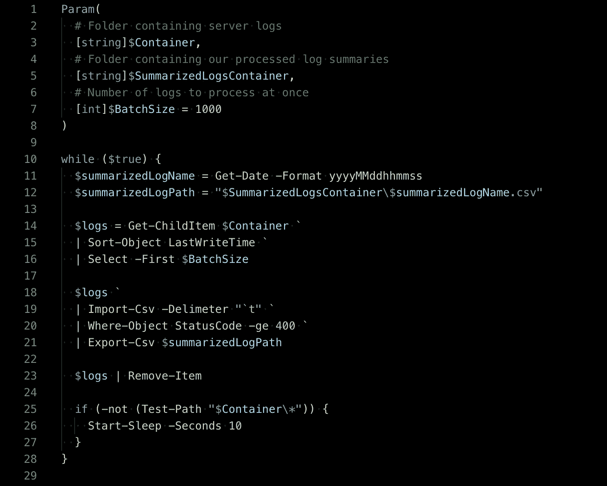
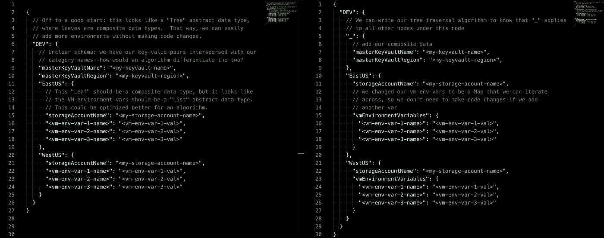

# 声明性 DevOps

> 原文：<https://itnext.io/declarative-devops-30788ddd43cd?source=collection_archive---------3----------------------->

## 深入了解 DevOps 的最大趋势

[*的第二部分*声明性 DevOps 微框架**](https://medium.com/@cjkuech/declarative-devops-microframeworks-9908c8d05332)

声明式编程并不是一个新概念——但它在描述 DevOps 工具方面的使用最近出现了爆炸式增长。这可能看起来只是另一个时髦的术语，但是声明式编程对于 DevOps 来说有一些独特的好处，这确保了它的存在。

随着开发人员试图破坏越来越多的远程资源，声明式开发运维的流行程度随着云的发展而增长

# 什么是声明式编程？

声明式编程经常与函数式编程混为一谈，但有些不同。理解声明性范例最简单的方法是将其与“普通的”命令式代码进行对比。

## 什么是命令式编程？

如果你在问这个问题，命令式代码的一个很好的例子就是你当前的代码库。命令式代码将逻辑定义为一系列步骤。每一步都要等待上一步完成后再继续，并且每一步都要修改系统的状态。“状态”是保存动态值的任何东西，例如:

*   内存中的一个变量
*   磁盘上的一些资源，如文件或注册表设置
*   一些外部资源，比如云中的虚拟机

## 命令式编程有什么不好？

状态很难调试。如果您将状态存储在变量中，您可能需要一个调试器来检查程序的状态。如果您将状态存储在磁盘或云中，您可能需要运行一个脚本或打开一个浏览器来查看状态。更糟糕的是，状态是副作用的同义词，比“[纯函数](https://en.wikipedia.org/wiki/Function_(mathematics))”更难进行单元测试。纯函数——保证没有副作用的函数——只需要对其输入和输出进行单元测试，而有副作用的函数也需要测试是否存在副作用。

哇，这么多要调试的！

## 一定有更好的方法！

命令式编程的替代方法是声明式编程。声明式编程是您“声明”您的数据结构并“查询”它们的状态的地方。例如，SQL 是一种纯粹的声明性语言，因为您“声明”您的数据结构(数据库、表及其相互关系)，然后“查询”结果值。同样的论点也适用于其他纯声明性语言，如 Haskell，在 Haskell 中，您将数据结构“声明”为树，并在这些数据结构上进行“查询”替换。

> 声明式编程是您“声明”您的数据结构并“查询”它们的状态的地方。

如果你对抽象语言感到困惑，不要担心——直觉地理解纯声明性语言是如何工作的可能需要几周时间。您需要记住的是，声明性代码避免了程序中的状态突变，从而避免了副作用，因此是自动幂等的，并且更容易调试。

## 编写声明性代码

您并没有为您的应用程序和脚本使用纯粹的声明性语言，但是您仍然可以将声明性概念应用到您的代码中。这些准则将使您的代码更具声明性:

*   “查询”您的数据，将尽可能多的逻辑放入引用您先前定义的常数的表达式中
*   通过将这些查询表达式绑定到一个不可变的变量来“声明”您的数据

这个用于聚合服务器请求日志的示例 PowerShell 片段演示了这些准则，从不改变状态并最大限度地使用表达式。

应用我们的声明性编码指南的 PowerShell 脚本示例

由于我们是“查询”而不是“执行一系列步骤”，我们的计算本质上是无状态的，没有副作用，所以我们可以将问题分解成越来越小的单元测试组件，而不必运行调试器。

# 声明性 DevOps

声明性 DevOps 是声明性编程的一个特例。使用声明性 DevOps，我们定义我们配置的**期望状态**，然后让平台**设置**期望状态，或者“使其如此”。

> 声明性 DevOps 是您“声明”您的配置的期望状态，然后让平台“使它如此”。

## 跳过中间状态

虽然大多数脚本必须考虑任意数量的初始和中间状态，但是对于声明性配置，我们只定义最终的“期望”状态。由于我们不必考虑程序中的这些其他状态，我们需要调试的代码就少了很多。

由于我们不必担心中间状态，我们可以保证我们的代码将是**幂等的**:如果你多次运行它，它不会有不同的结果(比如抛出一个错误)。使用声明性 DevOps，如果您的部署脚本中途失败，您将再也不必手动重建您的配置——您只需重新运行您的声明性脚本。由于我们不需要自己实现幂等性，我们的代码也会更干净，因为我们不会在整个代码中使用 [WET](https://en.wikipedia.org/wiki/Don%27t_repeat_yourself) `if`语句，或者使用`-Force`和`-ErrorAction Ignore`来隐藏所有错误，即使一些错误可能(即使在极少数情况下)是可操作的。

## 声明您的抽象数据类型

声明性 DevOps 程序将序列化的[抽象数据类型](https://en.wikipedia.org/wiki/List_of_data_structures#Abstract_data_types)作为输入——通常是定义系统的一组“资源”——我们称之为“配置”。因为它们是抽象的，它们是高度可扩展的，并且因为它们是模式化的数据类型，所以它们可以通过根据模式验证配置来进行静态验证，这对于防御 DevOps 代码至关重要。

当试图创建声明性程序时，一个常见的错误是使用[复合数据类型](https://en.wikipedia.org/wiki/List_of_data_structures#Composite_types_or_non-primitive_type)作为输入，而不是使用[抽象数据类型](https://en.wikipedia.org/wiki/List_of_data_structures#Abstract_data_types)。复合类型实际上只是命名空间的全局常量，而不是真正可扩展的数据结构。虽然复合数据类型配置对于编译的程序是有益的，因此您可以在不重新编译程序的情况下更改输入，但是这些配置实际上会给 DevOps 脚本添加不必要的抽象(在代码更改后不需要重新编译)，并且进行小的代码修改需要多次代码更改。

这些是用于描述环境的配置。如果数据发生变化，左侧需要进行许多代码更改，但是右侧(虽然更长)更好地利用了抽象数据类型来最小化代码更改。

从上面的比较中可以看出，右边的抽象数据类型配置严格使用了列表和映射，而左边的配置则不那么通用。

## 流行的声明性 DevOps 系统

这些是一些最受欢迎的 DevOps 工具，用于定义基础架构和平台的理想状态。

*   **Kubernetes/Helm 图表** — Helm 图表让您定义 Kubernetes 资源的期望状态:Pod、服务帐户、容器等。
*   [**ARM**](https://docs.microsoft.com/en-us/azure/azure-resource-manager/resource-group-authoring-templates) **和**[**CloudFormation**](https://aws.amazon.com/cloudformation/aws-cloudformation-templates/)**模板** —面向 Azure 的 ARM 模板和面向 AWS 的 Cloud formation 模板让您定义所需的云资源状态:虚拟机、存储帐户、负载平衡器等。
*   [**PowerShell 期望状态配置**](https://docs.microsoft.com/en-us/powershell/dsc/overview/overview) — DSCs 允许您定义计算上下文(物理服务器、虚拟机或 Docker 容器)中资源的期望状态:文件、注册表设置、访问控制列表等。

# 后续步骤

开始使用一个声明性的 DevOps 系统，并将配置签入到`git`，这样您就可以实现代码为的[基础设施。](https://en.wikipedia.org/wiki/Infrastructure_as_code)

## 了解有关扩展 PowerShell 的更多信息

本文是关于大规模管理 PowerShell 代码库的[声明性 DevOps 微框架](https://medium.com/@cjkuech/declarative-devops-microframeworks-9908c8d05332)系列文章的一部分。阅读本系列的[部分，了解更多关于为大型 DevOps 代码库设计和编写更少代码的信息。](https://medium.com/@cjkuech/declarative-devops-microframeworks-9908c8d05332)