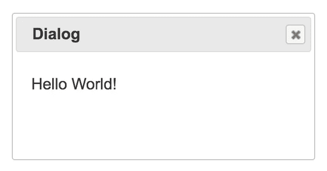
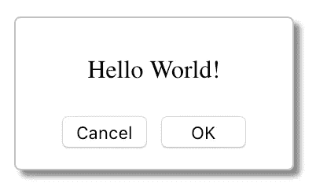

# React 和 JSX 中的声明性对话框

> 原文：<https://itnext.io/declarative-dialogs-in-react-and-jsx-570aa40d258c?source=collection_archive---------0----------------------->


# 介绍

在实际应用中，我们经常会在各种情况下看到确认对话框，例如在 SNS 上发帖、推广付费计划、购买确认等。有时它们很烦人，但对用户来说仍然很重要。

在 HTML5.2 `<dialog/>`或者 jQuery 中，有一个方法可以打开这样的对话框，但是在 React 中情况就有点不一样了。让我们来看看它们有什么不同。

*更新* 2018/7/19 新增巴别塔示例。

# 如何在 React 中打开对话框？

虽然 HTML 5.2 的`[<dialog/>](https://www.w3.org/TR/html52/interactive-elements.html#the-dialog-element)` [元素已经发布，但是 jQuery UI 的 dialog 目前仍然是一个流行的库。使用 jQuery UI，可以像这样打开一个对话框，](https://www.w3.org/TR/html52/interactive-elements.html#the-dialog-element)

```
<div id="dialog" title="Basic dialog">
  <p>Hello World!</p>
</div> // in script tag
$(function() {
  $("#dialog").dialog();
});
```



jQuery UI 对话框的示例

相反，在 React/JSX 中使用 [react-modal](https://github.com/reactjs/react-modal) 打开一个对话框看起来像这样。

```
<ReactModal isOpen={this.state.isOpen}>
  <p>Hello World!</p>
  <button>OK</button>
</ReactModal>
```



反应对话框的一个例子

可以用`isOpen = true`改变状态打开，但是 jQueryUI 中没有`.dialog()`这样的方法。我们要做的是管理好`isOpen`州。

# 管理对话状态

可以用任何方式管理`isOpen`状态:类状态、HoC、Redux 等。然而，这种状态[不应该由 Redux](https://medium.com/@dan_abramov/you-might-not-need-redux-be46360cf367) 管理，因为它在大多数情况下是局部的，并且与全局状态隔离。有一个来自`[reenhance-components](https://www.npmjs.com/package/reenhance-components)`的组件`StateProvider`，它提供状态和更新器。可以这样用。

```
const ModalState = StateProvider(false);const HelloModal = () => (
  <ModalState>
    {({ state: isOpen, setState: setIsOpen }) => (
      ...
    )}
  </ModalState>
);
```

若要通过单击按钮打开对话框，按钮和模式必须用状态括起来。下面是例子。

```
const ModalState = StateProvider(false);const HelloModal = () => (
  <ModalState>
    {({ state: isOpen, setState: setIsOpen }) => (
      <div>
        <button onClick={() => setIsOpen(true)}>Push me</button>
        <ReactModal
          isOpen={isOpen}
          shouldCloseOnEsc={true}
          onRequestClose={() => setIsOpen(false)}
          className='modal'
        >
          <p>Hello modal dialog!</p>
          <button onClick={() => setIsOpen(false)}>OK</button>
        </ReactModal>
      </div>
    )}
  </ModalState>
);
```

仅此而已。让我们在下面的 CodePen 上试试吧。

你可能会觉得把一个模态放在按钮的同一层很奇怪。这是有意义的，因为这样的实现使得重用组件有点困难。

# 在 JSX 让对话框以声明方式打开

因为 JSX 是一种声明式 DSL，所以我们可以像这样声明一个带有确认对话框的按钮。

```
<WithConfirm>
  <button onClick={...)}>Increment</button>
</WithConfirm>
```

封装组件`WithConfirm`可以通过这些步骤实现。

*   从儿童道具中获取`onClick`的句柄。
*   将处理程序附加到模式对话框的“确定”按钮。
*   用打开模态对话框的处理程序替换儿童道具的`onClick`道具。

父组件可以通过`children.props`访问子组件的道具。将`onClick`从孩子身上移除，`React.cloneElement`可以用新道具克隆他们。所以，渲染方法应该是这样的。

```
const newChildren = React.Children.map(children,
  (child) => React.cloneElement(child, {
    onClick: () => setIsOpen(true),
  }));return (
  <>
    {newChildren}
    <ConfirmModal
      isOpen={isOpen}
      setIsOpen={setIsOpen}
      onOkClick={children.props.onClick}
    />
  </>
);
```

这是 CodePen 上的一个工作示例。试着点击按钮，看看会发生什么。

# 结论

乍一看，在 React 中显示对话框似乎很困难，但是由于 React 的 JSX 和声明性，标记可以非常清晰。