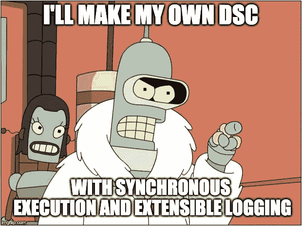
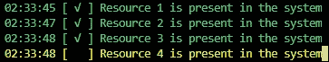
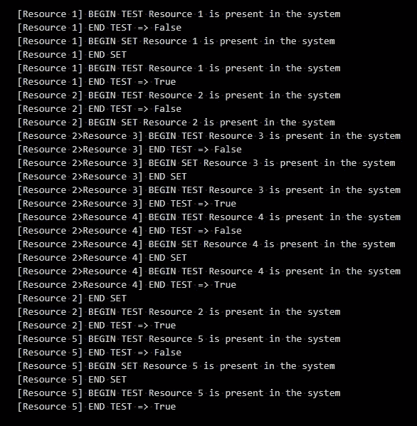
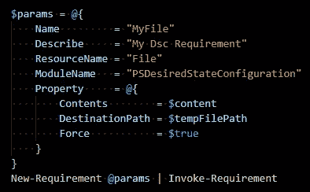

# 陈述幂等性

> 原文：<https://itnext.io/declarative-idempotency-aaa07c6dd9a0?source=collection_archive---------2----------------------->

## 迫使工程师编写经验证的、一致记录的和幂等的代码，而他们甚至没有意识到

*第七部分 [*声明式 DevOps 微框架*](https://medium.com/@cjkuech/declarative-devops-microframeworks-9908c8d05332)*

*当一个脚本可以多次运行而没有不同的结果或错误时，它就是**幂等的**。在 DevOps 中，我们经常描述复杂的系统，然后将它们设置为期望的状态。系统的组件可能处于不同的状态，所以我们的脚本是幂等的并且不假设系统的初始配置是很重要的。*

*为了获得幂等性，开发人员通常会应用几种模式中的一种*

*   *拆卸和重建，常见于只处理单个启动配置的命令式脚本。*
*   *重复的`if` / `else`块，在设置资源之前检查资源是否处于所需状态。*
*   *`-Force`参数用于在资源已经处于所需状态时消除错误。*
*   *声明性框架，在这里您定义了期望的状态，然后让框架来处理初始和中间状态。*

*声明式框架是目前最好的选择；然而，在我们的 PowerShell 脚本中，没有足够通用的方法来解决任意代码的幂等性。我们将实现我们自己的[声明性 DevOps 微框架](https://medium.com/@cjkuech/declarative-devops-microframeworks-9908c8d05332)来为 PowerShell 添加声明性幂等支持，并自动强制所有代码都是幂等的、经过验证的和一致记录的。*

**

*电梯按钮是幂等的。在电梯中按下“3”按钮将总是将电梯设置到 3 楼，而不管该按钮被按下多少次。*

# *改善期望的状态配置*

*PowerShell 已经提供了一个声明性的幂等框架:期望的状态配置。那么我们为什么要自己写呢？*

## *好人*

*期望状态配置是用于配置复杂系统的 PowerShell 语言构造。它们为 DevOps 提供了各种有价值的好处—*

*   ***声明性的**，因此您定义了您希望您的配置是什么样子，而不是如何实现您的配置*
*   ***等幂**，因此您可以根据需要多次应用有效配置，而不会出错*
*   ***在编译过程中静态验证**，以便在应用配置之前尽可能多地捕捉错误*
*   ***与日志记录**集成，因此我们知道我们的配置是否失败、在哪里失败以及为什么失败*
*   ***自我修复，**定期运行以重新应用漂移的配置*

## *坏事*

*DSC 实际上只是设计用来帮助一群 Windows 服务器节点异步维护所需的状态。不幸的是，DSC 的异步执行模型和对 Windows 操作系统的依赖排除了它在许多完美的 DevOps 场景中的应用，例如*

*   *命令行界面*
*   *CI/CD 脚本*
*   *码头文件*
*   *Linux 操作系统*

## *向 DSC 学习*

*DSC 提供了一个不错的资源库，但是复杂的逻辑总是以`Script`资源告终，这些资源定义了一个“测试”`scriptblock`和一个“集合”`scriptblock`。一个理想的框架会盗用这种模式(甚至可能盗用资源库)来声明性地定义资源，然后幂等地将资源设置为它们期望的状态；与 DSC 不同，这种理想的框架将同步运行，以便将错误传播到主机，并清晰地记录输出。*

**

# *设计一个声明性幂等框架*

*为了设计我们的声明性幂等框架，我们将根据一组“需求”来定义系统，必须满足这些“需求”才能使系统处于期望的状态。然后，我们将编写一个引擎，用于将需求幂等地设置为期望的状态，并输出事件以观察引擎的执行——然后，我们可以使用本机`Format-*`甚至`Export-Csv`cmdlet 来格式化事件。*

## *申报要求*

*“需求”是系统的一个原子组成部分。它由一个系统必须满足的单个条件或另一个需求的先决条件组成。常见要求包括设置文件内容、设置环境变量、放置二进制文件或安装证书。*

*一个需求，最简单的形式，可以被定义为—*

*   *一个**名**，用于识别测井中的组件。*
*   ***测试**条件，测试系统是否处于配置所需的状态。*
*   *一个**设置**条件，用于将系统修改为配置所需的状态。*
*   *一组**依赖关系**，在该需求应用之前必须处于期望状态的其他需求。我们不会实现这一点(DSC 的方法)，我们将假设需求是按照依赖图的拓扑顺序来声明的。*

*我们将定义一个`Requirement`作为包含这些属性的 [PowerShell 类](https://medium.com/@cjkuech/functional-powershell-with-classes-820c8e9acd8f)。*

## *需求引擎*

*在上面的代码片段中，我们有一个`Requirements`数组，我们现在需要将它设置为期望的状态。我们将编写一个 cmdlet `Invoke-Requirement`来为我们完成这项工作。我们将使用`Test`条件来决定是否运行`Set`条件。与 DSC 不同，我们将再次运行`Test`条件来[验证和快速失败](https://medium.com/@cjkuech/defensive-powershell-with-validation-attributes-8e7303e179fd)。*

## *伐木编织*

*上面的解决方案已经很有价值了；然而，我们可以通过一些日志来改进它。我们希望我们的日志记录是可扩展的和惯用的，所以我们将通过返回`RequirementEvent`对象来实现它[功能](https://medium.com/@cjkuech/functional-programming-in-powershell-876edde1aadb)，然后我们可以用现有的 cmdlet(`Format-Table`、`Format-List`)或我们自己实现的更多特定于域的格式化程序来格式化这些对象。*

*现在，我们可以将引擎日志通过管道传输给格式化程序—*

*它会干净地输出—*

*我们现在有了框架级别的详细日志记录——我们不再需要依赖工程师来维护一致的日志记录。这突出了[需求](https://github.com/microsoft/Requirements)及其底层[声明性](https://medium.com/@cjkuech/declarative-devops-30788ddd43cd)方法的真正价值:我们的声明性解决方案迫使工程师编写一致记录和验证的代码，而不是依赖约定、代码审查和手工实施的风格指南。*

> *声明式解决方案迫使工程师编写一致的记录和验证代码*

# *完整的解决方案*

*`[Requirements](https://github.com/microsoft/Requirements)` PowerShell Gallery 模块提供了这种声明性幂等微框架的完整且更健壮的实现。文档可在其 GitHub 网站上获得—*

> *【https://github.com/microsoft/requirements】*

*`Requirements`为定义和运行`Requirement`提供多个接口，支持依赖图执行，支持 DSC 资源，并包含专门的日志格式化 cmdlets。*

## *日志格式*

*`Requirements`引入了两个 cmdlets，用于格式化从引擎流出的`RequirementEvent`*

*   *`Format-Checklist` —模拟需求完成后的检查，是 CLI 和其他人工启动的脚本的理想选择。*

**

*通过管道向`Format-Checklist`实时反馈*

*   *`Format-Callstack` —将每个事件记录到输出流中，非常适合在 CI/CD 脚本和 Docker 容器构建等无头环境中运行。*

**

*通过管道将详细日志记录到格式调用堆栈*

## *DSC 支持*

*`New-Requirement`支持引用 DSC 资源，因此您可以在我们的同步需求引擎中使用 DSC 资源。这允许您利用庞大的声明性 DSC 资源库，而无需提交完整的 DSC 堆栈。*

**

*使用有要求的 DSC 资源*

*不幸的是，DSC 不是非常跨平台友好的，所以这种场景只在 PowerShell 5 中受支持。*

# *后续步骤*

## *了解有关扩展 PowerShell 的更多信息*

*本文是关于大规模管理 PowerShell 代码库的[声明性 DevOps 微框架](https://medium.com/@cjkuech/declarative-devops-microframeworks-9908c8d05332)系列文章的一部分。阅读本系列的[部分，了解更多关于为大型 DevOps 代码库设计和编写更少代码的信息。](https://medium.com/@cjkuech/declarative-devops-microframeworks-9908c8d05332)*