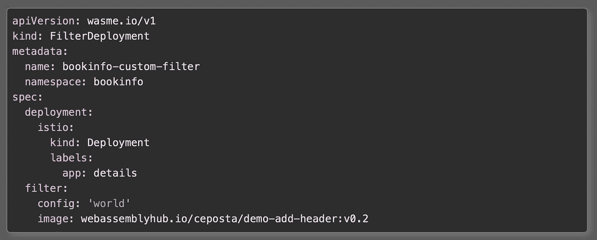
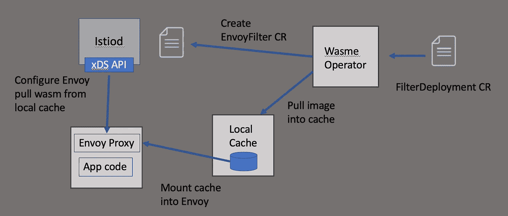
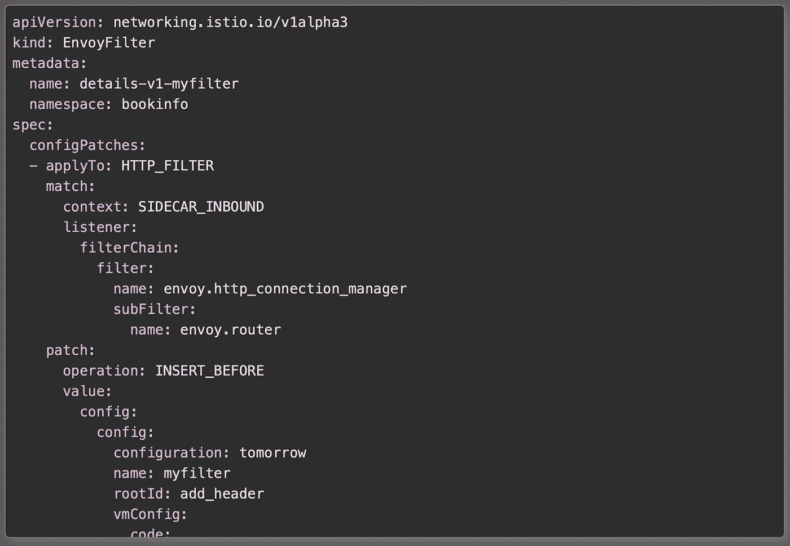

# Istio 的声明性 WebAssembly 部署

> 原文：<https://itnext.io/declarative-webassembly-deployment-for-istio-fd71ff697bc5?source=collection_archive---------6----------------------->

正如在 [Istio 2020 trade winds 博客](https://istio.io/blog/2020/tradewinds-2020/)和最近发布的 Istio 1.5 中所概述的，WebAssembly (Wasm)现在是扩展 Istio 服务代理(Envoy proxy)功能的一个(alpha)选项。使用 Wasm，用户可以构建对新协议、自定义指标、记录器和其他过滤器的支持。我们在社区( [Solo.io](https://solo.io) )与 Google 密切合作，专注于构建、社交和部署 Wasm 扩展到 Istio 的用户体验。我们已经宣布了 [WebAssembly Hub](https://webassemblyhub.io) 和[相关工具](https://docs.solo.io/web-assembly-hub/latest/installation/)来构建一个“docker 式”的 Wasm 使用体验。

# 背景

借助 WebAssembly Hub 工具，我们可以使用`wasme` CLI 轻松引导 Envoy 的 Wasm 项目，将其推送到存储库，然后将其拉/部署到 Istio。例如，要使用`wasme`将 Wasm 扩展部署到 Istio，我们可以运行以下命令:

```
$ wasme deploy istio webassemblyhub.io/ceposta/demo-add-header:v0.2\ 
--id=myfilter \ 
--namespace=bookinfo \ 
--config 'tomorrow'
```

这将把`demo-add-header`扩展添加到在`bookinfo`名称空间中运行的所有工作负载中。通过使用`--labels`参数，我们可以更细粒度地控制哪些工作负载获得扩展:

```
$ wasme deploy istio webassemblyhub.io/ceposta/demo-add-header:v0.2\ 
--id=myfilter \ 
--namespace=bookinfo \ 
--config 'tomorrow' \ 
--labels app=details
```

这种体验比手动创建`EnvoyFilter`资源并尝试将 Wasm 模块安装到作为目标工作负载一部分的每个 pod 上要容易得多。然而，这是与 Istio 交互的一种非常必要的方法。就像用户通常不会在生产中直接使用`kubectl`而更喜欢声明式的、基于资源的工作流一样，我们也希望对我们的 Istio 代理进行定制。

# 声明式方法

WebAssembly Hub 工具还包括[一个操作员，用于将 Wasm 扩展部署到 Istio 工作负载](https://docs.solo.io/web-assembly-hub/latest/tutorial_code/wasme_operator/)。[操作符](https://kubernetes.io/docs/concepts/extend-kubernetes/operator/)允许用户使用声明格式定义他们的 WebAssembly 扩展，并让操作符来调整部署。例如，我们使用`FilterDeployment`资源来定义哪些映像和工作负载需要扩展:



然后，我们可以使用这个`FilterDeployment`文档，并用我们剩余的 Istio 资源对其进行版本化。您可能想知道为什么我们需要这个定制资源来配置 Istio 的服务代理使用 Wasm 扩展，而 Istio 已经有了`EnvoyFilter`资源。

让我们来看看所有这些在幕后是如何运作的。

# 它是如何工作的

在幕后，运营商正在做一些事情，帮助将 Wasm 扩展部署和配置到 Istio 服务代理(Envoy 代理)中。

*   设置 Wasm 扩展的本地缓存
*   将所需的 Wasm 扩展拉入本地缓存
*   将`wasm-cache`装载到适当的工作负载中
*   配置特使与`EnvoyFilter` CRD 使用 Wasm 过滤器



了解 wasme 运算符如何工作

目前，Wasm 映像需要发布到注册表中，以便运营商正确缓存它。缓存窗格在每个节点上作为 DaemonSet 运行，以便缓存可以装入 Envoy 容器。这正在改进，因为它不是理想的机制。理想情况下，我们不需要安装任何东西，可以直接通过 HTTP 将模块传输到代理，所以请继续关注更新(应该会在几天内发布)。通过使用`sidecar.istio.io/userVolume`和`sidecar.istio.io/userVolumeMount`注释建立安装。有关如何工作的更多信息，请参见[Istio 资源注释文档](https://istio.io/docs/reference/config/annotations/)。

一旦 Wasm 模块被正确缓存并安装到工作负载的服务代理中，操作员就可以配置`EnvoyFilter`资源。



您可以看到`EnvoyFilter`资源配置代理来添加`envoy.filter.http.wasm`过滤器并从`wasme-cache`加载 Wasm 模块。

一旦 Wasm 扩展被加载到 Istio 服务代理中，它将使用您引入的任何定制代码来扩展代理的功能。

# 后续步骤

在这篇博客中，我们探讨了在 Istio 工作负载中安装 Wasm 扩展的选项。在 Istio 上开始使用 WebAssembly 最简单的方法是使用`wasme`工具[来引导一个新的 Wasm 项目](https://docs.solo.io/web-assembly-hub/latest/tutorial_code/getting_started/)使用 C++，assembly script[或者 Rust 即将到来！].例如，要设置 C++ Wasm 模块，可以运行:

```
$ wasme init ./filter --language cpp --platform istio \
--platform-version 1.5.x
```

如果我们没有额外的标志，`wasme init`将进入交互模式，引导您选择正确的值。

看一看[web assembly Hub wasme tooling](https://docs.solo.io/web-assembly-hub/latest/tutorial_code/getting_started/)，开始使用 Istio 上的 Wasm。

*原载于 2020 年 3 月 16 日*[*https://istio . io*](https://istio.io/blog/2020/deploy-wasm-declarative/)*。*