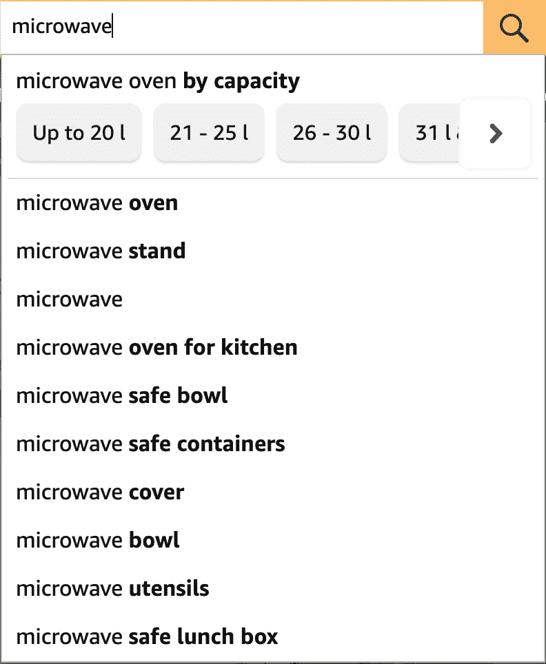

# 用 Swift Codable 解码动态 JSON

> 原文：<https://itnext.io/decoding-dynamic-json-with-swift-codable-64160d06b456?source=collection_archive---------1----------------------->

## 使用 Swift 的声音类型系统处理动态服务器响应

在应用程序中提供动态内容需要与外部服务通信以获取数据。如今最常用的格式是 JSON，在 swift 中处理 JSON 数据的常见方式是借助 [Codable](https://developer.apple.com/documentation/swift/codable) 将其转换成 swift 类型。在大多数用例中，数据可以用具有静态属性列表的具体 swift 类型来表示。

在其他情况下，当应用程序中的内容高度动态且范围广泛时，响应数据可能会在多种格式之间变化。一些常见的例子有:

*   用 [CMS](https://en.wikipedia.org/wiki/Content_management_system) 构建动态的服务器驱动 UI。
*   在电子商务网站上展示各种产品。
*   社交网络中的动态内容提要。

在本帖中，我们将看到处理解码这类响应的典型方式，以及 [DynamicCodableKit](https://github.com/SwiftyLab/DynamicCodableKit) 如何通过构建在 Swift 的[可编码](https://developer.apple.com/documentation/swift/codable)之上来无缝处理动态响应。

# 初速电流状态

以下是当用户在搜索框中键入任何文本时，亚马逊的建议响应数据，在这个场景中为“**微波”**:

属性包含搜索的动态结果列表，每个结果包含一个字段`type`,表示结果的实际类型。在上面的响应中，收到了`KEYWORD`和`WIDGET`类型的结果，每种类型都包含一些额外的元数据，这些元数据反过来用于向用户显示额外的选项，如下所示:

一种方法是使用带有可选字段的单个`struct`。尽管这种方法看起来更简单，但是通过这种方法，您可以使用默认的合成`Codable`实现。这种方法的缺点是，您必须用数据验证代码来污染您的业务逻辑，并且对于相同的属性可能有不同类型的情况，这种方法就不太好了。

另一种更受欢迎的方法是使用带有相关值的`enum`。它通过为要解码的每种类型添加单独的案例，解决了以前方法的缺点，即删除`nil`属性需求并解决属性类型冲突。可以为`enum`提供定制的`init(from:)`实现，它将解码底层的案例/类型。

在我们的例子中，我们可以检查每个对象的`type`字段，并相应地解码建议:

# 使用 DynamicCodableKit

虽然上述方法适用于动态性水平较低的响应，但是维护所有这些样板文件会变得更加困难。主要的缺点是你必须做一些额外的工作来访问所有情况下的公共属性，并且使用枚举，你必须在每次添加新类型时更新所有的开关情况。

这就是 [DynamicCodableKit](https://github.com/SwiftyLab/DynamicCodableKit) 通过使用通用属性包装器而大放异彩的地方。它处理基于`DynamicDecodingContext`的动态解码，T5 是一个[类型擦除](https://fabernovel.github.io/2020-06-03/approaches-to-type-erasure-in-swift#:~:text=%20Approaches%20to%20Type%20Erasure%20in%20Swift%20,are%20very%20constrained%20to%20work%20with.%20More%20)，它解码一个特定的`DynamicDecodable`类型并将其转换为其通用类型。可以在不同场景下自定义`DynamicDecodingContext`动态解码多种类型。 [DynamicCodableKit](https://github.com/SwiftyLab/DynamicCodableKit) 还为集合解码提供了[多种配置](https://swiftylab.github.io/DynamicCodableKit/documentation/dynamiccodablekit/collectiondecoding/)，以定制当遇到无效数据时会发生什么，即您可以选择只解码有效数据而忽略无效数据，而不是仅仅抛出一个错误。

对于我们当前的例子，我们可以创建一个`Suggestion`协议类型，它将提供对底层实际建议的公共属性和方法的访问，即`KeywordSuggestion`、`WidgetSuggestion`。`SuggestionType`和`SuggestionTypeCodingKey`可以分别实现`DynamicDecodingContextIdentifierKey`和`DynamicDecodingContextIdentifierCodingKey`来解码实际类型。与前面的方法相比，添加新类型只需要改变`SuggestionType`的`associatedContext`实现:

> 注意:默认情况下，`*DynamicDecodable*`只支持向下强制转换，如果你想强制转换成一个不相关的类型，你必须提供一个自定义的实现。

# 结论

除了上面的例子， [DynamicCodableKit](https://github.com/SwiftyLab/DynamicCodableKit) 提供了几个属性包装器和相关的协议来处理各种动态解码场景，所有这些都在[文档](https://swiftylab.github.io/DynamicCodableKit/documentation/dynamiccodablekit/)中有详细的解释，使得动态解码在使用最少的 boiler-plate 时更加简单。

 [## GitHub-swifty lab/DynamicCodableKit:在…的约束下实现动态 JSON 解码

### 通过在 Swift 的基础上工作，在 Swift 的声音类型系统的限制内实现动态 JSON 解码…

github.com](https://github.com/SwiftyLab/DynamicCodableKit)