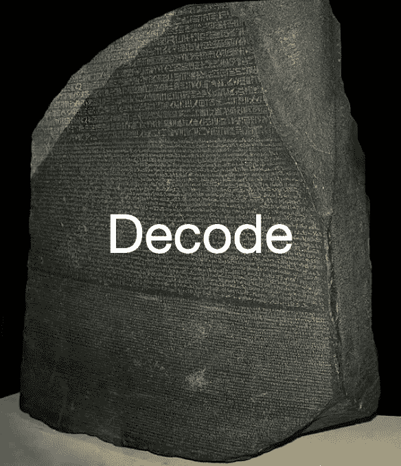
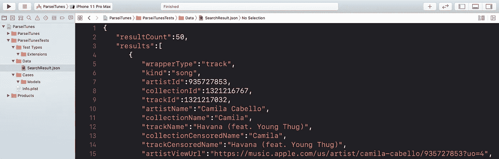
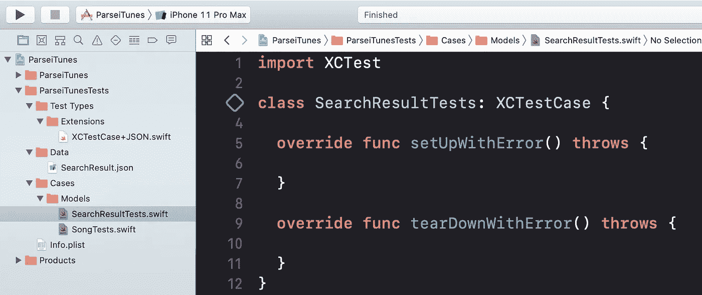
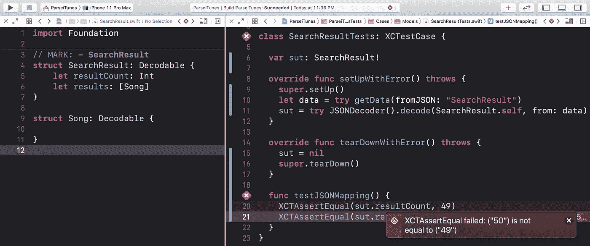
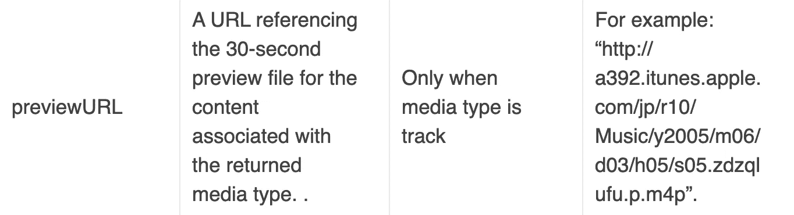
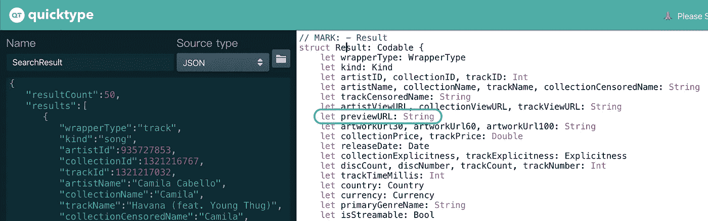
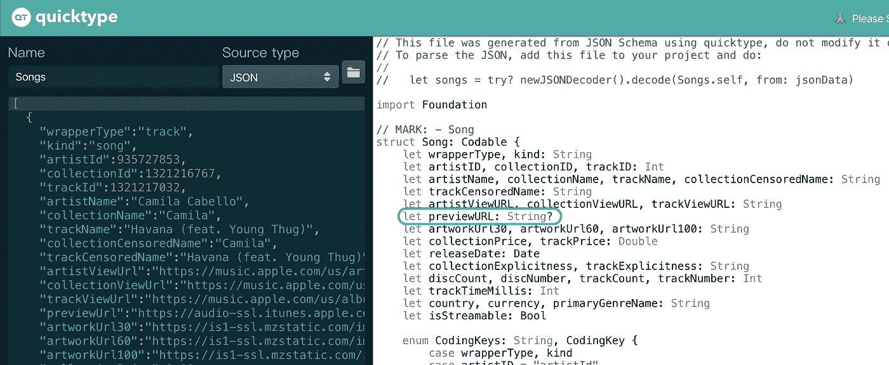
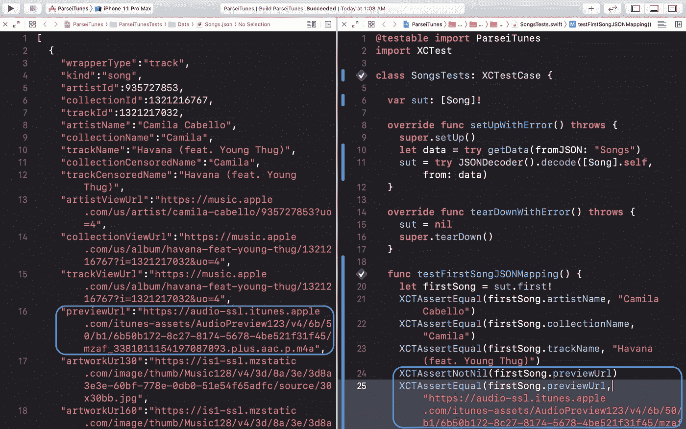

# 解码 JSON 模型和单元测试

> 原文：<https://itnext.io/decoding-your-json-models-along-with-unit-test-2285100f9499?source=collection_archive---------2----------------------->

将你的 JSON 解析成`Data`，然后解码成你的`struct`或者`class`模型是我们在 iOS 开发生活中经常做的事情。然而，如果没有单元测试的帮助，您要么重复运行模拟器来跟踪打印日志，检查您是否解码正确，要么打开一个空白的项目/操场，重新填充元数据来攻击 API。程序员讨厌做重复性的工作，这就是单元测试的用处。我们可以用一个 JSON 文件在本地测试它，快速且专用于特定的模型。

在本文中，我将使用 [iTunes API](https://developer.apple.com/library/archive/documentation/AudioVideo/Conceptual/iTuneSearchAPI/Searching.html#//apple_ref/doc/uid/TP40017632-CH5-SW1) 向您展示我如何一步一步地将 JSON 数据解码为模型。

## 项目设置

这里我将使用[搜索 Havanna 的歌曲](https://itunes.apple.com/search?media=music&entity=song&term=havana)作为我的终点。复制 JSON 数据并将其粘贴到 data 文件夹下的 JSON 文件中。在这个例子中是 *SearchResult.json* 。

从*中快速获取`Data`。json* 文件，在扩展文件夹下添加这个 helper 函数。

在我们写代码之前的最后一件事是用 [quicktype.io](https://app.quicktype.io/) 准备我们的 cheatsheet。

【https://app.quicktype.io/】

瞥一眼 quicktype.io 备忘单，你会发现只有两种型号，`SearchResult`和`Result`。由于 [Swift 5 已经引入了](https://developer.apple.com/documentation/swift/result) `[Result](https://developer.apple.com/documentation/swift/result)` [型](https://developer.apple.com/documentation/swift/result)，为了避免歧义，我们将其命名为`Song`。相应地为这两个模型创建测试用例。

## **解析模型**

我们先从外模开始，`SearchResult`。将您的`sut`被测系统设置为`SearchResult`，使用 *XCTestCase+JSON.swift.* 中提供的 helper 函数加载数据

一个测试用例每次运行都会经历`setupWithError()` →测试函数→ `tearDownWithError()`的过程。因此，在`setupWithError()`期间，press ⌘+U 将自动为您检查解码，您将检查内容是否与提供的 JSON 匹配。

> 注意:如果你没有任何测试功能，它永远不会激活`setupWithError()`。

在 TDD 中，**红绿重构**过程是标准的。我已经将结果计数设置为 49，以确保单元测试正常运行。修改回 50，测试用例就通过了。

接下来，我们将解析嵌套模型`Song`。

如果你和你的后端有一个单一的真相来源，那么你应该遵循它。就拿`Song`来说吧，[这个文件应该是 it](https://developer.apple.com/library/archive/documentation/AudioVideo/Conceptual/iTuneSearchAPI/UnderstandingSearchResults.html#//apple_ref/doc/uid/TP40017632-CH8-SW1) 。来自不同端点的响应结果可能有也可能没有某些属性，比如`previewURL`。

然而，quicktype.io 会给我们一个`String`而不是`String?`。我们必须小心，否则很容易撞车。幸运的是，如果您已经为其他端点编写了单元测试，您也会很快失败，并防止您将那些错误代码发送到产品中。

如果你仔细看文档，`artworkUrl100, artworkUrl60`、`previewUrl`、`trackTimeMillis`是可选的。为简单起见，我将在本演示中简单地使用`previewUrl`。复制 *SearchResult.json* 中的前两个`Song`，粘贴到一个新的 *Songs.json* 文件中，然后删除一个`previewUrl`。有了正确的 JSON 数据，我们就可以再次利用 quicktype.io。

我们不需要所有的属性，只需要解析我们需要的属性。与我们对`SearchResult`所做的一样，主要区别是测试第一个和第二个`Song`是否有`previewUrl`。

差不多就是这样！希望您已经掌握了用健壮的单元测试解码 JSON 模型的技巧。有需要可以看一下[源代码](https://github.com/ji3g4kami/ParseiTunes)。

## 从这里去哪里

我建议编写一个脚本，用后端的单一来源更新 JSON 文件。约翰·桑德尔写了一篇关于此事的[文章](https://www.swiftbysundell.com/articles/writing-end-to-end-json-mapping-tests-in-swift/)，尽管[马拉松](https://github.com/JohnSundell/Marathon)遭到了反对。