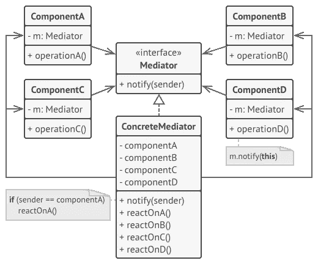

# 用 Ruby 中类似“中介者”的模式解耦对象交互

> 原文：<https://itnext.io/decouple-object-interaction-with-a-mediator-like-pattern-in-ruby-a9ee1e61c491?source=collection_archive---------5----------------------->

## 减少通信对象之间的耦合和依赖。事件驱动的方法。

设计模式是软件设计[1]中给定上下文中常见问题的可重用解决方案。一般来说，牢记设计模式是一个好习惯，但是应该避免从一开始就应用它们。思考好的设计是一件好事，但是一直应用它会伤害你的软件、维护和一些人为了理解一个类做了什么而需要付出的努力。在我看来，一直应用模式，特别是对于简单的任务，会使事情变得复杂，我们会以过度工程化的解决方案和不必要的软件复杂性而告终。

在本文中，我将介绍**中介** **设计模式**【2】，以及一个如何使用它来降低多个对象之间通信复杂性的实例。我们将引入一个协调器类(中介器),它将处理不同类之间的所有通信，以便通过促进松散耦合来支持代码的轻松维护。

下图显示了中介模式的 UML 图。



中介设计模式 UML 图[3]。

简而言之，我们有以下几点:

*   **组件(同事):**是包含一些业务逻辑的各种类。每个组件都有一个对中介的引用，但是它不知道使用了哪个中介以及原因。这为我们提供了更好的可重用组件。
*   **中介器**:中介器定义了一个方法，这个方法将被每个传递上下文对象的组件调用。注意，在接收者和发送者之间(组件之间)不应该发生耦合。

从上面可以看出，每个组件不应该知道系统中的其他组件。一旦收到消息，中介将负责处理不同对象之间的**通信和交互**。

高级架构和系统设计中的中介可以被视为封装不同组件之间通信的消息代理或服务总线。组件之间的每次通信都可以通过**传递事件** ( [事件驱动架构](https://en.wikipedia.org/wiki/Event-driven_architecture))并将调用路由到不同的消费者来完成。中介可以包含一些逻辑(如管道和过滤器)以满足一个用例，或者它可以只包含相关组件的初始化逻辑和错误处理。我更喜欢后者，倾向于让中介尽可能的精简，除了一些错误处理(如果需要的话)之外，没有太多的逻辑，并且只充当从不同组件接收的消息之间的路由器。

说了以上，下面来看一个假设的例子:

```
class *RequestCompletedService* attr_reader :request def initialize(*request*)
    @request = *request* end def call
    if request.empty? && request.acknowledged?
      return UserService.put(DataBuilder.null)
    end if !rules_applied?
      return request.error("Invalid request!")
    end *request_data* = RequestService.get_details(request)
    if *request_data*.empty?
      return request.error("Missing request data")
    end *localized_request_data* = LocalizedRequestFormatter.call(*request_data*) if *localized_request_data*.size > TOTAL_PAYLOAD_THREASHOLD
      @upload_url = RequestUploader.call(*localized_request_data*)
    end *some_other_service_payload* = DataBuilder.build(
      data: *localized_request_data*,
      attachment: @upload_url
    ) UserService.put(*some_other_service_payload*)
    request.complete!
  rescue LocalizedRequestFormatter::Error
    request.error!("Formatting error")
  rescue UserService::NotFoundError
    request.destroy!
  rescue UserService::BadRequestError
    request.error!("Malformed request created.")
  endprivatedef rules_applied?
    # ...
  endend
```

很有逻辑。上面代码的最初意图是将逻辑保存在一个地方。我们看到一些业务规则(如“应用的规则”?或者如果请求为空并被确认)，然后是一些处理逻辑，包括获取一些请求细节并为不同的服务构建另一个请求——在我们的例子中是*用户服务*。

**上面的课怎么了？**

1.  显而易见的是，它有太多的责任，因此它违反了[单一责任原则](https://en.wikipedia.org/wiki/Single_responsibility_principle)。
2.  忽略[洋葱架构](https://www.infoq.com/news/2014/10/ddd-onion-architecture)和 [DDD 原则](https://www.infoq.com/news/2014/10/ddd-onion-architecture)，现在还不清楚我们的领域应该专注于什么？它应该是我们的请求实体的状态和业务用例吗？我们的域规则还是外部服务调用？
3.  很难测试。
4.  我们使用异常来处理控制流和做出决策。

尽管上述用例中的每个组件似乎都有一个简单的逻辑(格式化数据、获取数据或构建相关数据)，但在不模仿实现的情况下，*RequestCompletedService*中的逻辑很难单独测试。

我们能做得更好吗？

让我们看看如何通过保持*RequestCompletedService*尽可能的精简来分离上述类中的职责，并且只知道如何在所涉及的组件之间路由不同的消息。我们将像中介对象一样使用*RequestCompletedService*,以便根据发生的不同事件协调系统中不同组件之间的请求。

让我们看看我们需要做出的改变:

1.  每个组件都需要一个对中介的引用
2.  中介将初始化每个组件，并定义一个“notify”方法，每个组件将调用该方法来通知它一个事件。
3.  中介将“监听”这些事件，并根据它引发的事件采取不同的行动。
4.  操作将是调用负责处理事件的正确组件。

让我们看看第二个版本的 *RequestCompletedService* :

```
class *RequestCompletedService* attr_reader :request, 
              :request_policy, 
              :request_service, 
              :formatter, 
              :uploader, 
              :data_builder, 
              :user_service def initialize(*request*)
    @request = *request* @request_policy = RequestPolicy.new(*request*)
    @request_policy.mediator = self @request_service = RequestService.new
    @request_service.mediator = self @formatter = LocalizedRequestFormatter.new
    @formatter.mediator = self @uploader = RequestUploader.new
    @uploader.mediator = self @data_builder = DataBuilder.new
    @data_builder.mediator = self @user_service = UserService.new
    @user_service.mediator = self
  enddef call
    request_policy.call
 enddef notify(*event*)
    case *event*.type
    when EmptyRequestAcknowledged
      user_service.put(data_builder.null)
    when EmptyRequest
      request.error!(*event*.data.reason)
    when RequestReadyToBeProcessed
      request_service.get_details(request.id)
    when FetchRequestDataCompleted
      formatter.call(*event*.data.request_details)
    when DataFormatted
      uploader.call(*event*.data.formatted_data)
    when DataUploaded, DataUploadSkipped
      DataBuilder.build(
        data: *event*.data.formatted_data,
        attachment: *event*.data.remote_url
      )
    when UserDataBuildCompleted
      UserService.put(*event*.data.user_data)
    when UserServiceNotFound
      request.destroy
    when FormatDataError, UserServiceBadRequest, GetRequestDataError
      request.error!(*event*.data.reason)
    end
  end
end
```

好极了。看起来有点像 Redux reducer —:)，但是让我们看看我们实现了什么:

*   我们仍然将业务用例的处理逻辑放在一个地方，这是我们最初的意图。
*   *RequestCompletedService* 现在只对事件做出反应，并且只在组件之间路由和发送消息。
*   服务内部用例的单一来源。
*   组件可以在不同的中介实现中重用。
*   我认为代码现在更容易理解和推理，因为如果你至少知道一些关于用例及其背后的过程，查看事件，你可以立即看到发生了什么以及你如何对它做出反应。
*   更容易测试和更好的隔离。请记住，在前面的实现中调用服务可能会对每次调用产生不同的副作用。现在，当**基于被调度的**事件**应用**时，我们只有 **1 副作用**。
*   **领域事件**是**业务**【4】和**建模**的一个重要方面，我认为在代码中使用它们是一个巨大的优势，尤其是当你与利益相关者和产品所有者交谈时。例如，当你阅读一段写有`if a && b`的代码，并试图理解 a & & b 的意思，而不是阅读`if CONTRACT_ENDED`时，情况就不同了。它立即给你意图和你对此的反应。它对涉众来说更加透明，尤其是如果你遵循 DDD 原则，并试图在你的基于无处不在的语言的代码中应用它们。
*   当“if else”语句变得复杂时，我们可以很容易地将它们提取到一个[策略](https://en.wikipedia.org/wiki/Strategy_pattern)或[状态模式](https://en.wikipedia.org/wiki/State_pattern)中，但我认为现在这样做有些过头了。
*   将**松耦合**和**高内聚**提升到该具体用例中。
*   它可能会更好，但我认为我们已经迈出了更好的一步。

让我们看看下面的一些组件实现。

我们上面看到的第一个组件叫做 *RequestPolicy* ，它将负责通过发出正确的事件来实例化我们的处理逻辑。在我们开始处理请求之前，它还将确保请求处于正确的状态，并在我们无法处理请求时引发错误(请注意，应该引发此错误，因为它是我们的**域**中的未知错误)。这是我们无法处理的例外情况)。

```
# class *RequestPolicy will be the component responsible to handle # # our `rules_applied?` validation logic.
# It is also our initial component that will be called first from the
# mediator. All other interactions will be based on the events that # are raised after the first call.*class *RequestPolicy* include Colleague*UnknownRequestState* = Class.new(StandardError) attr_reader :request def initialize(request)
    @request = requestend def call
    if request.empty? && request.acknowledged?
       notify(EmptyRequestAcknowledged)
    elsif request.empty?
      notify(EmptyRequest, data: { reason: empty request" })
    elsif request.completed?
      notify(RequestReadyToBeProcessed)
    else
      raise UnknownRequestState
  end
end
```

很简单。我们从这个组件的初始服务中移除了验证和前提条件逻辑。在开始处理之前，我们确保前提条件得到满足，并且我们还检查请求中的一些确认的逻辑。根据请求的状态，发出不同的事件。

我们还在上面的组件中包含了一个名为`Colleague(the name is bad but will stick with it for our examples)`的助手模块，以便提供一些像 notify 这样的助手方法。让我们看看下面的模块定义:

```
module *Colleague* def self.included(*base*)
    *base*.class_eval do
      attr_reader :mediator
    end super
  end def mediator=(*mediator*)
    @mediator = *mediator* end def notify(*type*, *data*: {})
    mediator.notify(event(*type*, data: *data*))
  end private def event(*type*, *data*: {})
    Events::Base.new(*type*, data: *data*)
  end
end
```

很简单，它提供了一个 setter 方法来设置 mediator 和一些 helper 方法来通知和创建事件逻辑。

让我们看看另一个组件， *RequestService* ，它负责获取请求细节。请注意，下面的异常不再委托给中介，而是通过事件进行通信。

```
class RequestService
  include Colleaguedef initialize(client: HttpClient; @client = client; enddef get_details(id)
     client.get!(path, id: id) # imaginary callrescue SomeExternalException
       notify(GetRequestDataError, data: { reason: "get request details failed"})endend
```

上面的组件逻辑很简单，我们可能有像下面这样逻辑更复杂的组件:

```
class DataBuilder
  include Colleague

  include OtheRelatedModuledef null; {}; enddef build(data: , attachment: nil)
    assert_required_attibutes!(data)
    assert_optional_attibutes!(data)user_data = create_domain_data(data) # "complex logic"notify(UserDataBuildCompleted, data: { user_data: user_data})

    rescue InternalErrorA, InternalErrorB => ex
      notify(BuildDataError, data: { reason: ex.message })endend
```

以类似的方式，所有其他组件都被定义为上面的组件，每个组件都有自己的实现，并向其中介发送事件。

现在想象一下，您需要创建一个具有自己逻辑的新组件。只需在中介中进行新的初始化，并监听正确的事件，就可以调用新的组件。组件本身要么终止处理逻辑(不再发出事件),要么发出一个已经存在的或新的事件，以便根据场景调用正确的组件。上面一个简单的例子是一个通知组件，当数据被发送到用户服务或者请求被删除时，它会发送一个通知消息。这里的关键是域事件**。**

**缺点**

*   降低组件之间的复杂性会增加中介本身的复杂性，尤其是在中介中有逻辑的情况下。
*   增加中介器的复杂性与没有中介器的设计是一样的。

**相似模式**:

*   [观察者](https://en.wikipedia.org/wiki/Observer_pattern)
*   [立面](https://en.wikipedia.org/wiki/Facade_pattern)

# 结论

我们采取了不同的方法，通过使用事件驱动的架构和引入中介对象来封装一组对象如何交互，来实现用例。我们从这种方法中获得了很多好处，最重要的是有更好的测试和更透明的领域逻辑。将域事件引入我们的代码库使得代码更具可读性，也更容易推理。通过应用领域事件，与涉众和产品所有者的交叉交流得到了改善，并使我们进一步应用 DDD 和其他架构模式，如 [Clean Architecture](https://blog.cleancoder.com/uncle-bob/2012/08/13/the-clean-architecture.html) 。

# 参考

【1】【https://en.wikipedia.org/wiki/Software_design_pattern
【2】[https://en.wikipedia.org/wiki/Mediator_pattern](https://en.wikipedia.org/wiki/Mediator_pattern)
【3】[https://refactoring.guru/design-patterns/mediator](https://refactoring.guru/design-patterns/mediator)
【4】[https://en.wikipedia.org/wiki/Domain-driven_design](https://en.wikipedia.org/wiki/Domain-driven_design)