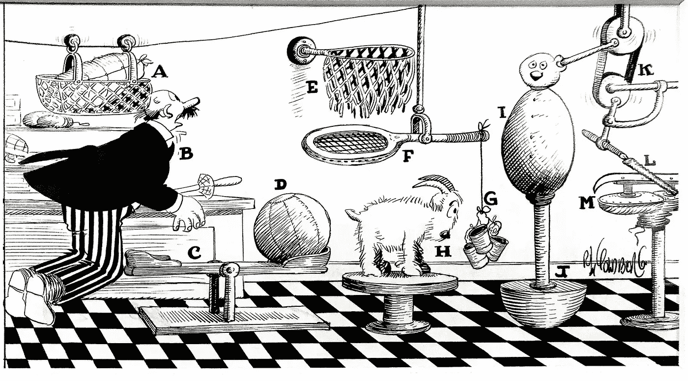

# 用依赖反转解耦视图组件

> 原文：<https://itnext.io/decoupling-app-and-ui-components-cbcea3653d00?source=collection_archive---------3----------------------->



图片来自 Flickr 上的[rocor](https://www.flickr.com/photos/rocor/40020297094)

这篇文章是关于使用依赖反转来分离视图组件的。这样做的好处如下:更简洁易读的呈现函数、减少的导入和分离的组件。

# 基于组件的用户界面

基于组件的 UI 开发是 web 应用程序开发的标准。组件树代表了 UI 的每一种可能的状态。它的美妙之处在于你永远不必考虑组件树。您可以一次只关注一个组件，以及它所呈现的组件。可以将组件集合在一起，并制作成一个包，以便于导入；但是，在某些框架中，UI 组件仍然需要导入到使用它们的每个组件中(Vue 除外，yay Vue！).

在组件之前，你需要根据 UI 库的文档构建一组 HTML 元素，比如 Bootstrap。然后，您可以编写一些 JS 来查找 HTML 并使其具有交互性。现在，有了组件，我们有了一个更有凝聚力的模型来构建应用程序。需要最少的协调，因为组件包含了它需要的大部分内容，您只需要与组件支持的道具和事件进行交互。

UI 组件的一个优点是它与代码库的其他非 UI 部分非常相似。你导入你需要的东西，然后你用参数调用它，让它做你想做的事情；然而，有时候一层[间接](https://en.wikipedia.org/wiki/Indirection)/抽象会产生更好的代码。

# UI 组件中的依赖倒置

我还没有见过这种类型的模式用于解决基于组件的架构中视图组件之间的依赖关系，但是在我看来，这种模式利大于弊。

让我们来看看一个组件在 React 应用程序中可能是什么样子。我从[的 Material-UI 文档](https://material-ui.com/demos/cards/)中拿了这个例子。我用 React 的 createElement 方法替换了 JSX。为了消除噪音，我将 null 作为道具传递给所有组件。

```
import { createElement as h } from 'react';
import Card from '@material-ui/core/Card';
import CardActionArea from '@material-ui/core/CardActionArea';
import CardActions from '@material-ui/core/CardActions';
import CardContent from '@material-ui/core/CardContent';
import CardMedia from '@material-ui/core/CardMedia';
import Button from '@material-ui/core/Button';
import Typography from '@material-ui/core/Typography';function MediaCard (props) {
  return h(Card, null,
    h(CardActionArea, null,
      h(CardMedia, null),
      h(CardContent, null,
        h(Typography, null, 'Lizard')
      )
    ),
    h(CardActions, null,
      h(Button, null, 'Share')
    )
  )
}
```

如你所见，很大一部分代码是 import 语句。此外，该组件与材料 UI 库不可分割地耦合在一起。这是一个孤立的小例子，但是想象一下有多少不同的应用程序组件使用卡作为 UI。根据我在 React 的经验，代码库的很大一部分是导入语句。

让我们看看当使用依赖反转时，组件可能是什么样子。让我们称这个抽象为“ui-resolver”。

```
import uiResolver from '../ui-resolver'
const h = uiResolver.createElementfunction MediaCard (props) {
  return h('card', null,
    h('card-main', null,
      h('card-media', null),
      h('card-content', null,
        h('text', null, 'Lizard')
      )
    ),
    h('card-actions', null,
      h('button', null, 'Share')
    )
  )
}// optional step
uiResolver.on('media-card', MediaCard)
```

在第二个版本中，MediaCard 组件完全不依赖于材质 UI 库。材料设计卡是一种通用设计模板，由许多 UI 包实现。你可能已经注意到，不太明显的部分是，现在我们的组件不再依赖于 React！我们可以将这个“MediaCard”组件用于任何组件库，只要我们可以将参数映射到组件框架的 API。

在视图组件中使用依赖反转让我想起了使用 web 组件。您必须确保您已经将 web 组件导入到您的项目中，但是一旦导入，您就可以在任何您想要的地方使用它。像定制元素一样，如果组件没有注册，我们可以设置 ui-resolver 静默失败。ui-resolver 还可以向控制台输出警告，而自定义元素则不能。

让我们来看看如何设置它。首先，将所有的材质 UI 组件聚集在一起，作为 ui-resolver 的插件。

```
import { createElement } from 'react';
import Card from '@material-ui/core/Card';
import CardActionArea from '@material-ui/core/CardActionArea';
import CardActions from '@material-ui/core/CardActions';
import CardContent from '@material-ui/core/CardContent';
import CardMedia from '@material-ui/core/CardMedia';
import Button from '@material-ui/core/Button';
import Typography from '@material-ui/core/Typography';const h = c => (...args) => createElement(c, ...args)export default function UiLibrary (uiResolver, options) {
  const { on } = uiResolver

  on('button', h(Button))
  on('card', h(Card))
  on('card-main', h(CardActionArea))
  on('card-actions', h(CardActions))
  on('card-content', h(CardContent))
  on('card-media', h(CardMedia))
  on('button', h(Button))
  on('text', h(Typography))
}
```

然后，实例化 ui-resolver 并传递插件。

```
import UiResolverLib from 'ui-resolver-lib'
import UiLibrary from './ui-library'const uiResolver = UiResolverLib()
uiResolver.use(UiLibrary)export default uiResolver
```

这种方法的缺点怎么样？有一些小的计算开销。你也不能用 JSX(至少现在还不能)。

# 参考实现

我整理了一个名为 [Ioku](https://github.com/rhythnic/ioku) 的小型参考实现(名称可能会改变)。这是 30 行代码，没有经过测试，还没有使用过，除了玩玩之外，不鼓励做任何事情。当我有时间确定这个想法是否可行时，我会开始重复它。如果有人对探索这个想法感兴趣，我们非常欢迎投稿。