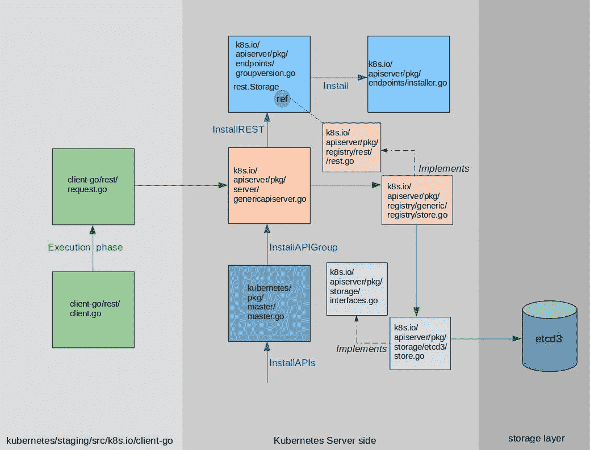

# 深入探究 Kubernetes REST API 的工作原理

> 原文：<https://itnext.io/deep-dive-into-how-kubernetes-rest-api-works-517c86f1640b?source=collection_archive---------1----------------------->

最近，我们一直在研究 Kubernetes REST API 是如何工作的，以找出如下问题的答案:

-如何/在哪里定义从 REST 路径到处理 REST 调用的函数的映射？

-与 etcd 的交互发生在哪里？

-从客户端发出请求到对象保存在 etcd 中，端到端路径是什么样的？

这篇文章试图回答这些问题。Kubernetes 的代码相当复杂，所以这里的演示是我们目前理解的最好的。

Kubernetes REST 实现可以大致分为三个部分，如下图所示。



客户机/服务器功能是通过 k8s.io 包中的各种库实现的。服务器端的实现分布在几个包中。服务器端的主包是“apiserver”。其中的重要包是“端点”、“服务器”、“注册表”和“存储”。客户端在 client-go 包中实现。其中的主包是“rest”。

在详细介绍这些包之前，这里有一些您应该记住的关键 Kubernetes 术语/概念。

1.  group:Kubernetes REST API 以“/API”为根组织在一个层次结构中。一个组为这个根下的一组 REST 资源定义了一个逻辑名。API 组的一个例子是“应用程序”，它在层次结构中表示为“/API/应用程序”。您可以使用以下命令检查所有可用的 API 组:

```
kubectl get --raw /apis | python -mjson.tool
```

2)版本:Kubernetes REST APIs 有版本。版本名用于定义在一个组中一起发展的 REST 资源端点。典型的版本名称有:v1、v1alpha1、v1beta1 等。您可以使用以下命令找到 API 组的所有可用版本:kubectl get — raw /apis/ <group-name>示例:</group-name>

```
kubectl get --raw /apis/apps | python -mjson.tool
```

3)类型:表示概念的命名实体(例如:Pod、部署、服务等)。).

4)种类:Kubernetes 类型的 JSON/YAML 表示。

5)资源:处理特定类型的 REST 请求的端点/路径。资源在 api 层次结构中表示如下:/APIs/<group>/<version>/namespaces/<namespace>/<kind-plural>(例如:/APIs/apps/v1/namespaces/default/deployments)</kind-plural></namespace></version></group>

*服务器端:*

当研究服务器端时，我们着重回答以下问题:a)资源安装在服务器的什么位置？b)与 etcd 的交互发生在哪里？

1) genericapiserver.go:该文件定义了 [APIGroupInfo 类型](https://github.com/kubernetes/kubernetes/blob/master/staging/src/k8s.io/apiserver/pkg/server/genericapiserver.go#L49)，用于保存关于 API 组的信息，例如存在哪些版本，以及在那些版本中定义了哪些资源。它定义了 [GenericAPIServer 类型](https://github.com/kubernetes/kubernetes/blob/master/staging/src/k8s.io/apiserver/pkg/server/genericapiserver.go#L75)，该类型实现了为 API 组安装 REST 端点的 [InstallAPIGroup 方法](https://github.com/kubernetes/kubernetes/blob/master/staging/src/k8s.io/apiserver/pkg/server/genericapiserver.go#L357)。这个方法[在内部调用 api groupversion 实例上的 InstallREST 方法](https://github.com/kubernetes/kubernetes/blob/master/staging/src/k8s.io/apiserver/pkg/server/genericapiserver.go#L328)。为了开始运行服务器，GenericAPIServer 包含 Run()方法。

2) groupversion.go:该文件定义了 [apiGroupVersion 类型](https://github.com/kubernetes/kubernetes/blob/master/staging/src/k8s.io/apiserver/pkg/endpoints/groupversion.go#L41)，该类型用于保存关于 API 组的特定版本的信息，例如对提供实际 REST 端点实现(store.go)的对象的引用。它还定义了 InstallREST 方法，该方法[在内部调用 installer](https://github.com/kubernetes/kubernetes/blob/master/staging/src/k8s.io/apiserver/pkg/endpoints/groupversion.go#L98) 上的 Install 方法来为该版本安装 REST 资源。

3) installer.go:这个文件定义了 APIInstaller 类型，它实现了[安装方法](https://github.com/kubernetes/kubernetes/blob/master/staging/src/k8s.io/apiserver/pkg/endpoints/installer.go#L94)。该方法使用 GroupVersion 实例中的 REST 实现对象(参见第 2 点)在 [go-restful 库](https://github.com/emicklei/go-restful)中安装 REST 路径到处理函数的映射。使用这个库时的模式是[定义一个‘处理程序’函数，为一个特定的 REST 路径](http://ernestmicklei.com/2012/11/go-restful-first-working-example/)调用。该模式在 installer.go 中用于设置对应于不同资源端点的处理程序。例子: [ws。获取(行动。路径)。](https://github.com/kubernetes/kubernetes/blob/master/staging/src/k8s.io/apiserver/pkg/endpoints/installer.go#L583)至(处理程序)。这里的“handler”是从 GroupVersion 实例的 REST 实现对象中获得的函数。它被定义为在处理对“action”的 GET 请求时被调用。路径。

4) master.go:这个文件定义了 master 类型，它保存了指向 GenericAPIServer 实例的指针。它定义了 [InstallAPIs 方法](https://github.com/kubernetes/kubernetes/blob/master/pkg/master/master.go#L404)，该方法通过[调用 genericapiserver 的 InstallAPIGroup 方法](https://github.com/kubernetes/kubernetes/blob/master/pkg/master/master.go#L432)来启动注册工作流。当创建 Master 的新实例时，将调用 InstallAPIs 方法。

5) registry/rest/rest.go:这个文件定义了各种接口，任何想要提供类似 Kubernetes 的 rest 端点的后端都应该实现这些接口。该文件中的关键接口有:[存储](https://github.com/kubernetes/kubernetes/blob/master/staging/src/k8s.io/apiserver/pkg/registry/rest/rest.go#L55)和[标准存储](https://github.com/kubernetes/kubernetes/blob/master/staging/src/k8s.io/apiserver/pkg/registry/rest/rest.go#L270)。groupversion.go 中由 APIGroupVersion 维护的对 rest 实现对象的[引用属于 REST 类型。存储接口。](https://github.com/kubernetes/kubernetes/blob/master/staging/src/k8s.io/apiserver/pkg/endpoints/groupversion.go#L42)

6)registry/generic/registry/Store . go:该文件定义了实现其余部分的[存储类型](https://github.com/kubernetes/kubernetes/blob/master/staging/src/k8s.io/apiserver/pkg/registry/generic/registry/store.go#L80)。标准存储接口。方法实现对由存储类型维护的[存储对象](https://github.com/kubernetes/kubernetes/blob/master/staging/src/k8s.io/apiserver/pkg/registry/generic/registry/store.go#L176)进行调用。该对象属于存储类型。界面(见下文)。

7) storage/interfaces.go:这个文件定义了一个名为“Interface”的接口[，它包含了我们希望用于实际持久性的任何存储应该实现的方法。关于这个接口中的方法的一个关键点是，它们只返回一个“错误”而不返回其他任何东西。如果某个方法需要返回任何数据，它会通过一个对象返回，该对象的指针作为参数传递给该方法。例如，检查 Get 方法](https://github.com/kubernetes/kubernetes/blob/master/staging/src/k8s.io/apiserver/pkg/storage/interfaces.go#L115)的[签名。](https://github.com/kubernetes/kubernetes/blob/master/staging/src/k8s.io/apiserver/pkg/storage/interfaces.go#L151)

8) storage/etcd3/store.go:该文件定义了实现 storage.Interface 的[存储类型](https://github.com/kubernetes/kubernetes/blob/master/staging/src/k8s.io/apiserver/pkg/storage/etcd3/store.go#L62)，使用 etcd [clientv3 库](https://github.com/kubernetes/kubernetes/blob/master/staging/src/k8s.io/apiserver/pkg/storage/etcd3/store.go#L129)与 etcd3 交互。

*客户端:*

在客户端，我们重点回答以下问题 REST 调用是如何进行的？

1) request.go:这个文件定义了[请求类型](https://github.com/kubernetes/kubernetes/blob/master/staging/src/k8s.io/client-go/rest/request.go#L80)，它实现了对资源进行 REST 调用的方法。进行调用的模式是首先创建一个 NewRequest 对象，然后使用[流畅风格的方法链接来调用 REST 方法](https://github.com/kubernetes/client-go/blob/master/rest/request_test.go#L1044) (GET、POST、PUT、DELETE)。资源的名称和命名空间对于创建完整的端点至关重要，它们是通过链接的方法调用来定义的。

2) client.go:该文件定义了一个名为[‘Interface’](https://github.com/kubernetes/kubernetes/blob/master/staging/src/k8s.io/client-go/rest/client.go#L43)的接口，该接口包含返回请求对象指针(在 request.go 中定义)的 REST 方法包装器。它还定义了实现这个接口的 [RESTClient 类型](https://github.com/kubernetes/kubernetes/blob/master/staging/src/k8s.io/client-go/rest/client.go#L61)。进行 REST 调用的模式是首先创建一个 NewRESTClient，并通过 REST 方法包装器之一获得一个 NewRequest 对象。一旦 NewRequest 对象可用，REST 调用就使用方法链进行，如上所述。

*观察:*

a) Kubernetes 代码被广泛记录。这有助于弄清楚一段代码中发生了什么。

b)有些地方类型隐式地实现了方法。在接口中收集这样的方法会很好。这将使该类型实现什么方法变得显而易见。(注册表包很好地做到了这一点，但 installer.go 是一个不会发生这种情况的例子。)

c) Golang 导入别名可以帮助判断一个方法来自哪个包。虽然代码确实使用了别名，但是还有更广泛地使用它们的余地。

*结论:*

Kubernetes 代码库很大。在这篇文章中，我们试图了解它的一个方面 REST API。在以后的文章中，我们可能会对 Kubernetes 的其他部分进行类似的深入研究。如果您对任何特定部分感兴趣，请随时在回复中告诉我们。

[www.cloudark.io](http://www.cloudark.io/)