# 深入了解 Android 中的 ShapeableImageView

> 原文：<https://itnext.io/deep-dive-into-shapeableimageview-in-android-1ba7f9a5969e?source=collection_archive---------2----------------------->

## 完全指南

## 如何轻松编写圆形 ImageView 和其他形状的代码？

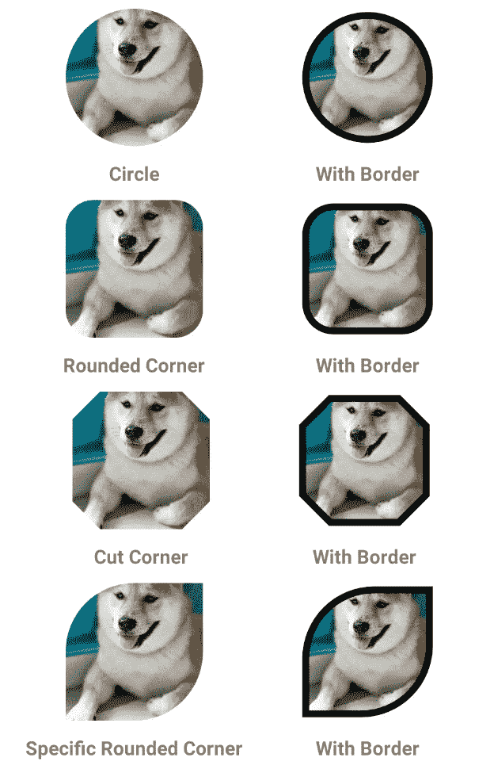

不同形状的示例

我从未与对默认图像视图形状满意的设计师合作过，老实说，他们是对的，它的尖角看起来有点无聊，就像一个旧的正方形。从那种不赞同和让我们的图像看起来漂亮的需要中。帮助我们实现这一目标的库开始把我们从丑陋的 ImageView 中拯救出来。

由 *hdodenhof 制作的 *CircleImageView* 被默认添加到任何项目中。这节省了我们很多时间。*

 [## hdodenhof/CircleImageView

### 快速圆形图像视图非常适合侧面图像。这是基于文斯米的 RoundedImageView 本身是…

github.com](https://github.com/hdodenhof/CircleImageView) 

但谷歌的 Android 团队最终决定跟上，并在材料设计 1.2.0 中引入了 **ShapeableImageView** 。

## ShapeableImageView

扩展 AppCompatImageView，这意味着它具有提供的所有功能。

**新的 XML 属性**

*   笔画颜色
*   冲程宽度

它们都将用于控制 ImageView 的边框属性

**转角族**

*   切口
*   全面的

用于决定拐角形状的类型

**边角尺寸**

用来决定拐角形状的大小，在 dp 中可以用百分比或绝对值

## 使用

首先需要给 Gradle 添加材料设计

实现' com . Google . Android . material:material:1 . 2 . 0 '

## 圆形图像视图

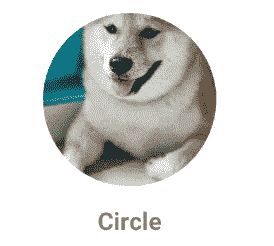

圆形图像视图

圆形图像视图，主要用于用户头像

首先，我们创造风格。

如果你注意到这里我们没有指定 cornerFamily，那是因为缺省值是四舍五入的，这是这里需要的。

然后在布局文件中将创建的样式分配给

应用程序:shapeApperanceOverlay

正如你所见，这将使我们可爱的 Doge 图像循环，而不需要添加外部库

## 带边框的圆形图像视图

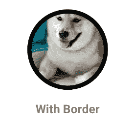

通常，我们会在图像视图中添加边框，以帮助它们更加突出，所以让我们看看如何将边框添加到圆形图像视图中。

将使用我们在普通圆形图像中使用的相同样式。

但是会将 storkeColor 和 strokeWidth 添加到 circle 项目中，如您在附加代码中所见。

请注意，我们添加了与 strokeWidth 相同大小的填充，因为如果我们不这样做，边框会看起来变形。

## 圆角图像

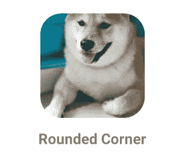

圆角

为了实现这一点，大多数开发人员习惯将它放在 CardView 中，以受益于它具有圆角的能力，这可能会降低布局的效率。ShapeableImageView 为我们提供了一种更好的方式来实现这一点。

首先，我们添加一个新的样式

并在布局文件的 ShapeableImageView 中使用它

这使得我们的 Doge 有一个圆角的好形象。

## 带边框的圆角图像

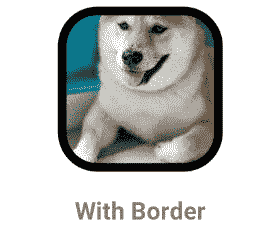

带边框的圆角图像

如上所述，边框是应用程序中使用图像视图的关键部分。

像以前一样，将使用我们为圆角图像创建的相同样式，并将 strokeWidth 和 strokeColor 添加到 ShapeableImageView。

## 剪切角图像

剪切角图像

现在是时候探索不同类型的转角系列了。这将使图像视图在拐角处具有尖锐的切口，而不是平滑的圆形切口。

首先，在风格上，我们开始使用 cornerFamily 并给它分配 Cut

并在 ShapeableImageView 中开始使用“app:shapeappearancoverlay”中的“cut_corner”

## 带边框的剪切角图像

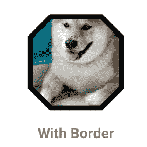

带边框的剪切角图像

由于上述例子将遵循传统，并添加了切角图像的边界的例子。

不要忘记为填充指定与 strokeWidth 相同的值。

## 特定圆角

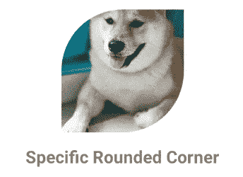

特定圆角

现在，我们可以升级游戏场，而不是让 ImageView 具有四个匹配的角，我们可以使用 cornerFamily“location prefix”将不同的 corner family 和 cornerSize 分配给不同的角。

在主题文件中，让我们添加以下样式

在这里，我们决定使左上方和右下方有一个圆角，其余的将保持锐利的外观，这将给我们一个独特的和漂亮的外观。

在布局文件中，将如前所述，将“特定圆角”分配给“应用程序:形状外观覆盖”

## 带边框的特定圆角

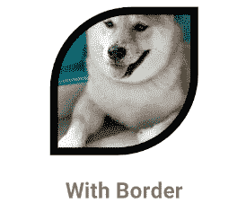

带边框的特定圆角

因为我们现在已经习惯了边框变体，所以我们只需要在布局文件的 ShapeableImageView 中添加 strokeWidth 和 strokeColor。

## 特定切割角

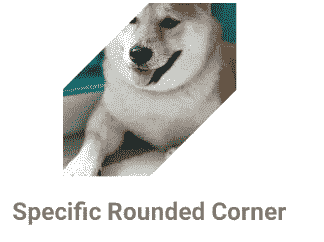

特定圆角

圆角并不适合所有的使用情况，这就是我们在这里讨论切角族的原因。

它将匹配特定的圆角，但只需更改角族

在布局文件中

## 带边框的特定切割角

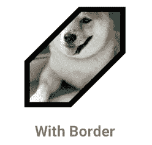

带边框的特定切割角

将遵循和以前一样，并指定 strokeColor，strokeWidth，具有相同的样式

## 带有圆角和切角的 ImageView

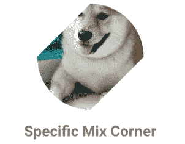

切角和圆角的图像

一些设计需要圆角和切角的混合，以实现更独特的形状。

我们将对所有拐角使用 50dp 的拐角尺寸

左上角和右下角的角族将被剪切，而右上角和左下角将被倒圆。这将产生附加图像中的形状。

布局文件

开始玩不同的组合，这将允许您为图像视图创建独特而美妙的形状

## 用 Kotlin 编程

有时需要通过代码动态更改形状、属性和角族。而 ShapeableImageView 提供了一套方法，让我们的生活变得更加轻松。

例如，如果我们需要使用 setTopRightCorner 将右上角设置为圆角大小为 14dp。

上述示例可在以下存储库中找到

 [## AMahmoud991/shapeableimageview

### 在 GitHub 上创建一个帐户，为 AMahmoud991/shapeableimageview 开发做出贡献。

github.com](https://github.com/AMahmoud991/shapeableimageview) 

看一看，并开始玩不同的形状，你会惊讶地发现，仅使用 ShapeableImageView 就可以制作出许多独特的形状。