# 深入了解 web 组件

> 原文：<https://itnext.io/deep-dive-into-webcomponents-6b36a4049fbf?source=collection_archive---------3----------------------->

# 制作基于动态组件的 web 应用程序的原生方式。

# 什么是 WebComponents，我为什么要使用它们？

WebComponents 让你有可能**创建新的 HTML 标签**。

它们不是新的。事实上，它们最早是在 2011 年发布的，并随着 2014 年 Polymer 的发布而大受欢迎。主要的问题是关于浏览器支持，但是现在，它们已经在所有现代浏览器上实现了。

WebComponents 背后的理念是许多现代 web 框架成功的一部分:制作可以多次使用的元素**。看看 webcomponents.org 的[就明白我的意思了。](https://www.webcomponents.org/)**

**WebComponents 可以被视为 React、Angular 或 Vue.js 的原生版本**。这样，您就不必包含大量代码来使您的 web 应用程序工作。代码已经构建在浏览器中，随时可以使用，无需担心下载和执行大量的 JavaScript。****

**这是最常见的 web 框架之间的大小比较:**

1.  **普通定制元素→随时可用**
2.  **LitElement→～5kb**
3.  **Vue.js → ~30kb**
4.  **React.js(带 React DOM) → ~110kb**
5.  **AngularJS → ~160kb**
6.  **角度→ ~550kb**

# **我们的第一个 web 组件！**

**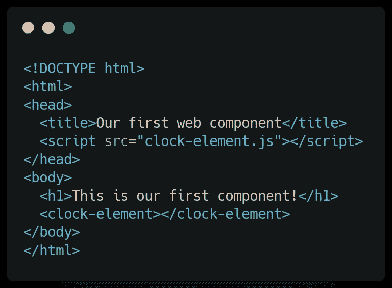**

**index.html**

**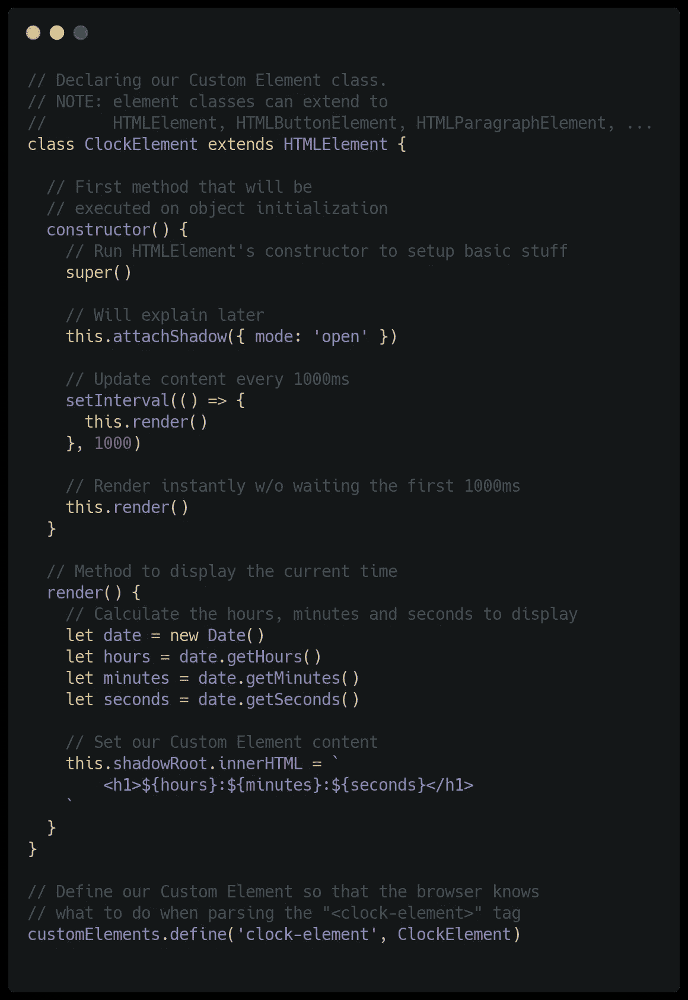**

**时钟元素. js**

**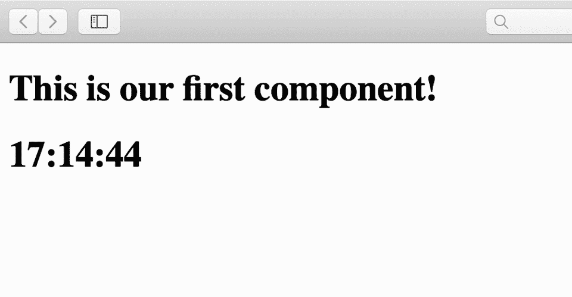**

**输出**

# **什么是影子 DOM？**

**让我们来谈谈这行代码:**

**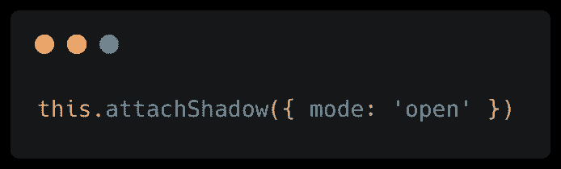**

**这就是为什么定制元素在各种 web 应用程序的开发过程中保持**可重用**的原因。你可以把影子 DOM 看作是根 DOM 不能干扰的子 DOM。**

**例如，如果我们在 HTML 文件中导入一个 CSS 文件，那么写在其中的规则不会被影子 DOM 简单地考虑。**

**一个真实的例子可能是社交媒体按钮，如 Twitter 的 Tweet 按钮或脸书的 like 按钮。它们必须是独立的，页面的样式不应该干扰这些元素的样式。**

**“模式”属性可以设置为“打开”或“关闭”。
当设置为 open 时，可以通过 HTMLElement 的“ **shadowRoot** ”属性访问 shadow root。否则，如果设置为“closed”,“shadowRoot”属性将为空。注意，**很容易绕过**，因为您仍然可以使用 HTMLElement 的“_root”属性访问影子根。**

# **使我们的代码更容易编写和优化**

**优化定制元素可能很难。这就是**文学元素**发挥作用的地方。**

**LitElement 是 Polymer 家族的一部分，它通过一组方便的**特性**使定制元素开发**变得更加容易，这些特性将帮助我们编写**更干净的代码**和**优化性能**。****

# **我们的第一个 web 组件…带 LitElement！🔥**

**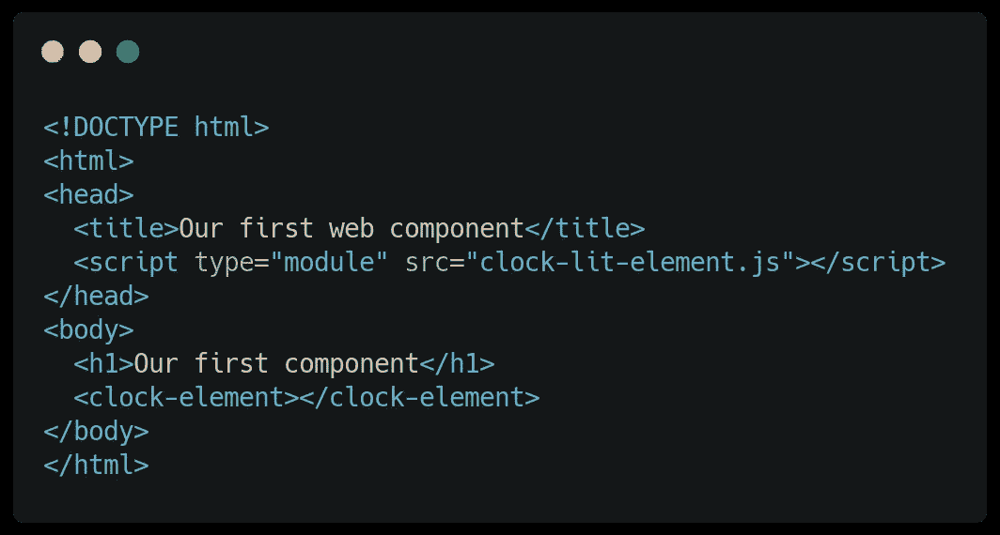**

**index.html**

**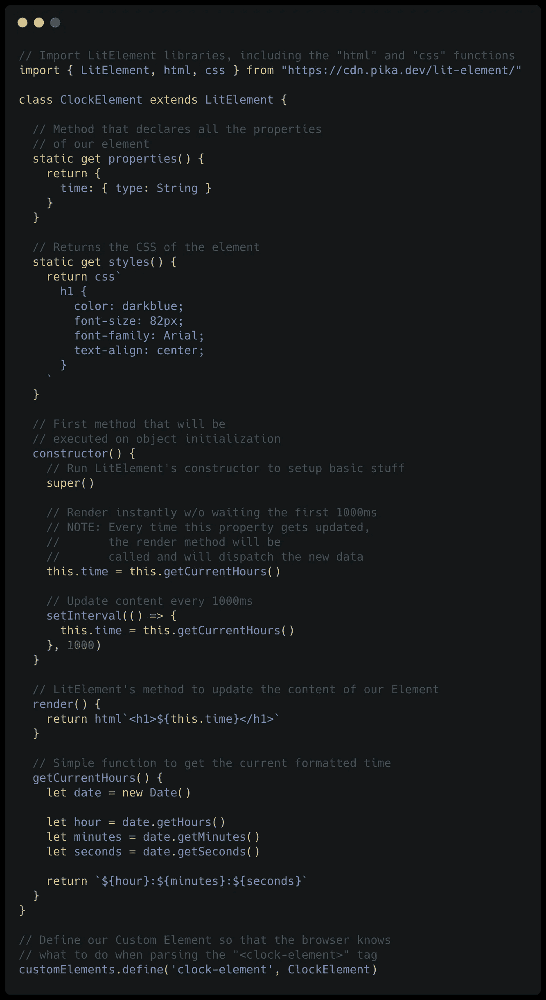**

**clock-lit-element.js**

# **什么是'**

**这是我们告诉浏览器我们正在使用 **ES 模块**的方式。
实际上，当一个 JS 文件导入一些其他文件(比如一个库，一个样式表，一个图像，或者其他什么…)时，它必须用 **type="module"** 属性导入。在我们的例子中，我们需要它直接从 clock-lit-element.js 文件导入 LitElement。**

# **“属性”方法**

**这个方法允许我们**声明**元素的属性。它们都必须有一个“**类型**属性，可以是“字符串”、“数组”、“对象”等，属性可以声明为**属性**。它们将自动转换为对象属性。例如:**

**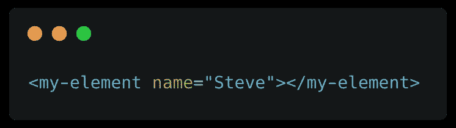**

**会自动将“name”属性设置为“Steve”。**

**每当其中一个属性改变时，它就会调用 render 方法，并让**有效地更新内容，只更新需要的内容，而不是整个组件。****

# **“风格”方法**

**“styles”方法给了我们一种更干净的方式来声明组件的 CSS。**

**该函数还可以返回一个**数组**，这在我们想要与多个元素共享 CSS 代码时非常有用。**

**例如:**

**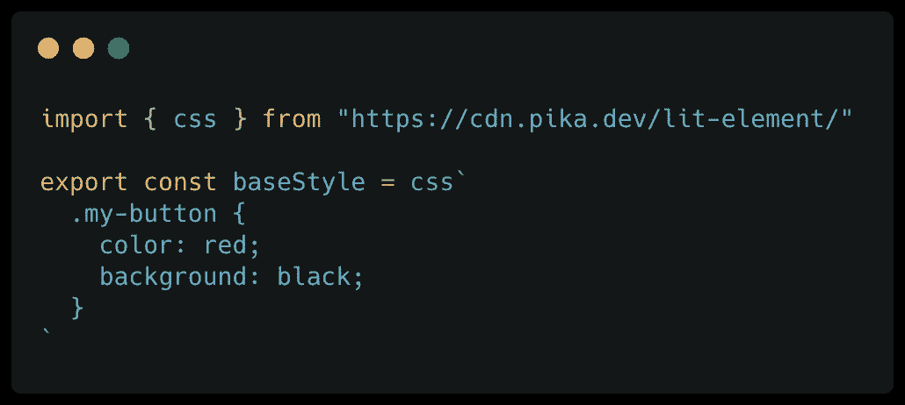**

**基本样式. js**

**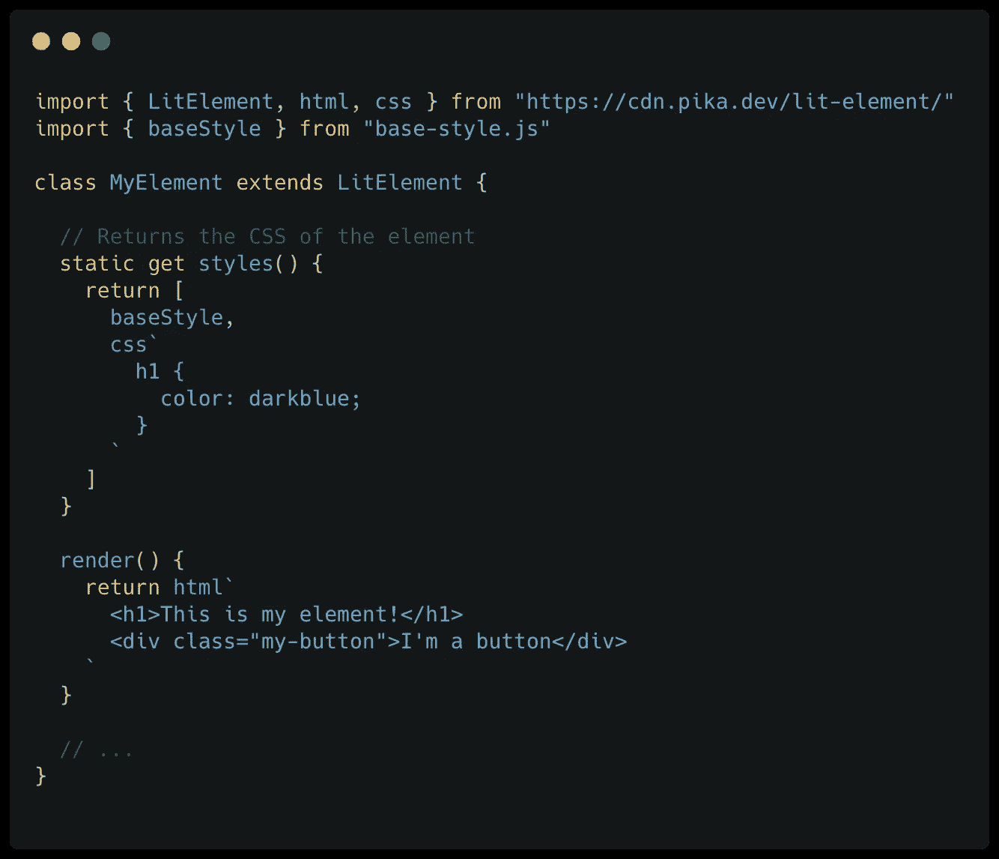**

**my-element.js**

# **“渲染”方法**

**这个方法生成了元素的 HTML 结构。**

**它必须返回一个由“ **html** 函数生成的值。为了描述它是如何工作的，我们必须引入“**字符串文字**”，这是 ES6 特性集的一个新特性。它们是简单的字符串，必须用 [**反斜杠**字符](https://superuser.com/questions/254076/how-do-i-type-the-tick-and-backtick-characters-on-windows)声明。**

**当你需要**连接**多个字符串时，这些类型的字符串非常有用。
例如:**

**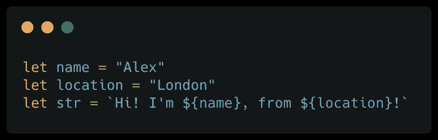**

**当一个函数在没有括号的情况下使用字符串文字(比如`html`<h1>Test</h1>``)被调用时，JavaScript 传递给函数**两个参数，**静态**字符串和**动态**生成的值。****

**LitHtml 能够生成**优化的 HTML** ，只更新需要更新的东西。**

# **元素间的通信**

**为了让元素进行通信，我们有两个选项:**

*   **使用元素实例并调用它的**方法。** 该选项仅在对**子**元素进行操作时可用。
    举例:**

**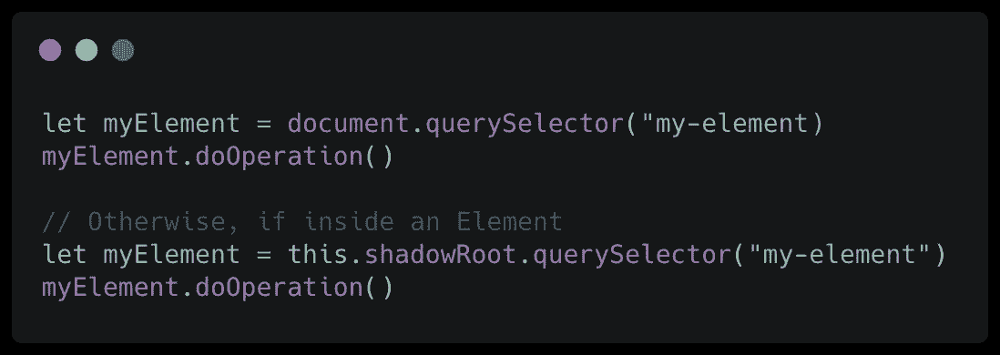**

*   **调度一个**全局事件。** 举例:**

**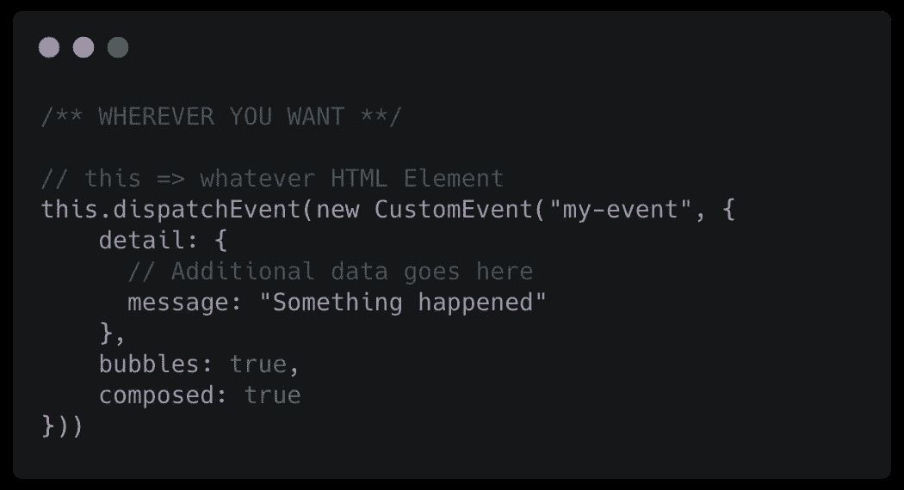**

**派遣一个事件**

**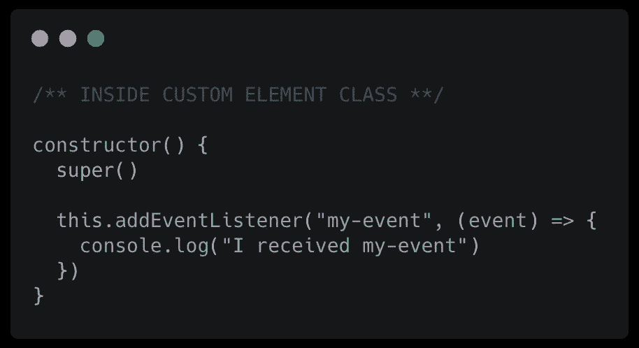**

**在事件上做某事**

# **感谢您的关注！**

**[这里有](https://gist.github.com/lobellomatteo/248755ac13f7332b5998bffc4e4598da)的公开要点链接，如果你想看的话。😊**