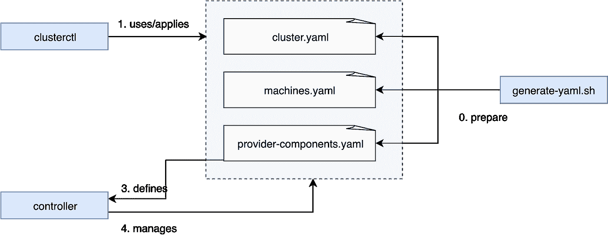
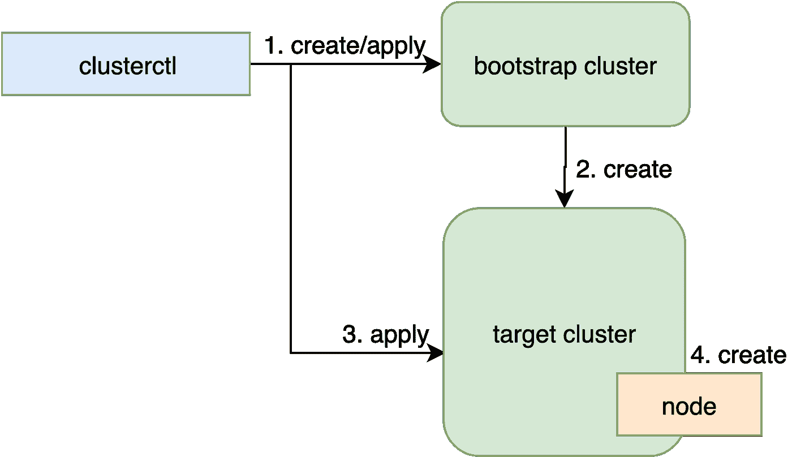
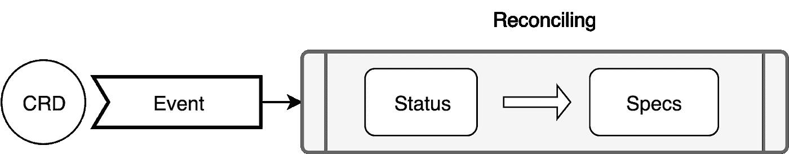
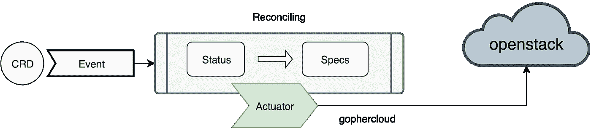
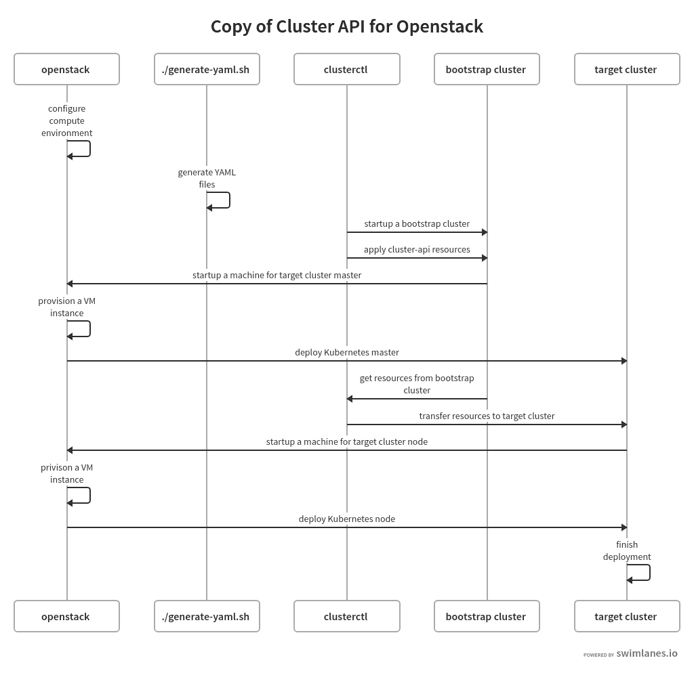

# 深入了解集群 API

> 原文：<https://itnext.io/deep-dive-to-cluster-api-a0b4e792d57d?source=collection_archive---------3----------------------->

Kubernetes 是一个流行的开源容器编排平台，用于跨主机集群管理云原生应用程序。它可以通过多种方式部署。您可以使用 minikube 轻松引导 Kubernete 集群。您也可以从头开始尝试 kubeadm、KIND 或手动部署 Kubernetes 集群。但是您不能使用 API 部署 Kubernetes 集群。Cluster API 是一个开源项目，用于进行基于 API 的 Kubernetes 集群部署。本文详细描述了什么是 Kubernetes 集群 API 以及它是如何工作的。作为一个具体的基础设施提供者示例，[https://github . com/kubernetes-sigs/Cluster-api-provider-open stack](https://github.com/kubernetes-sigs/cluster-api-provider-openstack)用于集群 API 介绍。

# 什么是 Kubernetes 集群 API？

```
*“The Cluster API is a Kubernetes project to bring declarative, Kubernetes-style APIs to cluster creation, configuration, and management. It provides optional, additive functionality on top of core Kubernetes.”*[https://github.com/kubernetes-sigs/cluster-api](https://github.com/kubernetes-sigs/cluster-api)
```

Kubernetes 通过对象和控制器管理不同的资源。控制器通常管理资源，使其对象的实际状态与规范提供的期望状态相匹配。例如，您可以应用带有 yaml 规范的部署资源。它管理 nginx 应用程序。部署控制器的功能有助于进行应用程序复制和滚动更新。但是，对于 Kubernetes 集群本身，没有 Kubernetes 的方法来管理它。Cluster API 将集群作为 Kubernetes 中的一种资源，并通过一个控制器来管理其状态。

集群 API 将管理功能分为代码管理的两个部分。基本集群 API 是用于所有提供者的框架。它独立维护。集群 API 提供者为集群 API 框架实现不同基础设施的操作细节。借助 provider，集群 API 从不同第三方基础设施供应商的操作细节中抽象出集群及其机器的整体管理功能。

目前有很多提供者实现，比如 AWS，Azure 等。本文使用 Openstack 作为实现示例。

# 如何部署和使用集群 API？

要使用 API 部署集群，可以使用特定的集群 API 提供者代码库。[https://github . com/kubernetes-sigs/cluster-API-provider-openstack](https://github.com/kubernetes-sigs/cluster-api-provider-openstack)中的 README 显示了在 open stack 上创建集群的详细步骤。对于您的第一个基于集群 API 的 Kubernetes 部署，您可以参考它。每个准备工作完成后，执行一个命令行来引导集群。

```
clusterctl create cluster — bootstrap-type kind \
                  -provider openstack \
                  -c examples/openstack/out/cluster.yaml \
                  -m examples/openstack/out/machines.yaml \
                  -p examples/openstack/out/provider-components.yaml
```

这些选项可以分为 3 个部分:

*   `bootstrap-type`指定引导集群的种类。

引导集群是一个临时集群，用于预配您在相关资源文件中指定的目标集群。目前，您可以使用 KIND、minikube 和现有的 Kubernetes 集群作为引导集群。

*   本例中的`provider`是 openstack

当您使用不同的基础设施提供者时，它可以是任何提供者。

*   `cluster.yaml`、`machines.yaml`和`provider-components.yaml`描述了管理目标 Kubernetes 集群所必需的资源。

`cluster.yaml`和`machines.yaml`描述集群及其成员机的规格。`provider-components.yaml`描述必要的 CRD、RBAC 和控制器。它还存储在由基础设施提供者引导的机器上部署 Kubernetes 二进制文件所执行的脚本。

当目标集群启动时，您可以通过 kubectl 的集群 API 来管理它。这与库伯内特的其他资源是一样的。您只需要操纵`Cluster`和`Machine`资源来管理您的 Kubernetes 集群。

# 具体是如何工作的？

在准备阶段，`generate-yaml.sh`根据`clouds.yaml`规范和源代码中的模板 YAML 文件生成 YAML 文件。yaml 描述了提供者认证和访问信息。它不同于提供商。



对于生成的`machines.yaml`，Openstack 机器细节仍需要配置。您需要确保您的机器具有预期的风格、映像、网络、安全组、ssh 验证数据等。`clusterctl`启动一个引导集群，然后在集群中应用`provider-components.yaml`、`cluster.yaml`和`machines.yaml`。当`provider-components.yaml`中定义的控制器启动时，它们管理应用于启动的集群和机器资源，并管理目标集群。

实际上，正如我们在一个`clusterctl`进程中提到的，有两个 Kubernetes 集群。它包括创建集群的 4 个步骤。

1.  创建一个引导集群(如果没有现有的 Kubernetes 集群，则按需创建)并在集群中应用资源
2.  为目标群集创建一台控制平面机器。
3.  将所有集群 API 资源从引导集群转移到目标集群控制平面
4.  从目标群集的控制平面创建计算节点



目标 Kubetnetes 接管集群 API 管理工作后，引导集群自动销毁(如果由`clusterctl`创建)。

# 架构是什么？

特定提供者的集群 API 有 3 个组件:

*   `clusterctl`:用于提供 Kubernetes 集群的命令行工具。它为所有提供者共享公共逻辑。
*   集群 API 控制器:相关资源的集群管理功能的控制器。也是集群 API 核心部分代码。
*   提供者控制器:群集和机器供应的提供者资源的控制器。它是特定于提供商的代码。您可以从每个提供者实现代码库中获得。

**二进制**:集群 API 控制器

**功能控制器:**机器部署控制器、机组控制器、节点控制器

**CRD** : `MachineDeployment`，`MachineSet`，-

**二进制**:提供商控制器

**功能控制器:**集群控制器，机器控制器

**CRD** : `Cluster`，`Machine`

对于控制器二进制文件，它包括许多用于管理多种资源的函数。对于每个资源管理功能，我们也称之为资源控制器。因此,“控制器”意味着在不同的上下文中对资源的管理功能。

对于资源控制者，传统的方法是协调 CRD 的事件。协调功能包括资源的定制逻辑。一般来说，它试图使资源的状态符合规范。



在集群 API 中，它有进一步的抽象。协调功能是 cluster-api 项目中常见的管理逻辑。而`Actuator`才是真正给提供商打电话的地方。它需要不同的提供者实现。对于 Openstack，`Actuator`接口实现调用 gophercloud API 向 Openstack cloud 请求相关的 VM 操作。这种详细的操作有助于集群 API 为提供商基础设施管理 Kubernetes 集群和机器。所以，如果你想开发自己的基础设施提供者，你需要为它开发执行器代码。



# 代码逻辑是什么？

# 集群 ctl

这是用于集群 api 的命令行工具。最好从不同的提供者处获取，例如，要使用 Openstack 作为提供者，您应该从 cluster-api-provider-openstack 项目构建`clusterctl`。因为目前，clusterctl 是为每个提供者构建的。在这种情况下，cluster-api-provider-openstack 中的代码对于使用特定的提供者更有意义。当然，cluster-api 总是包含`clusterctl`核心进程的最新进展。

集群部署的主要逻辑位于:

`pkg/vendor/sigs.k8s.io/cluster-api/cmd/clusterctl/clusterdeployer/clusterdeployer.go: func (d *ClusterDeployer) Create`

它的工作原理如下:

## -引导集群运行阶段

*   `CreateBootstrapCluster()`

它在本地主机中创建引导集群。函数返回后，指定类型的引导集群(上面例子中的类型)就可以使用了。您可以使用 kubectl 来监控引导集群。在`clusterctl`的部署过程完成后，它将被自动删除。

*   `ApplyClusterAPIComponents()`

它在引导集群中应用`provider-components.yaml`。CRD、依赖关系资源和控制器部署是在集群中创建的。目标机器上的启动脚本也作为秘密存储在文件中。

*   `ApplyCluster()`

它在引导集群中应用`cluster.yaml`。

*   `ApplyMachines()`
    在引导集群中应用`machines.yaml`。注意，它仅应用标签为“set: master”的机器，因为引导集群仅在主节点上启动目标集群控制平面。
*   `updateClusterEndpoint()`

它从控制平面机器对象的“openstack-ip-address”注释中获取 IP。然后它使用这个 IP 来更新集群 API 端点状态。这并不好，因为状态通常是由控制器管理的。它必须重新考虑这个设计。

## -目标集群运行阶段

*   `createTargetClusterClient()`

等待引导群集的提供者控制器创建目标群集。它创建一个客户端到目标群集。

*   `applyClusterAPIComponentsWithPivoting()`

它将`provider-components.yaml`中的资源应用于目标集群。因此，在目标集群中创建了 CRD 资源并启动了控制器。之后，集群和机器资源从引导集群转移到目标集群。如果存在，集群 API 管理的资源 MachineDeployment 和 MachineSet 也会在此过程中传输。

*   `saveProviderComponentsToCluster()`

它将 provider-components . YAML 保存为目标集群中的 ConfigMap。

*   `ApplyMachines()`

这仅适用于标签“集:节点”。所有计算节点都应用于目标集群，并由目标集群中的控制器进行管理。

最后，`clusterctl`完成它的工作。目标集群已启动。

# 集群 API 控制器

该控制器管理`MachineDeployment` 和`MachineSet`资源。它们相当于库伯内特斯的`Deployment`和`ReplicaSet`。一个用于滚动升级，另一个用于复制。他们可以管理 Kubernetes 中的机器资源，并让供应商特定的控制器在其上进行协调。

社区有一个流程图来描述它是如何工作的。有关详细信息，请参考机器集、机器部署和节点控制器链接:

[https://github . com/kubernetes-sigs/cluster-API/blob/master/docs/book/summary . MD](https://github.com/kubernetes-sigs/cluster-api/blob/master/docs/book/SUMMARY.md)

# Openstack 提供商控制器

这个控制器二进制管理`Cluster`和`Machine`资源。框架逻辑使用 actuator 来执行提供者特定的操作。`Cluster`和`Machines`的执行机构接口如下:

**执行器:** `Cluster`

**界面:** `Reconcile`，`Delete`

**执行器:** `Machine`

**界面:**`Create``Delete``Update``Exists`

框架逻辑位于:

*   `vendor/sigs.k8s.io/cluster-api/pkg/controller/machine/controller.go::ReconcileMachine{}`

在项目报告中对这部分有详细的解释:[https://github . com/kubernetes-sigs/cluster-API/blob/master/docs/book/common _ code/machine _ controller . MD](https://github.com/kubernetes-sigs/cluster-api/blob/master/docs/book/common_code/machine_controller.md)

对于集群协调，执行器协调提供者特定的任务。对于 Openstack，它管理目标集群机器管理的网络和安全组。

*   `vendor/sigs.k8s.io/cluster-api/pkg/controller/cluster/controller.go::ReconcileCluster{}`

在项目报告中对这部分有详细的解释:[https://github . com/kubernetes-sigs/cluster-API/blob/master/docs/book/common _ code/cluster _ controller . MD](https://github.com/kubernetes-sigs/cluster-api/blob/master/docs/book/common_code/cluster_controller.md)

对于机器，创建操作将在 Openstack 上创建一个新的 VM 实例。然后，它提取虚拟机实例的引导脚本，以便在主机启动后执行。它在机器上部署 Kubernetes 依赖项和二进制文件并启动它。该脚本来自 base64 编码的秘密`master-user-data`的`userData`。在发送出去执行之前，它被预处理以用脚本中的运行时结果替换模板值。

在源代码中，目录`cmd/clusterctl/examples/openstack/provider-component/user-data`包括不同的操作系统脚本模板。对于 ubuntu 来说，在`ubuntu/templates/`之下。主人和奴隶有他们不同的剧本:`master-user-data.sh`和`worker-user-data.sh`。

# 集群 API 工作序列



# 如何调试集群 API？

通过集群 API 部署 Kubernetes 的过程与许多对象实例有关:`clusterctl`、集群 API 控制器、引导集群、目标集群、Openstack、VM 实例和主机初始化脚本。如果有任何问题，你可以向社区寻求帮助。但是，如果你想了解更多关于集群 API 的知识，你最好自己去寻找答案。下面是一些在部署过程中获得有用信息的提示。

*   您可以使用集群命令行选项选项'-v 10 '来打印详细步骤日志。
*   在 bootstrap 集群控制器中，可以通过 kubectl 获得控制器的日志。对于不同的引导类型，您可以使用相关的 kubeconfig 来访问集群。对于 KIND，需要执行:`export KUBECONFIG=$(kind get kubeconfig-path --name=”clusterapi”)`。
*   在您调配的虚拟机中，您可以登录到主机
*   `tail -f /var/log/cloud-init-output.log`获取初始化脚本输出
*   `kubectl —-kubeconfig /etc/kubernetes/admin.conf logs`查看目标集群控制器日志

仅供参考。本文基于当前的开发代码进行介绍。它仍在开发中。代码甚至功能都可能改变。但是，它背后的概念和设计哲学在很长一段时间内都不会过时。

# 参考

[1][https://github.com/kubernetes-sigs/cluster-api](https://github.com/kubernetes-sigs/cluster-api)展示了集群 API 项目的源代码。

[2][https://github . com/kubernetes-sigs/Cluster-api-provider-openstack](https://github.com/kubernetes-sigs/cluster-api-provider-openstack)展示了集群 API 的 open stack 提供者的源代码。

[3][https://kubernetes-sigs.github.io/cluster-api/](https://kubernetes-sigs.github.io/cluster-api/)展示了如何创建自己的提供商代码库

[4][https://developer . IBM . com/articles/Cluster-api-Manage-your-kubernetes-Cluster-in-a-kubernetes-way/](https://developer.ibm.com/articles/cluster-api-manage-your-kubernetes-cluster-in-a-kubernetes-way/)集群 API:以 Kubernetes 本地方式管理您的 Kubernetes 集群