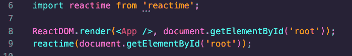
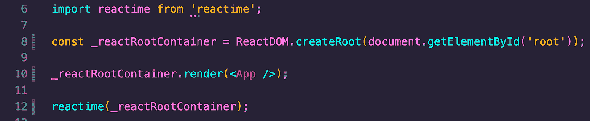

# 《野草在深处:反应时间》、《并发反应 _fiberRoot》和浏览器历史缓存

> 原文：<https://itnext.io/deep-in-the-weeds-with-reactime-concurrent-react-fiberroot-and-browser-history-caching-7ce9d7300abb?source=collection_archive---------6----------------------->

*Reactime me:开源 Chrome 开发工具，用于跟踪和可视化 reaction 应用程序中的状态变化*

*这是对构成 Reactime 核心功能的技术的低级审查。如果您对更高级别的概述感兴趣，* [*请点击此处。*](https://medium.com/@chriswillsflannery_54084/time-traveling-state-debugger-reactime-now-supporting-concurrent-mode-routers-and-more-56f9ca6f7601)

***简介***

Reactime 是一个 chrome 扩展，允许开发人员逐步完成他们应用程序中的一系列状态更改，允许他们探索事件链是如何以很大的粒度启动的。它建立在一个类似于 [Redux DevTools](https://chrome.google.com/webstore/detail/redux-devtools/lmhkpmbekcpmknklioeibfkpmmfibljd?hl=en) 的用户界面上，但是适用于 Hooks、Context API、常规的旧的有状态类组件，现在是并发模式(如果您不熟悉，不用担心——我们会讲到这一点。)听起来不错吧？很好，让我们潜入…

***reaction me 是如何工作的？***

在其核心，Reactime 是一个**函数**导出另一个**函数**导出另一个**函数**。*深呼吸*。Reactime 的核心位于 linkFiber.js 模块中，这是大多数业务逻辑的所在地。linkFiber.js 本质上是一个助手函数链，它们按顺序相互调用，构建一个当前 React Fiber 树的副本，并检查我们使用的是哪种*类型的*状态(即有状态组件、钩子或上下文 api ),并具有相应处理每种情况的逻辑。TL；灾难恢复:每次在附带的应用程序中进行状态更改时，Reactime 扩展都会创建当前状态的树“快照”，并将其添加到扩展中快照的当前“缓存”中。

***我们需要更深入***

当我说一个**函数**返回一个**函数**返回一个**函数**时，那意味着，linkFiber.js 是一个模块，它导出一个存在于 index.js 中的生命，这个函数导出一个函数，它包装了我们的 HTML 结构的根，比如 document.getElementById('root ')。通过获取 DOM 元素的根，我们能够基于应用程序中元素的层次结构构建纤程树，遍历树的每个分支，并根据需要适当地解析或丢弃元素(例如，我们选择**保留**有状态组件纤程，但**丢弃**悬念和其他符号类型表示的纤程)。

***解析钩子组件&与 AST 的*** 一起工作

根据您正在处理的状态的类型，纤程树的构造会有所不同——一些属性会“丢失”,一些属性会在其他位置，而一些全新的属性会出现。在一个使用 React 钩子的应用程序中，一些真正有趣的事情发生了。因为基于钩子的纤程树根明显缺少 stateNode 属性，取而代之的是一个填充的 memoizedState，所以我们可以使用 Acorn(一个解析库)从钩子结构中获取根类型并构造一个抽象语法树，以便提取钩子 getters 并将它们与对象中相应的 setters 相匹配。这个对象将被导出(由 astParser.js ),并被发送回 linkFiber.js，钩子将被保存在那里，我们可以移动到下一个子节点或兄弟节点，基本上重复这个过程。

这里最有趣的设计选择之一是，之前负责 Reactime 的团队选择实现一个函数来改变 *setState* dispatch 或 hooks 等价物的功能，在新的 *setState* 中，它不仅调用旧的功能，还更新当前状态快照树，并将该快照发送回 UI。当我们使用 chrome 扩展的时间旅行功能时，这允许我们实时查看 UI 更新。非常好的东西！

***纤根 vs 并发纤根***

还记得我在*深入*部分说过函数需要包装 HTML 根吗？这在并发模式下不太适用——因为设置有点不同。并发模式要求开发人员将 HTML 根包装在一个新的 React 函数中，该函数(在幕后)使用一系列函数来手动创建一个纤程根，进而呈现我们的< App/ >组件。然后，我们可以获取 createRoot 的计算结果，并使用 _reactRootContainer 调用 reactime()来启动该流程。在并发模式下，如果我们试图以旧的方式调用 react ime(document . getelementbyid(' root '))，它会出错——不会出现 _fiberRoot(位于 HTML 结构顶部的一个不可见的顶级 HTML 组件)。

***上下文模仿通量架构***

Reactime 利用 React 挂钩和带有功能组件的上下文 API，使用 Flux 设计模式创建单个状态存储，使用 useReducer 处理复杂的状态逻辑，消除不必要的 prop 钻探和 Redux 实现的开销。Reactime 将这种模拟的主状态用于功能组件，允许进行时间旅行调试。

**React 路由器&浏览器历史缓存 **

当从不同的端点对先前状态进行时间旅行调试时，如果路由不持久，React 路由器将无法在快照中挂载组件。我们可以利用浏览器的历史 API 为每次时间跳转推送 State()，使 Reactime 能够重新装载当前快照中引用的组件。递归遍历 React 纤程树，我们寻找路由器节点来记录当前状态的路径，并将状态添加到浏览器的会话历史堆栈中。在调用 pushState()后，浏览器不会尝试加载此 URL，新的 URL 会相对于当前 URL 进行解析。

***尚未解决的问题***

我们仍在解决一些问题——我们还没有真正用 GraphQL、Apollo 和 Relay 广泛测试 Reactime。此外，尽管我们可能会尝试，但我们似乎还没有弄清楚为什么第一次钩子点击没有在 DOM 中注册。根据 Reactime 2.0 合作者 Andy:

“我想我有一个好主意。在 webpack 配置设置中，创建一个模板，在其中将一个页脚 div 添加到所有客户端页面的最末尾。让树继续构建，只在页脚 div 渲染时创建快照。理论上，这应该是所有 linkFiber linkedlists 上的最后一个节点，也可能是您尝试用钩子捕获第一个点击问题的地方。”

我们会成功的——一步一步来。

Reactime 是一个开源项目，非常欢迎你——读者——参与合作，让它变得更好。我们当然会感谢任何和所有的帮助！即使你只是想尝试一下——到处玩，打破东西，在 [github](https://github.com/open-source-labs/reactime) 上发表一期，检查一下，让我们知道你的想法。一定要下载 [chrome 扩展](https://chrome.google.com/webstore/detail/reactime/cgibknllccemdnfhfpmjhffpjfeidjga)！

干杯，

Reactime 3.0 团队