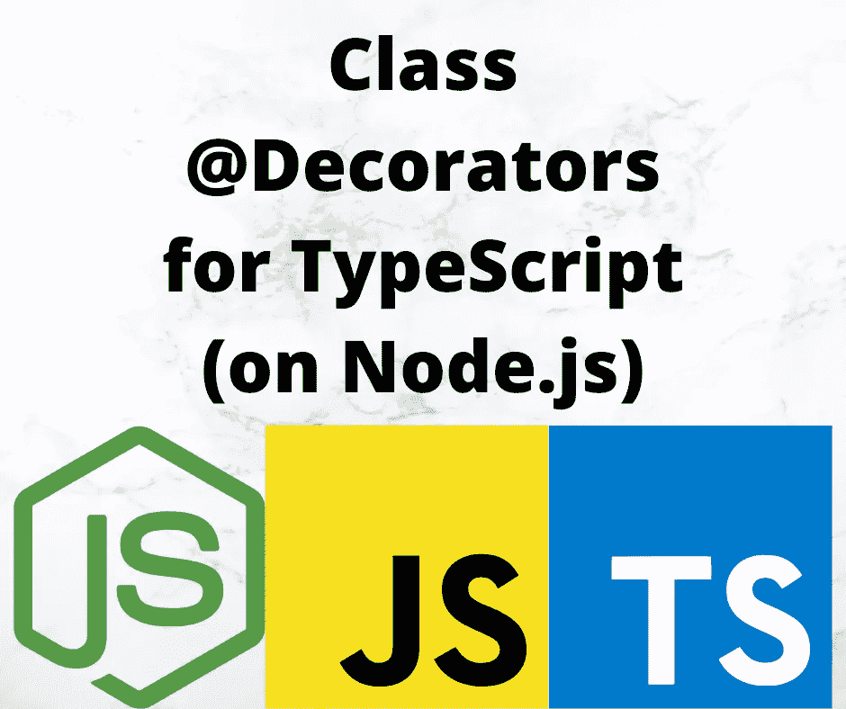

# 对 TypeScript 中的类装饰器的深入介绍

> 原文：<https://itnext.io/deep-introduction-to-class-decorators-in-typescript-23005ea5d035?source=collection_archive---------1----------------------->

## 向 TypeScript 中的类添加数据和功能



图像由作者与相应项目的标志

装饰器允许我们在 TypeScript 中向类或方法添加额外的信息，类似于 Java 中的注释。类装饰器应用于 TypeScript 中的类定义，可以观察、修改或替换类定义。

本文深入探讨了如何定义和使用 TypeScript 类装饰器。要使用 decorator，必须在 TypeScript 中启用它们，所以请务必[阅读本系列](https://javascript.plainenglish.io/deep-introduction-to-using-and-implementing-typescript-decorators-a9e876ad0d43)中的 decorator 介绍文章。类装饰器主要用于向类中添加元数据，这些元数据将被其他装饰器使用。但是，类装饰者也可以返回一个新的构造函数来覆盖或替换现有的构造函数或类，添加新的方法或其他行为。

实际上，它们看起来像这样:

```
@Decorator( ?? optional arguments)
class DecoratedClass {
    // properties, or methods
}
```

也就是说，您可以在关键字`class`前面加上一个或多个装饰符。对于一些装饰器，参数配置其行为。其他装饰器不需要参数，这将在文档中解释。

本文是系列文章的一部分:

*   [装修工介绍](https://javascript.plainenglish.io/deep-introduction-to-using-and-implementing-typescript-decorators-a9e876ad0d43)
*   **类装修工**本条
*   [物业装修工](https://javascript.plainenglish.io/a-deep-introduction-to-property-decorators-in-typescript-8ef011169ec)
*   [访问器装饰器](https://javascript.plainenglish.io/typescript-accessor-decorators-in-depth-take-control-over-get-and-set-accessor-methods-8b85c95124f9)
*   [参数装饰器](https://javascript.plainenglish.io/introduction-to-parameter-decorators-in-typescript-b0042b5474ed)
*   [方法装饰者](https://javascript.plainenglish.io/a-deep-introduction-to-method-decorators-in-typescript-6045d52e10a6)
*   [混合装修工](https://javascript.plainenglish.io/implement-hybrid-decorator-functions-in-typescript-f6d24bc5abb0)
*   [反射和带装饰器的反射 API](https://javascript.plainenglish.io/using-the-reflection-and-reflection-metadata-apis-with-typescript-decorators-c56ba9c690c7)
*   [使用装饰器和反射元数据在 TypeScript 中进行运行时数据验证](https://javascript.plainenglish.io/runtime-data-validation-in-typescript-using-decorators-and-reflection-metadata-3219fdf5dfb5)

# TypeScript 中的类装饰函数

装饰函数有一个参数:

*   类的构造函数

这为属性装饰函数定义了一个必需的签名。

让我们尝试一个简单的类装饰器的例子，它简单地打印给定的数据。

```
function logConstructor(constructor: Function) {
    const ret = {
        constructor,
        extensible: Object.isExtensible(constructor),
        frozen: Object.isFrozen(constructor),
        sealed: Object.isSealed(constructor),
        values: Object.values(constructor),
        properties: Object.getOwnPropertyDescriptors(constructor),
        members: {}
    };
    for (const key of Object.getOwnPropertyNames(constructor.prototype)) {
        ret.members[key] = constructor.prototype[key];
    }

    console.log(`ClassDecoratorExample `, ret);
}

@logConstructor
class ClassDecoratorExample {
    constructor(x: number, y: number) {
        console.log(`ClassDecoratorExample(${x}, ${y})`);
    }
    method() {
        console.log(`method called`);
    }
}

new ClassDecoratorExample(3, 4).method()
```

`logConstructor`是`@logConstructor` decorator 的 decorator 函数，它为类 decorator 实现了指定的方法签名。这个装饰器不使用任何参数，并且由于它的实现不需要括号。

它只是打印出关于构造函数的可用信息。大多数情况下，我们使用`Object`类中的方法来查询关于被修饰类的数据。在一些情况下，查询是针对`constructor.prototype`的，因为该对象包含附加到该类的方法的实现细节。

存储库中的`[decorator-inspectors](https://www.npmjs.com/package/decorator-inspectors)`包包含一个更全面的装饰器`LogClassInspector`，目的类似。

运行时，我们得到以下输出:

```
$ npx ts-node lib/classes/first.ts 
ClassDecoratorExample  {
  constructor: [class ClassDecoratorExample],
  extensible: false,
  frozen: false,
  sealed: false,
  values: [],
  properties: {
    length: {
      value: 2,
      writable: false,
      enumerable: false,
      configurable: false
    },
    name: {
      value: 'ClassDecoratorExample',
      writable: false,
      enumerable: false,
      configurable: false
    },
    prototype: {
      value: {},
      writable: false,
      enumerable: false,
      configurable: false
    }
  },
  members: {
    constructor: [class ClassDecoratorExample],
    method: [Function: method]
  }
}
ClassDecoratorExample(3, 4)
method called
```

`properties`中的值是我们会反复看到的`PropertyDescriptor`对象。我们大多数人不需要深究 JavaScript 的幕后。但是，要实现 decorators，我们需要知道一些事情。

例如，您知道对象上的`sealed`或`frozen`设置吗？现在我知道了它们，能够打开这些设置看起来肯定很有用。这个装饰器使它变得简单:

```
function sealed(constructor: Function) {
    Object.seal(constructor);
    Object.seal(constructor.prototype);
}
```

如果您将它附加到一个类定义，该类将被密封。

要使用它，请将其添加到脚本中:

```
@logConstructor
@sealed
class ClassDecoratorExample { ... }
```

我们可以很容易地给任何可装饰的东西添加多个装饰器。多个装饰器有一个执行顺序，它们从下往上执行。因此，输出现在会说`sealed: true`，因为`@sealed`会先执行。如果您将`@sealed`放在`logConstructor`上方，它仍然会显示`sealed: false`，因为`@sealed`将会第二个执行。

# 实现接受参数的类装饰器

装饰者也可以接受参数。[正如我们在简介](https://medium.com/@7genblogger/deep-introduction-to-using-and-implementing-typescript-decorators-a9e876ad0d43)中所说，这需要遵循一种不同的模式，称为装饰工厂。

下面是一个简单的类装饰器示例，它不仅展示了如何传入参数，还帮助我们理解了使用多个装饰器时的执行顺序。

```
function withParam(path: string) {
    console.log(`outer withParam ${path}`);
    return (target: Function) => {
        console.log(`inner withParam ${path}`);
    };
}

@withParam('first')
@withParam('middle')
@withParam('last')
class ExampleClass {
   // methods and properties
}
```

外部函数`withParam`接受与装饰器一起使用的参数列表。内部函数是装饰函数，是实现所需签名的地方。内部函数将包含实际的装饰器实现。

所发生的是*with param(param)*是一个表达式，它返回一个带有正确签名的函数作为类装饰器。这使得内部函数成为装饰函数，而外部函数是生成该函数的工厂。

在这个例子中，我们已经附加了三次`withParam`,所以我们可以了解更多关于执行顺序的信息。

```
$ npx ts-node lib/classes/constructors.ts  
outer withParam first
outer withParam middle
outer withParam last
inner withParam last
inner withParam middle
inner withParam first
```

我们在简介中详细讨论了这个[。记住，工厂函数从上到下执行，之后装饰函数从下到上执行。](https://techsparx.com/nodejs/typescript/decorators/introduction.html)

# 向框架注册的类装饰器

让我们研究一下类装饰器的一个可能的实际用途。也就是说，一个框架可能会保存某些种类的类的列表。对于这个例子，我们将模拟一个 web 应用程序框架，其中某些类拥有 URL 路由功能。每个路由器类处理特定 URL 前缀的路由，以及该路由的特定配置。

```
const registeredClasses = [];

function Router(path: string, options ?: object) {
    return (constructor: Function) => {
        registeredClasses.push({
            constructor, path, options
        });
    };
}

@Router('/')
class HomePageRouter {
    // routing functions
}

@Router('/blog', {
    rss: '/blog/rss.xml'
})
class BlogRouter {
    // routing functions
}

console.log(registeredClasses);
```

*路由器*是一个工厂函数，产生一个类装饰器，将类添加到`registeredClasses`数组中。该函数有两个选项，其中`path`是 URL 路径前缀，`options`是可选的配置对象。

因为类装饰器最后运行，所以类装饰器可以选择对类中包含的任何方法或属性做些什么。此外，更常见的存储数据的方法不是像这样的数组，而是使用反射元数据 API，我们将在后面讨论。

运行此命令的输出是:

```
$ npx ts-node lib/classes/register.ts 
[
  {
    constructor: [class HomePageRouter],
    path: '/',
    options: undefined
  },
  {
    constructor: [class BlogRouter],
    path: '/blog',
    options: { rss: '/blog/rss.xml' }
  }
]
```

由假设的框架来处理这些数据。正如我们前面看到的，从`constructor`对象开始，有相当多的额外数据可用。

# 在 TypeScript 中使用类装饰器修改类

这个简单的例子很有趣，但是让我们尝试做一些有趣的事情。我们可以修改或替换类定义。这需要一点魔法，所以让我们来看看。

在我们开始之前，后退半步想一想——类装饰函数接收类对象。它不接收正在创建的实例。我们可以使用`Object.defineProperty(target, ...)`添加属性，但是该属性是添加到类中，而不是添加到生成的任何实例中。

为了抓住一个随机的概念，考虑一个记录雇员一天中事件的应用程序。员工先打卡上班，下班后打卡下班。让我们创建两个类来记录这些事件，并使用一个装饰器来自动添加时间戳和唯一标识符。

```
import { v4 as uuidv4 } from 'uuid';

function TimeStamp<T extends { new(...args: any[]): {}}>(target: T) {
    return class extends target {
        uuid = uuidv4();
        created = new Date().toLocaleString("en-US");

        hello(msg: string) { console.log(`Extended ${msg}`); }
    }
}

@TimeStamp
class ClockIn {
    // methods and properties
}

@TimeStamp
class ClockOut {
    // methods and properties
}
```

`TimeStamp` decorator 有一个奇怪的声明，但这确实有效，它来自官方的 TypeScript 文档，并且与类 decorator 函数所需的签名相匹配。看来`extends`子句与扩展泛型类有关，因此 T 在这种情况下匹配任何类定义。

带有`<T extends { new(...args: any[]): {}}>`的部分是一个泛型，其中`T`被定义为扩展任何类的东西。该语法直接来自 TypeScript 文档，并且可能是声明类装饰器的更精确的方式。

带有`return class extends target`的部分是一个类操作，将创建一个新的类来扩展被修饰的类。在这个新类中，我们添加了两个字段和一个函数。`uuid`字段是唯一的标识符，而`created`字段是时间戳。

在 TypeScript 文档中，这种技术被描述为重写构造函数。

要对此进行测试，请使用以下内容:

```
const ci = new ClockIn();
const ci2 = new ClockIn();
const co = new ClockOut();

console.log(ci);
console.log(ci2);
console.log(co);

console.log(ci.hasOwnProperty('uuid'));
console.log(ci['uuid']);
console.log((<any>ci).uuid);
ci['hello']('World');
(<any>ci).hello('World #2');
```

我们正在生成两个`ClockIn`实例，以验证每个实例都获得了一个惟一的标识符。然后我们打印出一些数据。

运行时，它看起来像这样:

```
$ npx ts-node lib/classes/timestamp.ts 
ClockIn {
  uuid: 'bc3e6f35-c85d-491d-82c0-c906deacc774',
  created: '2/10/2022, 6:11:53 PM'
}
ClockIn {
  uuid: '13eb2df6-b9e7-4735-9130-a7ee13182d33',
  created: '2/10/2022, 6:11:53 PM'
}
ClockOut {
  uuid: '31ce8e88-90e0-40d7-9eb2-cbba5c879b5d',
  created: '2/10/2022, 6:11:53 PM'
}
true
bc3e6f35-c85d-491d-82c0-c906deacc774
bc3e6f35-c85d-491d-82c0-c906deacc774
Extended World
Extended World #2
```

我们的对象确实有添加的字段，并且两个 ClockIn 实例有不同的标识符。

代码变得有趣的地方是试图直接访问一个字段，比如`ci.uuid`。编译器给了我们一个错误，说该类型上不存在指定的字段，大概是因为 ClockIn 类没有名为`uuid`的字段。但是我们通过调用`hasOwnProperty`得知添加的属性确实存在，我们可以使用`ci['uuid']`或者像在`(<any>ci).uuid`中一样将`ci`转换为`any`来访问这些属性。

虽然我们设法使用装饰器修改了类，但结果却很棘手。在这种情况下，访问添加的属性是不自然的，使用起来没有吸引力。

TypeScript 文档演示了同样的问题。他们的例子展示了通过相同的机制添加一个字段`reportingURL`。但是尝试访问该属性会引发错误，*属性“reportingURL”在类型“bug report”*上不存在。据解释，因为 TypeScript 类型没有改变，所以类型系统不知道添加的属性。正如我们所展示的，这些属性就在那里，并且通过跳过一个环就可以获得这些属性。

但是，如果我们改为覆盖类中定义的字段，会发生什么呢？考虑一下这个:

```
function Override<T extends { new(...args: any[]): {} }>(target: T) {
    return class extends target {
        area(w: number, h: number) {
            return {
                w, h, area: w * h
            };
        }
    }
}

@Override
class Overridden {

    area(w: number, h: number) {
        return w * h;
    }
}

console.log(new Overridden().area(5, 6));
console.log(new Overridden().area(6, 7));
```

我们有一个类，*覆盖了*，一个名为*的装饰器覆盖了*。该类有一个名为 *area* 的函数，它简单地返回显而易见的值，即*宽度*和*高度*相乘的结果。重写版本返回一个匿名对象，该对象包含。

运行脚本我们得到:

```
$ npx ts-node lib/classes/override.ts 
{ w: 5, h: 6, area: 30 }
{ w: 6, h: 7, area: 42 }
```

显然，这确实成功地用新函数替换了原来的函数。此外，我们不需要通过任何障碍来访问重要的功能。

如果您在类装饰器内部的匿名子类中覆盖了一个类构造函数，会发生什么？

例如，npm/yarn 存储库中有许多 decorator 库，专注于记录对象创建、方法调用和属性访问。为了了解这是如何工作的，让我们来看一种在创建类的实例时打印日志消息的方法。

```
import * as util from 'util';

function LogClassCreate<T extends { new(...args: any[]): {}}>(target: T) {
    return class extends target {
        constructor(...args: any[]) {
            super(...args);
            console.log(`Create ${util.inspect(target)} with args=`, args);
        }
    }
}

@LogClassCreate
class Rectangle {
    width: number;
    height: number;

    constructor(width: number, height: number) {
        this.height = height;
        this.width = width;
    }

    area() { return this.width * this.height; }
}

@LogClassCreate
class Circle {
    diameter: number;
    constructor(diameter: number) {
        this.diameter = diameter;
    }

    area() { return ((this.diameter / 2) ** 2) * (Math.PI); }
}

const rect1 = new Rectangle(3, 5);
console.log(`area rect1 ${rect1.area()}`);

const rect2 = new Rectangle(5, 8);
console.log(`area rect2 ${rect2.area()}`);

const rect3 = new Rectangle(8, 13);
console.log(`area rect3 ${rect3.area()}`);

const circ1 = new Circle(20);
console.log(`area circ1 ${circ1.area()}`);
```

我们有两个简单的类，矩形和圆形。LogClassCreate 装饰器扩展了这个类，为它提供了一个定制的方法。因为这个方法使用了`...any`,所以它可以用于任何带有任意数量参数的构造函数。

当程序启动时调用 class decorator，当创建类实例时执行匿名子类的构造函数。

要验证这是否准确，请运行脚本并研究输出:

```
$ npx ts-node lib/classes/override2.ts 
Create [class Rectangle] with args= [ 3, 5 ]
area rect1 15
Create [class Rectangle] with args= [ 5, 8 ]
area rect2 40
Create [class Rectangle] with args= [ 8, 13 ]
area rect3 104
Create [class Circle] with args= [ 20 ]
area circ1 314.1592653589793
```

以 *Create* 开头的消息来自匿名子类的构造函数内部。事实上，这是在实例化一个类实例时执行的装饰代码。

请注意，它正确地记录了构造函数的参数，每个对象都被正确地初始化，并产生正确的结果。在 JavaScript 数学的范围内，最后一个是正确的，因为`Math.PI`是一个粗略的估计。

# 类装饰器可能失败

如果从类装饰函数中去掉必需的参数会发生什么？

```
function Decorator() {
    console.log('In Decorator');
}

@Decorator
class FooClass {
    foo: string;
}
```

在这种情况下，缺少所需的签名，并引发以下编译时错误:

```
error TS1329: 'Decorator' accepts too few arguments to be used as a decorator here. Did you mean to call it first and write '@Decorator()'?
```

这种情况下的问题是，如上所述，类装饰器需要接受一个参数，即类的构造函数。我们忽略了那个必需的参数，错误消息有点——有点——也许——可能是这么告诉我们的。

# 摘要

我们已经学习了很多关于类装饰器的知识。装饰器接收类对象，从中我们可以访问相当多的数据。

decorator 函数在创建类对象时执行，而不是在构造类实例时执行。这意味着要直接影响生成的实例，我们必须创建一个匿名子类。

使用匿名子类可能很棘手。访问任何添加的方法或属性都需要通过重重关卡，其中被覆盖的方法或属性透明地执行。

# 关于作者

[***大卫·赫伦***](https://davidherron.com) *:大卫·赫伦是一名作家和软件工程师，专注于技术的明智使用。他对太阳能、风能和电动汽车等清洁能源技术特别感兴趣。David 在硅谷从事了近 30 年的软件工作，从电子邮件系统到视频流，再到 Java 编程语言，他已经出版了几本关于 Node.js 编程和电动汽车的书籍。*

*原载于*[*https://techsparx.com*](https://techsparx.com/nodejs/typescript/decorators/classes.html)*。*