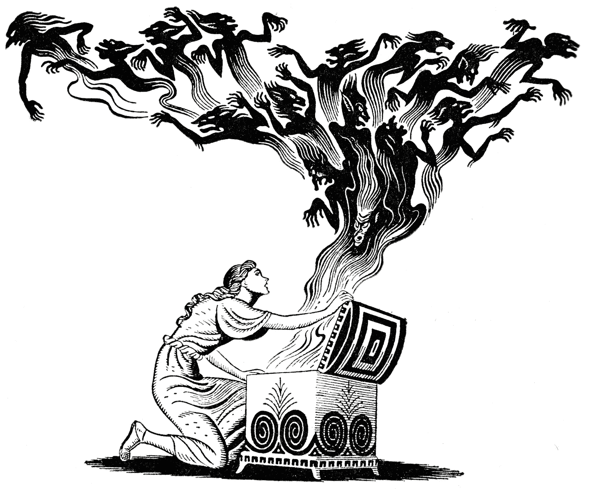
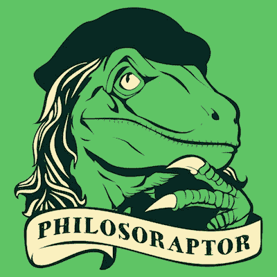

# 深度学习、人工智能和黑盒子

> 原文：<https://itnext.io/deep-learning-ai-the-blackbox-5ed48c3b12b4?source=collection_archive---------2----------------------->

深度学习会是下一个潘多拉魔盒吗？

上周，我给产品人员做了一个关于人工智能的报告:PO，PMO 和其他人。我回忆起我的极客日是如何使用 Alexa、Slack 机器人、x.ai、智能照明的。我们看到的许多智能、认知和自动化的东西都是简单的工作流，它们本身没有人工智能、*、*(*是另一篇文章*的讨论)。在一次精彩的对话中，我试图传递我的信息，阐明一些概念，并展示机器学习算法可以用于许多产品中——因此，**你可以在你的应用程序、软件、API、网站、……***语音识别、推荐系统、图像标记、自然语言处理、搜索优化、聚类*以及你的产品可以对其做出反应的许多其他功能中拥有人工智能，提供个性化的体验。

讲述人工智能的历史，50 年代和 60 年代的过度销售，人工智能的冬天和最近的繁荣，我试图让每个人都小心过度销售它的能力。实现机器学习算法和在产品后端拥有人工智能为你提供了巨大的自由度。然而，要实现这一点，我们现在有两点需要努力:

*   **为你的问题标记数据** —最先进的深度学习算法需要大量标记数据。如果你用的是 ImageNet，可以算出来。然而，也许你的问题是独一无二的，你要给自己贴标签。这非常昂贵、麻烦且耗费大量时间。因此，下一步将是使用更少标签数据和动态学习的算法— *是的，主动学习和其他人在回路中的功能将会增长*。
*   **UX 成熟度**——我们知道如何构建有吸引力的 GUI 和应用程序。我们已经做了很长时间了。然而，如何对聊天机器人做出反应，与 Alexa 交谈，以及许多其他关于人工智能交互的 UX 概念才刚刚开始。当我们看到 VUI(语音用户界面)和 TUI(文本用户界面)走向成熟时，这将需要大量的时间和研究。

## 黑盒

在我的演讲之后，还有一个来自[托马索·格里提](https://www.linkedin.com/in/tommasogritti/) ( [大脑创造者](https://www.braincreators.com))和[多马戈伊菲祖利奇](https://www.linkedin.com/in/domagoj-fizulic-aba98027/) ( [九连](http://www.nineconnections.com))的演讲。他们讨论了图像识别和 NLP 中的深度学习，展示了重要的用例。引发我写这篇文章的是受众对黑箱和问责缺口的关注。

嗯…人们喜欢深度学习，但他们希望能够解释为什么它会做某事…

阿滕迪夫妇对可能性和结果感到惊讶，但同时，他们也有点慌乱。如果你不知道深度学习模式为什么会朝着那个方向发展，你怎么能说服你的董事会、老板、首席执行官或妻子(*谁负责*)使用它呢？*为什么深度学习模型看到这个图像是狗就认为是猫？它能告诉我得出结论的所有步骤吗？**还没有…** 同一天看到这篇[科技评论文章](https://www.technologyreview.com/s/604087/the-dark-secret-at-the-heart-of-ai/)讲的是同样的问题。*

## 为什么围绕黑盒的紧迫性？

建立一个行为良好、可扩展并能预测/标记其预期结果的深度学习模型是一项艰巨的任务。那么，如果**它实现了目标，让广大用户开心了，那理解为什么还有什么意义呢？**

如果有效，我不需要知道为什么，对吗？；P

蒂亚戈，让我们来看看我吧。今天，有统计研究和基因检查可以告诉我是否有患前列腺癌的遗传倾向。如果我做这样的检查，结果显示我有这种基因，医生建议我切除前列腺作为预防措施…哇！我会花几天时间怀疑，听取别人的意见，甚至试图理解背后的原因，直到我做出决定。

现在想象一个不同的场景。我进行血液测试和组织检查，并将结果交给深度学习算法。它可以相当准确地预测我有患前列腺癌的倾向，但它不能说为什么(它不能用语言或理由)它假设它。我没有基因的解释，只有一个已经被证明准确的算法。对我来说，做一个决定，动手术摘除一个器官是很棘手的。为什么？因为我不能理解它的想法。

天网想取走我的前列腺？是啊，没错…

人类每天学习**推理&上下文**来做决定。我们根据环境改变我们的决定，并试图优化我们的生活——更快乐，赚更多的钱，更健康，更长寿，或任何驱使你的东西。这可能很难，但是你可以试着找出你每天做每一件事的原因。对于重要的决策来说，无法用语言表达“是什么”和“为什么”是一个非常可怕的命题。

## GDPR，美元和战争

在欧盟与数据工程和人工智能合作让我坐在了前沿技术的前排。它还为我提供了一个伦理视角，从明年开始，我们都将面临通用数据保护条例(GDPR)。公司关心的主要问题之一是**欧盟可能要求任何企业能够解释其算法之一做出的决定**。定义抵押贷款、信贷、投资或任何其他金融工具的限额、批准和拒绝的算法可能受此限制。那是什么意思？**现在没有金融工具深度学习！**

围绕人工智能和深度学习的另一场激烈辩论是如何将其用于战争。创造狭义的人工智能来战斗、射击并成为军队中的活跃成员是书籍、电影和人类思维中反复出现的想法。然而，请记住私人法庭、问责制和战争法庭的存在。一个战争参与者可能会被国际法庭审判(*你好，海牙现在就在我旁边！*)或被其军队查账或解释期间。如果你不能问一个士兵机器人为什么要引爆那个炸死三个平民的炸弹(它可能救了 2000 人)，它的推理和决策流程……我想你可能有问题。或者，至少你必须改变你如何起诉和审判这些战争罪行或调查。

## 未来

我相信我们将克服深度学习算法中的这种不可解释性问题。你已经可以看到，用于图像识别的卷积神经网络显示了用于边缘、纹理和定义对象的特征集的隐藏层(*它假设这张图片上有一只猫，因为它有一个毛皮纹理和猫脸的形状，例如*)。

然而，随着深度学习技术的指数增长及其与 GDPR 的后续冲突，我们需要抓紧时间。否则，受监管的市场将无法从如此惊人的技术成就中获益。

你有什么经验可以分享，有什么想法可以尝试，或者你就是不同意？留下你的评论，用心这篇文章，分享，让我们来搅拌这个讨论。

*这是根据演示稿“* [*AI 作为一个产品——产品人，全体万岁 Bender！*](https://www.slideshare.net/ThiagoFaria12/ai-as-a-product) *”在*[*product tank Meetup*](https://www.meetup.com/ProductTank-AMS/events/238795297/)*上主持*[*Mollie*](https://www.mollie.com/nl/)*。*

*原载于*[*www . linkit . nl*](https://www.linkit.nl/eng/knowledge-base/279/Deep_learning_AI_the_Blackbox)*。*