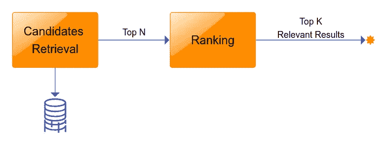
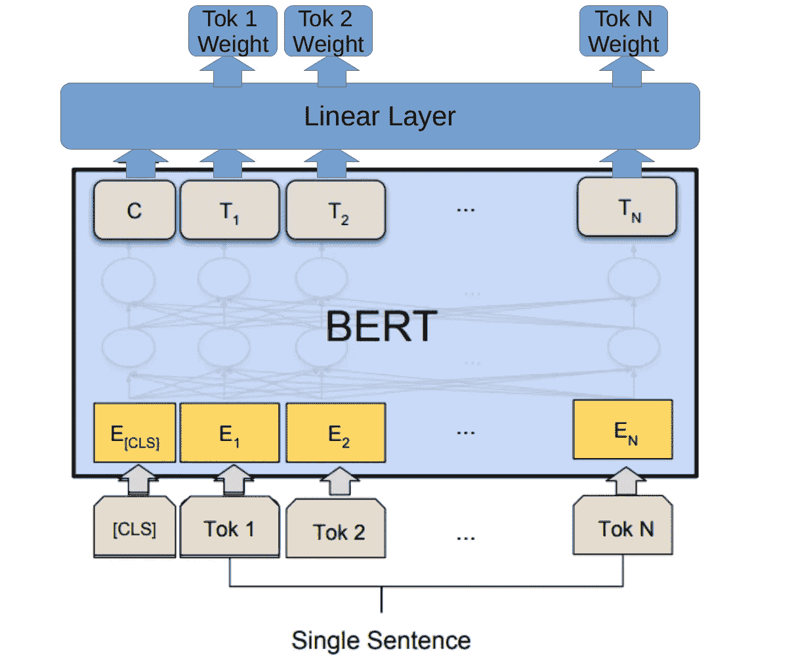
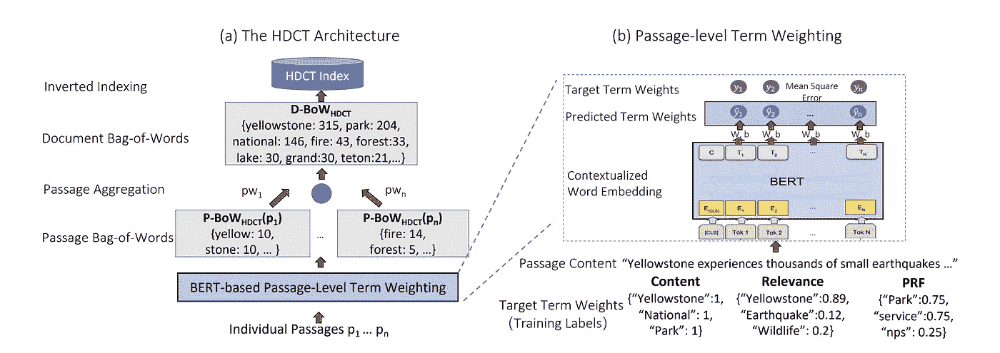
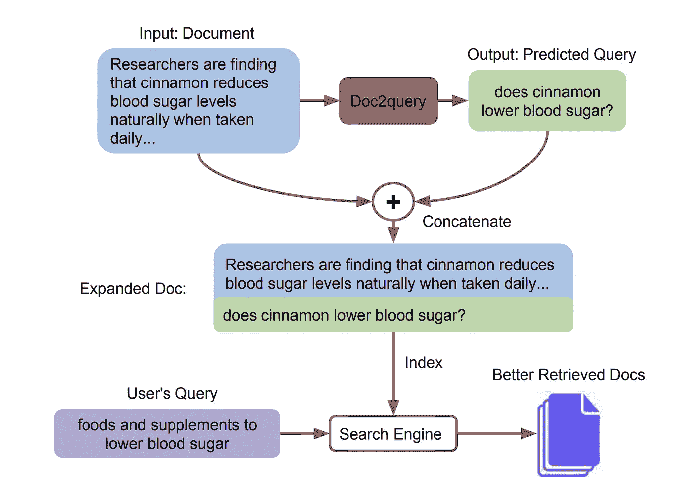
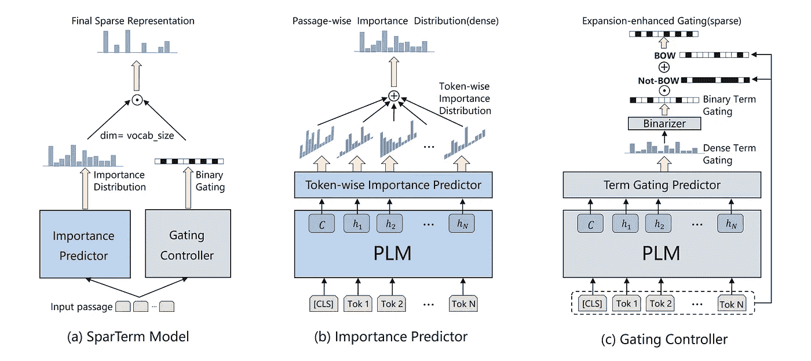

# 信息检索中的深度学习。第一部分:介绍和稀疏检索

> 原文：<https://itnext.io/deep-learning-in-information-retrieval-part-i-introduction-and-sparse-retrieval-12de0423a0b9?source=collection_archive---------1----------------------->


**信息检索(IR)** 是计算机科学的一个重要研究领域。这不仅仅是建立像谷歌或必应这样的大型 T2 搜索引擎。当我们使用网上商店搜索、聊天机器人或接收带有推荐在线课程的自动电子邮件时，我们可能会面对 IR 系统。信息检索是业界的一个热门领域。大型在线市场、流媒体服务、社交媒体、求职服务和许多其他公司都建立了自己的信息检索系统。搜索或推荐结果的相关性对这些领域的业务绩效有着至关重要的影响。提高百分之几的搜索质量可以带来数百万美元的利润增长。一些公司甚至创建了自己的研发部门，专门研究信息检索方面的问题。现代信息检索中仍有许多问题没有解决。研究人员致力于定义和解决这类问题。例如，[TREC-科维德信息检索挑战赛](https://www.kaggle.com/c/trec-covid-information-retrieval)于 2020 年举行。参与者竞相建立一个疫情文档搜索系统，该系统有助于为生物医学研究人员、临床医生和政策制定者确定一些重要问题的答案。2022 年更一般的 [TREC 2022 年公平排名赛道](https://fair-trec.github.io/index)，与其他挑战一起举行。这个挑战集中在公平地优先编辑维基媒体的文章，以提供来自不同群体的文章的公平曝光。
构建信息检索系统的一个有前途的领域是医学研究。绝大多数临床试验未能达到他们招募患者的目标。有效的患者试验招募是医学研究的主要障碍。这个问题的一个重要解决方案是建立一个信息检索系统，该系统将利用已经以电子健康记录形式存在的大量患者数据(EHR)。在 [2022 临床试验跟踪](https://www.trec-cds.org/2022.html.)中，参与者被要求建立一种从[ClinicalTrials.gov](http://ClinicalTrials.gov)中检索临床试验的方法，这是临床试验所需的注册。

国际关系领域的研究历史相对较长。[文本检索会议](https://trec.nist.gov/) (TREC)成立于 1992 年。但深度学习的最新进展极大地改变了这一领域。这是“信息检索中的深度学习”系列的第一篇文章。在这一系列文章中，我们将看看最近的深度学习方法是如何应用于现代信息检索系统的。我们将主要关注文本信息检索。图像、声音和其他对象的相似性搜索以及多模态信息检索也是重要且值得注意的研究领域。但是我们不会在本系列中深入探讨这些主题。在本文中，我们从文本信息检索的问题定义、解决信息检索的一般框架、信息检索中的经典算法以及使用深度学习来提高经典信息检索算法的性能的方法开始。

## **红外系统简介**

什么是**信息检索(IR)** ？将信息检索定义为排序问题是合理的。我们有一个**查询**(也称为**上下文**)，它是信息需求的正式陈述。例如，查询可以是搜索字符串、聊天中的问题、我们需要向其显示推荐的用户数据等。我们有一组**候选者**，它们是可用于检索特定**查询**的数据实体。例如，候选可以是段落、文档、图像、视频、音频文件或其他实体。在这一系列文章中，我将重点讨论文本数据。在信息检索中，查询并不识别候选集合中的唯一对象。相反，几个候选可能以不同的**相关度**匹配查询。一些查询可以有强匹配。另一个只能匹配相关性相对较低但仍与特定查询相关的弱结果。这就是为什么大多数 IR 系统**通过某种相关性分数对结果进行排名**并返回排名靠前的结果列表的原因。因此，信息检索可以定义为通过与特定查询的相关性对数据实体集合进行排序的问题。这是一个非正式的定义，有助于更好地理解 IR 问题。

有不同的指标来衡量一些信息检索算法或系统在任务排序方面的表现。最重要的指标之一是召回@N 和 MRR。 **Recall** 是检索到的相关结果的分数。 **Recall@N** 表示在第一个 ***N*** 排名靠前的结果中检索到的相关结果的分数。查询的排序结果列表的倒数排名**是第一个正确结果的排名的乘法倒数。M **ean 倒数排名**是查询数据集的结果倒数排名的平均值:**


其中 ***Q*** 是查询的样本，而***rankᵢ****是第*个*相关候选项在第*个*个查询中的排名位置。*

*在科学界，有不同的公共基准可以用来衡量 IR 系统的质量。其中最大的和最受欢迎的开放域 IR 是 MS MARCO 数据集。该数据集由 1，010，916 个匿名问题组成，这些问题从 Bing 的搜索查询日志中取样，每个问题都有人工生成的答案和 182，669 个完全由人工重写生成的答案。此外，该数据集包含从 Bing 检索的 3，563，535 个 web 文档中提取的 8，841，823 个段落，这些段落提供了管理自然语言答案所必需的信息。MARCO 女士的作者提出的任务之一是对给定问题的一组检索到的段落进行排序。该任务是大规模开放域信息检索系统的一个很好的基准。因此，该数据集经常在科学论文中用于测试现代信息检索中的新模型和方法。还有 TREC 复杂答案检索(TREC 汽车)数据集。它更小，基于所有维基百科页面的大约 700 万个段落。在科学论文中，TREC CAR 数据集也经常被用作现代 IR 方法的基准。此外，还有一些其他更小和更老的公共信息检索数据集、不同信息检索问题的基准、不同语言的数据集等。您可以查看 [ir_datasets](https://github.com/allenai/ir_datasets/) repo 和 Python 库，该库为许多 ir 排名数据集提供了一个公共接口。*

**

*典型红外系统管道*

*如何构建一个信息检索系统？一种直接的方法是设计一种算法或模型，其对要查询的候选项的相关性进行评分，并建立一种系统，其计算所有候选项的分数并返回排序的结果列表。然而，为每个查询排列整个候选集是不切实际的。这就是为什么大多数信息检索系统通常使用至少两级管道的原因(见上图)。第一阶段通常被称为**候选人检索**阶段。第二阶段和随后的阶段被称为**排名**或**重新排名**阶段。在候选项检索阶段，使用一些快速但不是非常精确的算法来检索可能包含相关结果的候选项的合理子集。然后在排序阶段，使用更复杂的算法和机器学习模型对检索到的子集进行排序，并为最终用户获得最相关的结果。在本文的后续部分，我们将深入 IR pipeline 的候选人检索阶段，了解它是如何工作的，以及如何应用现代深度学习方法来改善这一阶段的结果。*

## *经典算法(稀疏检索)*

*经典信息检索系统的核心组件之一是一个倒排索引数据结构。**倒排索引**是存储内容映射的索引，如术语、单词、数字等。到它在数据实体(文档、段落等)集合中的位置。)倒排索引的目的是以当新的数据实体被添加到系统中时增加的处理时间为代价来实现快速搜索。索引设计融合了语言学、认知心理学、数学、信息学和计算机科学的跨学科概念。*

*用于构建倒排索引的最简单的文本表示方法之一是**词袋(BoW)** 模型。在 BoW 模型中，数据实体文本
被表示为其单词(**术语**或**标记**)的包([多重集](https://en.wikipedia.org/wiki/Multiset))，而不考虑语法和词序。让我们看看下面的例子。这里有两个简单的文本:*

> *这篇文章是关于信息检索的。*
> 
> *信息检索是获取与信息需求相关的信息资源的过程。*

*基于这两个文本，为每个文本构建术语列表如下:*

```
*"this", "article", "is", "about", "information", "retrieval"*
```

```
*"information", "retrieval", "is", "the", "process", "of", "obtaining", "information", "resources", "that", "are", "relevant", "to", "an", "information", "need"*
```

*如果我们将两个文本数据集中使用的所有标记收集到单个**词汇表**中，并为词汇表中的每个标记分配一个顺序号，那么我们将能够使用每个包中特定标记的出现次数将每个单词包表示为一个向量。例如，让我们假设我们以如下方式定义词汇:*

```
 *0: "about",
 1: "an", 
 2: "are", 
 3: "article", 
 4: "is",
 5: "obtaining",
 6: "of",
 7: "need"
 8: "process",  
 9: "information",
10: "relevant",
11: "retrieval"
12: "resources",
13: "the", 
14: "this", 
15: "that", 
16: "to"*
```

*那么使用这两个文本的特定令牌包的出现次数可以表示为以下两个向量:*

```
*1: [1,0,0,1,1,0,0,0,0,1,0,1,0,0,1,0,0],
2: [0,1,1,0,1,1,1,1,1,3,1,1,1,1,0,1,1]*
```

*单词袋是一个简单的向量空间模型。它没有考虑到术语在特定文本的上下文中可能具有不同的重要性。例如，像“a”、“the”、“this”这样的常用词几乎总是出现频率很高，但携带的信息量很少。解决这个问题最简单的方法之一是使用 **tf-idf** 或 t **erm 频率-逆文档频率**模型。TF–IDF 计算为两个指标的乘积，**术语频率**和**逆文档频率**。一个数据实体被称为文档。**术语频率**是术语在文档中的相对频率，通常计算为术语在文档中出现的次数除以文档中的术语总数。**逆文档频率**与该术语提供的信息量相关，通常计算为文档总数除以包含该术语的文档数的分数的对数。词汇的计算逆文档频率集通常被称为 **IDF 表**。对于上述 IDF 表中使用以 10 为底的对数计算的两个文本数据集，如下所示:*

```
*"about": 0.30103,
"an": 0.30103, 
"are": 0.30103, 
"article": 0.30103, 
"is": 0,
"obtaining": 0.30103,
"of": 0.30103,
"need": 0.30103
"process": 0.30103,  
"information": 0,
"relevant": 0.30103,
"retrieval": 0,
"resources": 0.30103,
"the": 0.30103, 
"this": 0.30103, 
"that": 0.30103, 
"to": 0.30103*
```

*计算术语频率，然后计算每个术语的整个 tf-idf 度量，这两个文本可以表示为以下两个向量:*

```
*1: [0.05017,0.0    ,0.0    ,0.05017,0.0,0.0    ,0.0    ,0.0    ,0.0    ,0.0,0.0    ,0.0,0.0    ,0.0    ,0.05017,0.0    ,0.0    ],
2: [0.0    ,0.01881,0.01881,0.0    ,0.0,0.01881,0.01881,0.01881,0.01881,0.0,0.01881,0.0,0.01881,0.01881,0.0    ,0.01881,0.01881]*
```

*Tf-ids 和词袋都是简单的向量空间模型。在真实情况下(有几十万个术语的庞大词汇表)，它们都产生非零元素数量相对较少的向量。这样的向量被称为**稀疏向量**。使用稀疏向量的信息检索方法通常被称为**稀疏检索**。*

*最著名的稀疏检索经典算法之一是 Okapi BM25。 **Okapi** BM25 函数的一个流行变体如下:*

**

*其中 ***D*** 是文档*，* ***Q*** 是包含术语 ***q₁,…,qₙ*** ， ***k₁*** 和 ***b*** 是特殊常量， ***avgdl*** 是文档中术语的平均数量， **| ****【f(qᵢ,d】)***是术语*在文档***【d】***，***【idf(qᵢ)***中出现的次数，是逆文档频率的变化，通常计算如下:*****

**

*其中***【n(qᵢ】***为包含***qᵢ******n***为文档总数。*

*在本文中，我们将深入 BM25 算法背后的所有理论。请注意，尽管它是在 20 世纪 80 年代实现的，但它仍然在许多信息检索系统中使用。用于稀疏检索的旧的经典算法相对于最近的基于机器学习的方法具有一些优势:*

*   *索引和检索速度。在索引阶段(计算向量)和大多数情况下在检索阶段，经典算法比现代基于 DL 的方法快得多。*
*   *可解释性。稀疏向量的意义显而易见。我们可以很容易地检查为什么针对特定的查询检索到特定的实体，以及哪些术语具有最大的影响。甚至可以通过简单地删除或更新特定的术语或添加自定义规则来计算术语权重，从而影响结果。*

*因此，在现代的信息检索系统中，仍然使用经典的稀疏检索方法。了解它们是如何工作的是很有用的。现代深度学习方法甚至可以用来改进稀疏检索。让我们在下一节看看它是如何工作的。*

## *稀疏检索中的深度学习*

*基于 Transformer 架构变体的深度学习语言模型在跨不同领域的绝大多数 NLP 任务中取得了最先进的结果。第一个也是最受欢迎的语言模型之一是 BERT(来自变形金刚的双向编码器表示)，由 Google 的 Jacob Devlin 和他的同事在 2018 年开发并发布[ [3](#0e9b) ]。如果你不熟悉 Transformer 架构或 BERT，那么我推荐[这篇](https://jalammar.github.io/illustrated-bert/)文章。目前，这种模型有很多更强大的变体:RoBERTa、XLNet 等。但是如何将语言模型应用于信息检索，尤其是稀疏检索算法呢？*

*首先，让我们来看看一种叫做 **DeepCT** 的方法。正如我们在上面看到的，术语频率是一种在查询或文档中识别术语重要性的常用方法。但是它是一个弱信号，尤其是当频率分布是平坦的时候，例如在长查询或文本是句子/段落长度的短文档中。让我们来看看原始论文中的以下示例:*

**

*两段文字两次提到了“胃”。但是只有第一段是关于‘胃’这个话题的。DeepCT 论文提出了一个**深度上下文化术语权重**框架，该框架学习将 BERT 的上下文化文本表示映射到文本的上下文感知术语权重。当应用于段落时，DeepCT-Index 产生可以存储在普通倒排索引中用于检索的术语权重。当应用于查询文本时，DeepCT-Query 生成一个加权的单词包查询。典型的第一阶段检索算法可以直接使用这两种类型的术语权重[ [4](#df0e) ]。*

*DeepCT 包括两个主要组件:通过 BERT 生成上下文化的单词嵌入，以及通过线性回归为每个单词预测术语权重。语境化单词嵌入是一个特征向量，它表征了单词在给定语境中的句法和语义角色。DeepCT 将这些特征线性组合成一个单词重要性分数。给定文本中每个单词的基本真实项权重，DeepCT 旨在最小化均方误差。从 BERT 到回归层的 DeepCT 模型是端到端优化的。用预训练的 BERT 模型初始化 BERT 分量，以减少过拟合。它被微调以将上下文化的单词嵌入与术语预测任务对齐。最后一个回归层是从零开始学习的。*

**

*预测术语权重架构*

*使用 MSMARCO 和 TREC-卡尔数据集对 DeepCT 进行了基准测试。在 DeepCT-Index 上的 BM25 检索可以比经典的基于 tf 的索引精确 25%,并且比一些广泛使用的多级检索系统更精确。DeepCT 方法的变体也称为**W-索引检索**。*

*类似的方法可以用于长文档检索。例如，在名为 **HDCT** ( **上下文感知分层文档术语加权框架**)的工作中，提出了一种用于文档索引和检索的框架 [5](#1eee) 。HDCT 首先评估一个术语在每篇文章中的语义重要性。这些细粒度的术语权重然后被聚合到文档级的词袋表示中，该词袋表示可以存储到标准的倒排索引中，以便使用 BM25 等经典的稀疏方法进行高效检索。HDCT 建筑来自原始文件:*

**

*HDCT 建筑*

*像在 DeepCT 方法中一样，HDCT 被训练来预测文章中每个标记的重要性权重。但主要的区别是，HDCT 的作者提出了两种弱监督方法来训练 HDCT，而不是手动标记每篇文章中每个术语的重要性。第一种方法使用文档的元数据字段(例如标题、关键字和摘要)来基于包含来自文档的标记的字段实例的百分比生成弱标签。第二种方法使用查询和相关文档的数据集，基于从文档中提及术语的相关查询的百分比来生成弱标签。*

*在 4 个文档检索数据集上对 HDCT 进行了评估:MS-MARCO 文档排序数据集、ClueWeb09-B、ClueWeb09-C 和 ClueWeb12-C。*

*当查询和相关文本不能直接通过术语匹配时，改进的术语加权没有帮助。例如，如果在查询中使用同义词，或者查询包含与某些文本间接相关的术语。对于这种情况，另一种称为**文档扩展**的方法开始发挥作用。**文档扩展**是一种通过相关术语或短语扩展文档来提高信息检索质量的方法。有许多方法来进行文档扩展，但是这里我们考虑一些基于深度学习的方法。*

*第一种方法称为 **Doc2Query** 。这是一种简单的方法，它预测将对给定文档发出哪些查询，然后使用普通的序列到序列神经网络扩展这些预测，该神经网络使用由查询和相关文档对组成的数据集进行训练[ [6](#f459) ]。原始论文中的下图说明了该方法的思想:*

**

*doc2 查询思想*

*使用 top-k 随机抽样，使用训练的 Doc2Query 模型来预测 10 个查询，然后将生成的查询附加到索引中的每个文档。然后使用 BM25 算法进行第一阶段检索。这个方法的下一个版本叫做 DocTTTTTQuery，以同样的方式训练，但是使用现代的基于 transformer 的 T5 模型[ [7](#a696) ]。*

*像 Doc2Query 这样的文档扩展方法可以与 W-index 检索结合使用。但是一些现代深度学习方法同时进行文档扩展和术语加权。让我们看一些例子。*

*称为 **SparTerm** 的框架直接学习全词汇空间中的稀疏文本表示。SparTerm 包括一个重要性预测器，用于预测词汇表中每个术语的重要性，以及一个门控控制器，用于控制术语激活。这两个模块共同确保最终文本表示的稀疏性和灵活性，将术语加权和扩展统一在同一框架内[ [8](#a696) ]。原始论文中的 SparTerm 架构模式:*

**

*SparTerm 架构*

*重要性预测器输出段落中所有术语的语义重要性。通过优化排序目标，端到端地训练重要性预测器。但与 DeepCT 不同的是，它不直接符合统计术语重要性标签，而是将重要性视为中间变量，可以通过远程监控信号学习，用于段落排序。*

*选通控制器生成二进制选通信号，激活该二进制选通信号的哪些项来表示该通道。它学习激活文章中出现的术语和一些与文章主题相关的其他术语。这就是 SparTerm 如何通过激活最初没有出现在文章中的附加术语来进行文档扩展。通道-查询/摘要平行语料库用于门控员的训练。因此，文档扩展的方法类似于 Doc2Query。但是不同之处在于直接学习段落的稀疏表示，并且联合训练扩展和术语加权模型。在 MSMARCO 段落检索数据集上，SparTerm 优于 DeepCT 方法。*

*更现代的方法称为 **SPLADE** ( **稀疏词法和扩展**模型)对 SparTerm 模型进行了轻微但必要的修改，从而显著提高了其性能[ [9](#e29b) ]。首先，它对术语权重引入了对数饱和效应，这防止了一些术语占优势，并且自然地确保了表示中的稀疏性。第二，它引入了在 BM25 取样的批次中使用硬底片的损失。批量否定采样策略被广泛用于训练图像检索模型，并且已经显示出在学习第一阶段排序器中是有效的。第三，将一些正则化技术应用于损失，以获得良好平衡的索引。这些变化允许显著改进 SparTerm 方法。在这个方法的下一个版本 **SPLADEv2** 中，引入了几个在有效性和效率方面的重大改进。更具体地说，修改了模型的池化机制，并引入了用蒸馏训练的模型[ [10](#8367) ]。*

*还有其他深度学习方法进行稀疏检索[ [11](#7a37) ]。将深度学习应用于稀疏检索的一般思想是寻找一种获得稀疏文本表示的方法，这种方法将更好地用于像 BM25 这样的经典稀疏检索算法。*

## *结论*

*在这一部分，我们考虑了信息检索系统的基本概念:倒排索引，词袋，TF-IDF，MRR 和 NDCG 度量，稀疏检索和 BM25 算法。然后，我们看看使用深度学习来提高稀疏检索性能的不同方法:W 索引检索、文档扩展模型和混合方法，如 SparTerm 或 SPLADE。稀疏检索方法有一些优点，如可解释性和有效实现的存在，但其他方法在某些情况下可以优于稀疏检索方法。在下一部分中，我们将看看可用于 IR 系统的第一阶段检索的替代方法。*

## ***参考文献***

1.  *[Tri Nguyen 等人，MARCO 女士:人类生成的机器阅读理解数据集，2016，arXiv:1611.09268v3](https://arxiv.org/abs/1611.09268)*
2.  *[费德里科·南尼，巴斯卡尔·米特拉，马特·马格努松，劳拉·迪茨，复杂答案检索基准，2017，arXiv:1705.04803](https://arxiv.org/abs/1705.04803)*
3.  *雅各布·德夫林、张明蔚、肯顿·李和克里斯蒂娜·图塔诺娃。BERT:用于语言理解的深度双向变压器预训练，2018，arXiv:1810.04805*
4.  *[戴，杰米卡兰，面向第一阶段检索的上下文感知句子/段落术语重要性估计，2019，arXiv:1910.10687v2](http://arxiv.org/abs/1910.10687)*
5.  *[用于特定搜索的上下文感知文档术语加权，WWW ' 20:2020 年网络会议论文集](https://dl.acm.org/doi/10.1145/3366423.3380258)。*
6.  *[Rodrigo Nogueira 等，通过查询预测进行文档扩展，2019，arXiv:1904.08375](https://arxiv.org/abs/1904.08375)*
7.  *罗德里戈·诺盖拉，和艾的认知。从 doc2query 到 doctttttquery，2019*
8.  *[柏杨等，SparTerm:学习基于术语的稀疏表示用于快速文本检索，2020，arXiv:2010.00768](https://arxiv.org/abs/2010.00768)*
9.  *[Thibault Formal、Benjamin Piwowarski 和 Stéphane Clinchant，SPLADE:第一阶段排名的稀疏词汇和扩展模型，载于第 44 届国际 ACM SIGIR 信息检索研究与发展会议论文集(SIGIR '21)。美国纽约州纽约市计算机械协会，邮编:2288–2292，2021，doi:10.1145/3404835.3463098](https://doi.org/10.1145/3404835.3463098)*
10.  *[Thibault Formal，Carlos Lassance，Benjamin Piwowarski，Stéphane Clinchant，SPLADE v2:信息检索的稀疏词法和扩展模型，2021，arXiv:2109.10086](https://arxiv.org/abs/2109.10086)*
11.  *[SpaDE:使用双文档编码器改进第一阶段检索的稀疏表示，CIKM’22:第 31 届 ACM 国际信息会议论文集&知识管理，2022，doi:10.1145/3517456](https://dl.acm.org/doi/10.1145/3511808.3557456)*