# 关于颤振的深度学习。入会仪式。

> 原文：<https://itnext.io/deep-learning-on-flutter-initiation-ac4723261c73?source=collection_archive---------0----------------------->

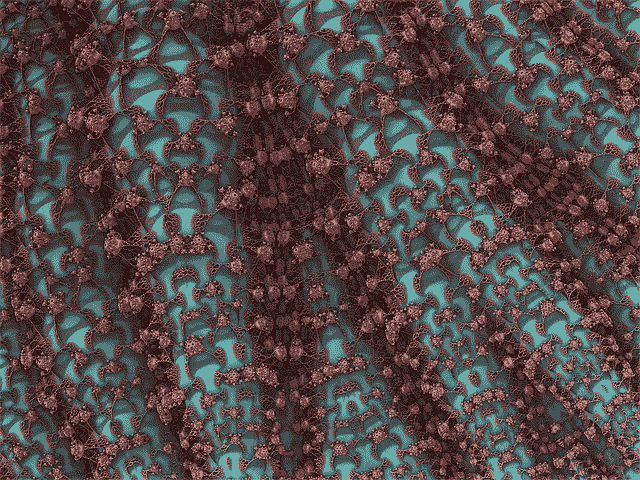

图片由来自[皮克斯拜](https://pixabay.com/?utm_source=link-attribution&utm_medium=referral&utm_campaign=image&utm_content=1487046)的[皮特·林福思](https://pixabay.com/users/thedigitalartist-202249/?utm_source=link-attribution&utm_medium=referral&utm_campaign=image&utm_content=1487046)拍摄

我决定开始一个关于颤振和机器学习(ML)的新系列文章。为什么这是个好主意？因为这是现代 IT 的两个热门话题。

如今，所有智能手机都配备了出色的 GPU，不仅能够运行视频游戏，还能直接在设备上执行 ML 计算。

你可以把这想象成你的智能手机接受了一个人造生物大脑。这听起来可能不太现实，但确实如此！你可以将训练好的神经网络部署到这样的人工大脑中，并将其连接到你的 Flutter app 上！

听起来够好了吧？那我们开始吧。

本文将主要介绍将一个[深度神经网络](https://en.wikipedia.org/wiki/Deep_learning#Deep_neural_networks) ( **DNN** )引入我们的 Flutter 应用程序的“机械”步骤。但是为了让您开始学习 ML，我将尝试用一些关于 ML 如何工作的非常高级的解释来修饰这篇文章。

# 应用

旅程结束时我们会得到什么？我们将开发 Android 应用程序“**干净还是凌乱**”。这是一个非常有用的应用程序，尤其是对于合租同一间公寓的人来说。对于什么是干净的，什么是脏乱的，我们通常有非常不同的感觉。例如，我是一个相当懒惰的人，我们和我的妻子就何时开始那些乏味的家庭清洁折磨进行了长时间的讨论。

但是有了这个新的应用程序，现在一切都清楚了。只需拍下正在讨论的房间的照片，并接受应用程序的结论:

*   干净。懒人赢了。享受你的自由时间！
*   脏乱。完美主义者赢了。折磨开始了。

正如你可能猜到的，我们的应用程序将使用 DNN 来分析你房间的照片，并将分为两类:**干净**或**脏乱**。

# 资料组

在任何 ML 项目中，你应该做的第一步是为你的 ML 模型找到数据集。否则，自己制作数据集可能是一项非常痛苦的任务。

什么是数据集？在我们的例子中，这是一个不同房间的照片大集合**用“干净”或“凌乱”标签标注**。

幸运的是，有一个地方可以找到现成的数据集。这是 Kaggle.com 的门户。

例如，这里是我们正在寻找:[https://www.kaggle.com/cdawn1/messy-vs-clean-room](https://www.kaggle.com/cdawn1/messy-vs-clean-room)

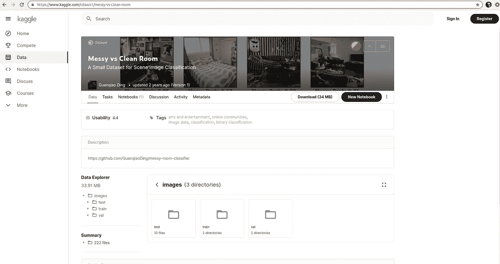

下载并解压到你电脑上的某个地方。

# 美国有线新闻网；卷积神经网络

在继续深入之前，一些读者会对这些 dnn 的高层次理解感到满意。如果你熟悉 CNN 的逻辑，可以跳过这个小部分。

作为 ANN(人工神经网络)的一部分，最简单的 DNN 可以直观地表示为多层感知器:

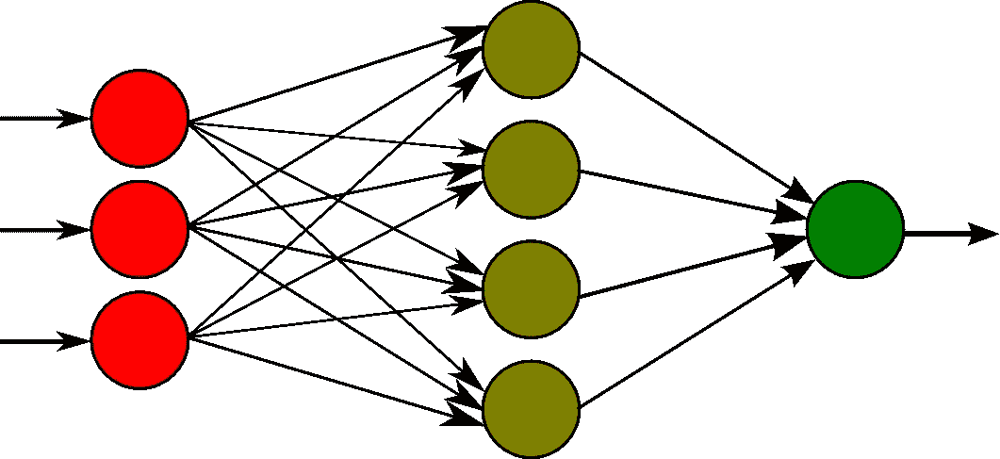

图片来源:By Sky99 —自己的作品，CC BY-SA 3.0，【https://commons.wikimedia.org/w/index.php?curid=19106639 

它模拟了生物大脑的一个非常简单的部分，能够进行一些分类。圆圈代表神经元，箭头代表轴突，轴突将神经元连接成网络。这可能是某种原始生物有机体的神经网络模型，比如[轮虫](https://en.wikipedia.org/wiki/Rotifer)，它们需要检测自己的嘴是应该张开还是闭合。想象红圈在轮虫的视觉皮层中扮演神经元的角色。它们通过轴突连接到绿色神经元的中间层，起到分类器的作用。如果轮虫“眼睛”前面的颗粒足够小，它将被归类为“食物”，最后一个神经元(在右侧)将启动打开轮虫的嘴。

在计算机对多层感知器的呈现中，我们将轴突(神经元之间的连接)存储为数字(在数组或矩阵中)，代表给定连接的功率，或其“**权重**”。**当我们执行分类**时，我们将输入值指定为另一个数字数组或矩阵，并对乘以给定层中每个神经元的入站轴突权重的输入进行求和。有一个**激活函数**分配给每个神经元。这个函数应该产生输出值，并传递给下一层(更深的)神经元。

**当我们执行这种 DNN 的训练**时，我们调整与每个轴突相关联的权重，以适合与训练**数据集**的最佳匹配。在数据集中，我们有不同种类的粒子**的各种输入，标记为**为“食物”和“非食物”。在我们输入了整个测试数据集之后，我们还可以**在另一个数据集(也有标签)上验证**这个模型，这个数据集叫做验证数据集。如果模型预测足够正确，我们可以说我们的模型已经为未知样本的分类做好了准备，或者，嗯，现实世界的工作。

对于更复杂的生物，比如我和你，我们有一个更复杂的视觉皮层和分类层，以一个大的层来表示分类结果。在与轮虫的区别中，人类的大脑配备了某种扩展版的 **CNN** (卷积神经网络)。

这是一张 CNN 的简化图片，用于对数字图像进行分类:

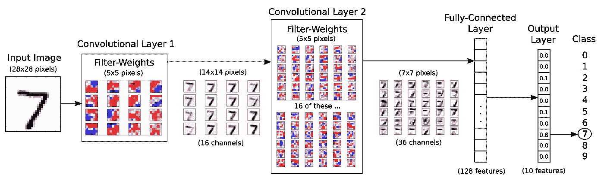

图片来源:【https://github.com/Hvass-Labs/TensorFlow-Tutorials 

CNN 有一个非常不同的识别图像的方法。第一层不是完全连接的神经元，而是模拟小过滤器在输入图像上的移动。这些过滤器被重新用于识别一些视觉模式(或图像**特征**)，如整个图像中的线条或线条交叉点。这种层有一个特殊的名字:卷积层。以下是如何将滤镜应用于图像以查找特征的直观说明:

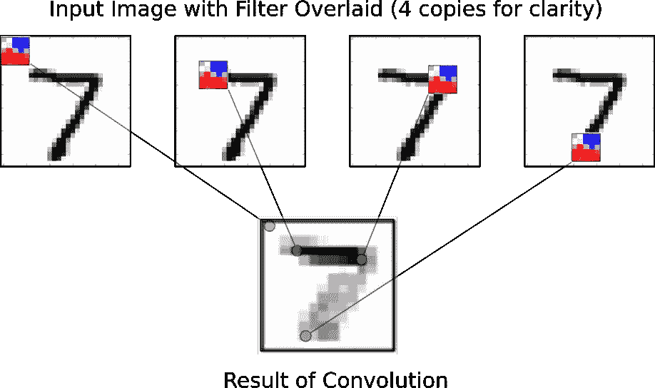

图片来源:[https://github.com/Hvass-Labs/TensorFlow-Tutorials](https://github.com/Hvass-Labs/TensorFlow-Tutorials)

更深的卷积层具有用于更复杂的图像特征的更复杂的过滤器，以及图像分辨率的降低。

CNN 的最终完全连接的神经元层类似于多层感知器，将图像分类到许多已知类别中的一个。

一般来说，CNN 的训练原理与简单的 ANN 相同:我们应该输入带标签的样本(在我们的例子中，是图像)。这种区域训练的输出是滤波器权重以及完全连接的神经元的权重的矩阵。

# 训练 ML 模型

前面的小部分听起来可能很复杂。幸运的是，CNN 的发现如此重要，以至于成千上万的研究人员和创业公司生产了许多现成的软件产品。所以你不应该自己开发 CNN 实现。

我们可以找到一个更快捷的解决方案:基于云的 CNN 实例。我们将使用[可示教机器门户网站](https://teachablemachine.withgoogle.com/)来训练我们的 CNN 并下载生成的模型。

在浏览器中打开[此链接](https://teachablemachine.withgoogle.com/)并点击“开始”:

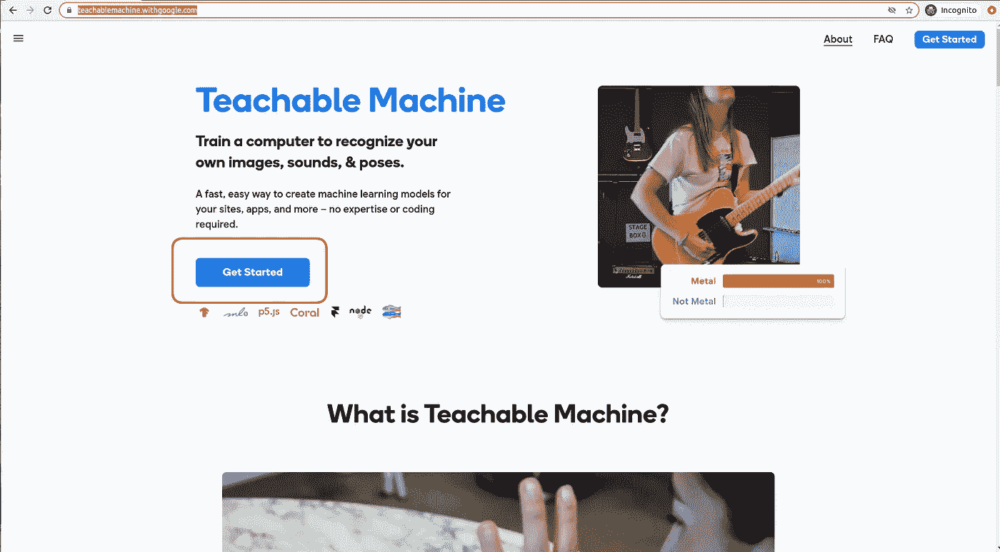

现在选择“形象工程”:

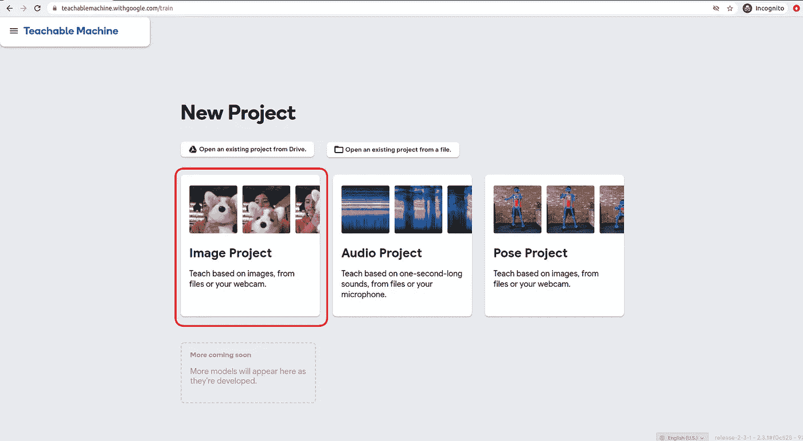

在这一步，我们应该输入你的分类名称。将“第 1 类”改为“干净”，将“第 2 类”改为“凌乱”。


现在让我们上传“干净”类的图像集。点击“上传”。应该会出现文件选择对话框。

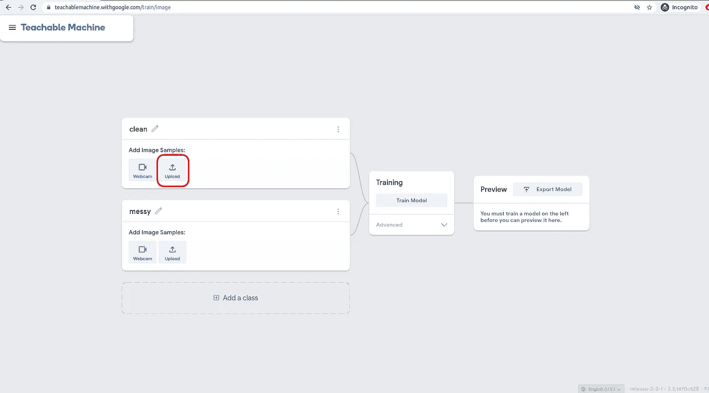

打开您提取数据集的文件夹。然后转到“图像/训练”。您会在这里找到两个文件夹:

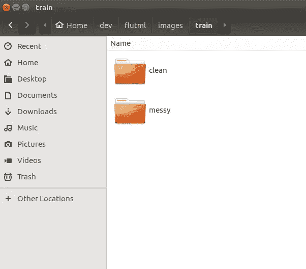

很自然地，打开“干净”文件夹，选择其中的所有图像。然后点击“打开”。

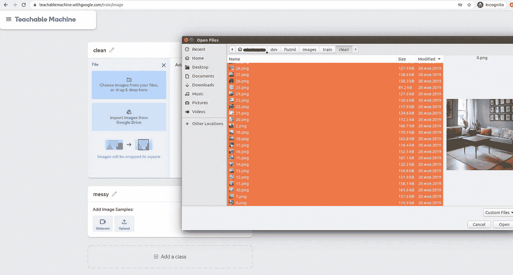

对“凌乱”类的数据集做同样的操作。现在点击“火车模型”按钮。您的 CNN 现在了解到:

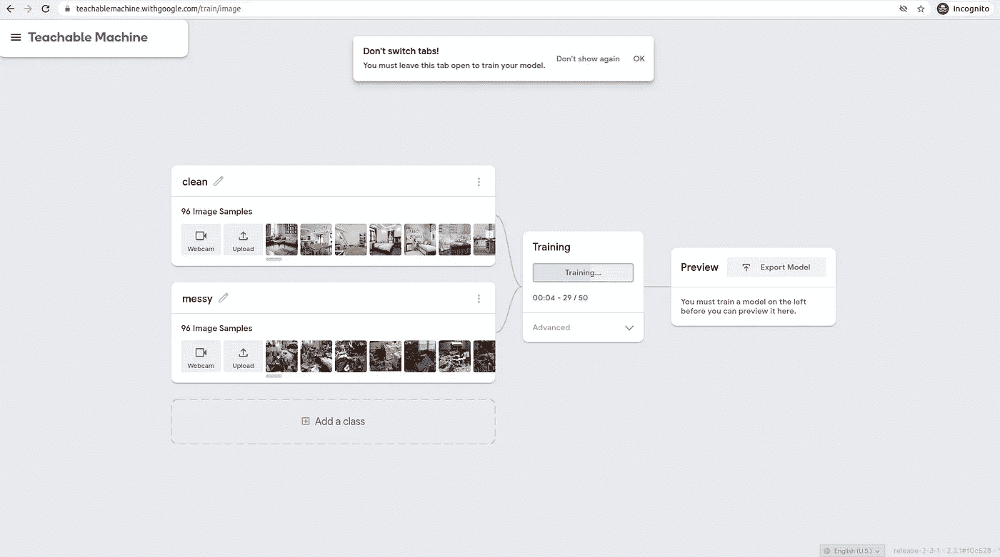

应该需要几分钟。训练后，您可以验证训练好的模型对其训练集之外的样本的识别能力。选择“文件”作为验证源，然后单击按钮“从您的文件中选择图像”:

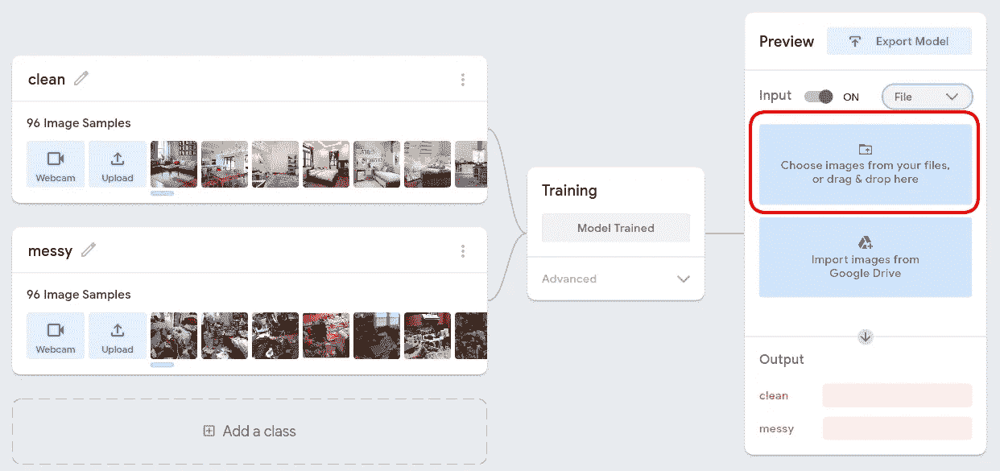

在文件选择对话框中，打开提取数据集的文件夹，然后转到“images/val”文件夹。然后挑选一些“干净”的图像。

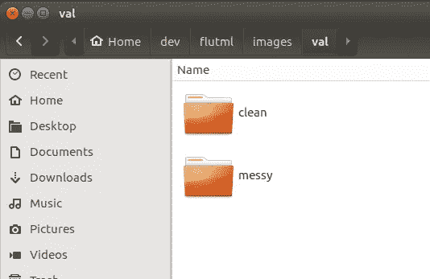

如你所见，你的 CNN 以 100%的准确率将其正确分类:


现在验证一些“杂乱”的图像:

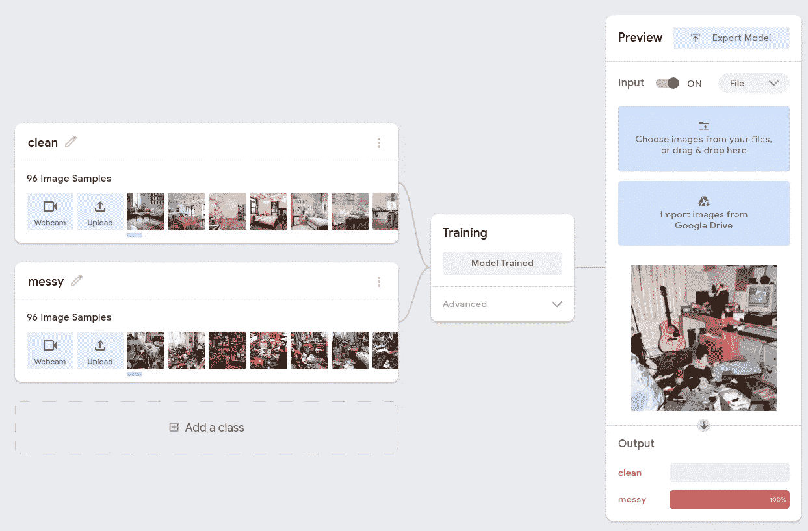

哇，这是一个令人印象深刻的结果！您可以选择验证更多图像。

现在是时候下载你训练好的模型了。您将实际下载一个特定于**的**格式的模型。对于 Flutter，我们必须选择“Tensorflow Lite”格式。使用默认的“模型转换类型”。点击“下载我的模型”:


这需要几分钟。最后，您将看到下载的 zip 存档，其中包含这两个文件:

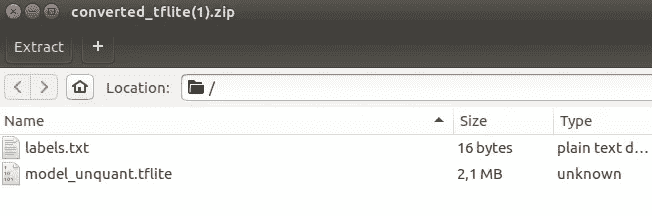

“labels.txt”包含了标签名“干净”和“脏乱”。“model _ un quant”—包含您的已训练模型的表示。

# 颤振:项目准备

我们将使用[FlutLab](https://flutlab.io/)—Flutter online IDE。[在浏览器中打开](https://flutlab.io/)。如果你已经注册了——转到你的个人资料，在“无状态 Hello World”的基础上创建一个新项目。如果您是 FlutLab 的新用户，请单击“开始使用”:

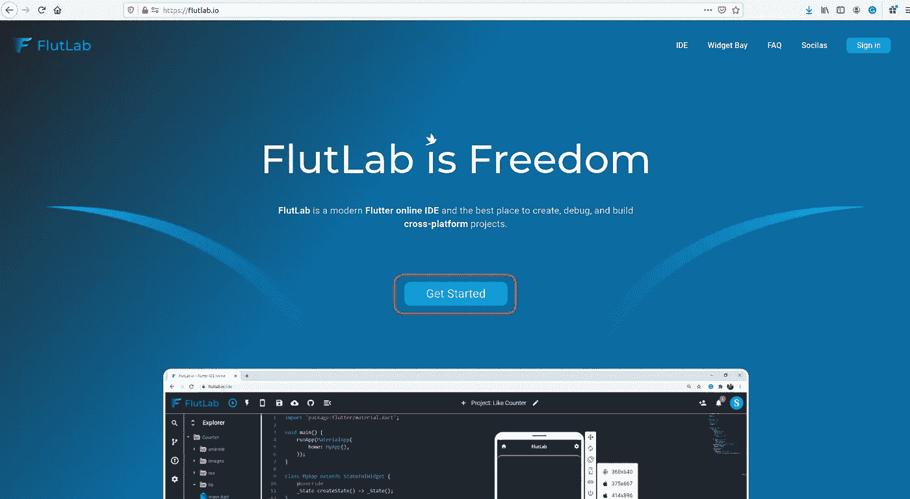

如果你是 FlutLab 的新成员，我们会考虑这个案例。你应该看到新创建的项目的文件树，在 Android、IOS 或 WEB 应用程序的中心打印“Hello World ”:

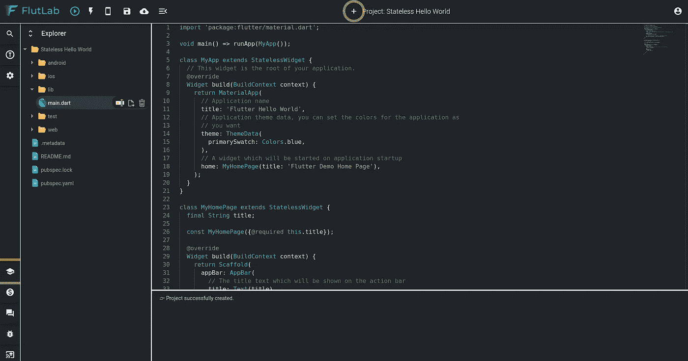

让我们做一些改变。最好先注册，因为这样的改动有一部分需要注册用户。点击屏幕右上角的登录图标:

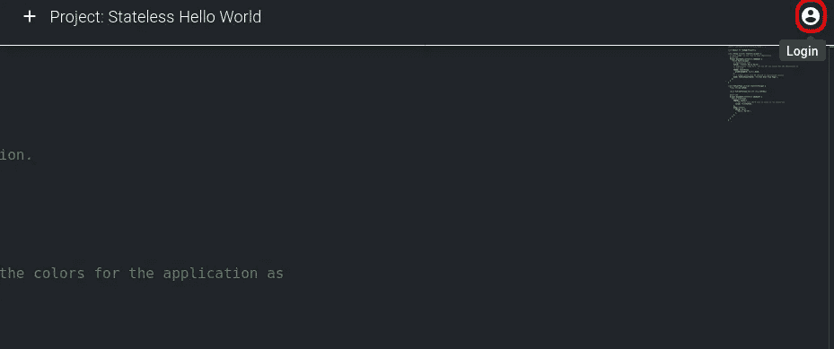

完成注册过程。因此，应该会出现一些附加控件。单击项目名称旁边的笔:

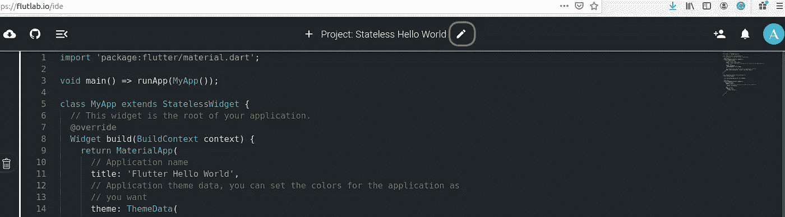

它允许您重命名项目。让它成为“mlpub1”。你可以选择任何其他适合你的名字。

现在我们来简化一下“main.dart”。它应该只是一个返回 MaterialApp 的 StatelessWidget，包装在 Home widget 周围:

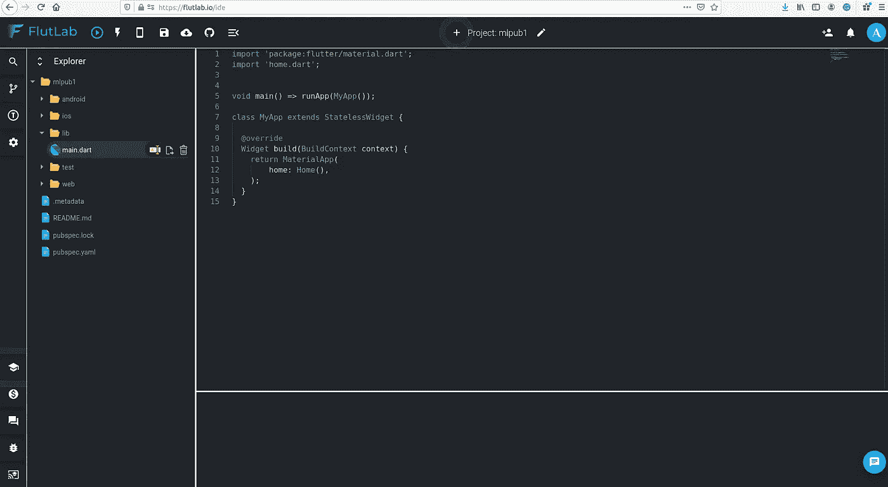

主页小部件暂时不存在。让我们创造它。单击“lib”文件夹级别上的“添加文件”图标:

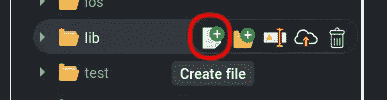

将“home.dart”作为新文件名。让我们用众所周知的 StatefullWidget 填充它的内容，现在用空容器返回 Scaffold。添加带有文本小部件的 AppBar。文本应该是“干净的或凌乱的”。现在让我们点击“热预览”按钮:

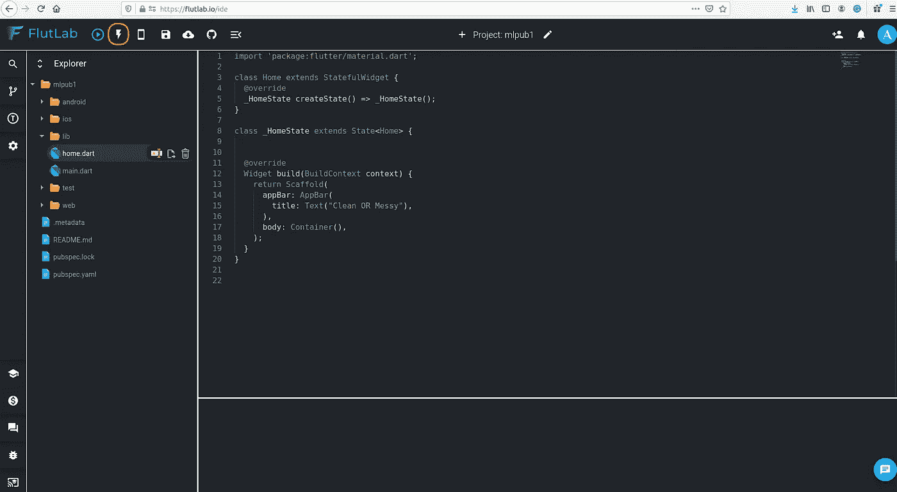

您应该会看到一个可用的空应用程序:


我们已经完成了颤振项目的准备工作。现在我们应该换个方式，将 Tensorflow Lite 的东西添加到我们的项目中。

# 颤振:添加 Tensorflow Lite

首先我们来编辑一下“pubspec.yaml”。

添加 2 个新的依赖项:

```
image_picker: ^0.6.7+4
tflite: ^1.1.1
```

image_picker 是一个用于从相机或图库收集图像的库。
tflite 是 Tensorflow Lite，具有在设备上托管深度神经网络的超强能力:

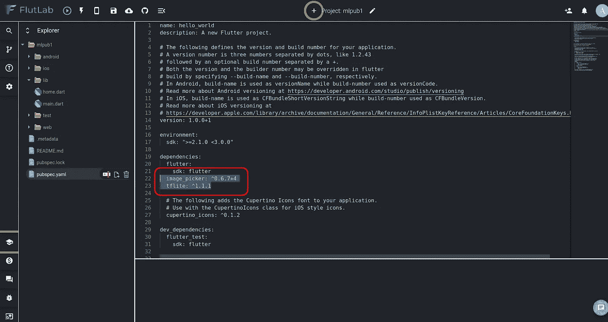

现在允许在资产文件夹中访问资产:

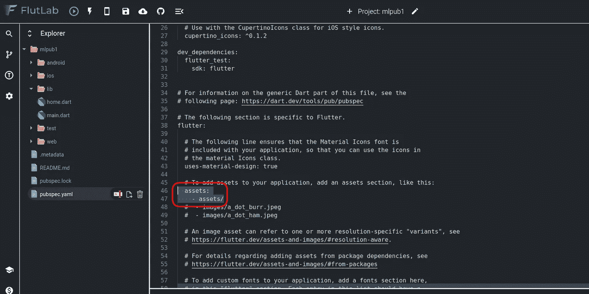

现在让我们添加**资产**文件夹本身:

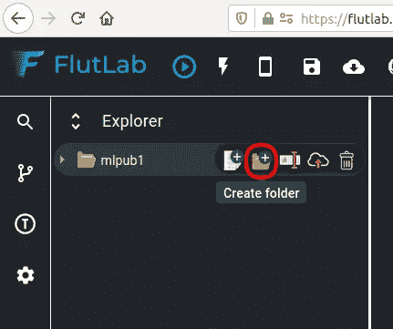

上传 3 个文件到新创建的**资产**文件夹:

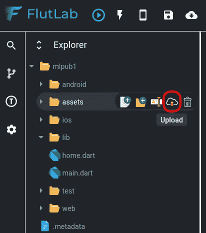

“labels.txt”和“model_unquant.tflite”正是我们在模型训练后从可教机器上下载的那两个文件。

“room . png”——是一个占位符图像，用于我们应用程序的 UI 中的任意房间。您可以从验证集或训练集中选择任何图像，并将其重命名为“room.png”:

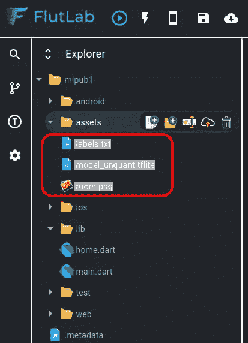

现在让我们打开“labels.txt”:

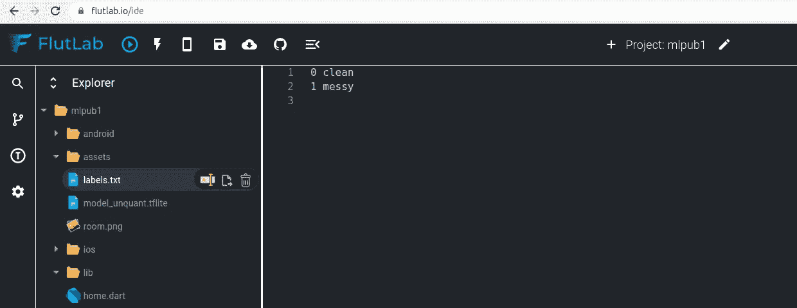

去掉前导数字——只有“干净”和“杂乱”的单词。

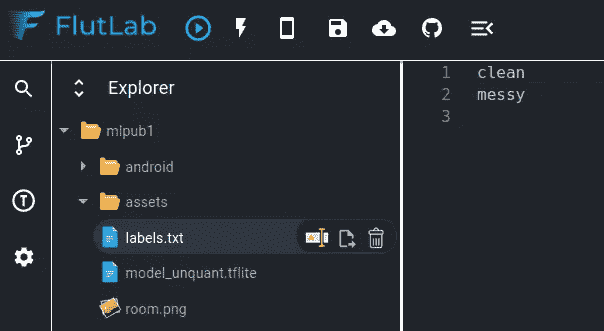

现在让我们添加一些肉来连接所有的东西。用这个新的实现替换类 **_HomeState** :

```
class _HomeState extends State<Home> { final picker = ImagePicker(); File _image; bool _loading = false; List _output; @override 
  void initState() { super.initState(); _loading = true; loadModel().then((value) {
      // TODO: add some interactivity
    }); } @override void dispose() { super.dispose(); Tflite.close(); } pickImage() async { var image = await picker.getImage(source: ImageSource.camera); if (image == null) return null; setState(() {
      _image = File(image.path);
    }); classifyImage(_image); } pickGalleryImage() async { var image = await picker.getImage(source: ImageSource.gallery); if (image == null) return null; setState(() {
      _image = File(image.path);
    }); classifyImage(_image); } classifyImage(File image) async { var output = await Tflite.runModelOnImage(
      path: image.path,
      numResults: 2,
      threshold: 0.5,
      imageMean: 127.5,
      imageStd: 127.5); setState(() {
      _loading = false;
      _output = output;
    }); } loadModel() async { await Tflite.loadModel(
      model: 'assets/model_unquant.tflite',
      labels: 'assets/labels.txt',
    ); } @override
  Widget build(BuildContext context) {
    return Scaffold(
      appBar: AppBar(
        title: Text("Clean OR Messy"),
      ), body: Container(
        padding: EdgeInsets.only(left: 10, right: 10),
        child: SingleChildScrollView(
          child: Column(
            mainAxisAlignment: MainAxisAlignment.start,
            crossAxisAlignment: CrossAxisAlignment.start,
            children: <Widget>[ // Buttons
              Column(
                mainAxisAlignment: MainAxisAlignment.start,
                crossAxisAlignment: CrossAxisAlignment.start,
                children: <Widget>[
                  _GroupText('Choose source:'),
                  ButtonBar(
                    alignment: MainAxisAlignment.center,
                    buttonMinWidth: 150,
                    layoutBehavior: ButtonBarLayoutBehavior.padded,
                    buttonPadding: EdgeInsets.symmetric(vertical: 10), children: <Widget>[
                      RaisedButton(
                        onPressed: pickImage,
                        child: Text('Cam'),
                      ), SizedBox(width: 20), RaisedButton(
                        onPressed: pickGalleryImage,
                        child: Text('Gallery'),
                      ), ], ) ], ), _SpaceLine(), // Image Center(
                child: _loading ? 
                  Container(
                    width: 300,
                    child: Column(
                      children: <Widget>[
                        SizedBox(height: 50),
                        Image.asset('assets/room.png'),
                      ],
                    ),
                  ) : Container(
                    child: Column(
                      children: <Widget>[
                        _output != null ? 
                          Container(
                            padding: EdgeInsets.symmetric(vertical: 10),
                            child: Text('${_output[0]['label']}',
                            style: TextStyle(
                              color: Colors.red, fontSize: 20.0)),
                            ) : Container(), SizedBox(height: 20,), Container(
                          height: 250,
                          child: Image.file(_image),
                        ),
                      ], )), ), ], ), ), ), ); }}
```

稍后我们将解释它的工作。

还要在“home.dart”中添加两个辅助类:

```
class _GroupText extends StatelessWidget {
  final String text;
  const _GroupText(this.text); @override
  Widget build(BuildContext context) {
    return Padding(
      padding: EdgeInsets.symmetric(vertical: 5, horizontal: 15),
      child: Text(
        text,
        style: TextStyle(fontSize: 25, fontWeight: FontWeight.w500),
      ),
    );
  }
}class _SpaceLine extends StatelessWidget { @override
    Widget build(BuildContext context) {
      return SizedBox(
        height: 5,
        child: Container(
        color: Colors.grey,
      ),
    );
  }
}
```

最后，“home.dart”的结构应该是这样的:

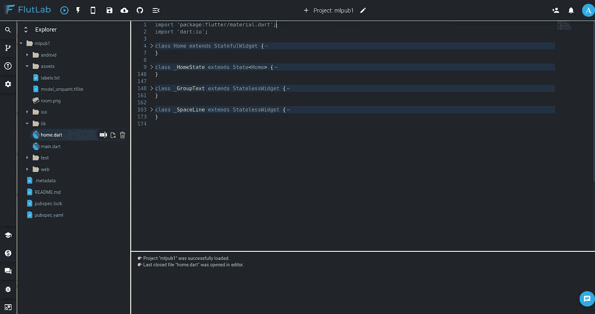

让我们向该文件添加 2 个新的导入行:

```
import 'package:image_picker/image_picker.dart';import 'package:tflite/tflite.dart';
```

一些最后的修改需要在“android/app/build.gradle”文件中完成。

将 **minSdkVersion** 设置为 **19** :

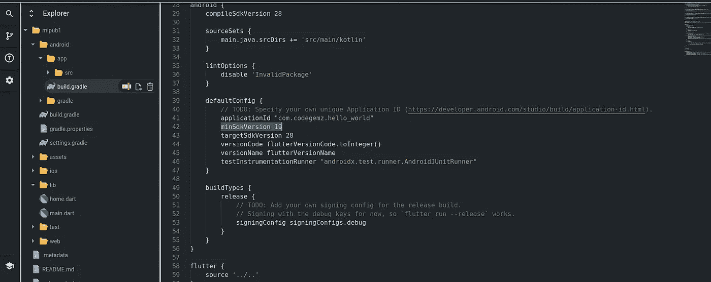

在“android”块中输入以下代码片段:

```
aaptOptions {
    noCompress 'tflite'
    noCompress 'lite'
}
```

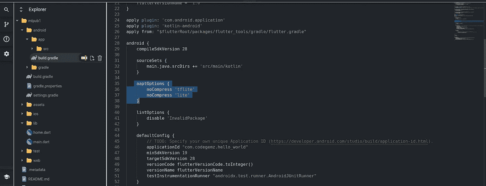

现在你可以在 Android 模拟器上运行这个程序了。

# 颤振:运行我们的应用程序

确保在“build”按钮附近的下拉列表中选择“Android-x86”(平台，适用于仿真器)。点击“构建”:

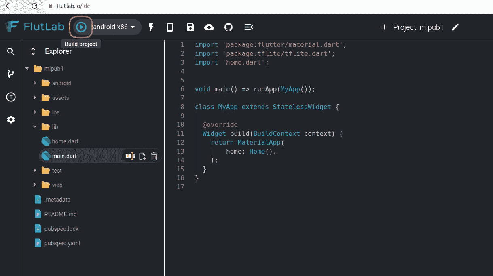

您将看到大约 1 分钟的构建动画:

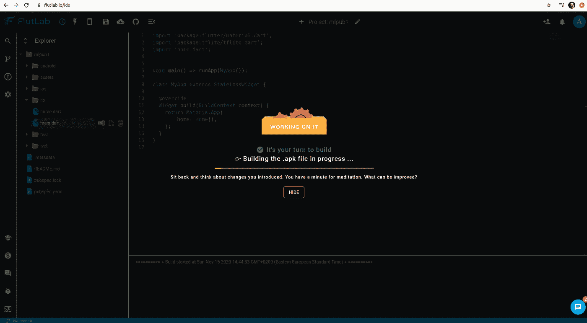

构建的结果应该是成功的。您可以在结果框中找到生成的应用程序的链接。点击“获取我的。apk”将应用程序下载到您的电脑:

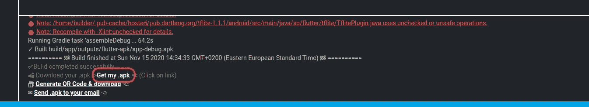

现在让我们在云 Android 模拟器上运行这个应用程序。打开[Appetize.io/upload](https://appetize.io/upload):

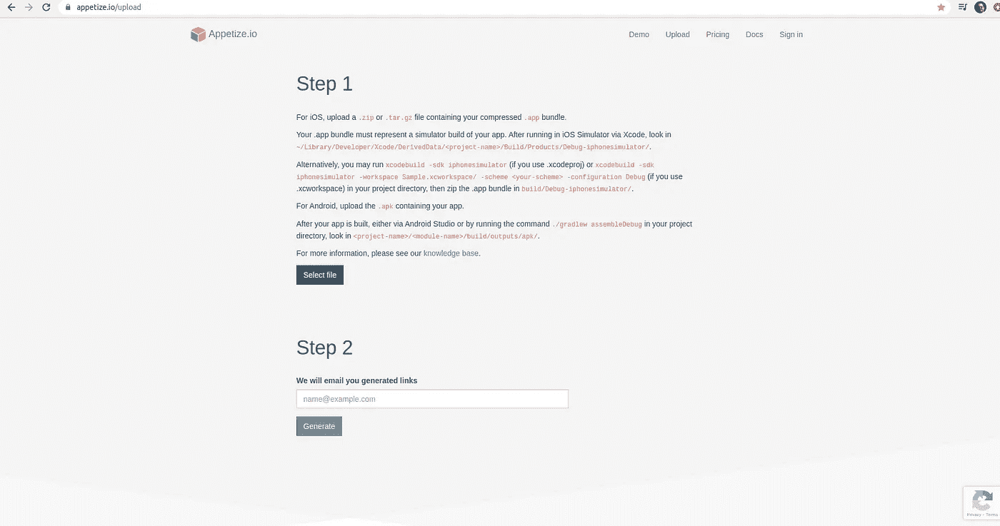

在步骤 1 中，打开下载的应用程序的**。apk** 文件。然后把你的电子邮件收到模拟器的链接。您应该很快就会在收件箱中找到该电子邮件:

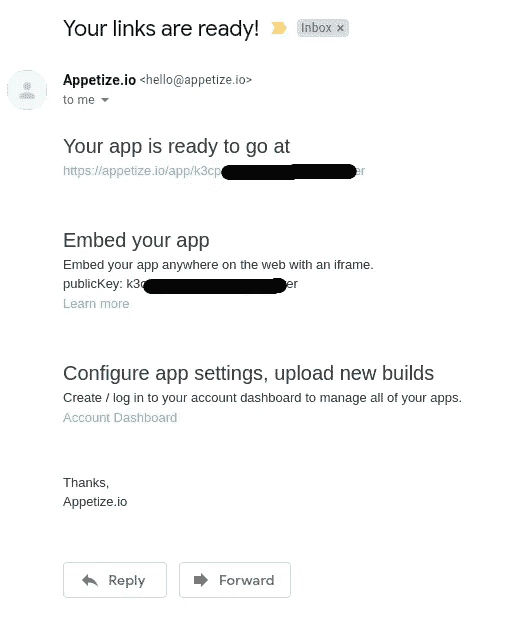

打开第一个链接。你应该可以在那里找到 Android 模拟器。点击它的屏幕，你会看到你的应用程序加载:

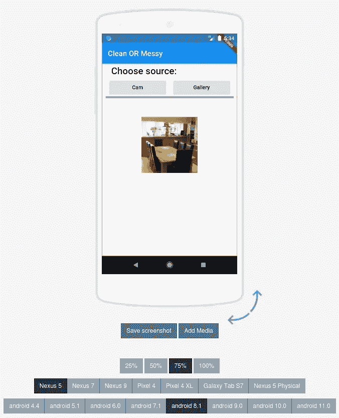

点击“图库”并接受打开照片的权限:

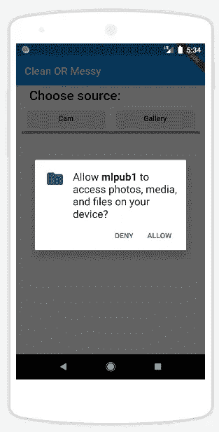

现在挑选一些干净客厅的照片。如果画廊是空的，你可以在设备上打开 Chrome 应用程序，搜索“干净的客厅”或“凌乱的客厅”，并下载一些找到的图片。

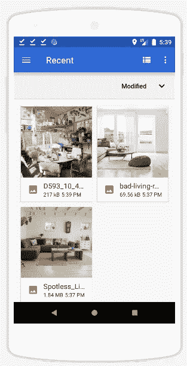

还有哒哒！你可以看到适当分类的**干净的**客厅。

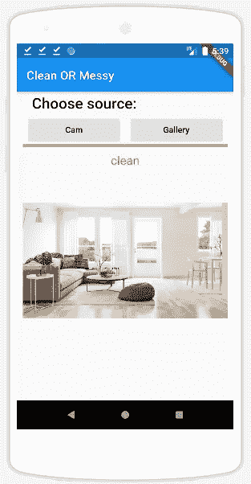

凌乱的厨房也是一样！

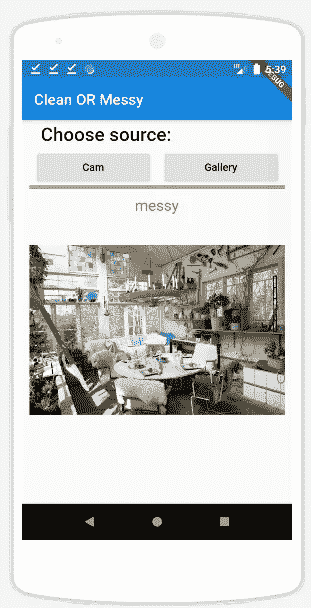

不要停下来！尝试不同房间的不同图像。此外，你可以构建“Android-arm64 ”,并使用二维码将应用程序上传到你的物理设备上。用摄像机对图像进行分类会更有趣！

# 它是如何工作的？

到目前为止，我们已经进行了一些实际旅行。但是，让我们看看引擎盖下，我们的应用程序是如何工作的。

首先是 Tensorflow 模型的初始化。这是通过 **initState()** 生命周期方法中的 **loadModel()** 方法完成的:

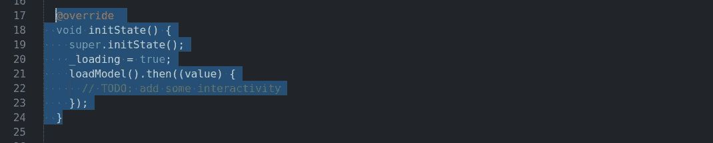

其中 **loadModel()** 委托给 **Tflite** 类中同名的方法。如你所见，它需要我们的两个朋友:训练好的模型和它的标签。

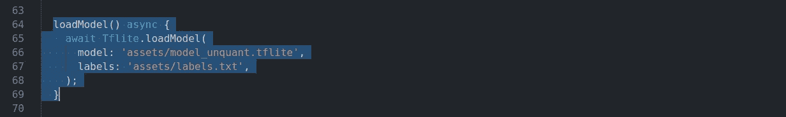

当我们点击“图库”按钮时，它调用 **pickGalleryImage()** 方法:

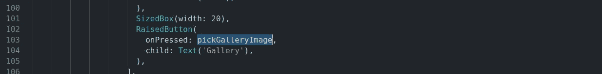

它做两件事:

*   允许用户从图库中挑选一些图像
*   调用 calssifyImage()方法，该方法依次将 _output 字符串设置为已识别的图像类(“干净”或“凌乱”)

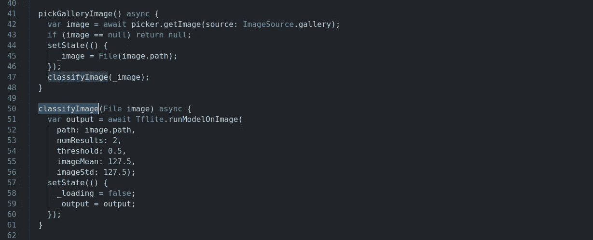

而且，因为在 setState()中设置了 **_output** ，所以这个代码片段在识别的类字符串从 Tensorflow 模型返回后立即打印它:

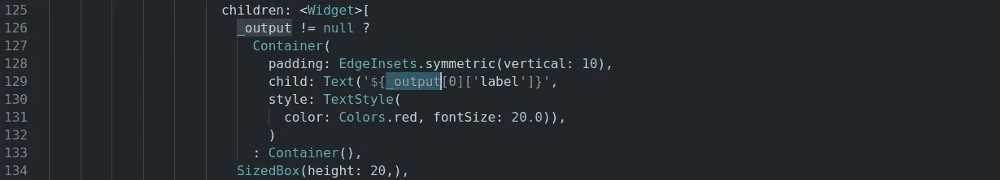

这都是关于“干净或凌乱”。但是我们在 ML 中关于颤振的旅程还在继续…