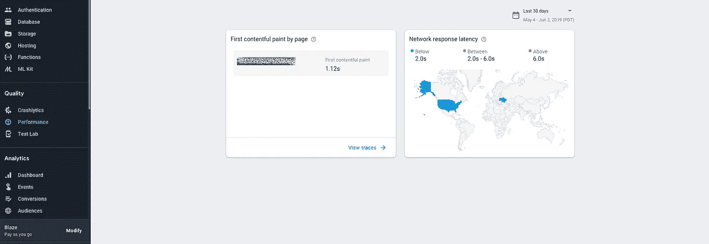
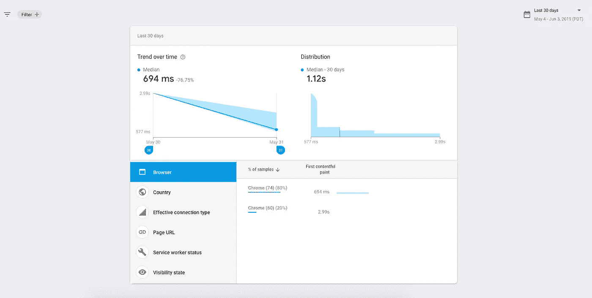
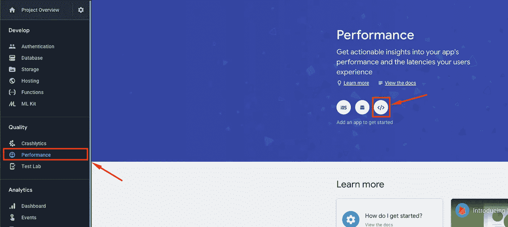
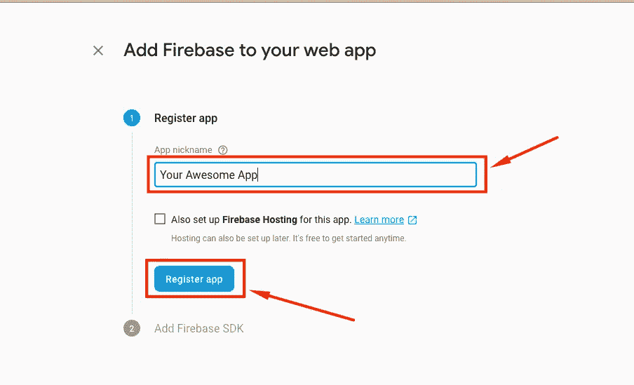
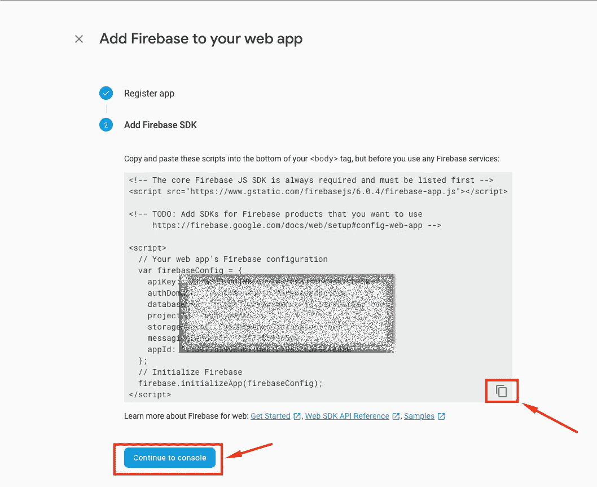
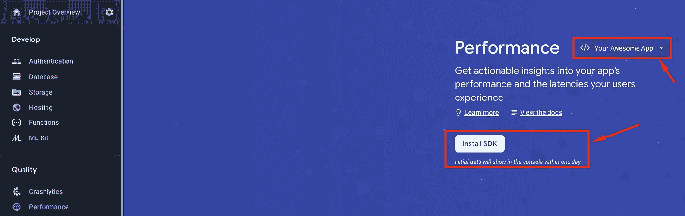

# 基于 Firebase 的深度网络应用分析

> 原文：<https://itnext.io/deep-web-app-analysis-with-firebase-6c32526622eb?source=collection_archive---------5----------------------->

通过**轻松设置**免费**在全球范围内进行应用程序引导、首次内容绘制、页面加载、浏览器分析、连接效率、服务人员状态、可见性状态以及更多其他性能分析**！

我认为我们大多数人都想知道应用程序对我们的用户来说到底是如何工作的，因为他们使用不同的设备和浏览器，为他们提供不同的应用程序使用体验。不久前，当我在分析我的 Firebase web 应用程序时，我发现了 Performance tab，这是以前的测试版:

这为我在全球范围内使用高质量的应用性能分析打开了一个新的机会！让我们看看 **Firebase Performance** 为我们提供了什么，然后为您的项目配置它。

应用性能仪表板

# Firebase 为我们提供了哪些现成的性能

## 第一次油漆

*导航后，浏览器呈现任何视觉变化时的时间戳，包括背景颜色的变化*，我们可以看到应用程序的首次绘制时间。这是现代 web 应用程序最重要的特征之一，因为你可以看到你为用户提供应用程序的第一个屏幕有多快。

我的 Firebase 应用程序中的第一次油漆分析

## 第一幅令人满意的画

所以我们的第一个屏幕已经准备好了，那么内容呢？*(导航后，浏览器呈现 DOM 中任何内容时的时间戳，包括任何文本、图像(包括背景图像)、非白色画布或 SVG)。*

我的 Firebase 应用程序中的第一个内容丰富的油漆分析

## 基本和自定义事件

默认情况下，Firebase Performance 将提供对`domContentLoadedEventEnd` *的分析(导航后，在初始 HTML 文档完全加载和解析(DOMContentLoaded)后立即提供的时间戳，但这并不意味着样式表、图像和子帧已完成加载)*、`domInteractive`、*(导航后，在用户代理将当前文档的就绪状态设置为“交互”之前立即提供的时间戳)*和`loadEventEnd` *(导航后，当前文档的加载事件完成时的时间戳)。*

这还不是结束，您可以自定义事件并添加多达 32 个自定义指标！如果您有兴趣在此了解更多信息，那真是太棒了:

 [## web | Firebase 性能监控入门

### 如果您还没有，请添加性能监控 SDK，并使用以下选项之一在您的应用程序中初始化 Firebase

firebase.google.com](https://firebase.google.com/docs/perf-mon/get-started-web) 

# 如何设置

转到应用程序的 firebase 控制台，切换到左侧的 Performance 选项卡，然后选择 Web SDK。

然后将 **Firebase** 添加到你的应用中，只需简单写下 app 昵称，注册即可。

应用程序注册后，你会得到一个 firebase 配置信息，保存在某个地方。没有保存也不用担心，可以在 app 设置里找到。

现在我们有两个选项，第一个选项是安装独立脚本，第二个选项是使用 SDK 进行定制的性能分析。

应用程序的独立脚本:

现在等一天，你会看到你令人敬畏的性能分析。

# 小结论

感谢您的阅读，我希望您喜欢这篇小教程文章，并会尝试为您的 web 应用程序使用 **Firebase Performance** 工具！

# 其他文章

 [## 想要带棱角的全栈？轻松点。

### 我想我们大多数人都希望有一个可扩展的、可靠的、模块化的项目，用 Angular CLI 来表达一种…

medium.com](https://medium.com/@vyakymenko/want-full-stack-with-angular-easy-12f307413ca7)  [## 使用 Lazy Render *ngFor 提高 Angular 中的渲染性能

### 我认为许多 Angular 开发人员在呈现大型数据列表时存在问题。所以我想和你分享一些技巧…

medium.com](https://medium.com/@vyakymenko/increasing-rendering-performance-in-angular-with-lazy-render-ngfor-ae8c5d16e194)  [## Web 性能清单

### 提高你的网站或网络应用程序性能的简单步骤。看看吧，也许你漏掉了什么…

itnext.io](/web-performance-checklist-6b616f3c6f0d)