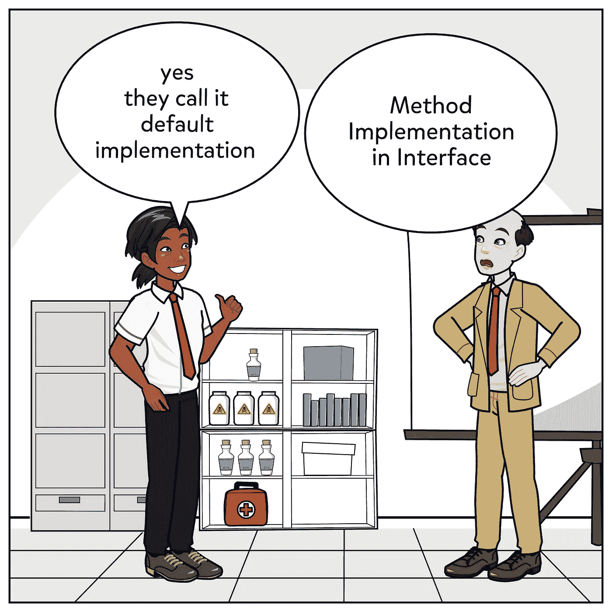

# C#中的默认接口方法

> 原文：<https://itnext.io/default-interface-methods-in-c-df01dfa7b4e8?source=collection_archive---------0----------------------->



c# 8 允许开发人员为接口中的方法编写默认实现。我认为这个特性是一个高风险的语言特性，因为它很容易被误用，导致灾难性的代码质量。在本文中，我们将讨论该功能的正确使用。

在我们进入接口中的新特性方法实现之前，让我们快速了解一下接口的类型。

# **1-表头接口**

头文件接口类似于 c++头文件，通常它是通过从一个类中提取所有方法并在一个接口中定义它而从该类中提取的，通常它用于允许开发人员提供替代实现。

示例:

```
public interface IFileSystem
{File CreateFile(string filename);
void DeleteFile(string filename);
File GetFile(string filename);
}public class WindowsFileSystem:IFileSystem{// windows impl}public class LinuxFileSystem:IFileSystem{// Linux impl} 
```

在这种情况下，IFileSystem 接口只代表一个定义文件系统类实现应该提供什么的契约，并且看起来所有这些方法都将有一个非常定制的实现。

但是现在让我们引入一个名为 GetOrCreateFile 的新方法。这个方法简单地搜索一个文件是否存在并返回它，如果它不存在，它将创建一个新文件。

所以我们的新方法可以使用现有的接口方法来定义。

```
public File GetOrCreateFile(string filename)
{
    var file=GetFile(filename);

     if(file==null)
       file=CreateFile(filename);

    return file;}
```

这种实现对所有文件系统都是有效的，因为它是抽象的，所以在这种情况下，我将在接口内部实现这种方法作为默认方法。

# 接口 vs 抽象类

我确信现在人们会更多地问这个问题，因为默认的方法实现特性减少了两者之间的差异。

因此，让我们首先澄清一些事情，这个问题只对头文件接口有意义，因为任何像 IFileSystem 这样的头文件接口都可以用基类 FileSystemBase 替换。如果你考虑多重继承的问题，我可以明确地说

> “一个类不能有一个以上的标题接口，如果是这样的话，应该被认为是对单一责任原则的极端违反”

> 请在#solid_principals 标签下发布

为了快速解释为什么这个陈述是一个事实，单个责任意味着一个类应该只有一个改变的原因，并且在头接口存在的情况下，头接口将代表改变的高级原因，想想“IFileSystem，IMediaManger，IRepository，…”

所以回到我们的主要问题头接口 vs 抽象类。答案是受保护的和私有的，接口只是类的一个契约，它告诉消费者从类中期望什么，它不能拥有自己的状态，也不能强迫类自己拥有某种私有状态。

很清楚为什么在这种情况下 FileSystemBase 必须是一个基类，而不能是一个接口，因为 GetFileCached 句柄上的缓存拥有一个具体的实现。

# 双角色界面

角色接口是创建接口的最佳方式，因为它遵循接口分离原则，与头文件接口相反，头文件接口是关于类可以提供的所有功能的契约，角色接口是关于类为了扮演某个角色应该实现哪些必需功能的契约。

```
public interface IFileWriter
    {
        File CreateFile(string filename);
        void DeleteFile(string filename);
    }public interface IFileReader
    {
        File GetFile(string filename);
        List<File> GetFiles();
    }
```

这是一个如何将标题接口 IFileSystem 重构为角色接口 IFileWriter 和 IFileReader 的示例。

只有 IFileWriter 和 IFileReader 而没有其他任何东西的原因是消费者代码，例如，我可能需要消费这个代码

```
public class FilesListViewModel
    {
        public File Files { get; set; } public FilesListViewModel(IFileReader fileReader)
        {
            Files = fileReader.GetFiles();
        } }public class FileCreatorViewModel
    {
        private readonly IFileWriter _fileWriter; public FileCreatorViewModel(IFileWriter fileWriter)
        {
            _fileWriter = fileWriter; } public void CreateNewFile(string name)
        {

           _fileWriter.CreateFile(name);
        }
    }
```

我不能给你一个关于你应该如何设计你的代码的一般指导，但是我建议遵循 CQRS 原则，回到角色接口。如果角色接口是为了满足消费者的需求而创建的，就像前面例子中的“IFileWriter，IFileReader”或者 mvvm 模式中的 ICommand，并且如果你来自 java 背景，你将熟悉回调接口。

相比之下，对于 Header 接口，一个类可能需要实现多个角色接口，这就是著名的说法“多重继承问题是通过接口解决的”

> 多重继承由接口解决，但它只应与角色接口一起使用

> 请在#solid_principals 标签下发布

默认接口方法的使用方式与头文件接口相同，如

```
public interface IFileWriter
    {
        File CreateFile(string filename);
        void DeleteFile(string filename);public File CreateNew(string filename)
        {
            DeleteFile(filename);
            CreateFile(filename);
        }
    }
```

但是在某些情况下，您会发现一个默认的实现具有跨角色的依赖关系，比如 GetOrCreateFile()，它需要同时提供接口 IFileReader 和 IFileWriter。

根据有这种跨角色依赖问题的方法的数量，您可以决定是否需要合并两个接口或者引入一个实现这些接口的联合接口，例如，

```
public interface IFileSystem :IFileReader,IFileWriter
    {

        public File GetOrCreateFile(string filename)
        {
            var file = GetFile(filename); if (file == null)
                file = CreateFile(filename); return file;
        }
    }
```

底线默认方法实现是一个改变游戏规则的新特性，如果正确使用，它将有助于构建更好的软件，但如果滥用，它将破坏您的代码。在接下来的文章中，我将展示装饰模式有多有用，以及更多关于用例的内容。

所以请在推特和媒体上关注我

[](https://twitter.com/MCC_Ahmed) [## 艾哈迈德·福阿德

### 艾哈迈德·福阿德的最新推文(@MCC_Ahmed)。我是 PlanRadar 的一名软件工程师，目前住在维也纳…

twitter.com](https://twitter.com/MCC_Ahmed) 

如果你喜欢这篇文章，你可以在

[](https://ko-fi.com/ahmedfouad) [## 给艾哈迈德·福阿德买杯咖啡。ko-fi.com/ahmedfouad

### 我是 PlanRadar 的一名软件工程师，目前住在奥地利的维也纳。我的兴趣范围从技术到网络…

ko-fi.com](https://ko-fi.com/ahmedfouad) 

您可以从以下网站了解更多关于 c#的信息

C# 8.0 和。NET Core 3.0 —现代跨平台开发:用 C#构建应用程序。NET 核心，实体框架核心，ASP.NET 核心，ML.NET 使用 Visual Studio 代码，第 4 版第 4 版，Kindle 版