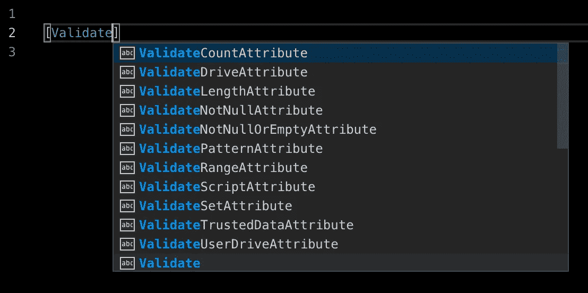

# 防御性 PowerShell

> 原文：<https://itnext.io/defensive-powershell-with-validation-attributes-8e7303e179fd?source=collection_archive---------5----------------------->

## 验证属性快速失败

属性是开发人员添加到代码中的标签，用于向解释器指示信息。属性最常用于定义 cmdlet 接口，在线上有很多关于在代码中利用 PowerShell 参数属性的指南，但是几乎没有关于在 PowerShell 代码中释放属性的全部潜力的指南。

# 防御性编程

程序应该检测错误的输入，并在检测到错误输入时立即失败。您总是希望尽可能早地检测潜在问题，并在前提条件失败后最小化代码运行量。

## 终止错误

在大多数主流编程语言中，如果程序抛出一个未被捕获的错误，程序就会停止运行。在 bash 和 PowerShell 这样的 shell 脚本语言中，如果程序遇到错误，默认情况下程序会继续下一行。要强制 PowerShell 总是在出错时停止，请设置:

告诉 PowerShell 将所有错误设为致命错误

## 陈述性或命令性

声明性代码告诉解释器*做什么*，而命令性代码告诉解释器*如何做*。考虑这两个等效的实现:

声明式与命令式实现

声明式实现显然更简洁，告诉解释器只需验证`$n`在 0 和 10 之间。相比之下，命令式解决方案需要更多的代码，并且包含实现细节——布尔运算和错误实例化——否则可以用声明式解决方案来避免。验证属性是声明性的，因为它们定义了值何时有效。

# 使用属性

## 声明属性

属性声明需要:

*   方括号
*   属性名称
*   属性参数-有时为空，但总是存在
*   属性影响的值

属性声明的形式

## 发现验证属性

如果你还没有，安装[代码](https://code.visualstudio.com/)并安装 [PowerShell 扩展](https://github.com/PowerShell/vscode-powershell)以在 PowerShell 和林挺中启用自动完成功能。找到可用验证属性的最简单方法是开始键入`[Validate`并查看自动完成菜单中的选项:

验证属性最容易通过 VS 代码的自动完成功能发现

这些属性中的大部分都是不言自明的，但是你总是可以在线搜索它们。请注意，我们用来声明属性的名称不包括在 autocomplete 菜单中所有属性上显示的“attribute”后缀。

# 放置验证属性

## 从简单开始:变量的属性

每当您将名称绑定到值时，都会应用属性。绑定值和名称的最简单的例子是使用变量声明。使用带有变量声明的验证属性遵循以下形式:

将属性应用于局部变量

例如，如果您输入的字符串不是“ca”、“eu”或“us”，下面的代码将引发错误:

将属性应用于局部变量的具体示例

一旦您理解了如何在最简单的情况下使用验证属性，您就可以看到相同的概念如何应用于更高级的用例，比如在函数调用中将值绑定到函数参数，或者在类实例化中将值绑定到类属性。

## 验证用户输入:函数的属性

只要有接受参数的函数，就可以在参数定义中添加验证属性。

定义函数参数的验证属性

这是迄今为止最常见的用例，因此您可以很容易地找到扩展这一概念的其他资源，以及解释其他类型的属性，例如`[Parameter(...)]`属性。

## 释放潜能:类的属性

如果你还没有，看看我的另一篇文章，关于为什么你应该使用 PowerShell 类。您将了解为什么 PowerShell 类是有益的，特别是对于类型转换和序列化/反序列化。结合了验证属性和强制转换的类完美地集成在一起，这在我见过的任何其他语言中都是无与伦比的。

您可以在关联的属性声明上应用验证属性，只要您设置属性值，它们就会运行，例如当您将哈希表强制转换为类或在构造函数中设置值时。

定义具有属性验证属性的类

当您将哈希表转换为类类型时，验证属性将确保属性包含有效值。

投射到对象

# 常见使用案例

这些是可以集成到脚本中的验证属性的实际例子。

# 进一步阅读

*   [关于功能高级参数](https://docs.microsoft.com/en-us/powershell/module/microsoft.powershell.core/about/about_functions_advanced_parameters)
*   [你应该使用 PowerShell 类](https://medium.com/@cjkuech/you-should-be-using-powershell-classes-9966db76f909)