# 微服务架构中的延迟任务

> 原文：<https://itnext.io/deferred-tasks-in-a-microservice-architecture-8e7273089ee7?source=collection_archive---------2----------------------->

通常在项目中，需要执行延迟任务，例如发送电子邮件、推送和其他特定于应用程序领域的特定任务。当通常的 crontab 不再足够时，当批处理不适合时，当每个任务单元都有自己的执行时间或被动态分配时，困难就开始了。

为了解决这个问题，一个叫做[触发挂钩](https://github.com/pvelx/triggerhook)的解决方案被创造出来。操作示意图如图 1 所示。该图显示了任务在其整个生命周期中的变化。改变颜色意味着改变任务的状态。

*   红色任务——启动时间还不算早的任务
*   黄色任务—即将启动的任务
*   绿色任务——启动时间已到的任务
*   蓝色任务—已处理的任务
*   灰色-未确认数据库中任务的状态
*   黑色—删除命令

生命周期任务:

*   当创建一个任务时，它进入数据库(方块)(红色和黄色)。
*   如果任务的开始时间即将到来(红色->黄色)，则任务被加载到内存中(三角形块)。这种结构以优先队列(堆)的形式实现。
*   当任务执行时间到了，就发送执行(黄色->绿色)。在处理之前使用中间缓冲器来补偿峰值负载。
*   如果任务成功提交，它将从数据库中删除(绿色->蓝色)。在删除之前使用中间缓冲区，也是为了补偿峰值负载。

接下来，我将尝试更详细地描述一些特性，并给出支持选择这种解决方案的理由。

## API 的简单性

该 ID 接受 UUIDv4 格式。如果没有通过，将独立生成。当使用异步通道时，从外部服务传递任务 id 的能力将非常有用。开始时间以 UNIX 格式指定。

创建:

删除:

处理启动事件:

## 持久性

例如，如果与消息代理的连接丢失，任务处理可能会失败。在这种情况下，任务不会被确认，但会再次尝试发送。只有在调用确认方法时，任务才会被标记为已处理。突然停止应用程序不会导致数据库不一致。

此外，考虑到以微服务的形式将应用程序转移到云的一般市场趋势，新的应用程序需求正在形成。至少以前在背景中的东西现在变得更重要了。使用这种方法，容器化的应用程序本质上是临时的。Trigger Hook 机制使得在一个服务器上折叠一个微服务并在生产环境中的另一个服务器上部署它成为可能，而不需要软停止。

如果应用程序崩溃，一些任务可能无法在数据库中确认。当您重新启动应用程序时，这些任务将被再次发送执行。这种行为是一种有利于提供容错的折衷。当你的应用程序从 Trigger Hook 接收到一条消息时，它应该只执行任务一次，当它再次接收时就忽略它。这种情况在面向事件的体系结构中很常见，它们不应该破坏内部状态并产生大量错误。

## 准确性和性能

为了避免对数据库的高频率请求，提供了一种机制来定期预加载执行时间在指定范围内的任务集。换句话说，很少请求任务集，而不是一次请求一个任务。例如，如果一次调度几十万个任务，这种方案非常适合。任务加载后，会按优先级排序。当最高优先级任务的计时器到期时，它会立即被发送到客户端代码进行处理。这使您能够实现高峰性能，并以每秒的精度处理任务。

此外，由于简单的任务存储方案、索引和多线程数据库访问，发送任务以供执行的性能得到了提高。

测量了任务处理速度的主要指标。

应用程序服务器:

*   AWS EC2 Ubuntu 20
*   t2 .微
*   1 个 2.5 GHz 虚拟 CPU
*   1 个 GiB RAM

数据库服务器:

*   AWS RDS MySQL 8.0
*   db.t3.micro
*   2 个虚拟 CPU
*   1 个 GiB RAM
*   网络:2085 Mbps

创建任务测试:

*   测试持续时间——1 分 11 秒
*   平均速度(任务/秒)— 1396
*   任务数量— 100000

删除任务测试:

*   测试持续时间—52 秒
*   平均速度(任务/秒)— 1920
*   任务数量— 100000

发送任务(任务状态从红色变为蓝色)测试:

*   测试持续时间——498 毫秒
*   平均速度(任务/秒)— 200668
*   任务数量— 100000

确认任务(任务的状态从蓝色变为删除)测试:

*   测试持续时间——2s
*   平均速度(任务/秒)— 49905
*   任务数量— 100000

## 监视

为了快速检查正确的操作，Trigger Hook 提供了连接时序数据库的能力。在初始化阶段，可以确定测量的频率并选择感兴趣的指标。此处提供了可用指标的完整列表。

也可以通过适配器连接记录系统。可用:

*   致命错误——导致应用程序完全关闭
*   值得注意但不会导致停止的错误
*   取消邮件标记

在这个例子中，您可以看到一个连接到 InfluxDB+Grafana 的例子

# 作为微服务架构一部分的触发器挂钩

## 异步交互

当使用微服务架构时，异步交互通常是首选。Trigger Hook 非常适合微服务、事件驱动架构。但是在任何情况下，传入(创建、删除)和传出(任务开始时间事件)通道可以是异步的，也可以是同步的，这取决于需求。

下面，图 2 显示了通过异步信道的通信方案的一个可能的变体。一个队列，比如 RabbitMQ，可以充当消息代理。这种方案消除了调用者对被调用微服务的阻塞，例如在通过 HTTP 的同步请求中。代理接受无限数量的任务(有条件地无限制)，这些任务的处理程序在它们被释放时接管它们。一旦处理了 create 命令，就会发送一个关于任务成功创建的事件。同样通过代理，客户机服务接收该事件并相应地对其做出反应——使用延迟任务更改实体的状态。该实体可以是例如给移动设备的带有广告的推送通知。

这种方案的一个显著缺点是服务于这种交互的基础设施的复杂性。事实上，引入“等待”其他微服务响应的状态是分布式事务。

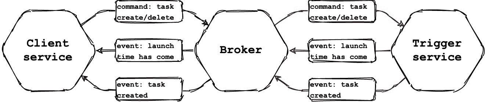

图 2 —异步通道通信图

图 3 显示了创建一个具有延迟执行的实体的过程，图 4 显示了该时间到来时的执行。

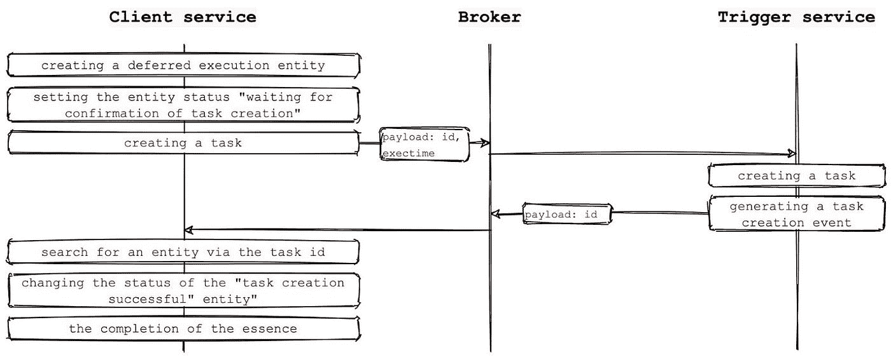

图 3——创建延迟执行实体的过程

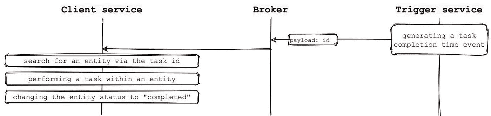

图 4 —完成实体任务

## 共享

创建任务时缺乏传递一些负载的能力可能会让一些人失望。但我向你保证，这是没有必要的。Trigger Hook 包含足够的功能来构建任务管理器。将触发器挂钩视为位于基础设施级别的抽象层。关于任务的完整信息，比如类型、状态、执行时间、执行尝试次数、有效负载等等，将包含在 Trigger Hook 之上的抽象层中。

顶层将拥有领域知识。换句话说，任务管理器将有一组特定的任务类型，一组与特定类型的任务相关的事件。例如，对接口的请求听起来像“*创建一个用于发送电子邮件消息的延迟任务*”或“*创建一个用于订阅 YouTube 的延迟任务*”，任务管理器本身将使用请求“*创建一个延迟任务*来处理触发器挂钩。到了开始任务的时候，触发钩子将创建“*任务完成时间已到*事件。该事件将被任务管理器截获，任务管理器将通过发出例如事件“*订阅费借记时间已到*”来处理该事件。图 5 和图 6 展示了这个过程。

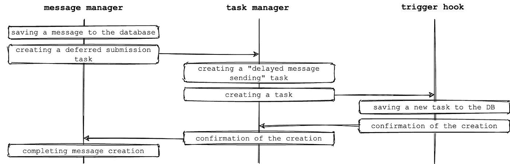

图 5 —使用中间层创建任务

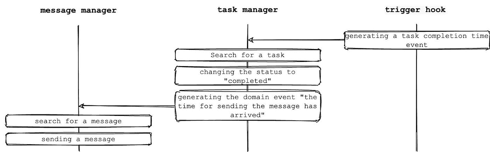

图 6 —使用中间层的事件处理

应用程序组件之间的通信应该非常弱。这也适用于一般的微服务。实际上，加强沟通的原因之一是将一个部门的部分责任转移给另一个部门。因此，最困难的任务之一是找到(例如，单片)应用程序到微服务的分区边界。要成功做到这一点，您需要考虑领域。现在我们需要回答这个问题:我们应该将“任务管理器”层放在哪个微服务中？

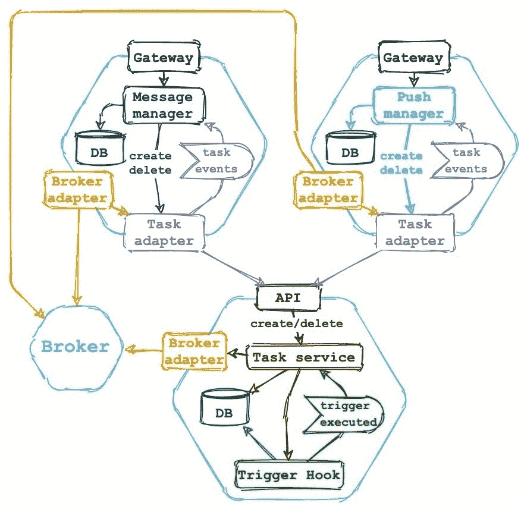

图 7-带有触发挂钩的微服务中的任务管理器

图 7 显示了一个图表，其中任务管理器是一个独立的微服务，包含关于任务类型、与这些任务相关的事件的领域知识。从图中可以看出，不同的客户端微服务应该共享任务管理器的一个微服务。每个微服务都有自己的接收事件的通道。在 RabbitMQ 中，这样的事件通道可以很容易地实现为直接模式。

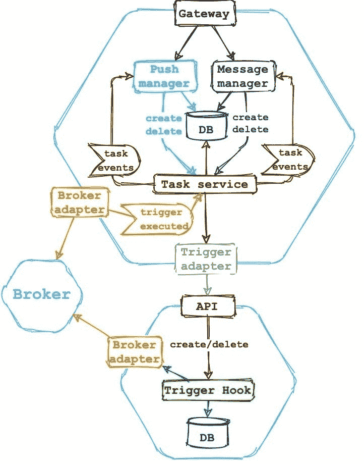

图 8 —作为客户端微服务一部分的任务管理器

图 8 显示了一个不同的方案，其中任务管理器是客户端微服务的一部分，仅用于其内部需求。如果没有其他使用延迟任务的微服务，或者如果每个微服务都有自己的带有触发挂钩微服务的任务管理器，那么这种方案是合适的。

## 按比例放大

有些应用程序比其他应用程序更难扩展。如果应用程序状态只存储在具有竞争性访问支持的外部存储中，例如，经典的 PHP + MySQL 捆绑包，那么一切都会变得容易得多。在这种情况下，PHP 应用程序的几个实例部署在不同的服务器上，Nginx 平衡它们之间的负载，而 MySQL 资源对 PHP 应用程序的所有实例保持不变。如果 MySQL 失败，那么可以独立于 PHP 应用程序添加副本。

当应用程序存储自己的状态时，事情就有点复杂了。横向扩展更加困难。触发挂钩将其状态存储在 RAM 中。它加载即将开始的任务。假设您已经创建了一个需要 5 秒钟完成的任务。这意味着 Trigger Hook 已经为执行预加载了它。但是你想取消这个任务。为此，调用 delete API 方法。从接受任务进行处理的应用程序实例中调用此方法非常重要。这是第一个难点。

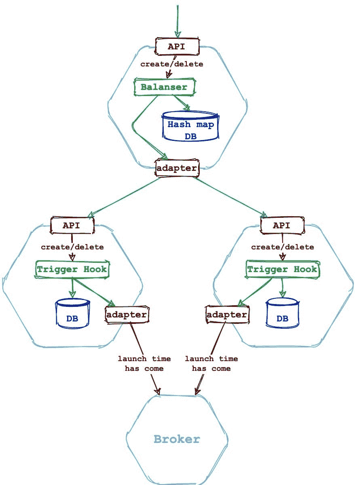

图 9 —水平比例图

第二个困难是每个触发器钩子实例必须在数据库中有自己的模式。这是因为在出现故障时要确保数据库的一致性。一般来说，从性能的角度来看，对单个数据库使用 Trigger Hook 实例是没有意义的，首先，因为 Trigger Hook 工作在多线程模式下，其次，在所有其他条件相同的情况下，数据库是一个瓶颈。

图 9 显示了一个负载伸缩的例子。Trigger Hook 的每个实例都有自己的数据库，在不同的服务器上(否则没有多大意义)。触发器挂钩实例前面有一个负载平衡器。除了平衡之外，它还将一个键-值对写入某个哈希映射数据库，比如 Redis:

```
task_id:instance_host
```

# 触发挂钩演示应用程序

该应用程序由五个微服务组成。每个人都使用 Docker 容器。一切都在 Kubernetes 上运行。该应用程序可以很容易地部署在 minikube 中。这里的描述了[的详细说明。](https://github.com/pvelx/k8s-message-demo)

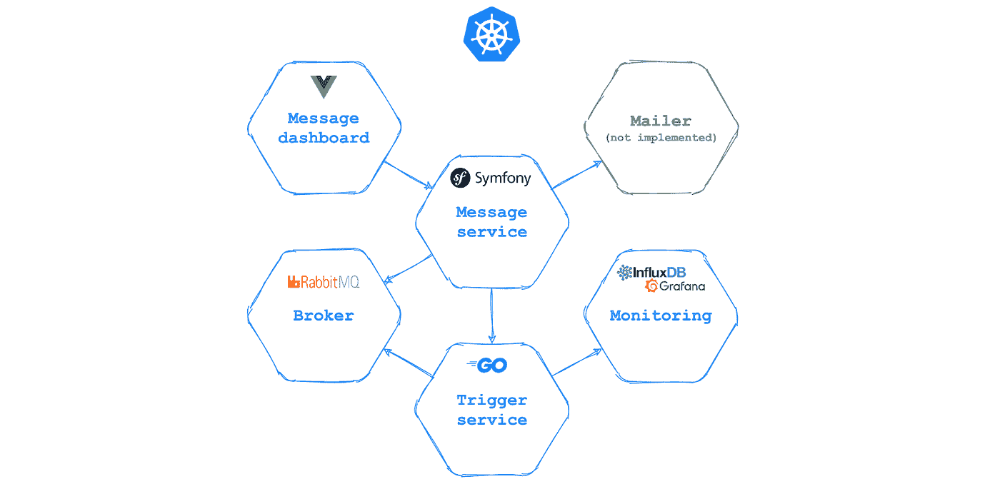

图 10 —微服务交互的简化方案

[消息服务](https://github.com/pvelx/message-service-demo) —提供 API 的服务(图 11)，用于创建电子邮件消息并分配它们在特定时间发送或取消。还允许您查看消息及其状态的完整列表。

一些功能:

*   位于域级别。
*   它由一个消息管理器和一个任务管理器组成。
*   用 PHP 写的，Symfony 5 框架。
*   它一式两份。第一个使用 Nginx 为 API 请求提供服务。第二个通过 supervisor 启动守护进程，监听来自 RabbitMQ 队列的事件。它有运行迁移的辅助实例。
*   使用图 8 中的图表来管理任务。

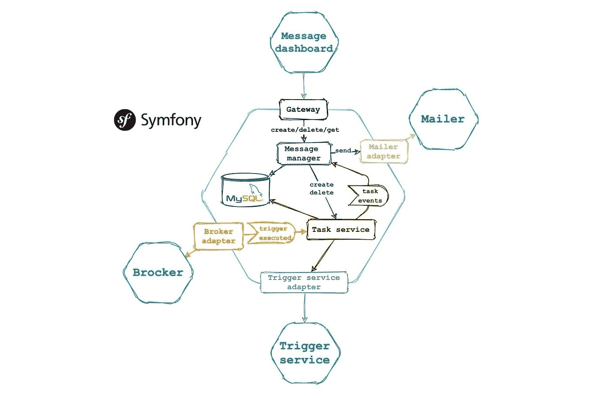

图 11-消息服务

[消息仪表板](https://github.com/pvelx/message-dashboard-demo) —消息服务接口(图 12)。

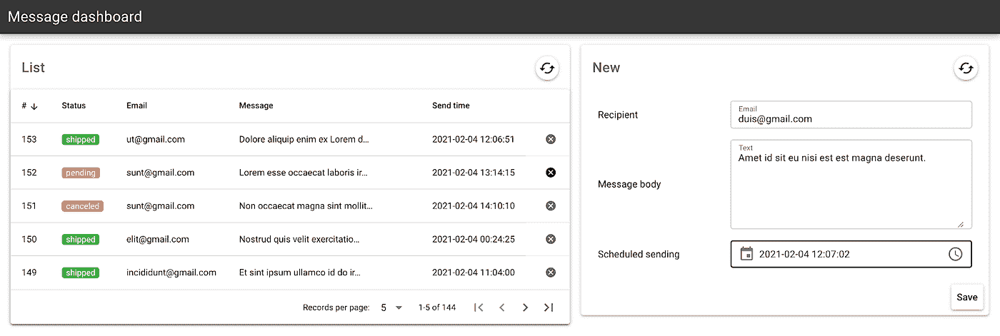

图 12 —演示应用程序界面

邮件服务位于基础设施层。必须直接做邮件列表。未实现，因为它在演示中并不重要。

[触发服务](https://github.com/pvelx/trigger-service-demo) —基础设施级服务。使用 GRPC 通道接收创建和删除任务的命令，使用 AMQP 通道发送任务执行时间事件(触发器)。

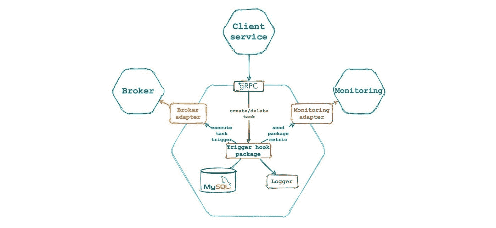

图 13 —触发服务

监控—也是在基础设施级别，因为它显示技术指标，而不参考业务事件。图 14 显示了面板的外观。由 Grafana 和 InfluxDB 使用。此处提供了指标的完整描述[。](https://github.com/pvelx/triggerhook#principle-of-operation)

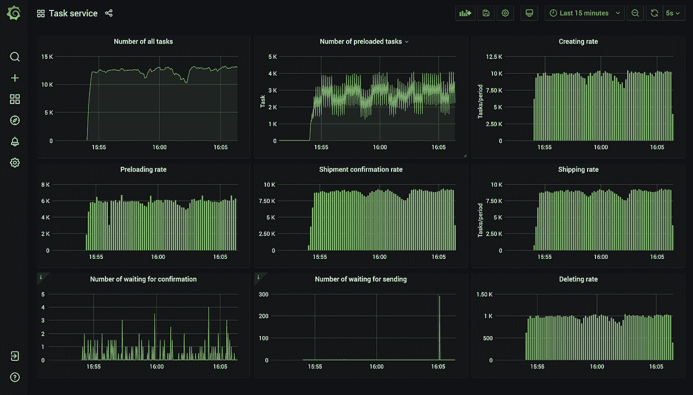

图 14-触发挂钩技术指标

希望 app 和文章对你有用！关注[我的 github](https://github.com/pvelx) ，关注[项目](https://github.com/pvelx/triggerhook)，放星星)感谢！