# 将 web 4.0 应用定义为多线程

> 原文：<https://itnext.io/define-a-web-4-0-app-to-be-multi-threaded-9c495c0d0ef9?source=collection_archive---------0----------------------->

通过学习使用 web workers 创建视觉效果惊人且速度极快的下一代 web 应用程序，将您的技能提升到一个全新的水平。

该应用程序以及您的组件将存在于一个应用程序 web worker 中。

# 内容

1.  我们要建造什么？
2.  先决条件
3.  建立基础设施
4.  使用 npx neo-app 创建应用程序外壳
5.  三种不同的环境
6.  检查输出
7.  类别配置和基本概念
8.  创建 header 容器
9.  创建 MainContainerController
10.  将我们的应用程序连接到 disease.sh API
11.  为生产部署您的应用
12.  摘要
13.  最后的想法

# 1.我们要建造什么？

我们将从零开始一步一步地逐步增强我们的应用程序，同时研究基本的架构和框架概念。

不要怕:)

虽然最终结果肯定很复杂，但本教程尽可能简单。像 3d gallery 和 helix 这样的高级组件已经存在，所以我们不需要自己创建它们。

为了保持范围合理，我将把教程分成多个部分。

欢迎来到第 1 部分！

在这个博客系列的最后一部分，我们将从单页面应用程序(SPA)版本开始，并将其转换为多窗口应用程序。

这个应用已经完成了，所以你可以看看完整的源代码。最终的结果显然超出了本教程的第 1 部分，所以如果您想尽早研究这段代码，请三思。

[apps/covid](https://github.com/neomjs/neo/tree/dev/apps/covid) (单页 app 版本)

[应用/共享视频](https://github.com/neomjs/neo/tree/dev/apps/sharedcovid)(多窗口版本)

# 2.先决条件

要学习本教程，您需要:

1.  对 Javascript、CSS 和 HTML 有扎实的理解
2.  熟悉基于 ES6+的课程体系
3.  了解面向对象的概念
4.  谷歌浏览器

你不需要任何使用 Angular、React 或 neo.mjs 等框架/库的经验。

使用 Angular 或 React(至少是多窗口版本)创建这个应用程序几乎是不可能的，所以 neo.mjs 是显而易见的选择。

# 3.建立基础设施

创建 neo.mjs 应用程序有两种不同的选项。
重要提示:我们将坚持选择**二。**

**选项一:**

1.  克隆 neo.mjs repo
2.  运行 npm 安装
3.  运行 package.json 中的 build-all 程序
4.  运行 create-app 程序，您的新应用程序文件夹会出现在“应用程序”下:


特别是在你想处理框架源代码的情况下，比如添加新的组件或者一个新的主题，这样开始是有意义的。您可以稍后将您的应用程序文件夹移动到一个真正的应用程序外壳。

**选项二:**

我们可以创建一个新的应用程序外壳(工作区),只需在终端中输入`npx neo-app`。这样我们可以让你自己的代码库和框架分开，只使用 neo.mjs 作为节点模块。

[可选]在此之前，让我们先创建一个新的 GitHub 存储库:

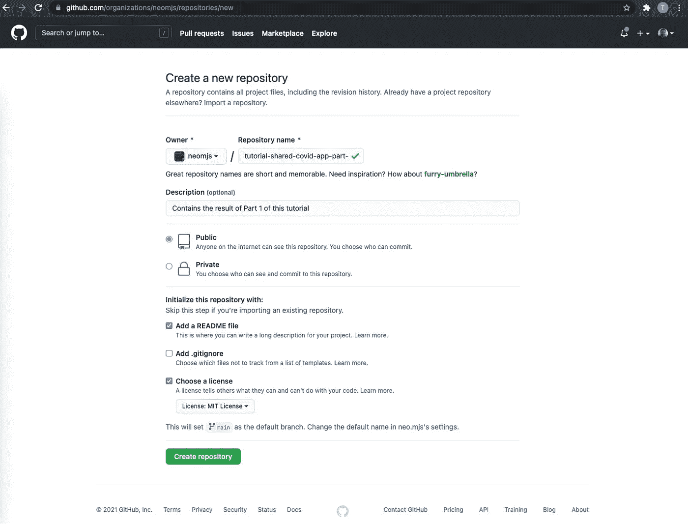

我们开始吧:

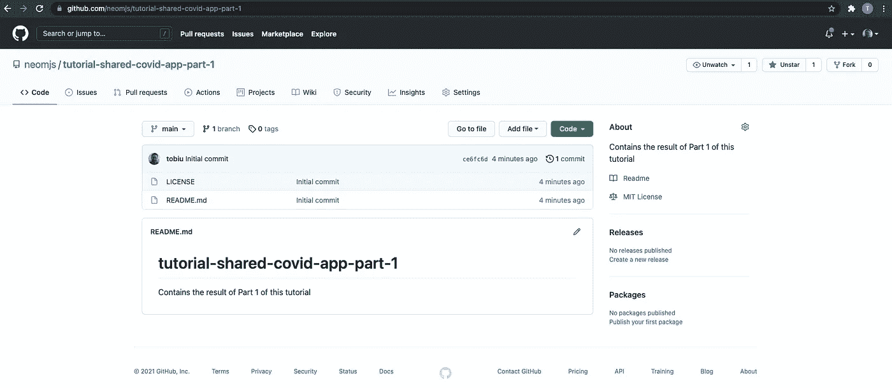

你可以在回购里面看到这个教程(第一部分)的结果:
[github.com/neomjs/tutorial-shared-covid-app-part-1](https://github.com/neomjs/tutorial-shared-covid-app-part-1)

也可以随意创建自己的回购协议，但这对于本教程来说是可选的。

接下来，我将克隆新的回购:

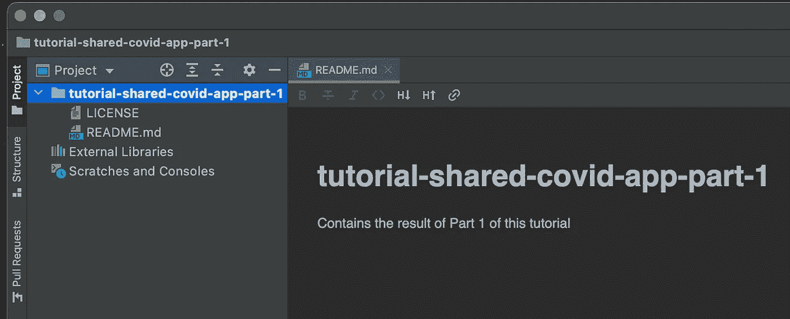

正如你可能已经看到的，我正在使用 [WebStorm](https://www.jetbrains.com/webstorm/) 。随意坚持你觉得舒服的任何 IDE。

# 4.使用 npx neo-app 创建应用程序外壳

我们即将完成开始编码所需的一切。缺少的最后一步是创建 neo.mjs 应用程序外壳。

为此，我们需要打开我们的终端(或 Windows 上的 CMD ),并进入我们的新鲜回购文件夹之上的第一层文件夹:

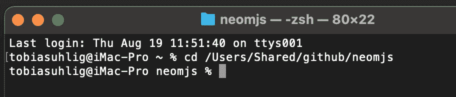

让我们看看我们的计划选项。输入`npx neo-app --help`:

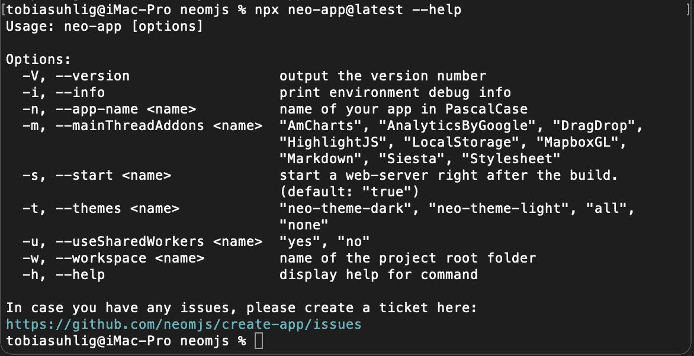

*【旁注】我用* `*@latest*` *来确保得到最新版本。*

如果您愿意，可以在命令行上传递一些选项，但是如果您不愿意，也可以使用可视化界面。

我们可以在以后更改所有通过的选项。

现在进入`npx neo-app`:

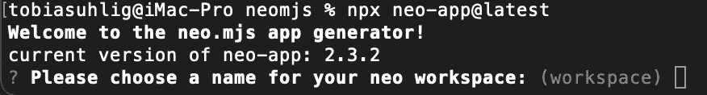

如果您的版本低于 2.3，请添加最新的标志。

该程序将要求您输入您的工作区(应用程序外壳文件夹)名称。这里重要的部分是匹配回购文件夹的名称。

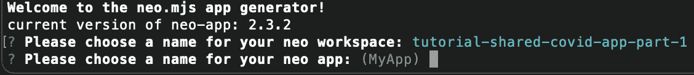

下一个问题是 app 名称。因为这也等于我们的代码库内的名称空间，所以它应该是 PascalCase。我们长话短说:Covid。

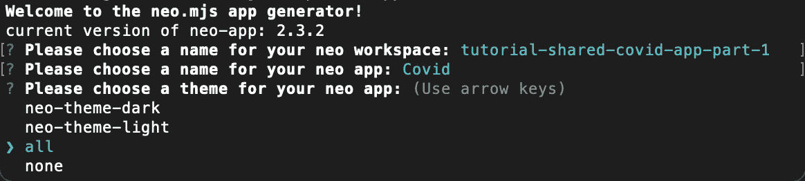

我们确实想使用这两种主题，并在运行时在它们之间动态切换，所以只需按 enter 键。

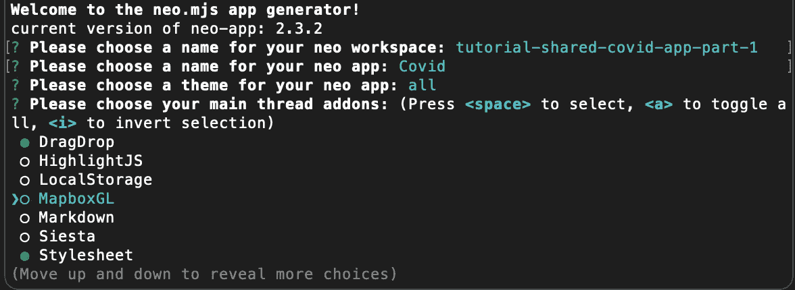

主线程插件`DragDrop`和`Stylesheet`已经被选中。我们以后会需要更多。现在，只需再次按回车键。

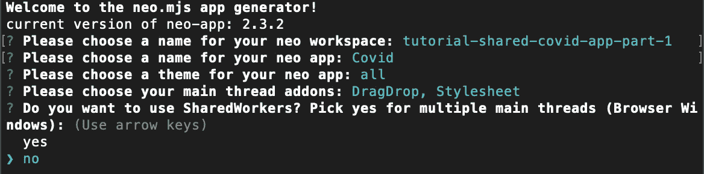

最后一个问题是，我们是要使用[敬业的员工](https://developer.mozilla.org/en-US/docs/Web/API/Worker)还是[共享的员工](https://developer.mozilla.org/en-US/docs/Web/API/SharedWorker)。

虽然我们的最终版本将使用共享工人，但我强烈建议从“普通”工人开始。再按一次回车键。

*【旁注】不直接使用共享工作器的原因是这使得调试有点复杂。对于工作人员，您可以直接在浏览器 devtools 中看到所有控制台日志。对于共享的员工，您需要为他们每个人打开一个新窗口:*

```
*chrome://inspect/#workers*
```

*该框架在工作人员通信的基础上使用了一个抽象层，所以我们可以在稍后通过改变一个顶层配置来进行切换。API 将保持不变。很酷，对吧？【端侧注释】*

这需要一点时间，因为后台发生了很多事情:

```
Total time for covid buildAll: 44.68s
```

一旦完成，开发服务器将自动在默认浏览器中打开一个新的浏览器标签。如果这不是谷歌浏览器，你应该复制网址并输入。

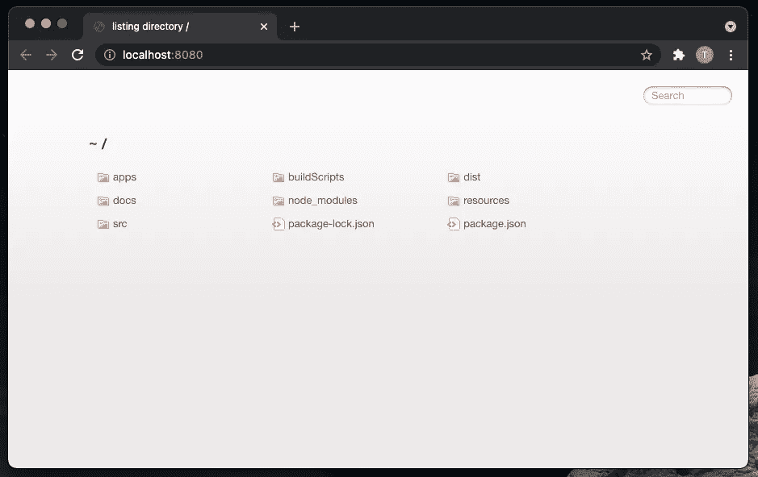

点击“应用程序”文件夹，然后点击“covid”:

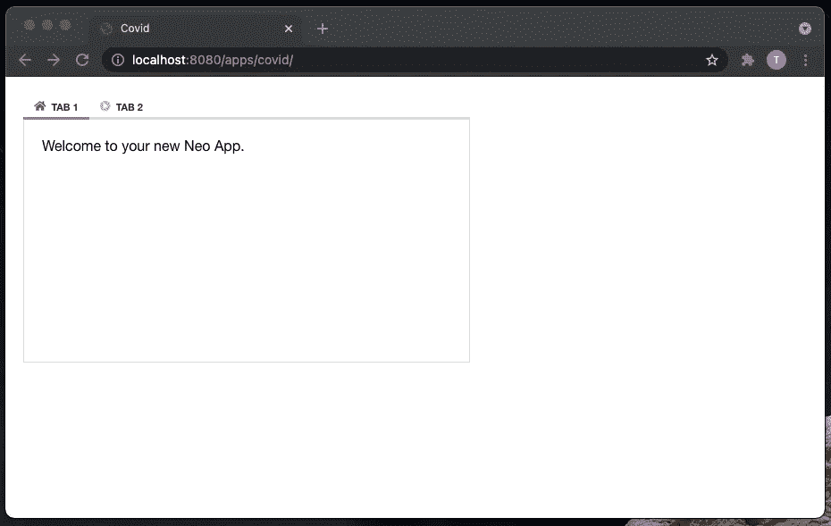

**祝贺你！**您的第一个 neo.mjs 应用程序已经启动并运行。

这几乎是你的“你好，世界”的起点。

接下来将 URL 更改为“docs ”:

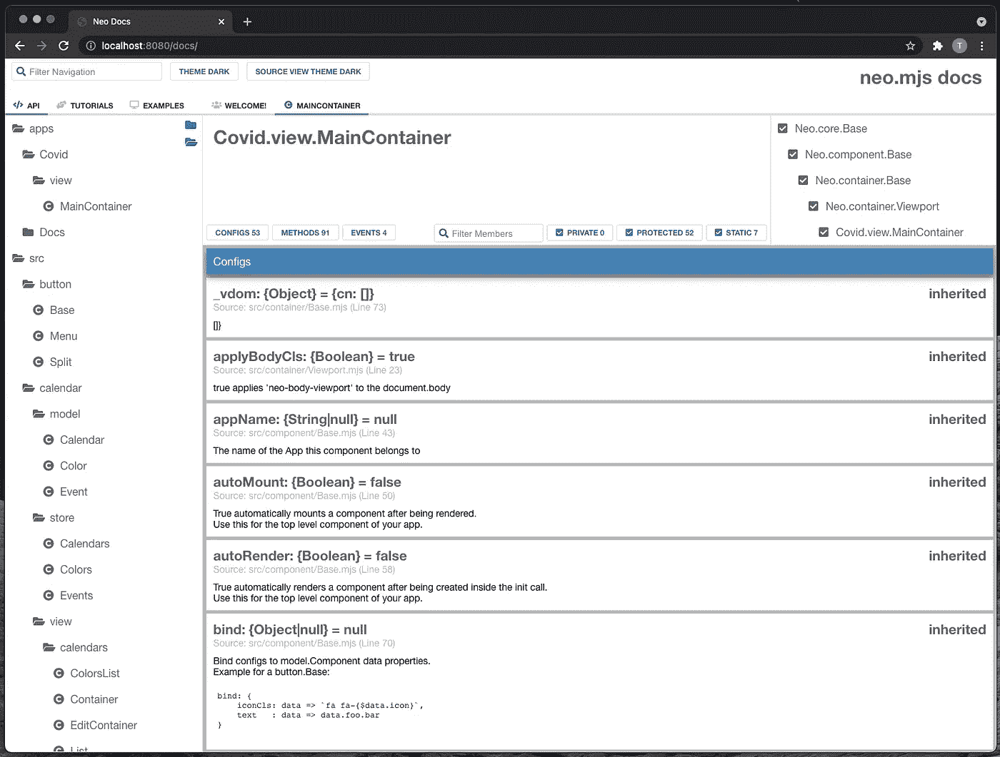

如你所见，这里有完整的框架源代码文档，也有你自己的新应用的文档。“Covid”是我们刚刚挑选的名称(空间)。

*【旁注】docs 应用也是用 neo.mjs 构建的。这对于了解类的层次结构以及查看所有可用的类配置和方法很有帮助。你可以点击每一个进入源代码视图。docs 应用程序对学习使用框架还没有帮助。目前它仅限于桌面浏览器。如果你想看这个应用程序的移动版本，请随意开一张票。感谢帮助。【结束旁注】*

# 5.三种不同的环境

neo.mjs 项目的一个设计目标是让 UI 开发回到它的归属:直接进入浏览器。

**开发模式**我们不需要基于 JS 的源代码图，可以直接调试真正的代码，没有任何外部副作用或热模块替换。这已经节省了我很多时间，非常方便。

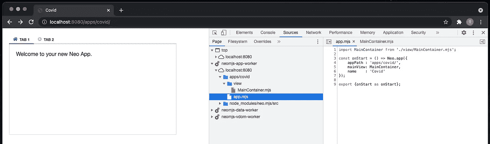

如您所见，我们获得了真正的代码，在此之上，它正在我们的应用程序工作器中运行。

dev 模式要求浏览器支持 JS 模块以及 worker 范围内的动态导入。Chromium 已经准备好一段时间了，所以它可以在谷歌 Chrome 和微软 Edge 中工作。Webkit (Safari)已经解析了票证，但还没有上线。开发模式也适用于 [Safari 技术预览版](https://developer.apple.com/safari/technology-preview/)。

Mozilla (Firefox)尚未准备好，但团队正在积极努力:

 [## 1247687 -实施工人模块

### 核心领域的新(ystartsev):工人。最后更新 2021-07-29。

bugzilla.mozilla.org](https://bugzilla.mozilla.org/show_bug.cgi?id=1247687) 

**dist/development**
如果你使用 Angular 或 React，这就是你所说的开发模式。我们正在以一种聪明的方式使用 [webpack](https://github.com/webpack/webpack) 来生成我们需要的分割块**，包括用于 JS 和 CSS 的**源地图。

这种模式可以在所有主流浏览器中运行。

**dist/production**
我们正在以一种巧妙的方式使用 [webpack](https://github.com/webpack/webpack) 来生成我们需要的分割块**而不需要用于 JS 和 CSS 的**源映射。代码被精简了。

这种模式可以在所有主流浏览器中运行。

# 6.检查输出

让我们快速看一下 npx neo-app 程序的输出:

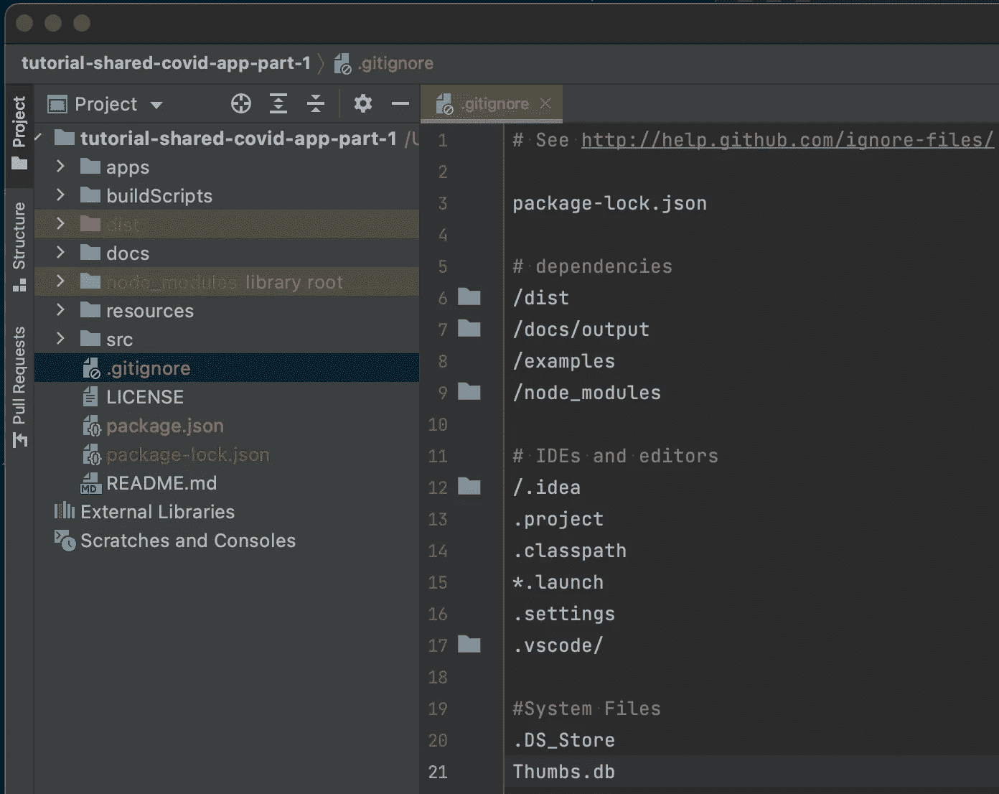

我们已经有了一个. gitignore 文件，它忽略了`dist`文件夹和`node_modules`，所以我只是调用顶层文件夹上的`git add`，并将其推送到回购。

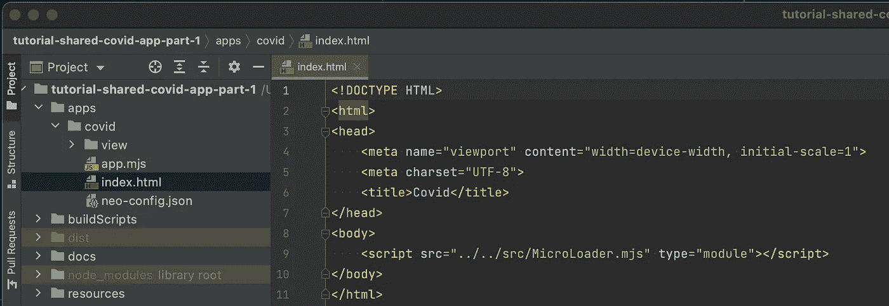

如果你喜欢或者创建一个 html 框架，你可以在这里添加更多的外部依赖。我们的主线程起点包括 MicroLoader:

MicroLoader 将导入框架的 [Main.mjs](https://github.com/neomjs/neo/blob/dev/src/Main.mjs) 文件。这将创建工人设置。您的应用程序将**而不是**驻留在主线程中。

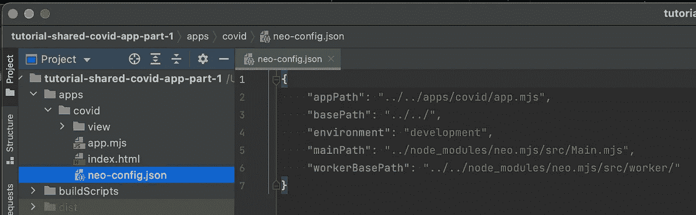

`neo-config.json`文件包含框架选项。构建程序将根据我们的不同环境调整这个文件。

您将在 [DefaultConfig.mjs](https://github.com/neomjs/neo/blob/dev/src/DefaultConfig.mjs) 中找到所有可用的框架配置。例如，主题默认为

```
themes: ['neo-theme-light', 'neo-theme-dark']
```

这就是为什么它没有包含在我们的配置文件中的原因(我们选择了默认值→ both)。

让我们在配置文件中添加`themes`配置并改变顺序:

在浏览器中重新加载应用程序:

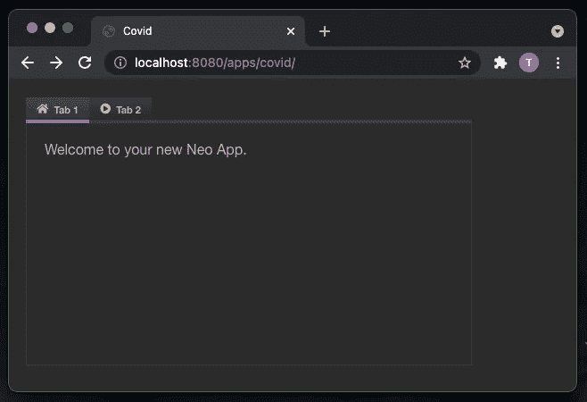

→使用多个主题的顺序很重要，默认情况下将应用第一个主题。

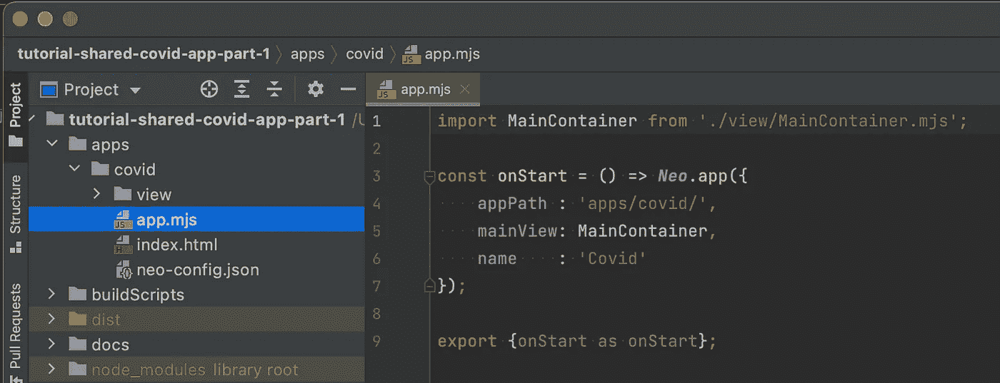

您的主要入口点是`app.mjs`文件。

把它想象成我们应用程序 web worker 的“index.html”。

一旦 neo.mjs 主线程完成创建 worker 设置，app worker 将导入文件并触发`onStart()`。

我们可以包含一个`mainView`，以防我们想马上把它放入 DOM，但是这是可选的。再次重申:

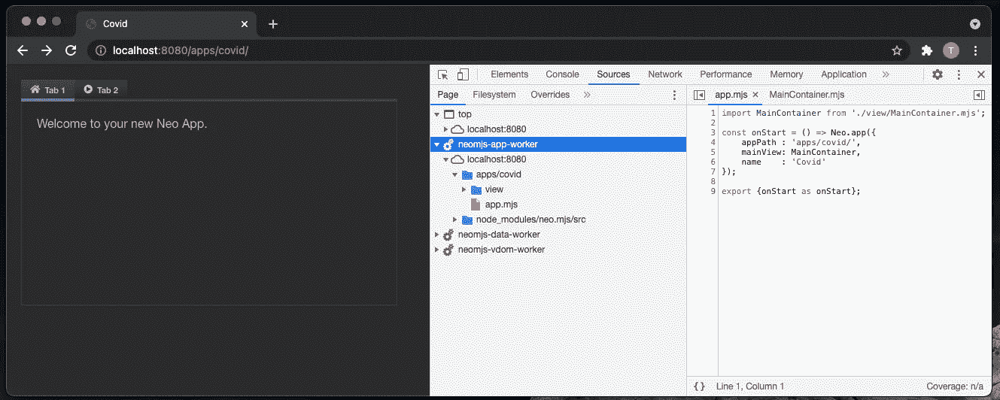

这是 neo.mjs 框架的**主要设计目标**:它的大部分部分以及你的应用程序都运行在 app worker 里面**而不是主线程里面**。

虚拟 dom 引擎也可以存在于自己的线程中，并且有一个用于数据工作者的线程。这一点不重要。


现在是休息一下的好时机，因为有很多事情要考虑。尤其是在你第一次使用 neo.mjs 的情况下。

# 7.类别配置和基本概念

让我们来看看你的新应用的主视图:

我们导入将在顶部使用的 JavaScript 模块(类)。这意味着，我们的应用程序的 dev & dist 版本将只包含我们使用的文件，而不是其他任何东西，以保持总文件大小较小。请确保在导入时添加文件扩展名，因为您的代码应该直接在浏览器中运行。

*【旁注】表示开发模式本身没有裸模块说明符*

仔细考虑要扩展哪个基类是很重要的。你的新类是一个没有 DOM 相关内容的工具文件吗？例如:去。如果有 DOM 相关的内容，使用`component.Base`或扩展这个内容的类。

例如，Viewport 的类层次结构是:

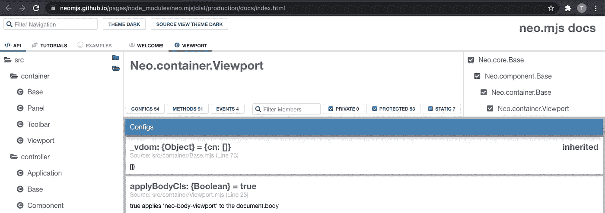

→您可以轻松查看 Docs 应用程序中的课程层级(右上角)。Docs 应用程序 UI 本身是使用 neo.mjs 编写的，因此您可以深入源代码，查看如何创建应用程序的另一个示例:
[docs/app/view](https://github.com/neomjs/neo/tree/dev/docs/app/view)

使用一个`container.Viewport`作为基类将使用屏幕的全部可用尺寸(高度&宽度 100%)，因为它正在扩展`container.Base`，你可以添加项目。

一般来说，neo.mjs 是高度配置驱动的，使用定制的类配置系统。

简而言之:您需要在静态 getConfig()方法中添加配置(类似于类字段)。

```
static getConfig() { return {
    // add your configs here
}}
```

配置的顺序无关紧要。配置通过以下方式应用

```
Object.defineProperty()
```

所以它们是由 get & set 驱动的。

```
myButton.text = 'Something else';
```

这意味着你可以通过分配一个新的值来动态地改变它们，并且你的 UI 将会更新(一致性:以同样的方式添加和改变配置)。

我刚刚使用了“myButton”，意思是`button.Base`的一个实例。现在来看看这个类:[src/button/base . mjs # L81](https://github.com/neomjs/neo/blob/dev/src/button/Base.mjs#L81)

我突出显示了文本配置的行。如果你仔细看，有一个尾随的下划线:

```
text_: '',
```

尾随下划线将被 [Neo.applyClassConfig()](https://github.com/neomjs/neo/blob/dev/src/Neo.mjs#L50) 使用，您可以在所有 neo.mjs 类定义的末尾(就在导出之前)找到它。

由于使用了尾部下划线，以下方法将可选地变为可用:

```
beforeGetText(value)beforeSetText(value, oldValue)afterSetText(value, oldValue)
```

有了这个，他就有了前处理和后处理。尤其是“afterSetX”方法对于将配置映射到虚拟 dom 或触发事件非常有帮助。

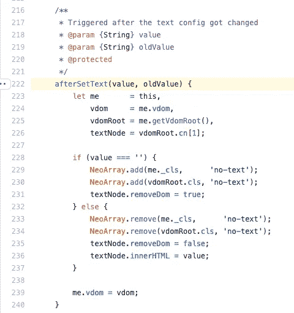

[src/button/base . mjs # L222](https://github.com/neomjs/neo/blob/dev/src/button/Base.mjs#L222)

*【旁注 vdom】重要的部分是:*

```
*textNode.innerHTML = value;*
```

*→我们将新值映射到 vdom。在这个方法的最后我们使用:*

```
*me.vdom = vdom; // setter*
```

*简而言之:这个“任务”是通过 main 将当前的 vdom 和以前的版本发送给 vdom 工作者，vdom 工作者将创建增量，将这些增量发送回主线程，main 将它们应用到真正的 dom，并将成功响应发送回您的作用域:应用工作者。*

*vdom 有一个名为“removeDom”的可选属性= >您可以从真实的 dom 中删除一个节点，而不用通过这种方式从 vdom 中删除它。好处是保持 vdom 的结构一致。总是将 iconCls 作为第一个节点，将 text 作为第二个节点会很方便，以防多个方法可以更改它们。【端侧注释 vdom】*

**重要提示**:对于类层次结构中的每个类配置，你只能使用一次尾部下划线。示例:

```
class MyButton extends Button {
    static getConfig() { return {
        text: 'My Button'
    }}
}
```

没有尾随下划线，因为我们已经在 Button 类中有了它。如果你不小心再次添加，框架会警告你。我们只是更改配置的值，这不会覆盖业务逻辑。

使用实例:

```
const myButton = Neo.create(Button, {
    iconCls: 'fa fa-home',
    text   : 'My Button'
});myButton.set({
    iconCls: 'fa fa-user',
    text   : 'Something else'
});
```

1.  请使用`Neo.create()`而不是 new 运算符，因为这将在内部触发`onConstructed()`和`init()`。
2.  与扩展类一样，这里不使用尾部下划线(只是传递值)。
3.  您可以使用`set()`一次更改多个配置。尤其是当多个配置映射到 vdom 时，这很有意义。

坏例子:

```
myButton.iconCls = 'fa fa-user';
myButton.text    = 'Something else';
```

会以同样的方式更改配置，但这会触发 vdom 引擎**两次**。使用`set()`，这种情况只会发生一次。既然我们确实关心性能，那么`set()`就是我们要走的路。

# 8.创建 header 容器

编码部分终于可以开始了:)

让我们回到我们的`MainContainer.mjs`文件，删除虚拟应用程序的内容:

现在重新加载您的浏览器选项卡:

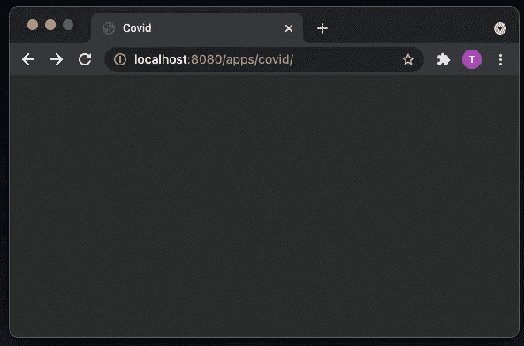

尤其是在有人想出将整个 UI 开发转移到 nodejs 之前，您已经在使用 JavaScript 的情况下，您现在可能会感到轻松。

您刚刚更改了一个 ES8+模块，您重新加载了浏览器，您的更改就在那里。**不涉及**构建过程或传输。

原因是如此琐碎，但在这一点上值得一提:它的工作是因为…猜猜看…浏览器应该处理 JavaScript。

使用容器时，首先要选择的是布局。最有用的一个很可能是 Flexbox，带有扩展名 HBox 和 VBox(水平框、垂直框)。让我们应用 VBox 并添加一些虚拟项目:

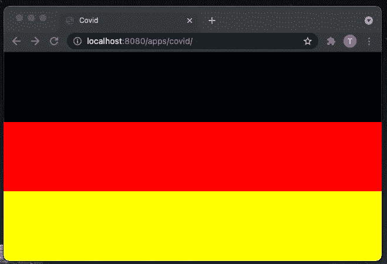

很好，我们有德国国旗。您可以将 camelCase 用于您的样式定义，或者将它们作为字符串应用。我更喜欢驼色版本。

让我们将布局切换到 hbox，并切换项目 2 和 3 的颜色:

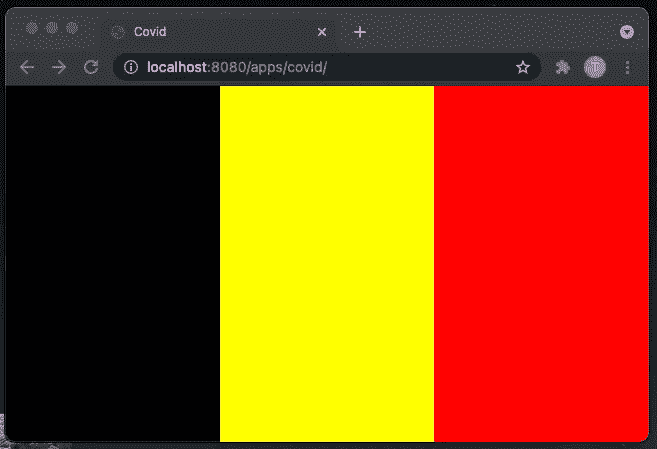

你换成了比利时的国旗。

```
layout: {ntype: 'hbox', align: 'stretch', **direction: 'row-reverse'**},
```

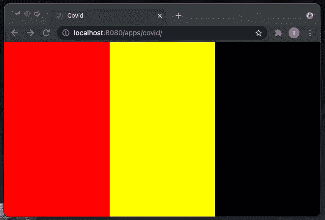

你可能发明了一面新的国旗。很简单，对吧？

关于布局的更多信息,“文档”应用程序是您最好的朋友:

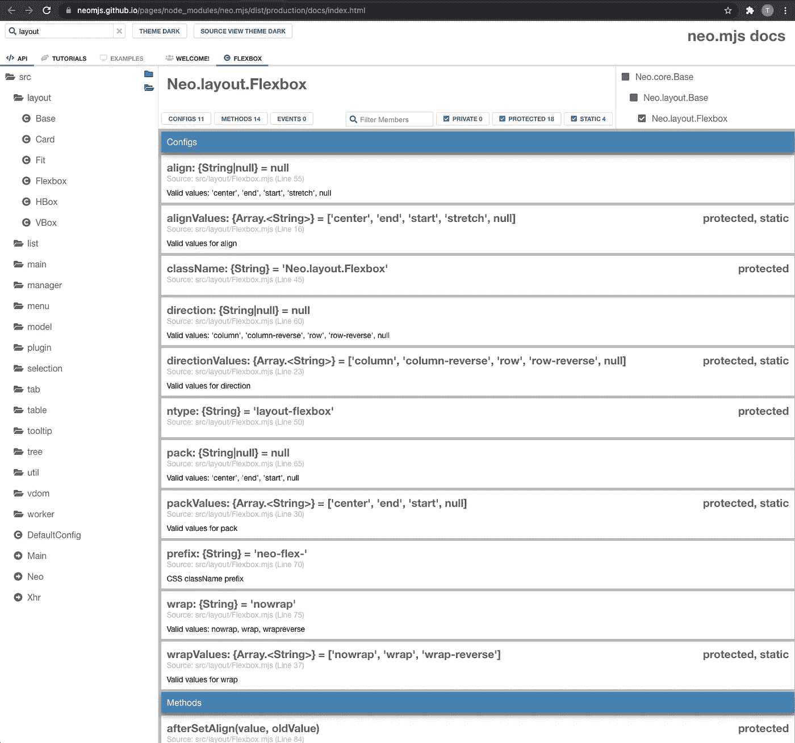

我使用左上角的搜索字段，取消选中父类复选框(右上角)。

显然，can 也可以深入到代码中寻找配置选项:
[src/layout/flexbox . mjs](https://github.com/neomjs/neo/blob/dev/src/layout/Flexbox.mjs)

与其他通用框架/库的区别:一个布局扩展了`core.Base`，而不是`component.Base`，因为它没有与 DOM 相关的输出。

你可能会想到的问题是:“什么是 ntype？”

`ntype`只是一个你知道已经存在的组件的快捷方式。你肯定记得:Viewport 在某个点扩展了`component.Base`。因此，组件必须在我们的模块中可用。

您当然可以导入它:

然后将 ntype 切换到 module，直接使用。你会同意，虽然这感觉像在这里创建锅炉板代码，所以我们将再次删除它。

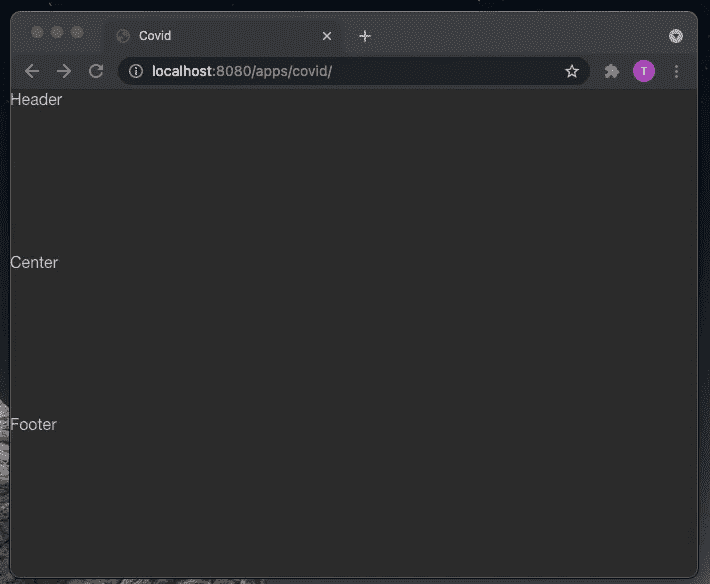

既然我们关心 OOP，就让我们把 Header 移到它自己的类中。我们在视图文件夹中创建文件`HeaderContainer.mjs`:

一个非常基本的类定义:我们正在扩展`container.Base`，我们正在使用 HBox 布局。“cls”配置将应用于该类的 vdom 根节点，height 是向 vdom 根节点添加高度样式的快捷方式。

我们还添加了一个徽标组件。这一个使用的是 image 标签，而不是默认的 div 标签，所以我们将标签& src 添加到 logo vdom 对象中。

下一步是将新的 HeaderContainer 包含到主容器中:

这里很酷的一点是，您实际上可以直接将 JS 模块放入容器项中。

重新加载您的应用浏览器选项卡:

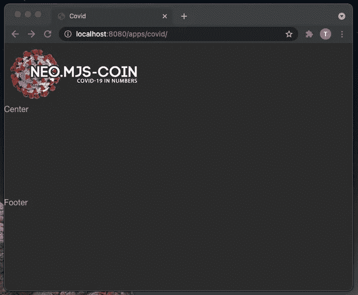

完美！你刚刚知道如何保持你的代码库模块化和整洁。

因为 height 更像是一个布局驱动的配置，所以让我们将它从 HeaderContainer 类中移除，并将其添加到实例配置中:

我们切换到使用`module`配置来传递 HeaderContainer，因为这允许我们只为这个实例传递配置，而不会影响 HeaderContainer 类，我们可以在其他具有不同高度的地方使用它。

重新加载您的浏览器选项卡，结果是一样的。

我们现在将其他 DOM 标记添加到 HeaderContainer 中。这真的只是 HTML/ CSS。只需用以下代码替换您的 HeaderContainer 文件:

之后，再次重新加载您的浏览器选项卡:

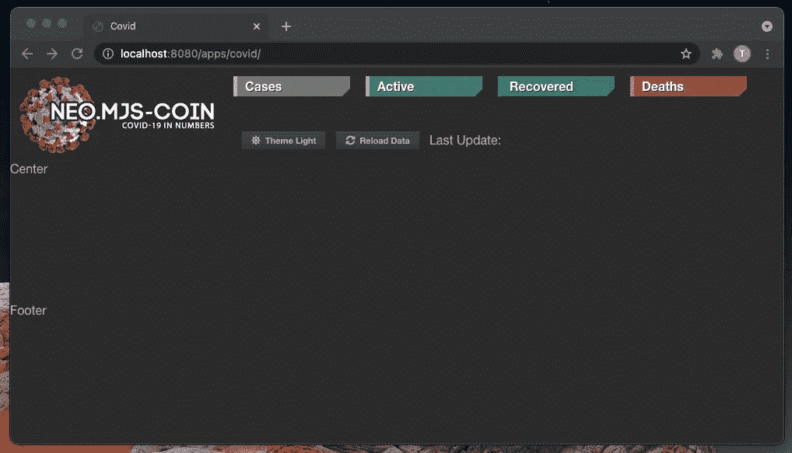

现在，这看起来已经非常接近我们将要构建的应用程序了。

我在这里做了一点手脚，已经把需要的样式定义包含到 neo.mjs 主题中了。看一看:

[资源/scss/theme-dark/apps/covid/header container . scss](https://github.com/neomjs/neo/blob/dev/resources/scss/theme-dark/apps/covid/HeaderContainer.scss)
[资源/scss/src/apps/covid/header container . scss](https://github.com/neomjs/neo/blob/dev/resources/scss/src/apps/covid/HeaderContainer.scss)

如果你仔细观察，你会发现导出 CSS 变量是可选的。

查看我们当前的应用程序，您会注意到

1.  点击 2 个按钮将会抛出错误
2.  目前还没有数据

如果您想了解更多关于使用基于 JSON 的虚拟 DOM 的信息:

[](https://medium.com/dataseries/your-benefits-of-working-with-json-based-virtual-dom-7318a983da9e) [## 使用基于 JSON 的虚拟 DOM 的好处

### 许多以前的同事和朋友找到我，问我:“你是如何做到如此高效和快速的……

medium.com](https://medium.com/dataseries/your-benefits-of-working-with-json-based-virtual-dom-7318a983da9e) 

关于基于应用程序的主题样式的更多信息:

[](/application-based-themed-styling-for-your-components-d8becd1217a9) [## 基于应用程序的组件主题样式

### 更准确地说:基于工作空间的样式

itnext.io](/application-based-themed-styling-for-your-components-d8becd1217a9) 

# 9.创建 MainContainerController

让我们从 HeaderContainer 中的切换主题按钮开始。

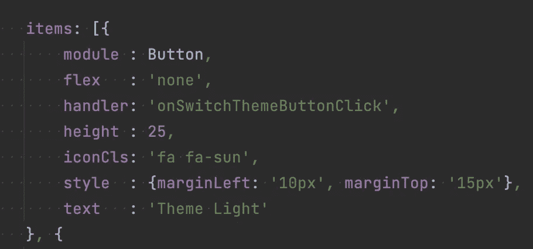

我添加了一个基于字符串的(点击)处理程序，这还不存在。这解释了单击按钮时的错误。我们可以将处理程序映射到这个类中的一个方法。以下截图只是举例，**不要**写。类似于:

1.  您可以在像`constructor`或`onConstructed`这样的方法中设置配置(在类层次结构中的所有构造函数完成后触发)。
2.  您可以使用非基于字符串的处理程序，并将它们直接映射到类方法。

不过，我们确实喜欢像 MVVM 这样的模式。所以这里需要一个视图控制器。我们运气好，`controller.Component`可用。

现在我们可以为 HeaderContainer 本身添加一个控制器，但是由于这个控制器实际上并没有做太多事情，所以让我们只为主容器添加一个控制器。

添加文件 view/maincontainercontroller . mjs:

只是一个基本的设置。快速浏览文档以检查类层次结构:

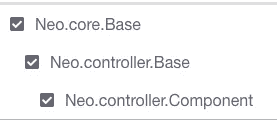

是**而不是**延伸`component.Base`。

回到我们的 MainContainer 文件，添加 import 语句，将 JS 模块添加到控制器配置中:

可爱:)

框架会为你创建一个控制器实例。

重新加载您的浏览器选项卡:

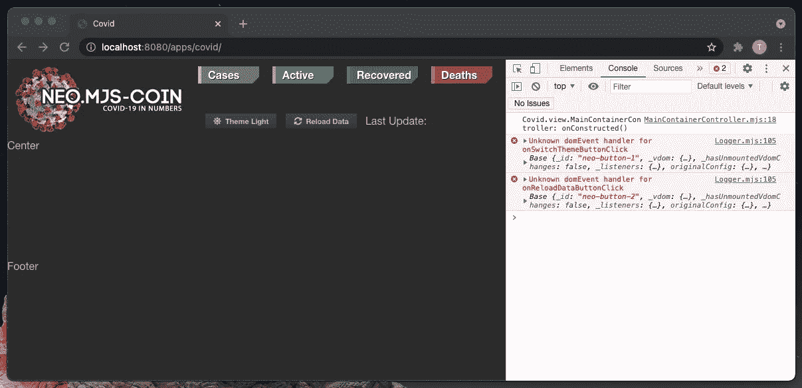

我们可以看到我们添加的`onConstructed()`日志，现在我们也得到 2 个真正的错误，因为控制器抱怨缺少按钮处理程序映射。

我们在这里学到了非常重要的东西:

1.  不是每个视图都需要自己的控制器。如果视图本身没有控制器，它可以与最近的父控制器通信。
2.  想象一下，我们还会添加一个 HeaderContainerController。然后，您可以在这个控制器中添加处理程序方法，或者仍然坚持使用 MainContainerController 并将它们放在那里。或者将一些放在一个控制器中，其余的放在另一个控制器中。因为这对你的建筑有意义。发挥创造力！

添加 2 个缺失的处理程序，重新加载浏览器选项卡，单击按钮:

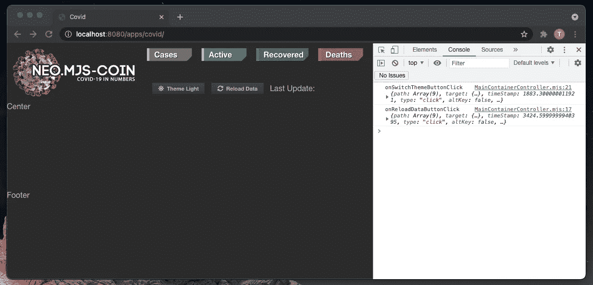

好了，我们可以开始研究业务逻辑了。

在此之前，我想向您展示一些关于“配置驱动”方法的其他内容:

展开控制台内的实例，向下滚动并查找:

```
iconPosition: (...)
```

点击 3 个点(它是一个吸气剂),它们会变成

```
iconPosition: "left"
```

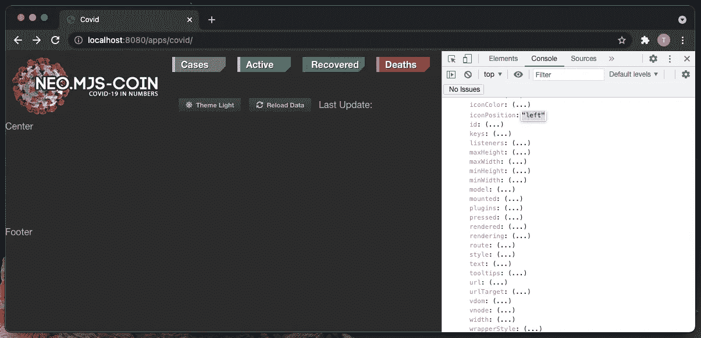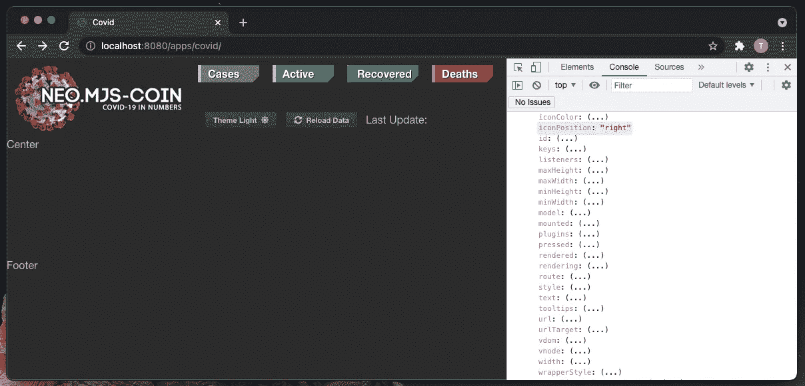

好的，我们现在只需要**和**来做这件事:

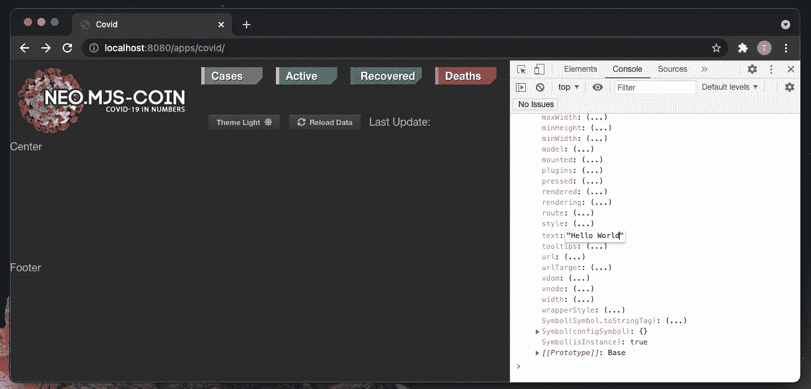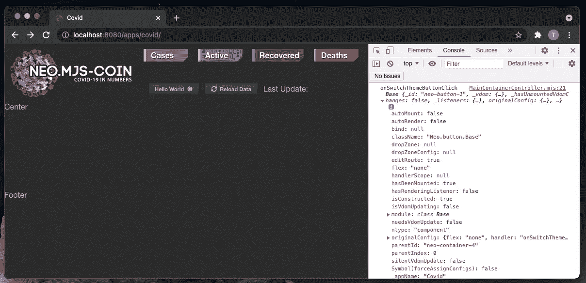

在引擎盖下，我们只是改变了应用工人内部的配置。这些配置与按钮 vdom 相关联，因此应用程序工作人员会将新的和旧的 vdom 发送到 vdom 工作人员，这个工作人员会创建增量，将它们发送回 main，它们会应用到真正的 dom，我们会在应用程序范围内收到一条成功消息。

仍然不容易，但是重复这个感觉很重要。

回到我们的“Hello World”…我指的是“切换主题”按钮。

用以下代码替换 onSwitchThemeButtonClick(数据):

重新加载您的浏览器选项卡，然后单击切换主题按钮:

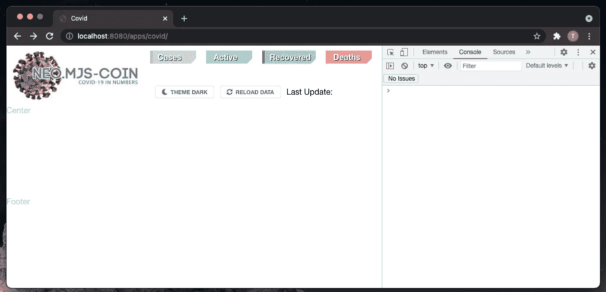

当我们点击“切换主题”按钮时，会发生三件事

1.  更准确地说，我们切换主题:由于我们使用 CSS 变量，我们只需切换 MainContainer 顶层 DOM 节点上的类，以便为每个主题切换到不同的 CSS 变量。您也可以将主题应用到应用程序的各个部分(例如，参见 docs 应用程序作为一个实例)。
2.  我们交换了商标。
3.  我们改变了“切换主题”按钮的`iconCls`

这里重要的一点是，我们给了徽标一个参考配置:

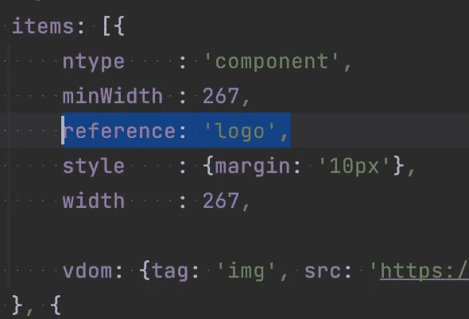

这允许我们在控制器中获得徽标组件实例:

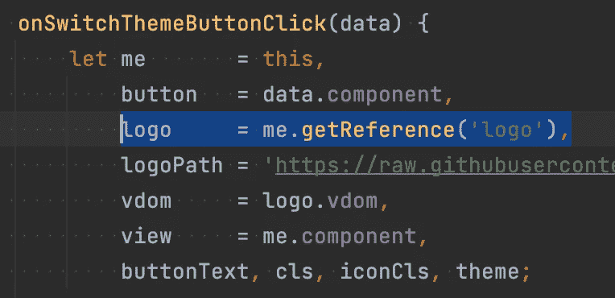

# 10.将我们的应用程序连接到 disease.sh API

一个没有数据的应用有点无聊，所以作为本教程的倒数第二步，让我们把它连接到下面的外部 API:

[https://github.com/disease-sh/API](https://github.com/disease-sh/API)

让我们稍微增强一下我们的 MainContainerController:

我们补充道:

1.  作为 JS 模块变量的 apiSummaryUrl
2.  loadSummaryData()只是在端点上使用 fetch()
3.  applySummaryData()只是记录输出

重新加载您的浏览器选项卡，点击“重新加载数据”按钮:

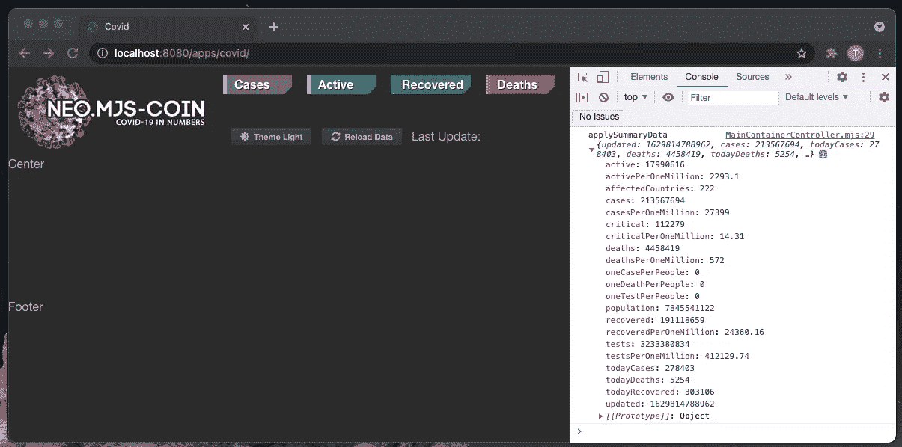

现在这个看起来很有前景(不是内容，那个很吓人！).

因为我们确实想以一种好的方式格式化我们的数字，并在不同的地方使用格式化方法，所以我们添加了最后一个文件:

covid/Util.mjs

我们正在扩展`core.Base`，并使用一个名为`formatNumber()`的静态方法。我们不需要创建这个类的实例。

将其导入 MainContainerController 并添加`applySummaryData()`逻辑接下来:

我们通过引用获取 total-stats 容器以及最近更新的文本，然后通过添加用我们的实用程序类格式化的 API 数据来更改虚拟 dom。

我们还添加了 onConstructed()来立即触发对 API 的第一次调用(无需点击按钮)。

最后，再次出现了

```
container.vdom = vdom;
```

魔术(你知道，工人乒乓球赛)。

重新加载您的浏览器选项卡:

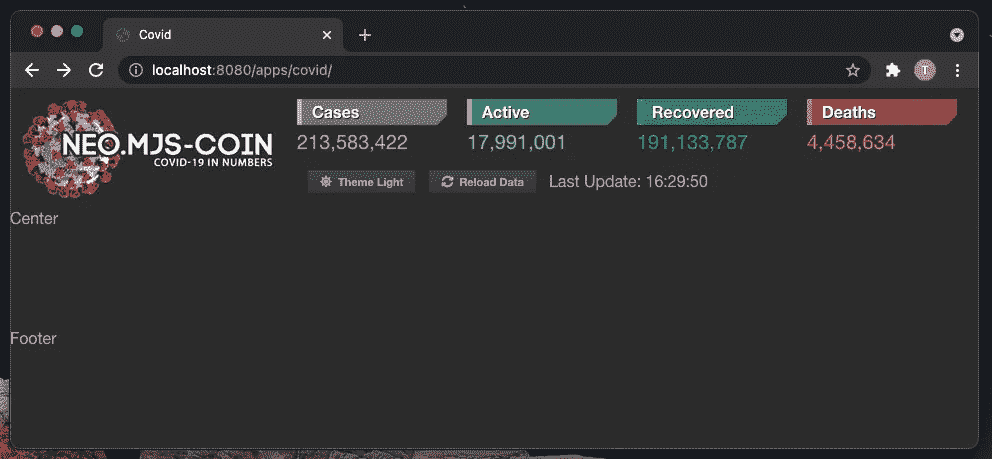

这就是第一部分的最终结果！

# 11.为生产部署您的应用

现在你很可能也想在 Firefox & Safari 中看到你的应用。

公平点:)

```
npm run build-all
```

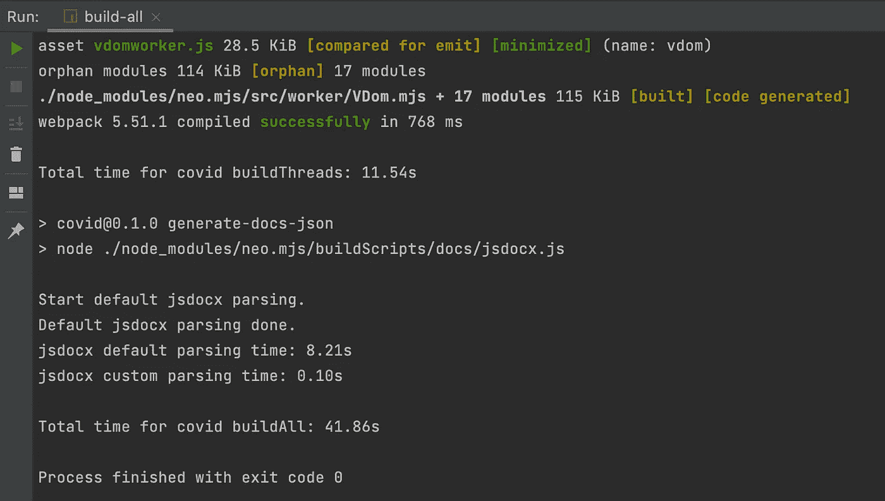

在 Firefox & Safari 中打开`dist/development`或`dist/production`版本:

火狐浏览器:

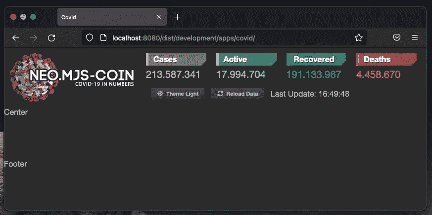

Safari ( **非**科技预览版):

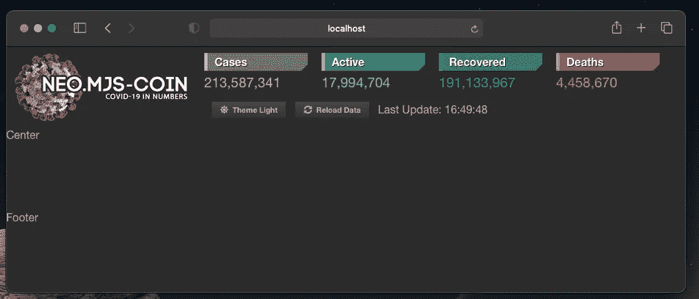

再次打开“文档”应用程序:

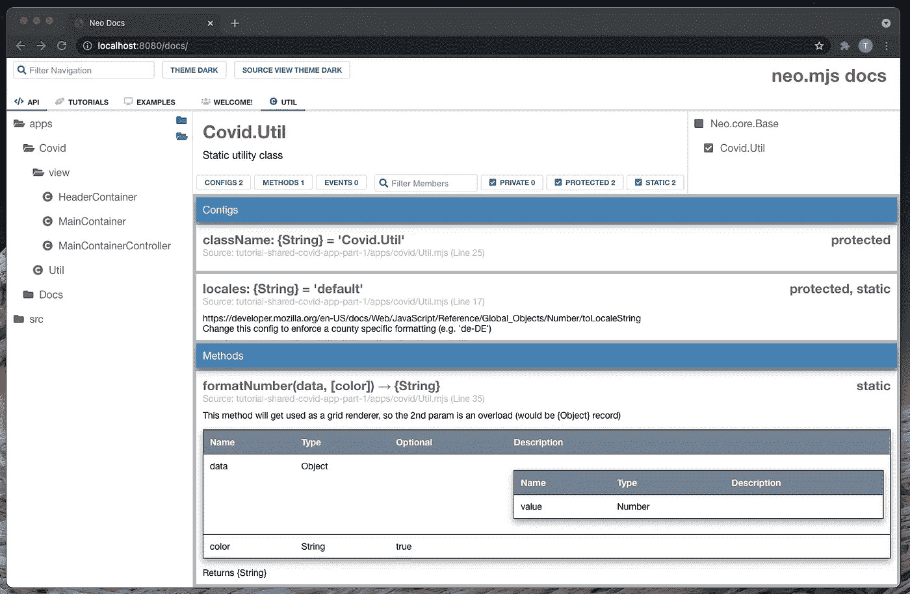

因为 build-all 包含 generate-docs 任务，所以现在在 docs 中有了最新版本的应用程序。

# 12.摘要

哇！如果你正在读这篇文章，我非常为你骄傲！

这是一个有大量内容的教程地狱。

您刚刚了解到:

1.  如何使用 npx neo-app 创建应用外壳
2.  配置系统的基本概念
3.  如何修改您的主视图
4.  如何通过分离类来保持你的架构模块化
5.  如何创建和使用组件控制器
6.  如何切换主题
7.  如何连接到外部 API

万一有问题，一定要问！

此时，您已经准备好创建自己的应用程序了。

在更多地使用 neo.mjs 之后，你也可以为这个项目做出贡献。如果你喜欢这些概念，加强它们。如果你没有，开始讨论应该改变什么。

加入松弛通道:

[](https://join.slack.com/t/neomjs/shared_invite/zt-6c50ueeu-3E1~M4T9xkNnb~M_prEEOA) [## 在 Slack 上加入 neo.mjs

### 我们知道切换浏览器很麻烦，但是我们希望你的 Slack 体验是快速、安全和最好的…

join.slack.com](https://join.slack.com/t/neomjs/shared_invite/zt-6c50ueeu-3E1~M4T9xkNnb~M_prEEOA) 

# 13.最后的想法

如果您想获得更多关于如何创建自己的组件的信息，neo.mjs 博客中有一些深入的指南:

[https://neomjs.github.io/pages/](https://neomjs.github.io/pages/)

例如:

[](/component-development-how-to-create-a-collapsible-fieldset-in-neo-mjs-311bf465d829) [## 组件开发:如何在 neo.mjs 中创建可折叠字段集

### 我被要求创建更多的内容，以帮助新开发人员跟上速度。一般来说，有两个主要的…

itnext.io](/component-development-how-to-create-a-collapsible-fieldset-in-neo-mjs-311bf465d829) [](/how-to-create-a-list-containing-checkbox-fields-and-keynav-in-125-lines-of-code-88b440de2951) [## 如何用 125 行代码创建包含复选框字段和 KeyNav 的列表

### 我只是需要这个小部件来实现 neo.mjs 日历。

itnext.io](/how-to-create-a-list-containing-checkbox-fields-and-keynav-in-125-lines-of-code-88b440de2951) 

您可以在以下位置找到 neo.mjs 框架存储库:

[](https://github.com/neomjs/neo) [## GitHub - neomjs/neo:应用工人驱动的前端框架

### neo.mjs 使您能够使用一个以上的 CPU 创建可扩展的高性能应用程序。不需要照顾一个…

github.com](https://github.com/neomjs/neo) 

不久前我已经为 neo.mjs v1 写了一篇第 2 部分的文章。逻辑是相似的，但是视图模型此时还不存在:

[](https://medium.com/swlh/how-to-create-a-webworkers-driven-multithreading-app-part-2-3c5b3c2d1adb) [## 如何创建 webworkers 驱动的多线程应用程序—第 2 部分

### 内容

medium.com](https://medium.com/swlh/how-to-create-a-webworkers-driven-multithreading-app-part-2-3c5b3c2d1adb) 

**行动呼吁:**

如果你想看 neo.mjs v2.3 第二部分的重写，请在这里添加评论！

如果你创建了自己的 neo.mjs 应用程序，并就此写了一篇博文，我很乐意在博客中分享。就给我 ping:)

**期待您的反馈！**

问候&快乐编码，
托拜厄斯

预览图像:

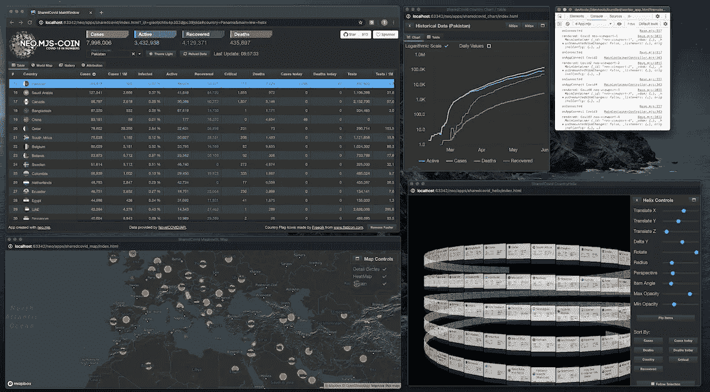