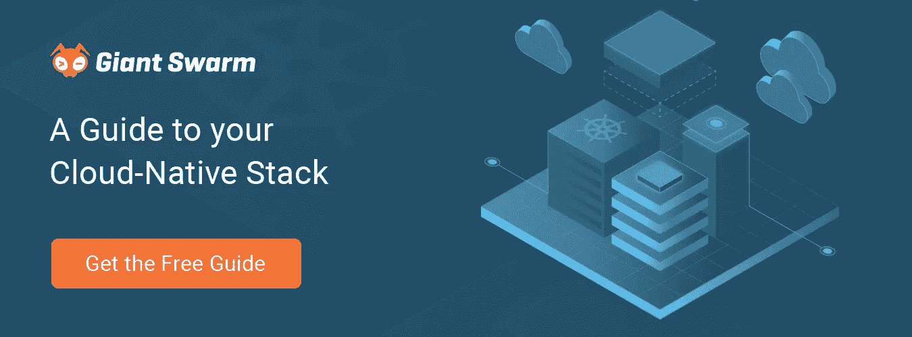

# 定义云原生堆栈

> 原文：<https://itnext.io/defining-the-cloud-native-stack-822c9bcb9ab5?source=collection_archive---------5----------------------->

如果你了解 IT 领域的流行趋势，那么你一定会注意到近年来围绕“云原生”的讨论。每个人都在谈论它，整个会议都被组织起来讨论它。甚至有一个突出的、厂商中立的基金会，其目的是促进“云原生”计算。

但它是什么，它给我们带来了什么好处？让我们从定义“云原生”的含义开始。

> 准备好深入这个迷人的话题了吗？在此下载您的 [**云原生必备指南-堆栈**](https://www.giantswarm.io/guide-cloud-native-stack) **。**

# 什么是云原生？

在过去的几年里,“原生云”这个术语已经充斥了我们的词汇，但却没有一个具体的定义。对于不同的人来说，它似乎意味着略微不同的事情，甚至由[云本地计算基金会(CNCF)](https://www.cncf.io/) 提供的[定义](https://github.com/cncf/toc/blob/master/DEFINITION.md)也在相对较短的时间内经历了[的演变](https://lists.cncf.io/g/cncf-toc/message/1541)。

我们可以肯定的是，这是一种将软件应用程序设计成小型、分布式、松耦合服务的新方法。这些可以使用高度自动化部署到不同的目标环境(包括云)，而不需要重新调整服务以考虑环境。这些服务的组成使得它们可以轻松地伸缩，以应对不断变化的需求，并通过冗余提供弹性。

用技术或流程术语来表达云原生的目的总是很诱人的，但从根本上说，云原生的目的是帮助企业。目标是当他们对其操作范围内的刺激做出反应时变得更加敏捷。它帮助创新者引领他们选择的市场。它有助于老牌企业智胜竞争对手。它帮助服务提供商快速响应客户需求。

为您的业务采用云原生方法并非易事。除了您的企业需要采纳的重大战略和文化变革之外，熟悉模式、技巧和[技术](https://landscape.cncf.io/format=landscape&fullscreen=yes)也是必要的，所有这些都有助于云原生堆栈的组成，即部署和运行软件应用的环境。

# 微服务

云原生方法的一个基本组件是微服务。它是一个独立的小代码单元，或者代表一个对等服务执行任务，或者使用另一个对等服务，或者两者兼而有之。它的特点是定义良好的接口，通常通过 API 调用启动。一组松散耦合的微服务构成了一个完整的逻辑软件应用程序。

作为一种架构模式，自从 Docker 的出现和容器的商品化以来，对微服务的兴趣一直呈指数级增长。术语“微服务”和“容器”经常互换使用，人们经常认为它们是同义词。尽管大肆宣传该模式是所有问题的解决方案，但采用该模式也有很多好处。诀窍是睁大你的眼睛，向前人学习。

**预期收益**

有大量[记录的好处](https://dzone.com/articles/benefits-amp-examples-of-microservices-architectur)与采用微服务模式相关，这里只是几个例子:

开发团队的自主权

当涉及到团队所负责的代码时，为团队提供清晰、明确的界限，为他们提供了更大的自主权。这意味着他们可以独立于负责其他服务的其他团队开发自己的代码，这释放了每个团队的内在潜力。

**更快的迭代**

这种独立性允许团队按照自己的速度前进。这给了他们迭代问题的方法，比要求他们适应其他团队的关注要快得多。他们可以按照自己的节奏发布代码特性。

**实验**

再一次，团队从微服务方法中获得的独立性允许他们更自由地进行实验。他们可以对实验结果进行评估并采取行动，而不必担心它可能会对另一个团队的工作产生影响。这促进了创新，提高了灵活性和适应性。

**弹性和规模**

当然，扩展服务以适应服务需求的波动并确保服务弹性的能力是至关重要的。拥有松散耦合的服务，允许它们独立地扩展和复制，这都有助于保持有效的服务级别。

# 挑战

设计微服务来实现这些好处本身就是一个完整的主题，有大量的文章、书籍和研讨会专门讨论这个主题。虽然我们清楚我们可以获得的潜在利益，但我们也应该清楚，你不会不劳而获。如果说微服务模式减轻了我们与传统[整体应用](https://blog.heptio.com/what-is-a-monolithic-application-e375f5ad5ecb)相关的复杂性，那么它只是通过将复杂性转移到堆栈的不同层来实现这一点。

因此，我们得到了一组分布式的短暂微服务部署，而不是手动部署我们精心制作的整体，我们可以相对容易地喜欢和培养它。这些需要可靠和胜任的自动化、观察、通信和(希望只是)偶尔的补救。我们如何按需扩展这些服务？我们如何促进可靠、安全的服务间通信？我们如何处理服务降级或失败？

处理这种复杂性的需求已经见证了专用于运行微服务的编排平台的发展，如 [Apache Mesos](https://mesos.apache.org/) 或 [Kubernetes](https://kubernetes.io/) 。尤其是 Kubernetes，它对云原生社区产生了极大的兴趣。通过在平台本身中隐藏一些与微服务相关的复杂性，开发人员可以通过他们构建的软件应用程序继续创造价值。

虽然一个平台负责为微服务提供自动化的运行时环境，但它并不(也许不应该)总是提供我们为微服务运行健壮环境所需的一切。我们需要通过监控和日志记录功能来观察部署的服务，需要促进可靠流量交付的方法，需要能够通过分布式跟踪来调试错误的事务，等等。幸运的是，我们不需要从头开始编写所有这些功能。相反，我们可以通过仔细选择和实现适当的工具来实现大部分甚至所有这些事情。

# 标准化

云原生技术的出现带来了一个显著的结果，那就是当涉及到构成云原生堆栈的工具时，有了更多的选择。这是我们将在未来关于云原生堆栈的指南中返回的主题。

将执行这些关键功能的工具选择留给负责每个微服务的不同团队可能很有吸引力，但这种方法很可能会适得其反。团队独立性是云原生方法的巨大优势之一。但是，当涉及到操作微服务环境时，操作工具的通用性或标准化会使任务更高效，更不容易出错，并提高团队和组织的速度。

**自动化**

云原生方法依赖于快速、可靠和有效地促进变化，对应用程序的消费者影响很小或没有影响。随着软件和支撑它的基础设施的不断变化，除非我们可以用健壮的自动化来代替手工模式，否则我们最终会被我们引入的复杂性所淹没。因此，自动化是云原生方法的一个关键方面。

**基础设施**

随着云计算现在成为消费计算基础设施的公认标准，从它提供的一切中受益是有意义的。它符合云原生应用消费的按需性质，并帮助我们最大限度地发挥应用运行基础架构的价值。即使您选择将您的条目抽象到一个更高的级别，例如在 Kubernetes 平台级别，您仍然可以从基于云的服务的动态、按需、弹性本质中受益。

然而，必须确保基础设施是以声明方式定义的，并且由合适的自动化工具支持。能够以等幂方式创建、重新创建和扩展基础设施，对于维护托管应用服务的平台的完整性非常重要。例如，你可以使用特定于云的自动化，比如 [AWS CloudFormation](https://aws.amazon.com/cloudformation/) 或[Google Cloud Deployment Manager](https://cloud.google.com/deployment-manager/)，或者满足于使用 [Terraform](https://www.terraform.io/) 、 [Pulumi](https://pulumi.io/) 或类似的更不依赖于云的方法。

**持续集成和交付(CI/CD)**

云原生方法的另一个基石是软件应用程序更新新功能和修复的速度和频率。当代码由一个开发团队开发，并且完成的代码在准备部署之前需要合并、构建、测试和打包时，需要有高度的自动化。如果这个部署管道由手动步骤组成，那么它很容易出错，并且只能以人类能够执行这些步骤的速度进行。

这就是为什么支持软件持续集成和交付的工具越来越多。再一次，在云原生时代，我们有太多的选择。有些工具可以追溯到云原生时代之前，例如 [Jenkins](https://jenkins.io/) ，这些工具已经[发展和调整](https://jenkins-x.io/)，以提供专门与云原生方法一致的 CI/CD 功能。还有一些随着云原生时代成长起来的工具，包括像 [GitLab](https://about.gitlab.com/product/continuous-integration/) 和 [Drone](https://drone.io/) 这样的工具。

**GitOps**

一个有趣的方向是整合基础设施和云原生应用的自动化技术。这种方法被称为“GitOps”，因为它依赖于在像 [Git](https://git-scm.com/) 这样的源代码版本控制系统中保存声明性配置，以及与部署基础设施和应用程序相关的操作性质。声明性配置是应用程序运行环境以及定义应用程序的代码的“唯一真实来源”。对于一个 Kubernetes 集群，我们可以在堆栈的所有级别上连续辨别期望状态和实际状态之间的差异。GitOps 方法的例子是 Weaveworks， [Weave Flux](https://www.weave.works/oss/flux/) 。

**DevOps**

自然，这一切都有人的因素，因为你需要软件开发人员编写代码，你需要工程师在生产中部署和管理工作负载。在云原生时代之前，这两个角色实际上是分开的、截然不同的。DevOps 运动旨在通过协作、软件应用及其运行环境的共同责任和所有权来打破这些障碍。术语 DevOps 经常被一个组织使用的工具，或者它采用的过程和实践错误地定义。虽然这些事情可能是采用 DevOps 的副产品，但最终 DevOps 是一个组织内的文化问题，其中开发人员和工程师的角色要么模糊到模糊不清的程度，要么以高度协作为特征。

云原生范式不能声称已经“发明”了 DevOps。相反，就像微服务模式和自动化技术的进步一样，它已经成为各种规模、形状和颜色的公司加速采用微服务的推动者。改变文化对这些组织来说是一个巨大的挑战，但如果没有文化，实现云原生方法优势的旅程将会受到严重阻碍。

**结论**

在过去的几年中，云原生已经从一个炒作的时髦词发展成为一种为其采纳者提供真正商业价值的切实可行的方法。它让企业能够以以前无法做到的方式适应、改变和创新。但要掌握云原生方法，需要在战略、文化、流程和员工技能方面做出重大改变。你的旅程应该仔细计划和执行。

为了帮助你在广泛的技术和令人困惑的选择中导航，[下载 Giant Swarm 的最新指南](https://info.giantswarm.io/guide-cloud-native-stack)到云原生栈。

由[Puja Abbas si](https://twitter.com/puja108)——开发者倡议@ [巨型群体](https://giantswarm.io/)撰写

 [## Puja Abbassi

### Puja Abbassi 的最新推文(@puja108)。开发者关系&产品@ GiantSwarm 研究员；主题…

twitter.com](https://twitter.com/puja108)