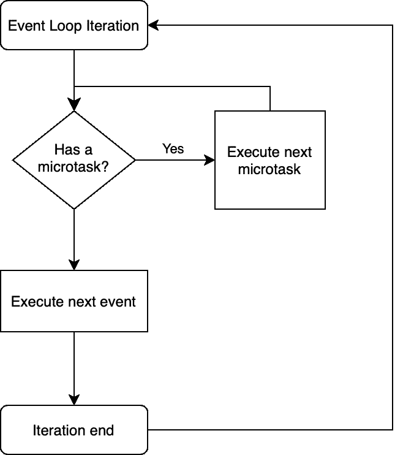

# 颤振中延迟的代码执行

> 原文：<https://itnext.io/delayed-code-execution-in-flutter-23d60b51e76f?source=collection_archive---------3----------------------->

微任务，Future 或者 postFrameCallback，我该用哪个？


在本文中，我将带您深入了解 Flutter，并了解更多关于调度代码执行的信息。作为对话的开始，让我们假设我们正在使用 [Provider](https://pub.dev/packages/provider) 库构建一个标准 [BLoC](https://flutter.dev/docs/development/data-and-backend/state-mgmt/options#bloc--rx) 架构的应用程序。为了使这项任务具有挑战性，在打开一个新的屏幕时，我们将不得不发起一个网络请求来通过互联网获取某些东西。在这种情况下，我们有几个选项来启动我们的请求:

1.  在显示我们的屏幕之前获取数据，并显示预加载的数据。这可能不是最好的选择。如果您决定只获取所需的数据部分，您可能会加载大量不必要的数据或者用微调器阻塞用户界面。
2.  在`BLoC`中启动加载程序，就在屏幕显示之前，当创建`BLoC`本身时或通过使用一个协调器对象为您启动它。如果您想保持您的架构整洁，这将是推荐的方法。
3.  在屏幕的 [initState](https://api.flutter.dev/flutter/widgets/State/initState.html) 中启动加载过程，尝试将该逻辑封装在屏幕本身中。

就架构正确性而言，第三个选项可能不是最好的，但实际上是 Flutter 世界中相当常见的方法。让我们来检查一下，因为它在现实世界的场景中完美地展示了我们的主题。

出于演示目的，这里有一个示例代码。注意到它有什么问题吗？

```
import 'package:flutter/material.dart';
import 'package:provider/provider.dart';void main() {
  runApp(
    MaterialApp(
      title: 'Demo',
      home: ChangeNotifierProvider(
        create: (_) => MyHomePageBloc(),
        child: MyHomePage(),
      ),
    ),
  );
}class MyHomePage extends StatefulWidget {
  MyHomePage({Key key}) : super(key: key); @override
  _MyHomePageState createState() => _MyHomePageState();
}class _MyHomePageState extends State<MyHomePage> {
  @override
  void initState() {
    super.initState();
    context.read<MyHomePageBloc>().fetchData();
  } @override
  Widget build(BuildContext context) {
    final bloc = context.watch<MyHomePageBloc>(); return Scaffold(
      appBar: AppBar(),
      body: Center(
        child: bloc.loading ? CircularProgressIndicator() : Text(bloc.data),
      ),
      floatingActionButton: FloatingActionButton(
        onPressed: () => context.read<MyHomePageBloc>().fetchData(),
        tooltip: 'Fetch',
        child: Icon(Icons.add),
      ),
    );
  }
}class MyHomePageBloc with ChangeNotifier {
  String data = "Loading";
  bool loading = false; void fetchData() {
    loading = true;
    data = "Loading";
    notifyListeners(); Future.delayed(Duration(seconds: 3), () {
      loading = false;
      data = "Done";
      notifyListeners();
    });
  }
}
```

乍一看，似乎一切都很好。然而，如果你运行它，它将不可避免地崩溃，你会在你的日志中看到类似的东西:`*‘package:flutter/src/widgets/framework.dart’: Failed assertion: line 4349 pos 12: ‘!_dirty’: is not true.*`

这个错误表明**我们试图在构建时**修改小部件树。小部件的 [initState](https://api.flutter.dev/flutter/widgets/State/initState.html) 方法在构建过程中被调用**，因此任何从那里修改小部件树的尝试都将失败。在我们的例子中，当调用 fetch 方法时，它同步执行 [notifyListeners()](https://api.flutter.dev/flutter/foundation/ChangeNotifier/notifyListeners.html) ，这导致小部件树中的变化。**

当你试图做更多看似不相关的事情时，你可能会遇到类似的错误。例如，显示一个对话框，也会因为类似的原因而失败，因为[上下文](https://api.flutter.dev/flutter/widgets/BuildContext-class.html) ( [元素](https://api.flutter.dev/flutter/widgets/Element-class.html))当前还没有安装在小部件树中。

无论您尝试做什么，都必须延迟代码执行，直到构建过程完成。换句话说，您需要异步执行您的代码**。现在谈谈我们的选择。**

# **如何在 Flutter 中延迟代码执行？**

**通过在网上研究这个话题，我整理了一份最常推荐的解决方案清单。您甚至可以找到一些附加选项，但以下是最引人注目的选项:**

*   **[日程安排任务](https://api.flutter.dev/flutter/dart-async/Zone/scheduleMicrotask.html)**
*   **[未来< T >。微任务](https://api.flutter.dev/flutter/dart-async/Future/Future.microtask.html)**
*   **[未来<T>](https://api.flutter.dev/flutter/dart-async/Future/Future.html)**
*   **[未来< T >。延迟](https://api.flutter.dev/flutter/dart-async/Future/Future.delayed.html)**
*   **[Timer.run](https://api.flutter.dev/flutter/dart-async/Timer/run.html)**
*   **[widgetsbinding . addpostframcallback](https://api.flutter.dev/flutter/widgets/WidgetsBinding-mixin.html)**
*   **[scheduler binding . addpostframcallback](https://api.flutter.dev/flutter/scheduler/SchedulerBinding/addPostFrameCallback.html)**

**你可能会说，这是相当多的选择，而且你是对的。说到我们前面提到的问题，这些都可以解决。然而，现在我们面临着如此多种多样的选择，让我们放纵自己的好奇心，努力了解它们之间的差异。**

# **事件循环和多线程**

**你可能知道， **Dart 是单线程系统**。令人惊讶的是，您的应用程序可以同时做多件事情，或者至少看起来是这样。这就是`Event Loop`发挥作用的地方。一个`Event Loop`实际上是一个无限循环(对于 iOS 开发人员来说是[运行循环](https://developer.apple.com/library/archive/documentation/Cocoa/Conceptual/Multithreading/RunLoopManagement/RunLoopManagement.html)),它执行预定的事件。事件(或者只是代码块，如果你喜欢的话)必须是轻量级的，否则，你的应用会感觉滞后或者完全冻结。每个`event`，比如一个按钮的按下或者一个网络响应，都被安排在一个`events queue`中，等待被`Event Loop`拾取和执行。这种设计模式在 UI 和其他处理各种事件的系统中很常见。可能很难用几句话来解释这个概念，所以我建议如果你对这个主题不熟悉的话，可以另外读一些东西。不要想太多，我们实际上是在讨论一个简单的无限循环和一系列计划执行的任务(代码块)，每次循环迭代一个任务。**

**我们即将了解的飞镖`Event Loop`晚会的特邀嘉宾是[微任务](https://api.dart.dev/stable/2.10.5/dart-async/scheduleMicrotask.html)。我们的`Event Loop`里面有额外的队列，就是`Microtask Queue`。关于这个队列，需要记住的唯一一件事是:在执行`event`本身之前，在`Event Loop`的一次迭代中，将会执行**队列中调度的所有**任务**。****

****

**每次迭代首先执行**所有**到`microtasks`，接着执行一个`event`。循环重复。**

**不幸的是，没有太多关于这个主题的信息，我所看到的最好的解释可以在网络档案[这里](https://web.archive.org/web/20170704074724/https://webdev.dartlang.org/articles/performance/event-loop)或者[这里](https://dart.cn/articles/archive/event-loop)中找到。**

**有了这些知识，让我们看看上面列出的所有选项，并了解它们的工作方式和它们之间的差异。**

# **事件**

**任何进入`event queue`的东西。这是在 Flutter 中调度异步任务的默认方法。调度一个`event`，我们将它添加到`event queue`中，由`Event Loop`拾取。这种方法被许多抖动机制使用，比如 I/O、手势事件、定时器等。**

## ****定时器****

**[定时器](https://api.flutter.dev/flutter/dart-async/Timer-class.html)是 Flutter 中异步任务的基础。它用于调度`event queue`中的代码执行，有延迟或没有延迟。由此产生的有趣事实是，如果队列繁忙，您的计时器将永远不会执行，即使时间到了。**

*****如何使用:*****

```
Timer.run(() {
  print("Timer");
});
```

## ****未来< T >和未来< T >。延期****

**一种广为人知且广泛使用的飞镖[特征](https://api.dart.dev/dart-async/Future-class.html)。这可能会令人惊讶，但如果你看引擎盖下，你只会看到前面提到的`Timer`的包装。**

*****如何使用:*****

```
Future<void>(() {
  print("Future Event");
});Future<void>.delayed(Duration.zero, () {
  print("Future.delayed Event");
});
```

*****内部实现(*** [***链接***](https://api.flutter.dev/flutter/dart-async/Future/Future.html)***):*****

```
factory Future(FutureOr<T> computation()) {
  _Future<T> result = new _Future<T>();
  Timer.run(() {
    try {
      result._complete(computation());
    } catch (e, s) {
      _completeWithErrorCallback(result, e, s);
    }
  });
  return result;
}
```

# **微任务**

**如前所述，所有预定的`microtasks`都在下一个预定的`event`之前执行。建议**避开**这个队列，除非绝对有必要异步执行代码，但是在`event queue`的下一个`event`之前。您也可以将此队列视为属于前一个事件的任务队列，因为它们将在下一个事件之前完成。重载这个队列会完全冻结你的应用程序，因为它必须执行这个队列中的所有东西，然后才能继续下一个`event queue`的迭代，比如处理用户输入，甚至是呈现应用程序本身。然而，以下是我们的选择:**

## ****日程安排任务****

**顾名思义，在`microtask queue`中安排一个块代码。类似于`Timer`，如果出现问题，会使应用程序崩溃。**

*****如何使用:*****

```
scheduleMicrotask(() {
  print("Microtask");
});
```

## ****未来< T >。微任务****

**与我们之前看到的类似，将我们的`microtask`包装在`try-catch`块中，以一种简洁明了的方式返回执行结果或错误。**

*****如何使用:*****

```
Future<void>.microtask(() {
  print("Microtask");
});
```

*****内部实现(*** [***链接***](https://api.flutter.dev/flutter/dart-async/Future/Future.microtask.html)***):*****

```
factory Future.microtask(FutureOr<T> computation()) {
  _Future<T> result = new _Future<T>();
  scheduleMicrotask(() {
    try {
      result._complete(computation());
    } catch (e, s) {
      _completeWithErrorCallback(result, e, s);
    }
  });
  return result;
}
```

# **后帧回调**

**尽管前两种方法涉及较低层次的`Event Loop`机制，我们现在转向颤振领域。这个回调在渲染管道完成时被调用，因此它被**绑定到小部件的生命周期**。调度的时候只调用一次**，不是每一帧都调用。使用 [addPostFrameCallback](https://api.flutter.dev/flutter/scheduler/SchedulerBinding/addPostFrameCallback.html) 方法，您可以安排一个或多个回调在框架构建完成后执行。所有预定的回调将在帧的末尾按照它们被添加的顺序执行。在调用这个回调函数时，可以保证**小部件构建过程已经完成**。通过一些烟雾和镜子，您甚至可以访问小部件的布局( [RenderBox](https://api.flutter.dev/flutter/rendering/RenderBox-class.html) )，例如它的大小，并进行其他类型的不推荐的攻击。回调本身将在正常的事件队列中运行，默认情况下，Flutter 对几乎所有事情都使用这个队列。****

## ******调度绑定******

****这是一个负责绘图回调的 [mixin](https://dart.dev/guides/language/language-tour#adding-features-to-a-class-mixins) 并实现了我们感兴趣的这个方法。****

*******如何使用:*******

```
**SchedulerBinding.instance.addPostFrameCallback((_) {
  print("SchedulerBinding");
});**
```

## ******WidgetsBinding******

****我特意包括了这个，因为它经常和[调度绑定](https://api.flutter.dev/flutter/scheduler/SchedulerBinding-mixin.html)一起被提及。它从`SchedulerBinding`继承了这个方法，并增加了与我们的主题无关的方法。一般来说，不管你使用`SchedulerBinding`还是 [WidgetsBinding](https://api.flutter.dev/flutter/widgets/WidgetsBinding-mixin.html) ，两者都会执行**中完全相同的代码**。****

*******如何使用:*******

```
**WidgetsBinding.instance.addPostFrameCallback((_) {
  print("WidgetsBinding");
});**
```

# ****将我们的知识付诸实践****

****既然我们今天已经学了很多理论，我强烈建议先玩一会儿，以确保你理解正确。我们可以在之前的 initState 中使用下面的代码，并尝试预测它将以何种顺序执行，这看起来并不容易。****

```
**SchedulerBinding.instance.addPostFrameCallback((_) {
  print("SchedulerBinding");
});WidgetsBinding.instance.addPostFrameCallback((_) {
  print("WidgetsBinding");
});Timer.run(() {
  print("Timer");
});scheduleMicrotask(() {
  print("scheduleMicrotask");
});Future<void>.microtask(() {
  print("Future Microtask");
});Future<void>(() {
  print("Future");
  Future<void>.microtask(() {
    print("Microtask from Event");
  });
});Future<void>.delayed(Duration.zero, () {
  print("Future.delayed");
  Future<void>.microtask(() {
    print("Microtask from Future.delayed");
  });
});**
```

# ****结论****

****既然我们已经了解了这么多细节，您可以考虑一下如何安排您的代码了。根据经验，如果你需要你的上下文或者与布局或 UI 相关的东西，使用`addPostFrameCallback`。在其他任何情况下，用`Future<T>`或`Future<T>.delayed`安排在`event queue`就足够了。`microtask queue`是一个你可能永远也不会遇到的非常小众的东西，但是仍然值得了解。当然，如果您有一项繁重的任务，您会看到创建一个[隔离](https://api.dart.dev/stable/2.10.5/dart-isolate/Isolate-class.html)，正如您可能已经猜到的那样，它将由`event queue`进行通信。但这是另一篇文章的主题。感谢您的时间，下次再见。****

*****在考虑开发一个 Flutter 或者 iOS 的 app，或者寻找顾问或者人力？从初创企业到公司层面，我都可以雇佣。就* [*联系我*](https://oleksandrkirichenko.com/contact/) *看看我们能一起做什么！*****

*****喜欢这篇文章？别忘了砸这个拍手*👏*按钮让我感觉棒极了，有动力写更多！*****

*****原载于 2021 年 2 月 7 日 https://oleksandrkirichenko.com**的* [*。*](https://oleksandrkirichenko.com/blog/delayed-code-execution-in-flutter/)****