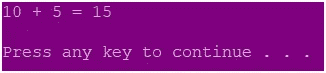
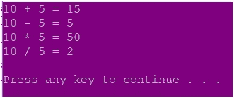
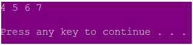
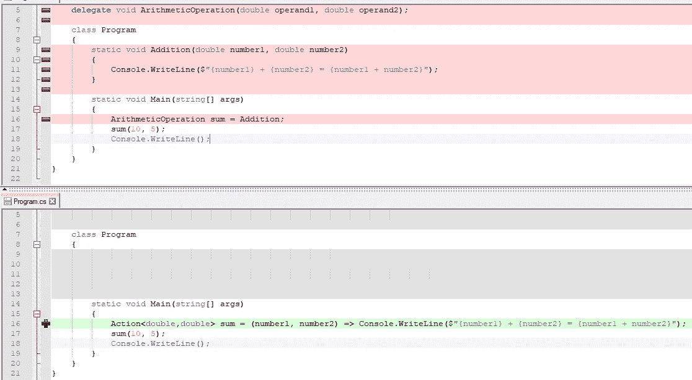
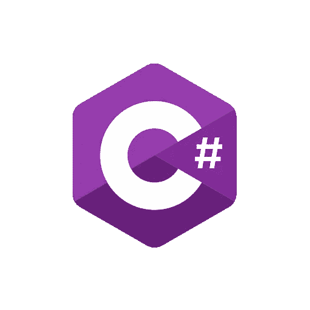

# 委托、匿名方法和 Lambda 表达式

> 原文：<https://itnext.io/delegates-anonymous-methods-and-lambda-expressions-5ea4e56bbd05?source=collection_archive---------0----------------------->

在这篇文章中，我将写下

*   代表
*   匿名函数(匿名方法和 Lambda 表达式)
*   内置委托(功能和动作委托)

让我们从什么是代表开始。

## 代表

[委托](https://docs.microsoft.com/en-us/dotnet/csharp/language-reference/keywords/delegate)是一种类型，它表示对具有特定参数列表和返回类型的方法的引用。

*   委托允许方法作为参数传递。
*   委托是一种引用类型，它保存方法的引用。
*   所有委托都隐式地从`System.Delegate`类派生。
*   C#通过委托处理回调函数和事件处理程序。

当你实例化一个委托时，你可以将它的实例与任何具有 ***兼容签名和返回类型*** 的方法相关联。您可以通过委托实例调用该方法。

下面是一个演示如何声明和实例化委托的示例:

输出:



**组播代理**

指向多个方法的委托称为多播委托。`+`操作符向委托对象添加一个函数，而`-`操作符从委托对象中删除一个现有的函数。

当调用多播委托时，它按顺序调用列表中的委托。只能组合相同类型的委托。

下面是多播代理用法的一个示例:

输出:



**C #中委托的演变**

在 C# 1.0 中，您通过使用代码中其他地方定义的方法显式初始化委托来创建委托的实例。

C# 2.0 引入了 ***匿名方法*** 的概念，作为编写可以在委托调用中执行的未命名内联语句块的方法。

C# 3.0 引入了 ***lambda 表达式*** ，在概念上类似于匿名方法，但更具表现力和简洁。

这两个特性统称为 ***匿名函数*** 。

*一般来说，针对 3.5 及更高版本的应用程序。NET Framework 应该使用 lambda 表达式。*

## **匿名方法**

匿名方法是没有名字的方法。C#中的匿名方法可以使用关键字`delegate`来定义，并且可以分配给委托类型的变量。

匿名方法

*   可以访问外部变量或函数。
*   可以作为参数传递
*   可以用作事件处理程序。

通过使用匿名方法，您可以减少实例化委托的编码开销，因为您不必创建单独的方法。

下面的例子展示了我们上面使用的委托例子的匿名方法版本:

## **λ表达式**

***λ表达式*** 是被视为对象的代码块(表达式或语句块)。它可以作为参数传递给方法，也可以通过方法调用返回。

Lambda 表达式是表示匿名方法的一种更简短的方式。

lambda 表达式使用`=>`、 [lambda 声明操作符](https://docs.microsoft.com/en-us/dotnet/csharp/language-reference/operators/lambda-operator)，将 lambda 的参数列表与其可执行代码分开。要创建 lambda 表达式，需要在 lambda 操作符的左边指定输入参数(如果有的话),并将表达式或语句块放在另一边。

下面是我们在第一个委托示例中使用的代码的 lambda 表达式版本:

对于上面的例子，我们可以省略花括号，因为只有一个语句，我们也可以排除参数类型。以下是简明版:

```
ArithmeticOperation sum = (number1, number2) => 
Console.WriteLine($"{number1} + {number2} = {number1 + number2}");
```

可以有不带任何参数的 lambda 表达式，我们可以在 lambda 表达式中使用局部变量，如下例所示:

输出:


Lambda 表达式也可以用于 LINQ 查询:

输出:



Lambda 表达式可以分配给 Func 或 Action 委托。我们将在下一节研究这些。

## **动作和功能委托**

C# 3.0 引入了内置的通用委托类型`Func`和`Action`，这样我们就不必声明自定义委托。这些包含在`System`名称空间中。

**动作委托**

C#中的 Action 表示具有 void 返回类型和可选参数的委托。

一个动作委托可以接受多达 16 个不同类型的输入参数。

在我们的委托示例中，我们将委托声明如下:

```
delegate void ArithmeticOperation(double operand1, double operand2);
```

如果我们使用一个动作委托，我们不需要这个声明，我们可以直接进行如下赋值:

```
Action<double,double> sum = Addition;
```

如您所见，参数类型必须相同。

因此，我们的代码如下:

可以将匿名方法分配给操作委托，如下所示:

lambda 表达式也可以与动作委托一起使用，如下所示:

如果你比较第一个版本和最后一个版本，你可以看到当我们使用动作委托和 lambda 表达式时，代码变得更加简洁:



**功能委托**

Func 委托用于返回值方法。

*   它可以包含最小 0 和最大 16 个输入参数和它必须包含一个输出参数。
*   Func 委托的*最后一个参数是输出参数或结果参数*。**
*   它还可以包含相同类型或不同类型的参数。
*   它不能包含`ref`或`out`参数*。*

现在，让我们修改我们从一开始使用的委托示例，以便它返回一个值:

如果我们想使用 Func 委托，我们不需要下面的自定义委托声明:

```
delegate double ArithmeticOperation(double operand1, double operand2);
```

我们可以进行如下分配:

```
Func<double,double,double> sum = Addition;
```

如您所见，参数类型必须匹配。

然后我们的代码变成如下:

我们可以为 Func 委托分配一个匿名方法，如下所示:

Func 委托也可以用于 lambda 表达式，如下所示:

我希望你觉得这篇文章内容丰富，易于理解。如果你在下面的评论中有任何问题和/或更正，请告诉我。

再见！



***参考文献***

[*https://docs . Microsoft . com/en-us/dot net/cs harp/programming-guide/delegates/*](https://docs.microsoft.com/en-us/dotnet/csharp/programming-guide/delegates/)

[*https://docs . Microsoft . com/en-us/dot net/cs harp/programming-guide/statements-expressions-operators/anonymous-functions*](https://docs.microsoft.com/en-us/dotnet/csharp/programming-guide/statements-expressions-operators/anonymous-functions)

[https://www . tutorialsteacher . com/cs harp/cs harp-anonymous-method](https://www.tutorialsteacher.com/csharp/csharp-anonymous-method)

[*https://docs . Microsoft . com/en-us/dot net/cs harp/programming-guide/statements-expressions-operators/lambda-expressions*](https://docs.microsoft.com/en-us/dotnet/csharp/programming-guide/statements-expressions-operators/lambda-expressions)

[*https://www . tutorial teacher . com/cs harp/cs harp-action-delegate*](https://www.tutorialsteacher.com/csharp/csharp-action-delegate)

[*https://www.geeksforgeeks.org/c-sharp-func-delegate/*](https://www.geeksforgeeks.org/c-sharp-func-delegate/)