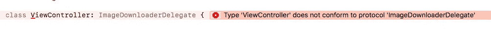

# 委托 vs 闭包回调

> 原文：<https://itnext.io/delegates-vs-closure-callbacks-f36f9029217d?source=collection_archive---------0----------------------->

还记得 Objective-C 中的代理模式有多棒吗？通过将您可能希望控制的部分委托出去，使类具有高度的可重用性。这是它在 Cocoa Touch 上无处不在的原因，它实在是太棒了！

但是有一种新的模式似乎正在悄悄地取代代表模式。我不确定它是否有正式名称，但我称它为:

*关闭回调模式*

你可能知道我指的是哪一个，但是如果你需要复习，这里有一些做事的方法:

```
protocol ImageDownloaderDelegate: class {
    func imageDownloader(_ downloader: ImageDownloader, didDownloadImage image: UIImage)
}class ImageDownloader { weak var delegate: ImageDownloaderDelegate? func downloadImage(url: URL) {
        // download the image asynchronously then...
        delegate?.imageDownloader(self, didDownloadImage: theImage)
    }
}
```

这里是闭包回调的方式:

```
class ImageDownloader { var didDownload: ((UIImage?) -> Void)? func downloadImage(url: URL) {
        // download the image asynchronously then...
        didDownload?(theImage)
    }
}
```

像其他人一样，当 Swift 问世时，我尝试了闭包回调模式，在我以前可能使用委托的地方使用它，以寻求不断增加的“迅捷”。尽管如此，我还是不满意。有时候感觉是一种进步，有时候不是。委托或闭包回调是更好的模式吗？我猜，嗯，*看情况*。

*不过要看什么*？？？让我们比较这两种方法，看看我们是否可以学到一些东西。

# 打破保留周期

每当两个对象相互引用时，其中一个必须持有对另一个的弱引用，否则我们就会得到一个保留循环。这两种模式对此的处理有天壤之别。

委托模式是如何做到的:

```
class ImageDownloader {
    weak var delegate: ImageDownloaderDelegate?
    //...
}class ImageViewer: ImageDownloaderDelegate { let downloader: ImageDownloader() init(url: URL) {
        downloader.delegate = self
        downloader.downloadImage(url: url)
    } func imageDownloader(_ downloader: ImageDownloader, didDownloadImage image: UIImage) {
        // view the downloaded image...
    }
}
```

*   `ImageDownloader`负责通过持有对其委托的`weak`引用来打破保留循环
*   弱/强关系只需要在一个地方定义
*   大会是为了让代表们保持虚弱，如果你忘记这样做，像 [SwiftLint](https://github.com/realm/SwiftLint) 这样的短绒会警告你

闭包回调是如何做到的:

```
class ImageDownloader {
    var didDownload: ((UIImage?) -> Void)?
    //...    
}class ImageViewer { let downloader: ImageDownloader init(url: URL) {
        downloader = ImageDownloader()
        downloader.downloadImage(url: url)
        downloader.didDownload = { [weak self] image in
            // view the image
        }
    }
}
```

*   `ImageViewer`负责确保它在回调中弱引用自己
*   弱/强关系必须在每次回调中正确实施
*   很容易出错，导致内存泄漏

这可能是做事情的老方法，但是委托模式在这方面是一个明显的赢家。`weak`关系只定义一次，出错的难度要大得多。

不过还有很多要考虑的，让我们看看闭包回调是否能自我救赎…

# 一对多关系

如果一个类需要使用多个`ImageDownloader`怎么办，我们的两种模式如何公平？

首先，代表模式:

```
class ProfilePage: ImageDownloaderDelegate { let profilePhotoDownloader = ImageDownloader()
    let headerPhotoDownloader = ImageDownloader() init(profilePhotoUrl: URL, headerPhotoUrl: URL) { profilePhotoDownloader.delegate = self
        profilePhotoDownloader.downloadImage(url: profilePhotoUrl) headerPhotoDownloader.delegate = self
        headerPhotoDownloader.downloadImage(url: headerPhotoUrl)
    } func imageDownloader(_ downloader: ImageDownloader, didDownloadImage image: UIImage) { if downloader === profilePhotoDownloader {
            // show the profile photo...
        } else if downloader === headerPhotoDownloader {
            // show the profile photo...
        }
    }
}
```

我们必须检查在每次回调中是哪个`ImageDownloader`实例在调用我们。如果你有一大堆委托方法，这将变得非常乏味。另外，你很可能会犯错误。

我敢肯定，我们以前都在一个应用程序上工作过，同一个对象是多个`UITableView`的代表。这不酷。

让我们看看闭包回调模式能否拯救我们:

```
class ProfilePage { let profilePhotoDownloader = ImageDownloader()
    let headerPhotoDownloader = ImageDownloader() init(profilePhotoUrl: URL, headerPhotoUrl: URL) { profilePhotoDownloader.didDownload  = { [weak self] image in
            // show the profile image
        }
        profilePhotoDownloader.downloadImage(url: profilePhotoUrl) headerPhotoDownloader.didDownload  = { [weak self] image in
            // show the header image
        }
        headerPhotoDownloader.downloadImage(url: headerPhotoUrl)
    }
}
```

这是一场明显的胜利。这两个实例的回调是完全独立的，所以我们不可能把它们搞混。

关闭回调赢得了这一次。现在是 1 比 1。让我们看看接下来会发生什么:

# 数据源

好吧，这些不是严格意义上的委托模式，但是我也见过用于向对象提供信息的闭包回调函数，所以我把它们包括进来。

让我们看一个基于`protocol`的数据源模式:

```
protocol SerialImageUploaderDataSource: class {
    var numberOfImagesToUpload: Int { get }
    func image(atIndex index: Int) -> UIImage
    func caption(atIndex index: Int) -> String
}class SerialImageUploader { weak var dataSource: SerialImageUploaderDataSource? init(dataSource: SerialImageUploaderDataSource) {
        self.dataSource = dataSource
    } func startUpload() { guard let dataSource = dataSource else { return } for index in 0..<dataSource.numberOfImagesToUpload {
            let image = dataSource.image(atIndex: index)
            let caption = dataSource.caption(atIndex: index)
            upload(image: image, caption: caption)
        }
    } func upload(image: UIImage, caption: String) {
        // Upload the image...
    }
}
```

*   协议方法都是必需的，所以如果`dataSource`存在，那么我们知道它已经实现了我们需要的所有方法
*   我们将数据源传递给了`init`方法，所以我们向这个类的用户明确表示数据源是必需的
*   如果我们稍后将所需的方法添加到 datasource 协议中，我们将会得到一个编译器错误，直到我们实现它们

现在用闭包实现了一个数据源:

```
class SerialImageUploader { var numberOfImagesToDownload: (() -> Int)?
    var imageAtIndex: ((Int) -> UIImage)?
    var captionAtIndex: ((Int) -> String)? func startUpload() { guard
            let numberOfImagesToDownload = numberOfImagesToDownload,
            let imageAtIndex = imageAtIndex,
            let captionAtIndex = captionAtIndex
            else {
                return
        } for index in 0..<numberOfImagesToDownload() {
            let image = imageAtIndex(index)
            let caption = captionAtIndex(index)
            upload(image: image, caption: caption)
        }
    } func upload(image: UIImage, caption: String) {
        // Upload the image...
    }
}
```

这个有点像火车残骸。我们相信所有三个闭包都是非零的，所以我不得不`guard`反对所有的闭包。我本可以在`init`中全部通过，并使它们不可选，但我认为这有点可笑。

如果您只需要一个闭包，那么您可以在`init`中提供它作为非可选的，否则使用协议显然是更好的方法。

# 可量测性

所以，我们现在只有一个方法，但是如果将来我们有 10 个呢？我们的协议现在看起来像这样:

委托人:

```
protocol ImageDownloaderDelegate: class {
    func imageDownloader(_ downloader: ImageDownloader, didDownloadImage image: UIImage)
    func imageDownloaderDidFail(_ downloader: ImageDownloader)
    func imageDownloaderDidPause(_ downloader: ImageDownloader)
    func imageDownloaderDidResume(_ downloader: ImageDownloader)
}extension ViewController: ImageDownloaderDelegate { func imageDownloader(_ downloader: ImageDownloader, didDownloadImage image: UIImage) {
    } func imageDownloaderDidFail(_ downloader: ImageDownloader) {
    } func imageDownloaderDidPause(_ downloader: ImageDownloader) {
    } func imageDownloaderDidResume(_ downloader: ImageDownloader) {
    }
}
```

*   我们已经将所有的委托方法巧妙地包装在一个扩展中
*   这一切是如何运作的，真的很清楚

关闭回调:

```
class ImageDownloader {
    var didDownload: ((UIImage?) -> Void)?
    var didFail: (() -> ())?
    var didPause: (() -> ())?
    var didResume: (() -> ())?
}class ViewController: UIViewController { let downloader = ImageDownloader() override func viewDidLoad() {
        super.viewDidLoad() downloader.didDownload = {
            //...
        } downloader.didFail = {
            //...
        } downloader.didPause = {
            //...
        } downloader.didResume = {
            //...
        }
    }
}
```

我一点也不喜欢这样。我们甚至不清楚应该把所有回调的设置代码放在哪里。也许我们可以做一个叫做`setupDelegateCallbacks()`的方法？对我来说，这一切都有点乱。

代表模式的又一个胜利。

接下来是我们的最后一项测试！

# 强制执行合同

任何与另一种类型一起工作的类型都应该期望另一种类型遵守约定。这样，如果契约没有履行，编译器可以在编译时通知我们，我们可以避免运行时令人讨厌的意外。

让我们看看这两种方法的类型安全程度。

**代表:**

增加一个新方法，得到一个编译器错误，甜！



**闭包回调:**

添加一个新的回调，你会幸福地意识到你还没有实现它。这可能会产生不良后果。希望这不重要！

# 那么哪个更好呢？

那么哪个最好呢？正如我们已经知道的，*这取决于*！但希望我们现在对什么有了更好的想法，所以让我们试着制定一些指导方针:

# 场景 1:

**你有一个单一的回调**

回调闭包模式在这里是最好的。在初始化器中传递它，你甚至可以使它不可选:

```
class ImageDownloader { var onDownload: (UIImage?) -> Void init(onDownload: @escaping (UIImage?) -> Void) {
        self.onDownload = onDownload
    }
}
```

# 场景 2:

**你的回访更像是通知**

如果你的回调更像是“通知”或者“触发器”,当其他事情发生时触发，那么闭包回调可能是一个侵入性较小的选择。让它们可选，你可以只实现你感兴趣的那些。

如果你的委托人说*嘿，我刚刚顺便做了这件事，让你知道*，而不是*我真的需要你现在做点什么！一个可选的闭包可以让你在需要的时候订阅那个回调，或者在不需要的时候不订阅。*

# 场景 3:

**你需要成为多个实例的代表**

这里闭包回调是更好的模式。但是要小心，这确实是你所需要的。您可以始终拥有一个专用的委托或数据源对象，并拥有许多这样的实例。

# 场景 3:

**您的委托实际上是一个数据源**

使用一个协议，它在两种类型之间实施一个更强的契约，并且编译器可以帮助你发现错误。

# 场景 4:

**你有许多回调，它们可能会在未来发生变化**

使用协议。如果你将来忘记实现新的方法，编译器会告诉你而不是你的用户。

# 还有什么，或者你不确定:

如果有疑问，使用协议。定义一个协议可以保证一致性类型已经实现了指定的方法。如果将来协议要求改变了，编译器会要求你更新你的类型。它还简化了弱/强关系，允许您在一个地方定义它。

# 结论

回调闭包模式似乎无处不在。这可能是降低复杂性、处理一对多关系并使代码更具可读性的一个好方法。不过，我仍然认为协议更适合大多数情况。

为正确的工作选择书写工具，如果你只记得这篇文章中的一件事——永远不要成为两个`UITableView`的代表！

# 进一步阅读

Oleg Dreyman 的这个帖子提出了一个很好的解决方案，使用闭包回调来避免弱/强舞蹈的陷阱

John Sundell 的这个帖子有一些关于闭包回调和委托的很好的例子。

想法/评论/抱怨/只是想聊天？给我发微博。