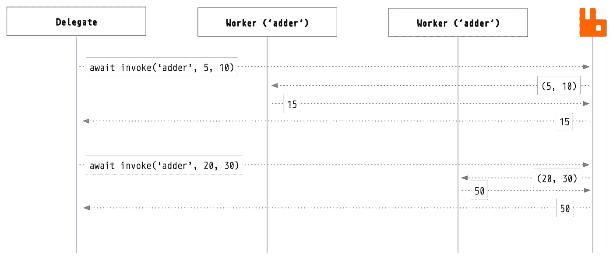

# 使用 NodeJS 和 AMQP 委派工作

> 原文：<https://itnext.io/delegating-work-using-nodejs-and-amqp-4d3cc1f62824?source=collection_archive---------3----------------------->


“海洋是最初的互联网；它连接万物。”— *伦佐·皮亚诺*

过去的这个周末，我去果阿放松一下，把我的注意力从工作上移开，吃点美食，呼吸新鲜空气，在海滩边放松一下。当我开始考虑消息队列和简单的任务委托时，我还不到一天，所以我决定写一个小的库，我称之为`amp-delegate`，它简化了`AMQP`远程工作者的创建和使用。

```
npm install amqp-delegate
```

## 一个例子:

`worker.js`

```
const { makeWorker } = require('amqp-delegate')// waits for 10ms then adds two numbers.
const task = (a, b) =>
  new Promise(resolve =>
    setTimeout(() =>
      resolve(a + b), 10))const worker = makeWorker({
  name: 'adder',
  task
})worker.start()
```

`delegate.js`

```
const { makeDelegate } = require('amqp-delegate')const delegator = makeDelegator()delegator
  .start()
  .then(() => delegator.invoke('adder', 10, 15))
  .then(result => {
    console.log('result', result)
  })
  .catch(err => {
    console.error('caught', err)
  })
```



您可以运行任意多的 workers，因为它们都是异步的，所以它们可以做抓取网页、与数据库交互或任何您喜欢的事情。第一个被点名的工人将接手这项工作。

# 它是如何工作的？

这只是标准远程过程调用模式的一个简单实现，但是消息队列交互的细节被包装在一个简单的高级接口中，因此您不必看到或理解它们。

## 工人

当你第一次制造一个工人时，你给它一个`name`和一个`task`来执行。`name`可以是任何字符串，`task`可以是任何接受简单参数并返回简单结果的纯异步函数。简单的意思是可以被整理成一个`JSON`字符串并转换成一个缓冲区的参数，缓冲区是`AMQP`的首选消息内容格式。

当您启动一个 worker 时，它连接到您的`AMQP`服务器，然后开始监听与 worker 具有相同`name`的队列。当它听到该队列上的消息时，它获取该消息，与其他具有相同`name`的工作线程竞争，将消息内容解码为一个参数数组，并将这些参数传递给工作线程的`task`。

当`task`完成时，它将结果编组到`JSON`，将其转换为缓冲区，并使用传入请求的`replyTo`队列将其发送回调用者，并提供传入请求的`correlationId`。这样，委托者就知道这个消息是对其请求的回复，而不是同一队列中的其他随机消息。

```
* makeWorker({ url, name, task, onError, onClose }) // => worker
* async worker.start()
* async worker.stop()
```

## 委托人

当你开始委托时，你不需要告诉它任何事情。它只是连接到`AMQP`服务器，等待您通过名称调用远程工作人员。当您调用`delegator.invoke`时，您给它您想要调用的工人的`name`，以及您想要工人在执行其`task`时使用的`params`。然后你就`await`结果。

委托者将参数编组到`JSON`中，然后编组到一个缓冲区中，创建一个惟一的`correlationId`，并开始监听队列的`replyTo`队列中带有右`correlationId`的消息。

```
* makeDelegator({ url, onError, onClose }) // => delegator
* async delegator.start()
* async delegator.invoke(name, ...params) // => result
* async delegator.stop()
```

## 错误处理

工作者和委托者都可以被提供`onClose`和`onError`钩子，您的代码可以使用它们来优雅地处理错误情况。除此之外，你可以在你的`awaits`周围使用标准的`try` / `catch`包装器，或者，如果你正在使用`promises`，使用标准的`catch`处理程序。

# 链接

*   参见`[github.com/davesag/amqp-delegate](https://github.com/davesag/amqp-delegate)`处的回购。
*   官方 [RabbitMQ RPC 教程](https://www.rabbitmq.com/tutorials/tutorial-six-javascript.html)。

—

像这样但不是订户？你可以通过[davesag.medium.com](https://davesag.medium.com/membership)加入来支持作者。