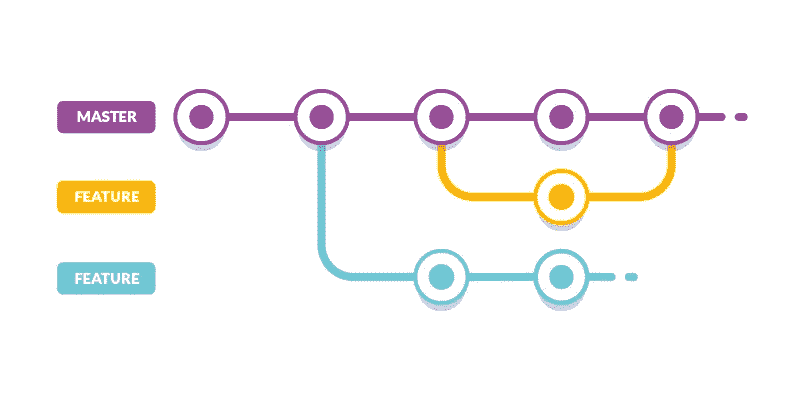

# 删除 Kubernetes 集群中的过时要素分支

> 原文：<https://itnext.io/delete-stale-feature-branches-in-a-kubernetes-cluster-23c76da27180?source=collection_archive---------3----------------------->



`Feature branch`(又名部署预览，预览应用)意味着一个拉请求被部署为你的应用程序的一个单独的实例。它允许一个人防止错误和缺陷，因为其他程序员或产品经理可以检查一个特性。本文介绍了一种在`Kubernetes`集群中删除特性分支资源的方法，在它的拉请求已经被合并到生产中之后。

## 特征分支

在`Kubernetes`集群中创建特性分支的一种方法是使用[名称空间](https://kubernetes.io/docs/concepts/overview/working-with-objects/namespaces/)将生产部署与其他部署分开。生产配置可能类似于:

```
apiVersion: v1
kind: Namespace
metadata:
name: medium-back-end
...apiVersion: apps/v1
kind: Deployment
metadata:
  namespace: medium-back-end
spec:
  replicas: 3
...
```

否则，特征分支总是具有不同的名称空间。如名称中的`-pr-`前缀或后缀。下面举例说明:

```
kind: Namespace
apiVersion: v1
metadata:
  name: medium-back-end-pr-17
...kind: Deployment
apiVersion: apps/v1
metadata:
  namespace: medium-back-end-pr-17
spec:
  replicas: 1
...
```

因此，我创建了 [Kubernetes 操作符](https://kubernetes.io/docs/concepts/extend-kubernetes/operator/)(一个可以访问集群资源的应用程序)。可以在 Github 上查看[。它会删除与过时特征分支相关联的命名空间。在`Kubernetes`中，如果一个名称空间被删除，这个名称空间中的所有其他资源也会被自动删除。](https://github.com/dmytrostriletskyi/stale-feature-branch-operator)

```
$ kubectl get pods --all-namespaces | grep -e "-pr-"
NAMESPACE              ... AGE
medium-back-end-pr-264 ... 4d8h
medium-back-end-pr-265 ... 5d7h
```

您可以在这里和这里找到关于使用名称空间[实现特性分支的更多信息。](/feature-deployments-in-kubernetes-c74bdcff0d8e)

## 动机

为了理解项目的动机，让我们检查拉式请求的通用持续集成及其生命周期:

1.  新的提交被推送到分支。
2.  代码风格和测试通过。
3.  应用特征分支的配置(例如，将拉请求的标识符添加到现成的模板中)。
4.  使用`kubectl apply`将配置部署到集群。
5.  该分支被合并到生产分支中(例如，主分支)。

一件重要的事情是，一个好的生命周期会在将配置应用到新的提交之前，删除特定提交的所有现有特性分支资源。需要确保每个提交的部署都是在清晰的状态下完成的。

要点是:当一个拉请求被合并到一个生产分支时，它的`Kubernetes`资源仍然存在于一个集群中。发生这种情况是因为，在合并之后，唯一的生产分支将建立在持续集成之上(没有删除陈旧特性分支的场景)。好吧，我们该怎么处理？

## 方法

将功能分支合并到生产分支后，有三种方法可以删除功能分支的资源。这个项目和这三种方法都不理想。你们每个人都可以选择最适合自己情况的方法。

1.  在每个生产分支构建中，检测哪个分支最后被合并并删除。

*   这只能通过获取提交历史来完成。在这种情况下，提交应该包含其拉请求的标识符(一个数字或分支名称)。
*   有时，生产分支的构建会在您不想重新构建的阶段失败。例如，您有以下几个阶段:下载项目、运行项目、运行测试、发布、发送通知、删除过时的特性分支。如果构建在发送通知阶段失败，您将无法轻松地重新构建它。
*   在没有任何上下文的情况下，删除陈旧特征分支的阶段对于新人来说并不明显。

2.将一个 webhook 集成到你的持续集成系统中([例子](https://github.community/t/trigger-jenkins-job-when-a-pull-request-is-merged-to-a-branch/1169/3))。

*   这可能不符合你的开发原则。例如， [Jenkins](https://www.jenkins.io/) 只支持一种类型的管道，您可以将管道的配置文件上传到源代码服务器。因此，要创建一个 webhook，你需要[单独的脚本来处理 webhook 的数据](https://stackoverflow.com/questions/31407332/how-to-process-a-github-webhook-payload-in-jenkins)，这些数据不会被上传到源代码服务器，应该保存在用户界面中。

3.在 Kubernetes 集群中创建自己的`Cronjob`资源。

*   这也需要开发和维护，尤其是在从一个公司转移到另一个公司的时候。
*   此外，这个项目的工作原理与`Cronjob`资源几乎相同，所以在重用时不会有任何损失。

## 装置

使用下面的命令应用最新版本的配置。这将创建`StaleFeatureBranch`资源，将操作员安装到`stale-feature-branch-operator`名称空间，创建[服务帐户](https://kubernetes.io/docs/reference/access-authn-authz/service-accounts-admin/)，以及必要的 [RBAC](https://kubernetes.io/docs/reference/access-authn-authz/rbac) 角色。

```
$ kubectl apply -f \ https://raw.githubusercontent.com/dmytrostriletskyi/stale-feature-branch-operator/master/configs/production.yml
```

## 使用

应用上述安装说明后，创建并应用一个配置文件，其中`feature-branch.dmytrostriletskyi.com/v1`为`apiVersion`，而`StaleFeatureBranch`为`kind`:

```
apiVersion: feature-branch.dmytrostriletskyi.com/v1
kind: StaleFeatureBranch
metadata:
  name: stale-feature-branch
spec:
  namespaceSubstring: -pr-
  afterDaysWithoutDeploy: 3
```

为资源选择任何元数据的名称，并深入了解规范:

1.  需要`namespaceSubstring`来获取所有特征分支的名称空间。例如，如果一个集群中有名称空间`medium-back-end`、`medium-front-end`、`medium-back-end-pr-17`、`medium-back-end-pr-33`，上面的例子将获取`medium-back-end-pr-17`和`medium-back-end-pr-33`，因为`-pr-`子串出现在那里。
2.  `afterDaysWithoutDeploy`只需要删除旧的名称空间。如果在那里设置`3 days`，则`1 day`或`2 days`之前创建的名称空间不会被删除，但`3 days, 1 hour`或`4 days`之前创建的名称空间会被删除。

默认情况下，它每隔`30 minutes`处理一次特性分支的名称空间。规格中最后一个可用的参数是`checkEveryMinutes`。如果默认值不符合您的需要，您可以以分钟为单位配置进程的频率。

## 它是如何在引擎盖下工作的

该指南展示了如何删除过时的特征分支。您不应该为生产集群复制下面的说明，因为它只是一个详细的示例来理解操作员的行为。在本章中，您将在您的个人计算机上运行一个测试集群。

要求是:

1.  [码头工人](https://docs.docker.com/get-docker)。虚拟化在称为容器的包中运行软件。
2.  [Minikube](https://kubernetes.io/docs/tasks/tools/install-minikube) 。在个人电脑上的虚拟机(或`Docker`)中运行单节点`Kubernetes`集群。
3.  库贝克特尔。访问`Kubernetes`集群的命令行界面。

使用以下命令在您的个人计算机上启动`Kubernetes`集群:

```
$ minikube start --vm-driver=docker
minikube v1.11.0 on Darwin 10.15.5
Using the docker driver based on existing profile.
Starting control plane node minikube in cluster minikube.
```

之后，选择创建的集群作为`kubectl`的主集群。当您在一台计算机上处理多个集群时，需要使用它:

```
$ kubectl config use-context minikube
Switched to context "minikube".
```

我们将应用生产配置。但是由于这些是生产配置，它们会期望集群中存在旧的名称空间。我们的集群是新的，不存在旧的资源。因为您没有它们，所以操作符允许您指定调试参数。如果启用了调试，将删除所有命名空间，而不检查是否过时:

将生产配置复制到您的个人计算机上:

```
$ curl https://raw.githubusercontent.com/dmytrostriletskyi/stale-feature-branch-operator/master/configs/production.yml > stale-feature-branch-production-configs.yml
```

通过更改设置来启用调试。对于`Linux`，它是:

```
$ sed -i 's|false|true|g' stale-feature-branch-production-configs.yml
```

对于`macOS`它是:

```
$ sed -i "" 's|false|true|g' stale-feature-branch-production-configs.yml
```

应用更改后的生产配置:

```
$ kubectl apply -f stale-feature-branch-production-configs.yml
```

获取`Kubernetes`集群中的所有资源(我们可以使用的种类)。您将看到可以创建的`StaleFeatureBranch`资源:

```
$ kubectl api-resources | grep stalefeaturebranches                 NAME                 ... KIND
stalefeaturebranches ... StaleFeatureBranch
```

获取`stale-feature-branch-operator`名称空间中的 pod。您将看到一个监听新的`StaleFeatureBranch`资源运行的操作员:

```
$ kubectl get pods --namespace stale-feature-branch-operator
NAME                                           ... STATUS  ... AGE stale-feature-branch-operator-6bfbfd4df8-m7sch ... Running ... 38s
```

获取操作员的日志以确保它正在运行:

```
$ kubectl logs stale-feature-branch-operator-6bfbfd4df8-m7sch -n stale-feature-branch-operator... "msg":"Operator Version: 0.0.1"}
... "msg":"Starting EventSource", ... , "source":"kind source: /"}
... "msg":"Starting Controller", ...}
... "msg":"Starting workers", ..., "worker count":1}
```

为`StaleFeatureBranch`安装夹具(模拟`Kubernetes`集群资源的现成配置):

```
$ kubectl apply -f https://raw.githubusercontent.com/dmytrostriletskyi/stale-feature-branch-operator/master/fixtures/stale-feature-branch.yml
```

fixture 将检查名称中包含`-pr-1`的名称空间`once a minute`:

```
apiVersion: feature-branch.dmytrostriletskyi.com/v1
kind: StaleFeatureBranch
metadata:
  name: stale-feature-branch
spec:
  namespaceSubstring: -pr-
  afterDaysWithoutDeploy: 1 
  checkEveryMinutes: 1
```

操作员接受了创建的资源，并准备删除与上述配置匹配的名称空间:

```
$ kubectl logs stale-feature-branch-operator-6bfbfd4df8-m7sch -n stale-feature-branch-operator... "msg":"Stale feature branch is being processing.",
"namespaceSubstring":"-pr","afterDaysWithoutDeploy":1,
"checkEveryMinutes":1,"isDebug":"true"}
```

创建包含两个名称空间`project-pr-1`和`project-pr-2`以及许多其他资源(部署、服务、秘密等)的 fixtures。):

```
$ kubectl apply -f https://raw.githubusercontent.com/dmytrostriletskyi/stale-feature-branch-operator/master/fixtures/first-feature-branch.yml -f [https://raw.githubusercontent.com/dmytrostriletskyi/stale-feature-branch-operator/master/fixtures/second-feature-branch.yml](https://raw.githubusercontent.com/dmytrostriletskyi/stale-feature-branch-operator/master/fixtures/second-feature-branch.yml)...
namespace/project-pr-1 created
deployment.apps/project-pr-1 created
service/project-pr-1 created horizontalpodautoscaler.autoscaling/project-pr-1 created secret/project-pr-1 created
configmap/project-pr-1 created
ingress.extensions/project-pr-1 created
namespace/project-pr-2 created
deployment.apps/project-pr-2
created service/project-pr-2 created horizontalpodautoscaler.autoscaling/project-pr-2 created secret/project-pr-2 created
configmap/project-pr-2 created
ingress.extensions/project-pr-2 created
```

您可以使用以下命令检查它们是否存在:

```
$ kubectl get namespace,pods,deployment,service,horizontalpodautoscaler,configmap,ingress -n project-pr-1 && kubectl get namespace,pods,deployment,service,horizontalpodautoscaler,configmap,ingress -n project-pr-2...
NAME                              ... READY ... STATUS  ... AGE
pod/project-pr-1-848d5fdff6-rpmzw ... 1/1   ... Running ... 67sNAME                         ... READY ... AVAILABLE ... AGE
deployment.apps/project-pr-1 ... 1/1   ... 1         ... 67s
...
```

如上所述，当启用调试时，所有名称空间都将被删除，而不检查是否过时。检查操作员的日志:

```
$ kubectl logs stale-feature-branch-operator-6bfbfd4df8-m7sch -n stale-feature-branch-operator... "msg":"Namespace should be deleted due to debug mode is enabled.","namespaceName":"project-pr-1"}
... "msg":"Namespace is being processing.","namespaceName":"project-pr-1"}
... "msg":"Namespace has been deleted.","namespaceName":"project-pr-1"}
... "msg":"Namespace should be deleted due to debug mode is enabled.","namespaceName":"project-pr-2"}
... "msg":"Namespace is being processing.","namespaceName":"project-pr-2"}
... "msg":"Namespace has been deleted.","namespaceName":"project-pr-2"}
```

如果您再次检查资源，输出将是`Terminating`或空的；

```
$ kubectl get namespace,pods,deployment,service,horizontalpodautoscaler,configmap,ingress -n project-pr-1 && kubectl get namespace,pods,deployment,service,horizontalpodautoscaler,configmap,ingress -n project-pr-2
...
```

您可以再次经历创建资源的过程。最后，在一分钟或更短的时间内，资源将再次被删除。

感谢您的关注！同样，[Github 上的 Kubernetes 操作员](https://github.com/dmytrostriletskyi/stale-feature-branch-operator)。:)