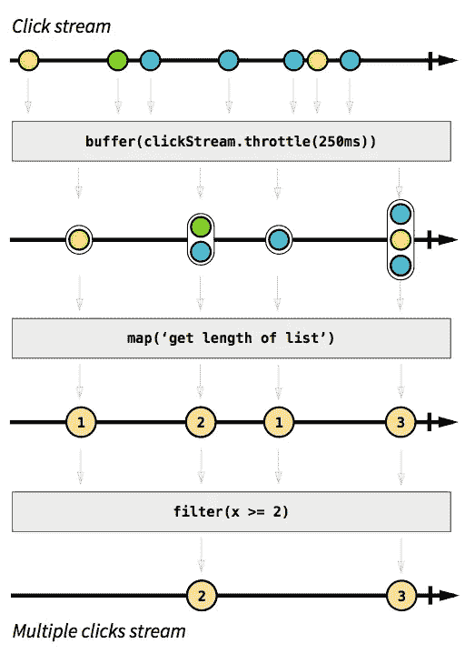
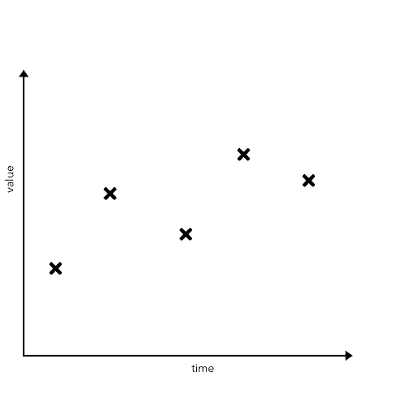
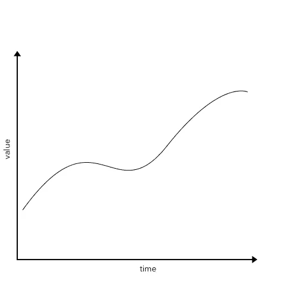

# 揭开函数式反应编程的神秘面纱

> 原文：<https://itnext.io/demystifying-functional-reactive-programming-67767dbe520b?source=collection_archive---------1----------------------->

由[塔拉斯·什普卡](https://unsplash.com/@bugsster?utm_source=medium&utm_medium=referral)在 [Unsplash](https://unsplash.com?utm_source=medium&utm_medium=referral) 上拍摄的照片

在过去的几年中，反应式编程已经获得了很多关注。[反应式宣言](https://www.reactivemanifesto.org/)主张反应式软件设计，已经被签署了数千次。像 ReactiveX 这样的反应式库现在基本上适用于每一种主要的编程语言。

随着大数据和 Spark 的出现，函数式编程也经历了一次大肆宣传。导致更加混乱的是，*函数式反应式编程*被混在一起，经常被用来描述反应式库，如 ReactiveX。

在这篇文章中，我想了解所有的流行词汇。那么什么是函数式编程、反应式编程和函数式反应式编程，它们之间到底有什么关系，为什么你要关心它们呢？

*(注意:我将在这里或那里使用一些 scala 片段来解释这些概念，但我会保持它们的简单，所以如果你不熟悉 scala，也应该很容易理解。)*

# 函数式编程

函数式编程都是关于函数的。(是啊，对吧？)嗯，其实都是关于*纯*函数。纯函数是没有任何副作用的函数。换句话说，它们不写数据库，不改变它们范围之外的任何东西的值，也不打印任何东西。

这有一个重要的结果:纯函数总是必须返回一些东西。一个不改变任何状态也不返回任何东西的函数是没有用的。

想象一下:

显然，这个函数没有做任何有用的事情。(以防因为不熟悉 scala 而不明显:函数不返回结果，也不改变任何外部值。)

## 对透明性有关的

另外，纯函数只依赖于作为参数传递给它们的参数。他们不接触外界的任何东西。

这有一个主要的优点:*引用透明*。当用相同的参数调用一个纯函数时，它将*总是*返回相同的结果。

这使得对代码进行推理变得容易多了。如果您已经测试了您的单个函数，并且您确信它们能够正常工作，那么您也可以确信这些函数相互之间的交互会产生您所期望的结果。

想象下面这个不纯的函数:

如果你不知道 a)它依赖于`value`和 b)什么是`value`的值，就没有办法预测这个函数将返回什么。

虽然这个例子可能有点做作，但可能每个经验丰富的程序员都已经面临过类似的事情，并且一直在想他们的返回值到底是从哪里来的。大多数函数比上面的函数要复杂一些，如果它们有外部依赖，改变这些依赖可能会导致完全不可预见的结果。

以下通常是一个更好的主意:

函数式程序员会告诉你，这是编写函数的唯一正确方法，一些函数式编程语言不允许你编写任何不纯的函数。无论你是否是一个铁杆函数式程序员，我认为引用透明性总是一个努力的目标。

## 不变

并发导致了对纯函数的另一个要求:作为输入传递给函数的变量必须是不可变的。否则，在将变量传递给函数后，另一个线程可能会更改变量的值，这将破坏引用透明性。

顺便说一下，因为您希望能够将一个函数的输出作为输入传递给另一个函数，所以一个纯函数的返回结果也必须是不可变的。

一些函数式编程语言甚至不允许任何东西是可变的。想要将一个列表的值加倍？将它传递给一个函数，让它返回一个新的列表。想要遍历一个列表，并且需要一个变量来跟踪你在列表中的位置？用[递归](https://en.wikipedia.org/wiki/Recursion_%28computer_science%29)代替。

当处理需要能够从故障中恢复的并发和分布式系统时，这具有相当大的优势。如果你不能改变任何东西，你就不需要担心竞争条件或死锁。此外，如果您有一个进行大量计算的分布式系统，并且您的一个节点发生故障，那么如果您仍然有原始的不可变数据并且您知道要执行的计算，那么恢复起来是很简单的。(处理大量数据的流行框架 Apache Spark 的工作原理正是如此。)

函数式编程还有很多内容，也有很多关于它的书籍，但这是它的基本要点。

# 反应式编程

反应式编程通常用电子表格来解释:想象一个计算其他两个单元格输入的单元格。一旦您更改其中一个输入，总和也会更新。细胞*对这些变化做出反应*并自我更新。

这与[数据流编程](https://en.wikipedia.org/wiki/Dataflow_programming)非常相似。从概念上讲，这里的重点在于数据流，而不是控制流。

实现反应行为的一种方法是使用提供回调的期货(或其他语言中的承诺)。例如，考虑下面的代码:

Futures 提供了一种抽象，让您可以轻松地并发执行长时间运行的代码，并让您处理结果，就像它们已经可用一样。一旦长时间运行的代码完成，提供的回调就被执行——它*对完成做出反应*。

虽然 Futures 是处理简单的、需要并发执行的一次性任务的好方法，但是如果您想做更复杂的事情，它们可能会变得混乱。例如，设想用期货实现一个电子表格应用程序。尽管您可以将 scala 中的 Futures 与 for-comprehensions 结合起来，并以其他方式组合它们，但事情很快就会变得一团糟。

与期货相反，最流行的反应库，如 Rx，将事件视为数据流。(它们也被称为“可观察的”，但我们将坚持“流”，因为对我来说这似乎更直观。)它们允许您转换那些事件流，并将结果动作粘合在一起。虽然 Futures 可以使用一次(一旦代码执行完成就调用回调)，但事件流可以用于在每次事件发生时触发一个操作。因此，事件流类似于未来，但更强大，因为它们增加了时间维度。

让我们看一个例子，让事情更清楚。假设您想在每次用户双击时触发一个事件。将它想象成一个流，如下所示:

(借用 Andre Staltz 极力推荐的[反应式编程简介](https://gist.github.com/staltz/868e7e9bc2a7b8c1f754))

当以流的形式查看单击事件时，可以使用一个简单的声明性 API 将这个流转换为另一个双击事件流。现在只需用一个回调来订阅这个流，当用户双击时，回调将执行您想要执行的任何内容。

关于反应式编程及其 API，还有很多内容显然超出了本文的范围，其他人已经比我解释得更好了。查看 Andre Staltz 的[遗漏的反应式编程介绍](https://gist.github.com/staltz/868e7e9bc2a7b8c1f754)，查看 JavaScript 中 Rx 的完整示例，或者在 ReactiveX 网站上查看教程的[列表。](http://reactivex.io/tutorials.html)

## 反应系统

现在，这一切如何与[反应宣言](https://www.reactivemanifesto.org/)中描述的反应系统联系起来？宣言希望你拥抱反应式编程，只用反应式风格写代码吗？不完全是。宣言更多的是谈论*反应式系统*而不是反应式编程。这有时会混淆在一起，导致混乱。

反应式系统符合某些建筑设计原则。这些设计原则旨在使系统具有响应性、可伸缩性和容错性，尽管当今的需求不断增长。

实现这一目的的主要手段是*消息传递*。当*反应式应用*(如在反应式编程中)关注事件时，*反应式系统*关注消息。《反应宣言》这样描述这种区别:

> 消息是发送到特定目的地的一项数据。事件是组件在达到给定状态时发出的信号。在消息驱动的系统中，可寻址的接收者等待消息的到达并对它们做出反应，否则就处于休眠状态。在事件驱动的系统中，通知侦听器附加到事件源，以便在事件发出时调用它们。这意味着事件驱动系统关注可寻址的事件源，而消息驱动系统关注可寻址的接收者。

这种对消息的关注让你可以轻松扩展，并带来*位置透明*。当您的单个代码片段只处理消息时，您是将这些消息发送到同一台机器还是发送到世界另一端的机器都没有关系。

*反应式系统*可以由*反应式应用*组成，但不一定非要这样。对于反应式系统，默认使用反应式编程风格通常是一个好主意，但是您也可以在没有它的情况下遵循反应式系统的设计原则。

# 功能反应式编程

最后，这与函数式反应式编程有什么关系？ReactiveX 和类似的反应式编程库有时被贴上“函数式反应式编程”的标签，但实际上这并不完全正确。ReactiveX 是反应式的，它采用了函数式编程中的许多元素，如匿名函数和方法，如 map、filter 等。然而，函数式反应式编程已经被明确定义为别的东西。正如 ReactiveX 的文档所说:

> [react vex]有时被称为“函数式反应式编程”,但这是一个误称。ReactiveX 可能是功能性的，也可能是反应性的，但“功能性反应性编程”是不同的动物。一个主要的区别是，函数反应式编程对随时间连续变化的值进行操作，而 ReactiveX 对随时间发出的离散值进行操作。

功能反应式编程最初是在 20 多年前由 Conal Elliott 和 Paul Hudak 在他们的论文《功能反应式动画》中定义的。他们区分了“行为”和“事件”。事件基本上类似于我们之前看到的流。它们是“随着时间推移而产生的离散值”。

如果你把它们放在图表中，它们看起来会像这样:

事件

然而，行为是*随时间变化的连续值*。这是一个微妙但重要的区别。如果你把一个行为放在一个图表中，它会是这样的:

行为

一种行为总是有价值的。一个事件只有最后一次发生(可能还有一个关联值)。例如，鼠标的位置是一种行为，因为你可以询问它的当前位置。然而，鼠标点击是一个流—您不能要求鼠标点击的当前值，只能要求它的最后一次发生。

ReactiveX 仅模拟离散事件，但不模拟连续值。那它是怎么逃脱的呢？

完全放弃这种区分是可能的。当询问一个事件的值时，您可以简单地取它最后一次发生的值。当有一个像鼠标移动这样的连续行为时，你可以对它进行采样，并把它当作一个事件流。

然而，这会导致一系列的问题。例如，可以通过简单地将一个流中的事件添加到另一个流中来组合事件流，但是这对于连续值没有意义。(如果这在您的应用程序中有意义，也许您可以将两个行为的值相加，但这与将一个流的事件添加到另一个流的时间线是两码事。)如果你在 API 里不做区分，API 就没有办法阻止你做傻事。

如果你对为什么这种区别有意义的更广泛的讨论感兴趣，我推荐[这篇文章](http://vindum.io/blog/behaviors-and-streams-why-both/)。

回到我们最初的工作表示例，其中一个单元格汇总了另外两个单元格的值:单元格的值是行为。它们总是有一个当前值，计算总和的单元格的值取决于其他两个单元格的值。但是，另一方面，如果您更改单元格的值，这种更改是一个事件。

如果您现在想要编写一个工作表应用程序，您可以通过两种方式来完成:您可以将一个回调附加到 change-event 来更新 sum 的值。但是，如果另一个值依赖于该总和，您也需要为其附加另一个回调。你可以看到这会很快变得难以处理。

另一方面，您可以将单元格值建模为行为，其中总和的值是它所依赖的其他两个值的函数。这似乎是解决这个问题的更自然的方法，会产生更优雅的代码。

如果你想了解更多关于如何在 Scala 中实现函数式反应式编程的知识，请查看[我写的关于如何从头开始编写自己的小框架的文章](https://medium.com/@timo.stoettner/functional-reactive-programming-in-scala-from-scratch-part-1-9f9db0c47478)。

我希望这篇文章能让你更好地理解围绕函数式反应式编程的所有术语。显然，我在这篇文章中只能触及皮毛，还有更多关于函数式编程、反应式编程和函数式反应式编程的内容。如果你想深入挖掘，这里有几篇我可以推荐的文章:

*   [我自己从零开始用 Scala 进行函数式反应式编程](https://medium.com/@timo.stoettner/functional-reactive-programming-in-scala-from-scratch-part-1-9f9db0c47478)
*   反应式编程 vs .反应式系统:[https://www . oreilly . com/ideas/reactive-programming-vs . reactive-systems](https://www.oreilly.com/ideas/reactive-programming-vs-reactive-systems)
*   你一直缺少的反应式编程入门:【https://gist.github.com/staltz/868e7e9bc2a7b8c1f754 
*   函数式反应式编程简介:[https://blog . danlew . net/2017/07/27/an-Introduction-to-Functional-Reactive-Programming/](https://blog.danlew.net/2017/07/27/an-introduction-to-functional-reactive-programming/)(对函数式反应式编程的看法与我的略有不同，但仍然是一篇很棒的文章)

如果你有任何建议或反馈，请在评论中告诉我！