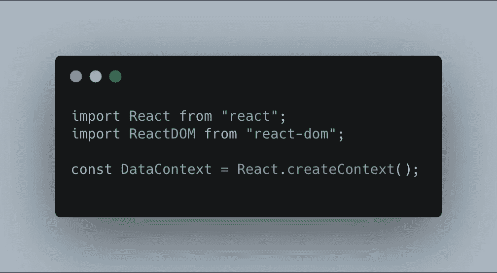
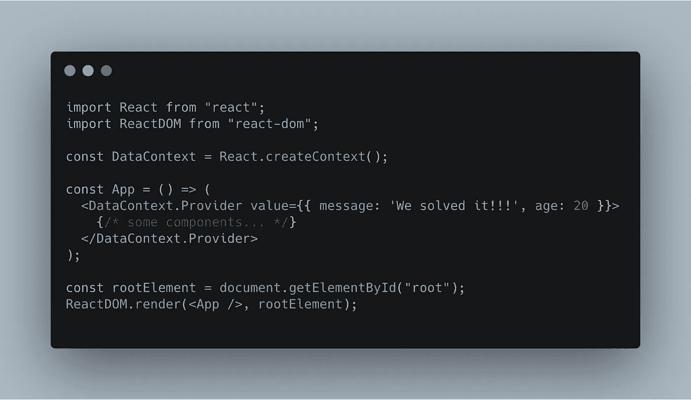
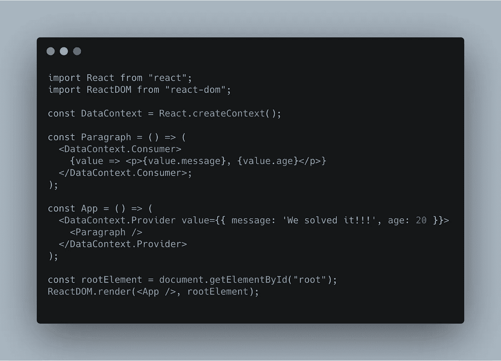
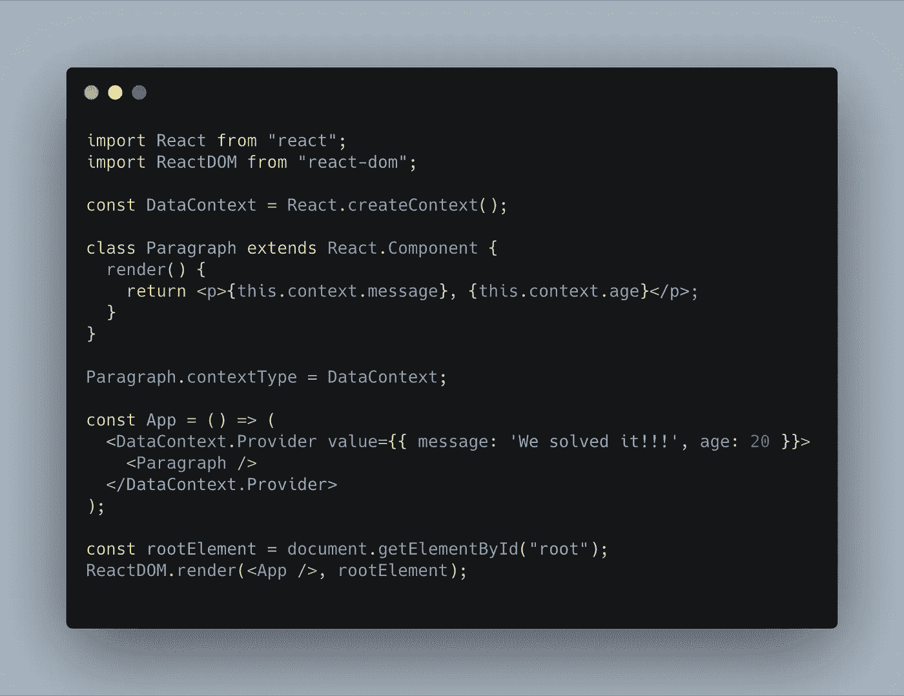
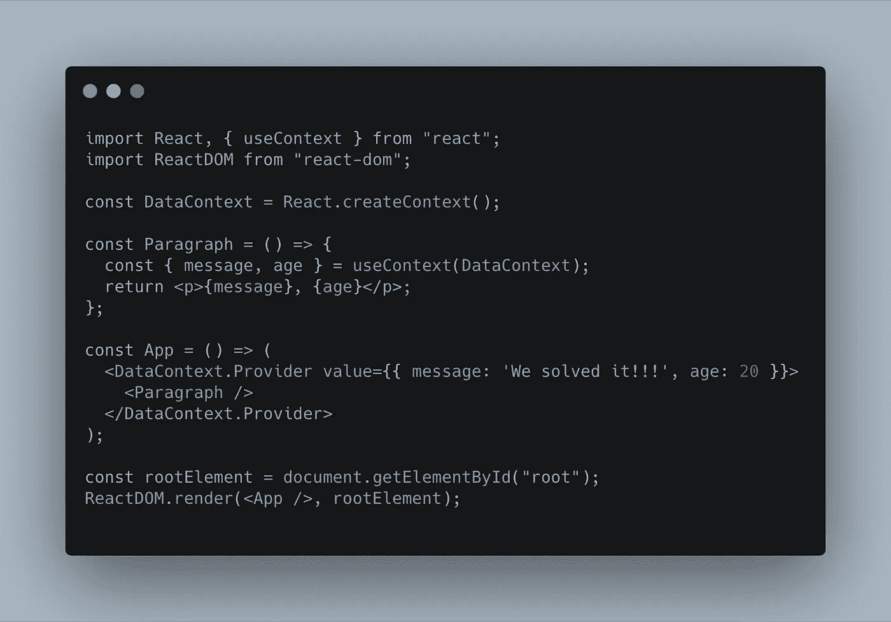
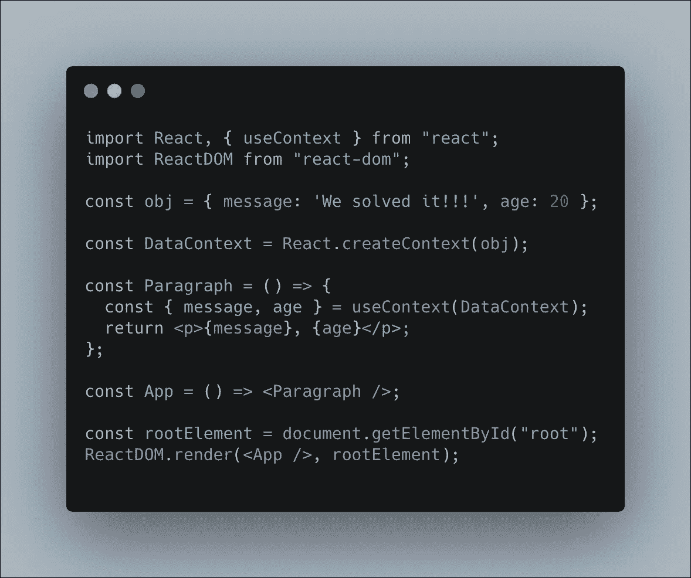

# 揭开 React 上下文的神秘面纱

> 原文：<https://itnext.io/demystifying-react-context-beba679e3de1?source=collection_archive---------2----------------------->

昨天，我花了一些时间学习如何使用上下文，当我阅读文档时，我想，“对于做简单事情的东西来说，这听起来非常复杂”。一开始我确实有这种感觉:

在研究了代码并了解了更多使用它的不同方法之后。我想与和我有同样感受的人分享会很好。

# 什么是反应上下文？

在这个特性出现之前，我们必须将道具传递到每个组件中，然后在组件中一次又一次地重复同样的过程。随着时间的推移，这变得非常糟糕，最终可能会导致道具在组件中嵌套过深的问题。

React 上下文是为了解决我们所有的问题而构建的，因为它消除了我们将道具传递到组件中的需要。相反，当嵌套在上下文提供者中时，组件将继承 props。

# 少说话，多编码！

现在让我们实际运行一些代码，这样我们就可以看到上下文在做什么。

## 步骤 1 —创建我们的上下文对象

我们要做的第一件事是我们需要创造我们的环境。

正如您在代码中看到的，在`React`模块上有一个名为`createContext`的方法。现在这已经就绪，我们可以继续创建我们的提供者，或者我们可以在`createContext`方法中设置一个`defaultValue`作为参数。

只有当提供者没有包装消费者时，默认值才会应用这些值。我将在`defaultValue` 部分更详细地介绍这一点。

## 步骤 2 —应用提供者

`createContext`方法提供了使用绑定到方法的两个组件的能力，这两个组件是`Provider` & `Consumer`。提供者是一种组件，它提供设置数据的能力，消费者组件无需传递任何属性就可以访问这些数据。

组件只带一个道具，叫做`value`。值可以是字符串、数字或对象。

## 步骤 3 —设置消费者

`Consumer`组件用于从`Provider`获取数据，然后将数据传递给嵌套在`Consumer`中的组件。有 3 种方法可以实现`Consumer`。

**方法一——使用消费者组件**

我们现在添加了一个段落组件，其中包含了`DataContext.Consumer`。这将返回一个函数，让我们可以访问在`Provider`中设置的属性。这种方式对于不需要任何逻辑的组件非常有用。那么我们如何用一个有逻辑的组件来做这件事呢？

**方法编号 2 —使用** `this.context` & `contextType`

在使用类的组件中，有另一种方法可以访问上下文数据。正如你所看到的，当我们创建我们的类时，我们在它下面有了`Paragraph.contextType = DataContext;`，它将做的是给类一个属性调用`context`，这是我们如何访问我们的提供者传递下来的值。

**方法 3 —使用上下文方法**

上面的两种解决方案都可以工作，这很好，但是我们必须用两种不同的方法来让它为每个组件工作。方法用来从上下文中获取道具，方法和上面两个方法一样，但是看起来简单多了。它看起来非常类似于你从`this.props`获得道具的方式，但是语法有点不同，因为你调用的是`useContext`。

# 等等马特，那`defaultValue`呢？

如前所述，我简要介绍了如何为我们的上下文设置默认值，如果我们没有包装组件的提供者，那么我们的消费者将使用在`createContext`中设置的默认值作为后备。

我们已经从我们的段落中移除了`Provider`,并在`createContext` 函数中设置了以前在 value prop 中的值。我花了很长时间才明白。

# 结论

我希望这让每个人都更加清楚！就像我说的，我是几天前学的，所以上下文方法可能有更多的内容。我希望这已经澄清了一些关于这个话题的困惑，因为它一开始确实让我感到困惑。

